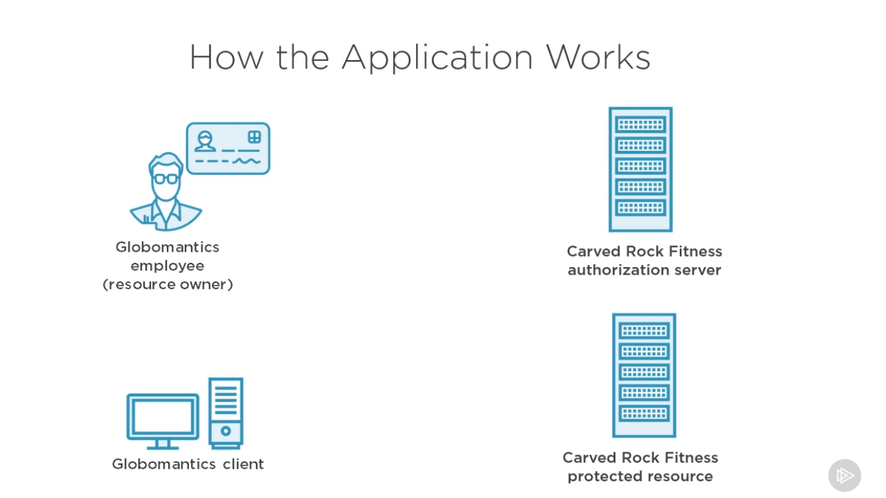
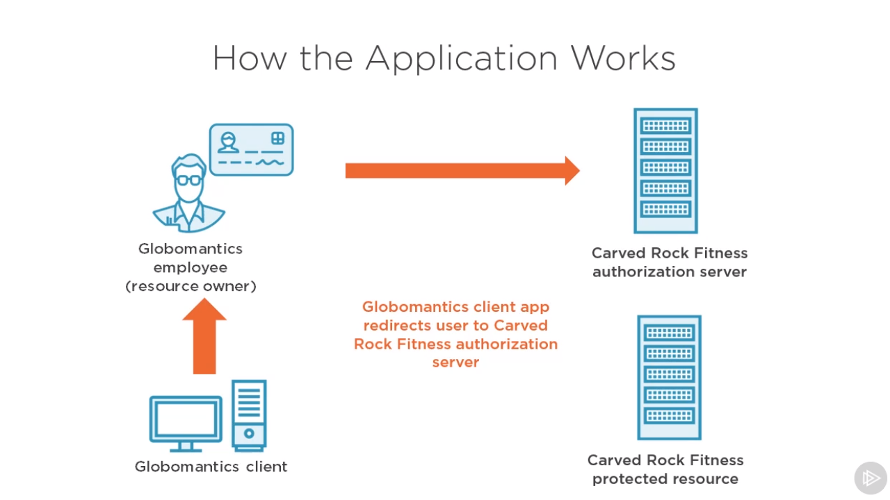
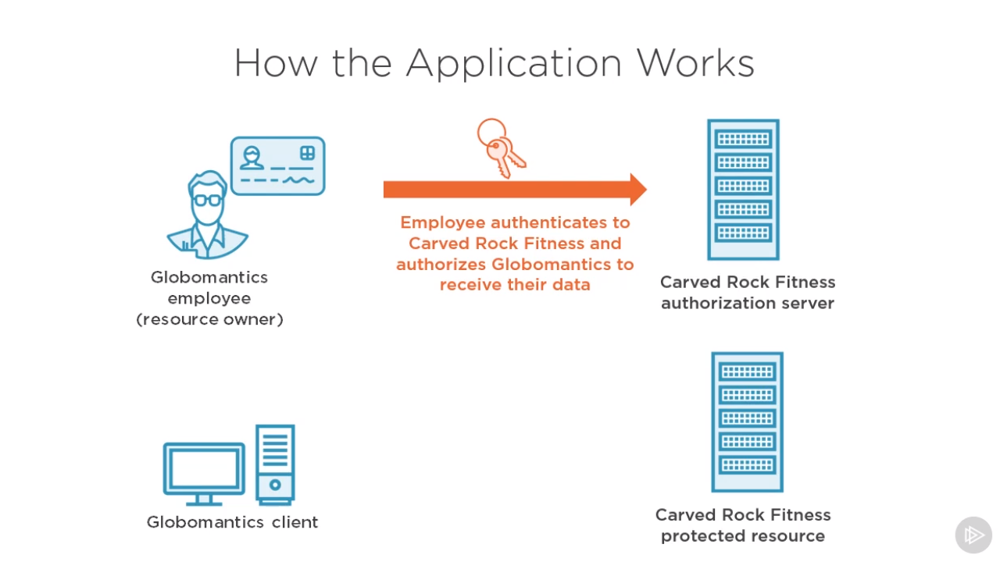
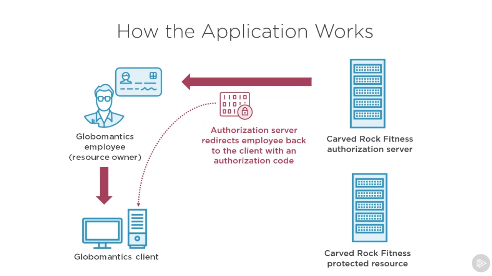
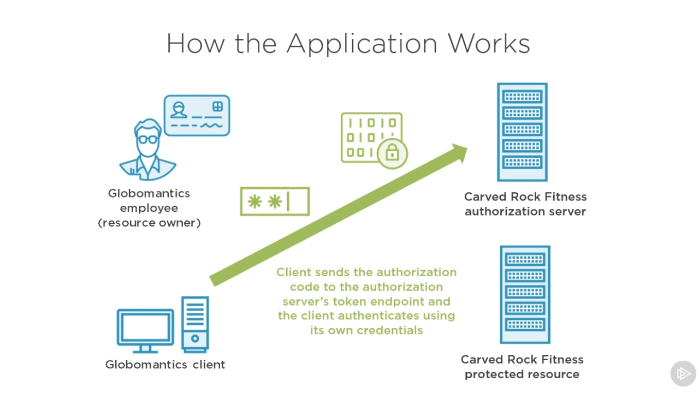
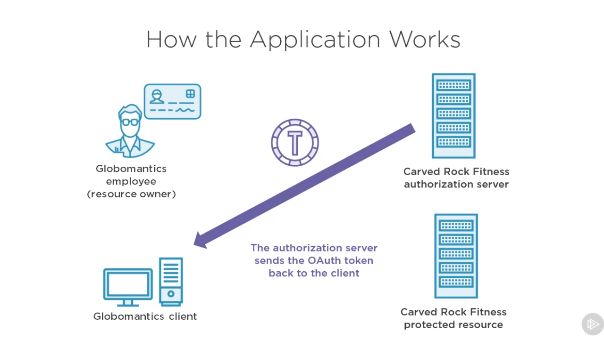
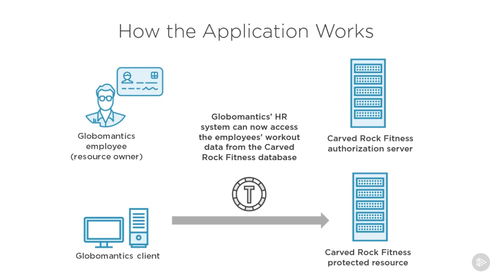

 <a href="02_01.md">◀ Back: Introduction</a>

---

# How the Finished Aplication Works.

En este punto vamos a explicar más detenidamente cómo funciona la aplicación que hemos descrito a un alto nivel en el [punto anterior](./02_01.md). Lo primero que tenemos que entender es que pese a que estamos centrándonos en un aplicación concreta (nuestra aplicación de ejemplo) los pasos que vamos a comentar a lo largo de este punto son los que se siguen en cualquier aplicación que utilizar OAuth.

A una escala de global los actores que están involucrados en la comunicación que se va a construir son los que se recogen en la siguiente imagen:

  

 

En primer lugar tenemos nuestra aplicación cliente *Globamactic Client* ya que se trata de la aplicación que va a solicitar la información al servidor de Carved Rock Fitness mientras que cada uno de los empleados de Globomantic son los que se conocen, en térmos de OAuth2, como **resource owner** ya que son los dueños de los datos (la información que se quiere compartir entre ambos sistemas).

El primer paso que se llevará a cabo cuando un empleado de Globomantics quiere utilizar la aplicación *Globomantic Client* para poder realizar la compra de nuevos créditos en el sistema que se traducirán en horas de gimnasio a un precio ventajoso, es que la aplicación va a redireccionar al usuario al **Authorization Server** de Carved Rock Fitness.

  

 

Es en este punto cuando el usuario (el empleado de Globomantic) se autentica en el servidor de Carved Rock Fitness y de forma explícita autoriza que la aplicación de Globomantic pueda obtener la información que de las horas consumidas, actividades, etc. que ha llevado a cabo en el ginmasio:

  

 

> El paso anterior que acabamos de describir es quizás el más importante en todo el proceso de comunicación vía OAuth ya que el usuario no solamente ha de probar que es quien dice ser (autenticar) sino que de forma explícita estará indicando qué la información puede ser intercambiada entre los dos sistemas.

La forma en la que se realiza al autenticación dentro de servidor de Carved Rock Fitness es algo que depende de este sistema y se puede llevar a cabo de diversas maneras pero desde el punto de OAuth cómo se lleve a cabo dicho mecanismo no nos importa por lo que es una parte del proceso en la que no vamos a indagar mucho más. A nosotros, como el equipo de desarrollo de Globomantic lo que nos va a importar es saber que la autenticación por parte del usuario ha sido llevada a cabo y que nos ha concedido el permiso para recibir la información.

  

 

Una vez que el usuario está autenticado el Authorization Server de Carved Rock le responderá al usuario con un código de autorización el cual va a poder suministrar a la aplicación cliente de Globomantic para que esta pueda llevar a cabo su trabajo.

  

 

Ahora que la aplicacación cliente de Globomantics ya tiene el código de autorización es el momento en el que esta va a enviar al Authorization Server directamente (es decir, que es la aplicación cliente la que se pone en comunicación con el Authorization Server) dicho código de autorización a un punto específico de la misma (o dicho en términos más técnicos, un endpoint), punto que además va a estar securizado y por lo tanto nuestra aplicación cliente va a tener que acceder al mismo utilizando sus propias credenciales de acceso (es decir, que como aplicación cliente vamos a tener unas credenciales de acceso que nos va a tener que haber proporcionado el Authorization Server para poder obtener los token de acceso).

  

 

En este punto si todo ha ido correctamente el Authorization Server nos contestará con un token OAuth que como aplicación cliente vamos a poder utilizar para realizar nuestras comunicaciones con el sistema de Carved Rock Fitness para acceder a la información que es propia del usuario y que está recogida en lo que en terminología de OAuth se conoce como el **Protected Resource**.

  

 

Así nuestra aplicación cliente envía el token junto con la petición de información al Protected Resource y es responsabilidad de este último asegurarse de que el token recibido es válido y retornar la información solicitada basándose en lo que está contenido dentro del token.

A lo largo del manual iremos viendo como implementar las diferentes piezas intervienen en la implantación de un sistema OAuth con Node. En otras palabras, vamos a ver cómo crear la aplicación cliente, cómo procesar los código de autorización que nos enviará el Authorization Server, qué aspecto tienen estos token, etc.

---

 <a href="02_03.md">Next: Reviewing the Finished Code ▶</a>

