

 <a href="02_02.md">◀ Back: How the Finished Aplication Works</a>

---

# Reviewing the Finished Code.

Vamos a detenermos en este punto en ver cómo funcionará la aplicación final que vamos a construir a lo largo del manual para entender hacia dónde queremos llegar. En concreto nos interesará ver:

- Cómo es la secuencia de pasos que se llevará a cabo desde el punto de vista de los usuarios de la aplicación que no son otros que los empleados de Globomantic.

- Veremos qué aspecto tienen las peticiones http que son llevadas a cabo para intercambiarse la información entre los sistemas involucrados para realizar la comunicación OAuth.

## Structure.

Para lograr construir el sistema que queremos nuestro proyecto de ejemplo incorpora un fichero que representa a cada uno de los elementos que están involucrados en la comunicación OAuth. Por una parte tenemos el archivo `globomanticsClient.js` que representará a la aplicación cliente que va a querer acceder al recurso compartido mediante OAuth (dicho de otra manera, la aplicación de Globomantic), el archivo `carvedRockProtectedResource.js` que viene a representar el recurso compartido al que quiere acceder el cliente y el archivo `carvedRockAuthorizationServer.js` que será el que implementa el servidor de autorización OAuth.

---
**Nota:** hemos decidido juntar las tres piezas que forman OAuth en un mismo proyecto con el fin de simplificar la explicación pero en un escenerio real lo normal sería que cada una de ellas se mantuviese en un proyecto por separado o al menos que el código de cada una de las empresas estuviese en proyectos separados.

---

Por simplicidad y debido a que  todas las piezas del código van a estarse ejecutando sobre la misma máquina es importante que tengamos claro en qué puerto de comunicaciones está escuchando cada unas de las partes que forman nuestra aplicación:

|Aplicación|Archivo|Puerto|
|---|---|---|
|Cliente Globomantic|globomanticsClient.js|9000|
|Protected Resource|carvedRockProtectedResource.js|9002|
|Authorization Server|carvedRockAuthorizationServer.js|9003|

 

Para probar nuestra aplicación vamos a abrir una ventana de incógnito de nuestro navegador con el fin de poder asegurar que no tenemos nada cacheado y accederemos a la url http://localhost:9000 que es donde se encuenta ubicada la aplicación cliente de Globalmantic donde se nos cargará una página similar a la que se muestra a continuación:

  

 

Aunque se trata de una página que trata de simular la de una compañía lo realmente importante desde el punto de vista de este manual es toda la información que se irá mostrando en la parte central de la misma ya que nos va a ayudar a entender cómo es el flujo que se sigue cuando se está utilizando OAuth.

Cuando, como usuarios de la aplicación, pulsamos sobre el botón *Get OAuth Token* lo que estamos haciendo será lanzar una petición al Authorization Server de Carved Rock Firness (el cual se encuentra escuchando en http://localhost:9000/authorize). Vamos ver qué es lo que realment está pasando cuando lanzamos esta petición para lo cual nos vamos a la pestaña *Network* dentro de las herramientas para desarrolladores del navegador.

  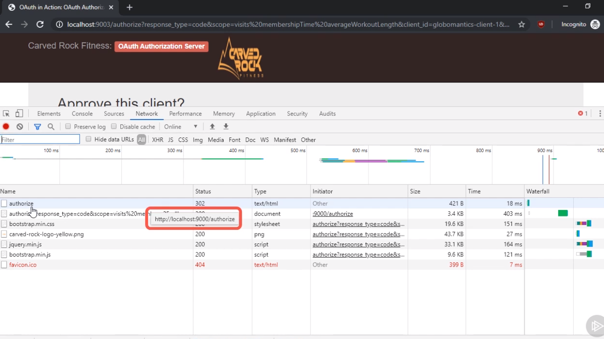

 

Lo primero que vemos es que la efectivamente se ha realizado la petición a la url en la que se encuentra ubicado el Authorization Server de Carved Rock Fitness y no solamente eso, sino que este servidor nos está retornando un código http 302 el cual significa que el navegador ha de llevar a cabo una redirección:

  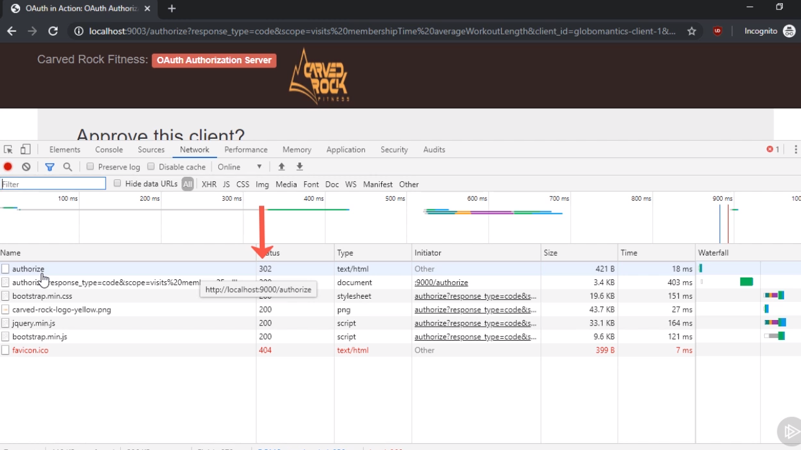

 

La información hacia la que se produce la redirección es la que se recoge en la segunda fila de la pestaña de red la cual incluye muchos campos pero lo realmente interesante es que la petición http que inicialmente hemos realizado ahora ha sido redireccionada a http://localhost:9003/authorize que es la url en la que está escuchando el Authorization Server de Carved Rock Fitness.

  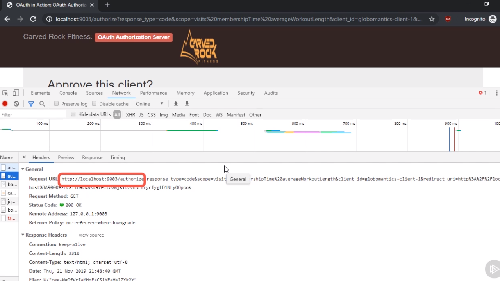

 

La petición es enviada al endpoint que se encargará de realizar la autorización (`/authorize`). Ahora bien, como parte de la petición también se envían una serie de parámetros en la query string que son de vital importancia para poder llevar a cabo el proceso de autorización los cuáles tienen un significado especial cuando estamos trabajando con OAuth.

  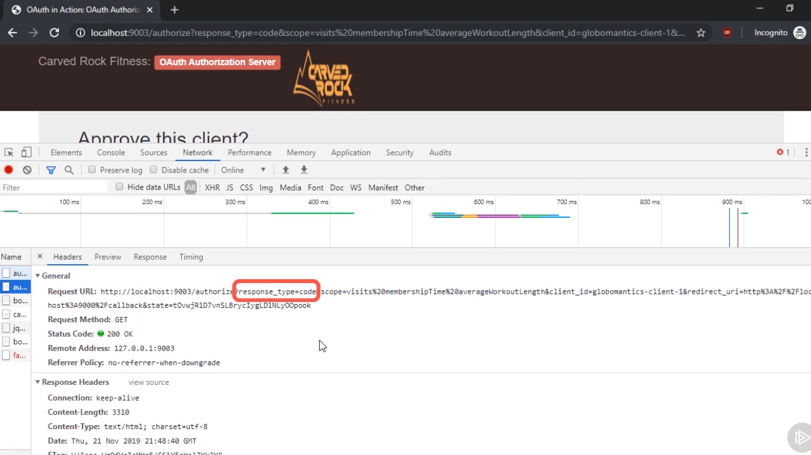

 

Con el paraḿetro de la query string `response_type` nuestra intención es indicar el **grant type** que está asociado a la petición. Con el valor `code` estaremos indicando que lo que queremos obtener es el código de autorización pero existen más valores posibles (como, por ejemplo, `refresh` que utilizaremos cuando necesitemos solicitar un refresh token).|

---
**Nota:** existen más valores para el parámetro `response_type` además de los que hemos descrito en la tabla pero todos ellos son una variante más sencilla del valor `code`. Así pues si entendemos correctamente el flujo completo de autorización con este valor podremos comprender cualquiera de los otros que se nos presenten.

---

  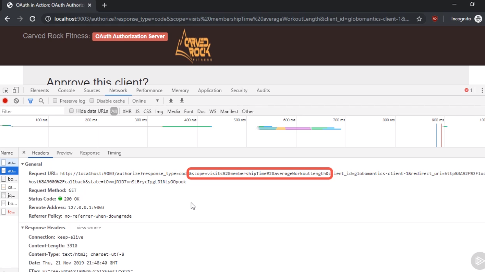

 

El parámetro de la query string `scope` viene a recoger a qué infomración estamos intentando dar acceso a la hora de pedir el código de autorización. En nuestro caso el valor que tiene asignado es `visits`, `membershipType` y `averageWorkoutLength` que es información propia del usuario que está recogida dentro de la aplicación de Carved Rock Fitness a la que cual la aplicación cliente de Globomatic quiere tener aceso.

Si nos fijamos en la codificación de esta información vemos que se está haciendo uso del caracter `%20` de http y la razón de ello es porque cuando especifiquemos los valores que asignaremos a este parámetro de la query string deberemos indicarlos siempre separados por espacios en blanco, los cuáles serán traducidos en la url (codificados) como `%20` por parte del navegador a la hora de mandar la redirección.

  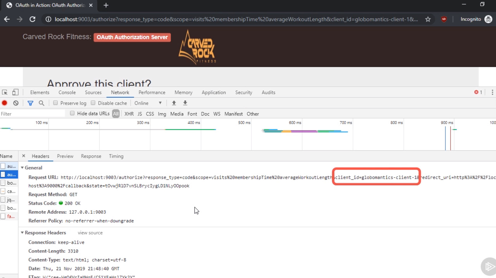

 

El siguiente parámetro de la query string es `client_id` que no es más que el identificador que la aplicación cliente utilizará para ella misma poder identificador dentro de la petición en el sentido de que así se va a permitir al Authorization Server saber que la petición que se está llevando proviene de la aplicación cliente de Globomantic y no de cualquier otra aplicación.

El valor que le asignaremos a este parámetro puede ser cualquiera pero es algo que ha de conocer el Authorization Server y ha de servir para identificar de forma unívoca qué aplicación es la que está realizando la petición.

  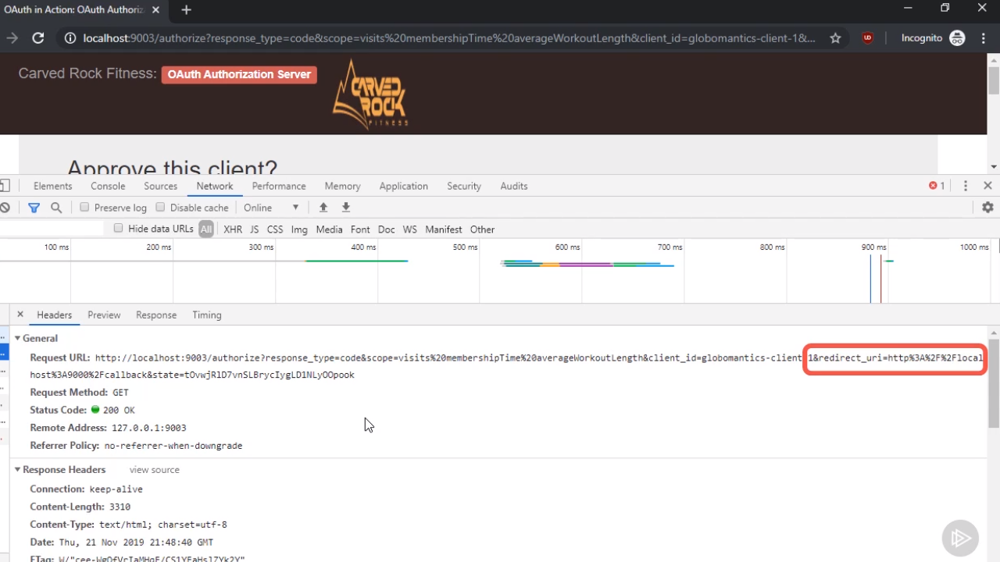

 

El parámetro `redirect_uri` viene a indicarle a al Authorization Server que la url a la que ha de redirigir la petición en el caso de que todo haya ido correctamente (en otras palabras, en el caso de que el usuario haya sido autorizado) enviando además el código de autorización que haya generado. En nuestro ejemplo en el caso de que todo vaya bien queremos ser redireccionados a la http://localhost:9000 (la aplicación cliente de Globomatic) pero al endpoint denominado `callback` junto con un parámetro de la query string que hemos denominado `state` y que tiene el siguiente aspecto:

  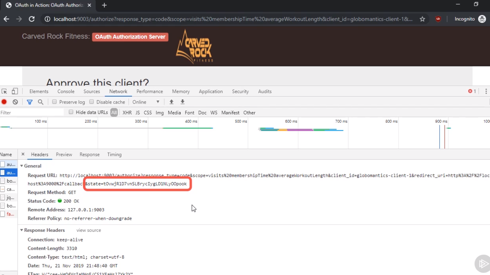

 

Este parámetro `state` es realmente importante por razones de seguridad ya que nos ayudará a prevenir de los problemas derivados de **[cross-site request forgery (CSRF)](https://en.wikipedia.org/wiki/Cross-site_request_forgery)** ya que asociada a cada una de las peticiones se está gerando una cadena de caracteres aleatoria que posteriormente veremos cómo utilizar en la aplicación cliente. Ahora bien, lo realmente importante aquí en este momento es saber que la especificación de OAuth lo que garantiza es que si se envía este parámetro `state` como parte de la query string que está asociada a al valor del parámetro `redirect_uri` dicho parámetro será enviado tal cual como parte de la redirección.

Si ahora nos vamos a la página que esta alojada en el la url a la que se ha dirigido la petición (la cual podemos ver en el navegador) podemos ver algo como lo siguiente:

  

 

Es decir que en esta página se está mostrando de forma visual qué es lo que sucede cuando la petición llega al Authorization Server de Caved Rock Fitness. Lo importante aquí es que se está mostrando la informació que hemos visto que forman parte de la redirección y además, que tenemos que la posibilidad de, pese a que en la petición se haya pedido acceso a determinada información en el parámetro `scope` nosotros (el Authorization Server) simplemente decidir a cuáles de ellas permitimos acceder y a cuáles no.

  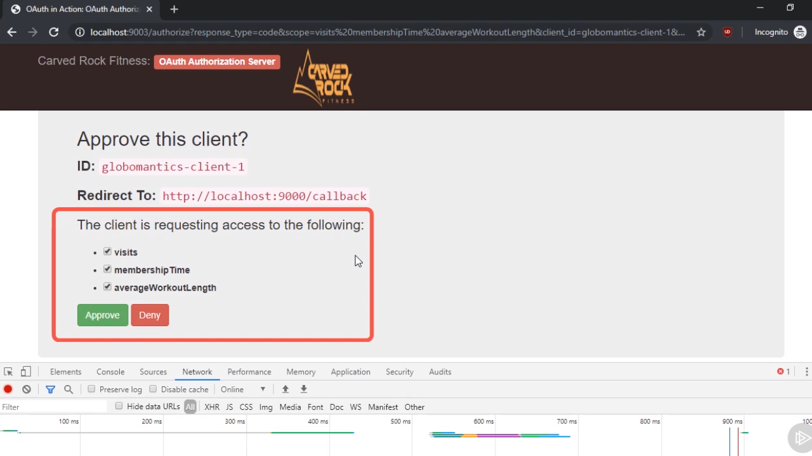

 

Con esto lo que queremos reflejar es que es el usuario de la aplicación el que de forma explícita ha de seleccionar a qué información va a conceder el acceso y a cuál no o dicho de otra manera, mientras que la aplicación cliente de Globomatics quiere acceder a toda la información nosotros como empleados de compañía podemos establecer que únicamente vamos a permitir que se acceda a parte de la misma.

Lo que nos puede chocar en este punto es que no hay una página e login para realizar al autenticación del usuario dentro del Authorization Server y es que lo tenemos que entender que, como su propio nombre indica, el Authorization Server se encarga de la autorización de los usuarios, es decir de determinar qué usuario acceden a qué recursos pero no de autenticarlos siendo la autenticación algo que queda fuera del ámbito de este servidor.

---
**Nota:** una solución para lograr realizar la autentificación además de la autorización consistiría que Carved Rock Fitness tuviese su propia gestión de usuarios de tal manera que antes de que se permitiese la redirección que estamos contemplando con OAuth lo que se hiciese sería mostrar al usuario un formulario en el que pudiese meter sus credenciales de acceso y, solamente en el caso de que los proporcionase correctamente, se siguiese con el proceso de redirección.

Otra opción podría consistir en que al estar hablando de dos compañías que se encargan de trabajar con varios usuarios que serán comunes a los sistemas se pueda hacer algún tipo de aserción entre los sistemas y así garantizar que se cumple con la autenticación de los usuarios. Un sistema muy simple pasaría por decir que todo usuario que es capaz de llamar al endpoint para obtener el código de acceso se va a suponer que está autorizado.

---

En resumen que si se está mostrando la información que está contenido en la página que se ha mostrado en la última imagen el sistema que estamos montando (el Authorization Server) va a suponer que el usuario está autenticado dentro del mismo.

Supongo ahora que pulsamos el botón **Aprove** simulando de esta manera que aprovamos al petición del usuario y vamos a ver qué es lo que pasa nuevamente gracias a la pestaña *Network* dentro de las herramientas para desarrolladores.

  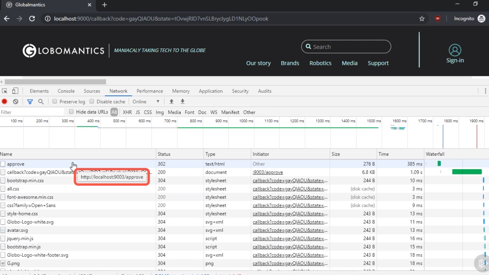

 

Lo primero que podemos ver es que la pulsar sobre el botón se está llamando a http://localhost:9003/aprove (es decir, que se está llamando a un endpoint que forma parte del Authorization Server) y nuevamente nos encontramos con un código http 302 que indica que queremos que se lleve a cabo una redirección. Ahora bien ¿hacia dónde se lleva a cabo esta redirección? Para verlo consultamos la siguiente fila en la pestaña *Network*:

  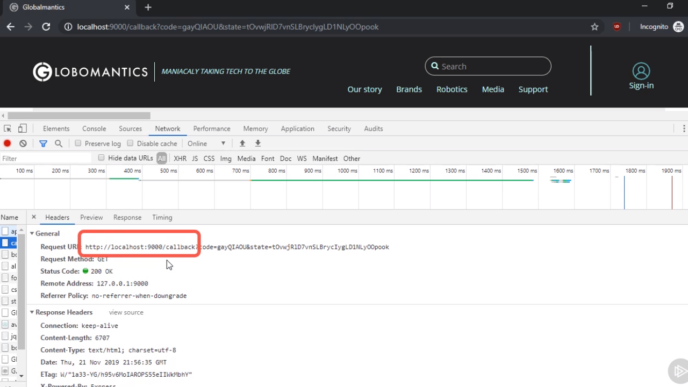

 

como podemos observar la url en cuestión es nuevamente la de la aplicación cliente de Globomantics siendo exactamente la misma que iba recogida en el parámetro `redirect_uri` cuando se ha realizado la petición al Authorization Server.

  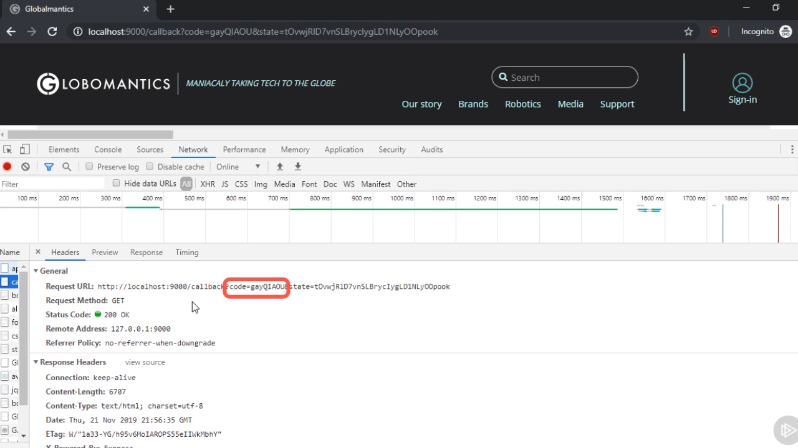

 

Como parte de la query string que es enviada por el Authorization Server nos encontramos con el parámetro `code` el cual tiene asignado el código de autorización que es el que posteriormente va a poder ser utilizado por la aplicación cliente de Globomatics para recibir el token de acceso.

  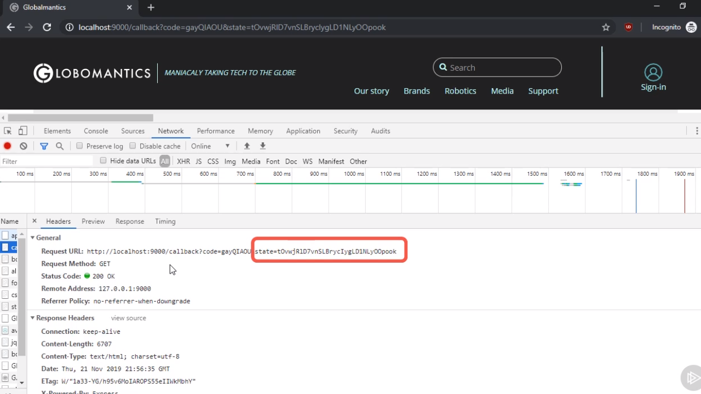

 

Por último indicar que también estamos recibiendo como parámetro de la query string de respuesta `state` con el mismo valor que le habíamos pasado en la petición que ha sido enviada iniciamente al Authorization Server y su valor es una cadena caracteres aleatoria que nos sirve para intentar evitar los ataques de tipo CSRF. Además, ya hemos comentado que la especificación OAuth indica que cualquier valor que se envía en este parámetro como parte de la petición del código de autorización por parte de un cliente ha de ser devuelto tal cual y así se está haciendo.

Junto con el envío de este código de acceso han pasado más cosas dentro del cliente de Globamatic y es que gracias al mismo se va a construir una nueva petición que será enviada al Authorization Server para obtener la información del token de acceso (cuando veamos el código del cliente de Globomatics veremos en detalle cómo se lleva a cabo este proceso) pero ahora lo que nos interesa es que en el navegador se nos estará mostrando la información del token de acceso que ha sido creado y así se mostrará al usuario:

  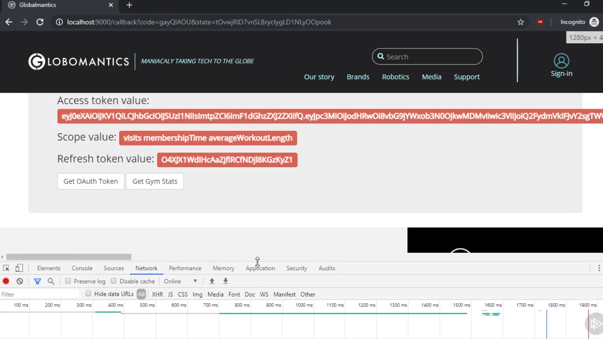

 

Como se puede ver en la imagen el valor de este token es execesivamente largo y la razón no es otra que estamos utilizando JSON Web Token (JWT) para codificarlo cosa que veremos más adelante cómo se lleva cabo aunque ahora es importante saber que trata de una especificación que está ampliamente aceptada a la hora de desarrollar aplicaciones que trabajan con token.

En lo que repespecta al valor que se muestra dentro del campo *Scope* que se muestra en la página de resultados lo que estaremos mostrando es el valor del scope que ha sido autirizado por el Authorization Server de Card Rock Fitness (es decir, que todos los que el cliente ha solicitado cuáles le han sido finalmente otorgados).

Por último también obtenemos lo que se conoce como el *refresh token* que es el que utilizaremos para poder obtener un nuevo access token si este último caduca.

En este punto tenemos un JWT que podemos utilizar para acceder al **Resource Server** de Card Rock Fitness para indicarle quienes somos para lo cual simplemente pulsaremos sobre el botón *Get Gym Stats* lo que lanzará una petición a http://localhost:9000/gymstats

  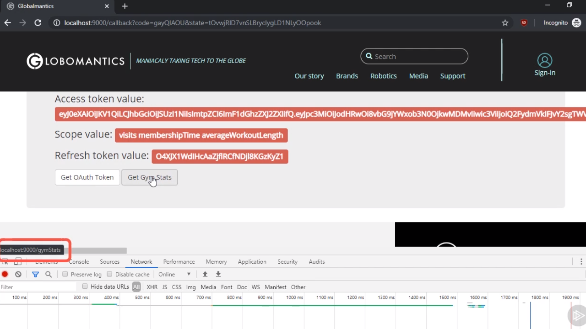

 

Es decir, que al lanzar la petición lo que estaremos haciendo es llamar al endpoint `gymstats` que está recogido dentro de la aplicación del cliente de tal manera que aquí es donde se llamará al recurso protegido utilizando el token de acceso, se extraerá la información y esta será mostrada al usuario en una página similar a la siguiente:

  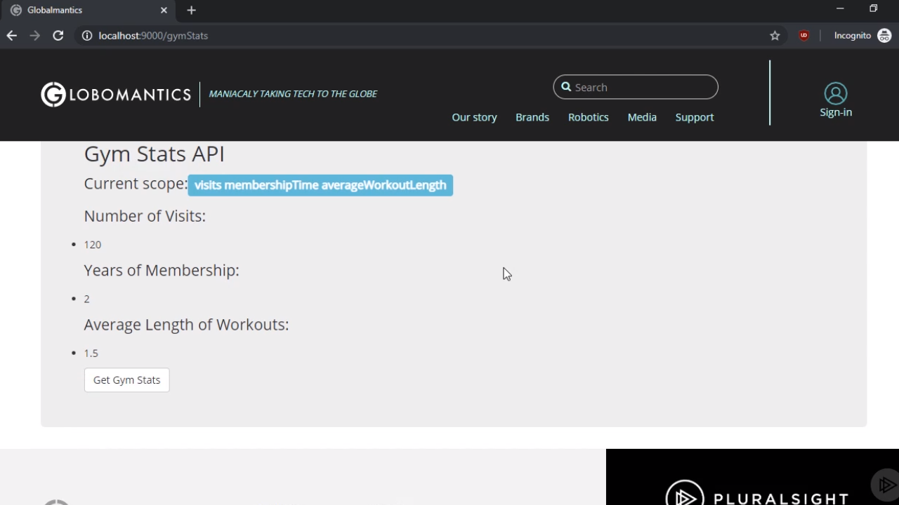

 

En esta página simplemente se está volviendo a mostrar el scope que está asociado a la petición del usuario y junto al mismo la información del número de visitas que ha realizado al gimnasio (ya que se ha otorgado el scope `visits`), el número total de años que el usuario lleva acudiendo al mismo (por el scope `membershipTime`) y la información de la media de horas que le lleva a cabo cada visita al gimnasio (por el scope `averageWorkoutLength`).

---
**Nota:** en una aplicación real la información que sería mostrada en la aplicación cliente seguiramente tedría otra apariencia o sacaría más valores, estadísticas, etc. con el fin de que Globomantics pudiera llegar a tomar decisiones basándose en esos datos.

---

Lo realmente importante aquí es que nos quedemos con el mecanismo que se ha llevado a cabo para poder obtener la información que precisa la aplicación cliente para obtener los datos del usuario:

1. El usuario ha tenido que ser autenticado (decir quién es y demostrarlo).
2. El usuario ha sido autorizado.
3. Se ha obtenido la información a partir de la autorización.

En los siguientes capítulos del manual lo que vamos a hacer es ir desgranando cada uno de los módulos en los que hemos definido nuestra aplicación con el fin de lograr poder ver como en Node vamos a implementar cada una de estas partes.

---

 <a href="02_04.md">Next: Summary ▶</a>

