

 <a href="03_00.md">◀ Back: Introduction</a>

---

# Reviewing the Client Code.

En este punto lo que vamos a hacer es repasar el código que forma lo que es la aplicación cliente de Globomantics la cual está desarrollada utilizando Node y Express aunque no vamos a centrarnos en entender cómo se pone en marcha la configuración de ambos ya que es algo que queda fuera del ámbito de estudio de este manual pasándo a centrarnos específicamente en entender aquellas partes del código que tienen que ver con el conjunto de tareas asociadas con OAuth.

El código completo de la aplicación cliente se encuentra dentro del archivo `globalmactics.js` y vamos a ir navegando por el mismo centrándonos en aquellos aspectos que son destacables. En primer lugar tenemos que ver que se está declarando la variable `authServer` en la que se recoge un objeto en el que cada uno de sus atributos son los endpoints del Authorization Server del que hará uso la aplicación.

  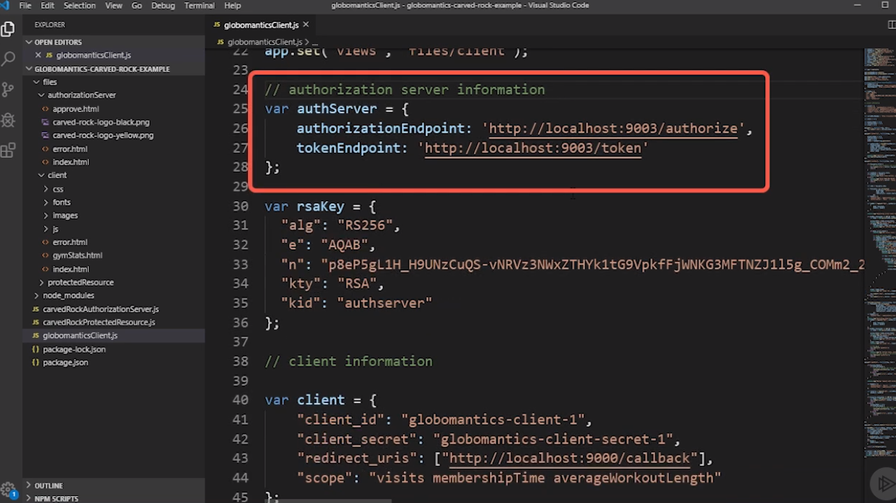

 

Una vez tenemos definido quién es el endpoint de nuestra aplicación, el siguiente paso que estamos haciendo es definir una clave que en este caso será la clave pública del Authorization Server que vamos a utilizar y que sabemos que este va a autilizar posteriormente para firmar los token de acceso que vaya creando y por lo tanto podamos cotejar que los tokens con los que estamos trabajando realmente provienen del servidor que dice que están proveniendo (cosa que veremos más adelante cómo se hace):

  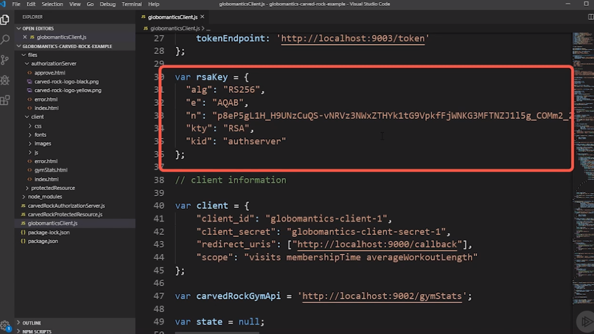

 

Hecho esto pasamos a definir toda la información que define a la aplicación cliente desde el punto de vista de OAuth:

  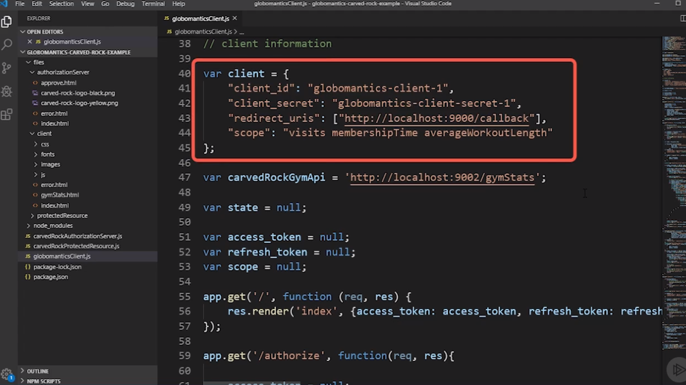

 

Y es en este punto donde tenemos que tomar nuestra primera decisión a la hora de montar un sistema OAuth ya que para definir los clientes del mismo se puede adoptar dos perspectivas: que el registro de los mismos sea estático o bien que sea dinámico.

Por **registro dinámico** de clientes lo que estamos tratando de reflejar es todas aquellas situaciones en las que nuestro Authorization Server de OAuth va a poder recibir peticiones de clientes en tiempo de ejecución del tipo querer registrarse como clientes autorizados para obtener información de los recursos y por lo tanto implicará el tener que implementar toda la lógica que va a permitir llevar a cabo este registro. Por su parte cuando obtamos por un **registro estático** de clientes lo que nos encontramos es que para poder utilizar el Authorization Server previamente el cliente ha de estar registrado dentro del mismo e intercambiada de alguna forma segura la información que va a permitir llevar a cabo el acceso. 

En nuestro caso hemos obtado por al segunda de las opciones, el regitro estático pero evidentemente si se tratase de una aplicación real que estuviese ejecutándose en producción no deberíamos codificar directamente nuestros credenciales de acesso a la aplicación como en nuestro caso, sino que deberíamos utilizar alguna otra estrategia que nos permitiese guardar la información y que esta no esté accesible.

En el conjunto de información que configuramos relacionada con el cliente tenemos el atributo `redirect_uris` en la cual se recoge como valor un array en el que cada uno de los elementos es un string que recoge diferentes url a la que se puede llamar como consecuencia de las llamadas que se pueden llevar a cabo en el Authorization Server. 

  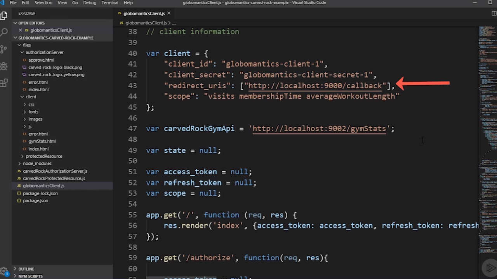

 

En nuestro caso el array asignado al atributo `redirect_uris` únicamente tiene un valor que es la url a la que ha de enviar una petición de redirección al Authorization Server en el caso de que el proceso de autorización finalice correctamente. Adicionalmente recogemos en el atributo `scope` toda aquella información para la cual el cliente (la aplicación de Globalmatics) solicita tener acceso que no tiene por qué coincidir con la la información a la que autoriza el usuario que se vaya poder acceder aunque en la mayoría de las situaciones esto será así. 

  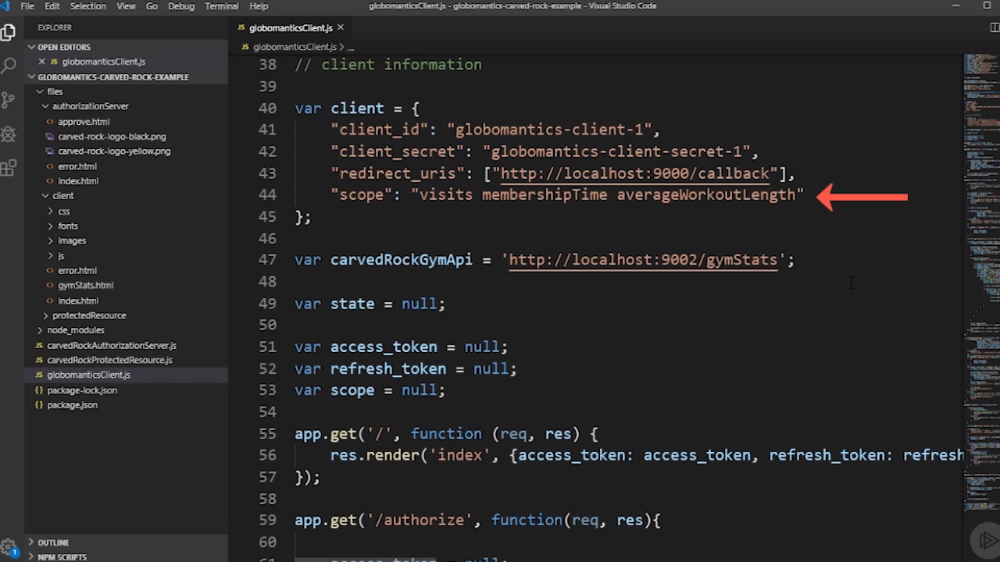

 

A continuación se define una variable que sirve para recoger la url del Resource Server que no será otro que el endpoint al que se ha de consultar para obtener la información de las estadísticas del usuario una vez se le ha concededido el acceso por parte del Authorization Server:

  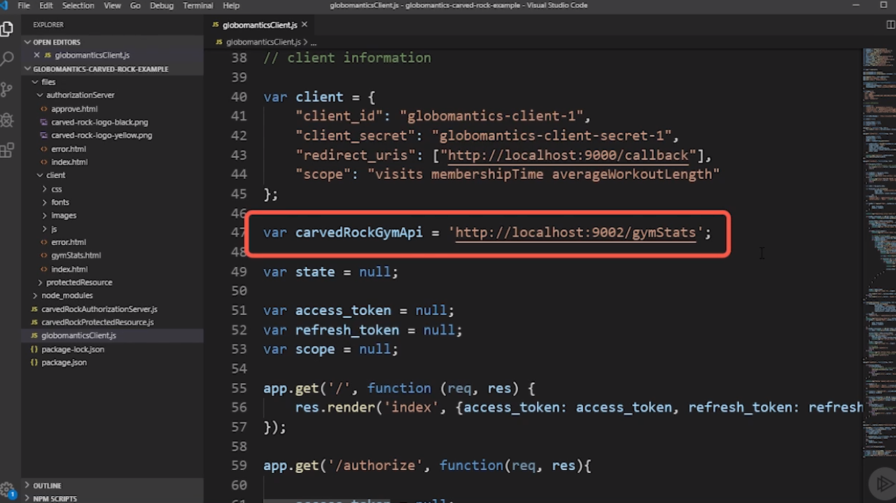

 

Vamos ahora a centrarnos en entender qué es lo que sucede cuando interactuamos con la aplicación. Lo primero que tenemos que saber es que cuando accedemos a http://localhost:9000 (la url en la que se ecuta la aplicación cliente de Globomantics) y pulsamos sobre el botón *Get OAuth Token*: 

  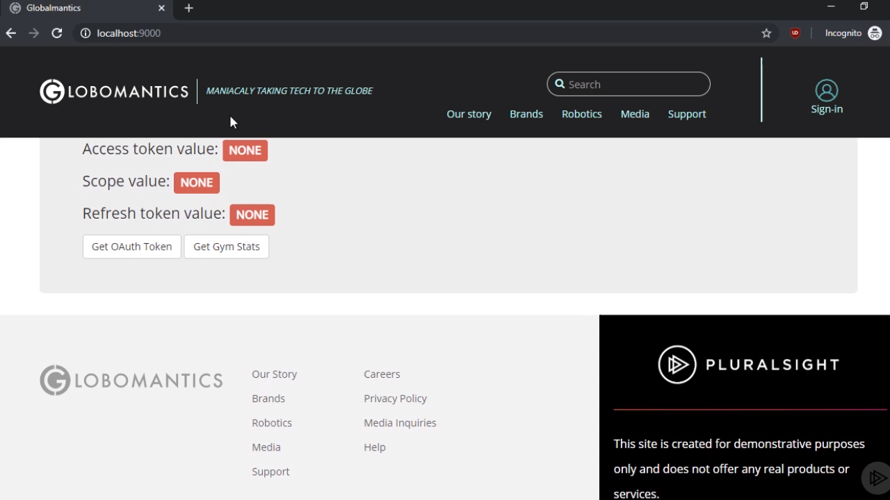

 

se estará lanzando una petición al endpoint http://localhost:9000/authorize. El código que se encarga de realizar el código necesario para resolver esta acción lo que hacemos es definir las variables que son necesarias para llevar a cabo la petición al Authorization Server lo que, entre otras cosas, incluye la generación de un cadena de caracteres de forma aleatoria que nos sirva para ser establecido como el parámetro `state` en la petición:

  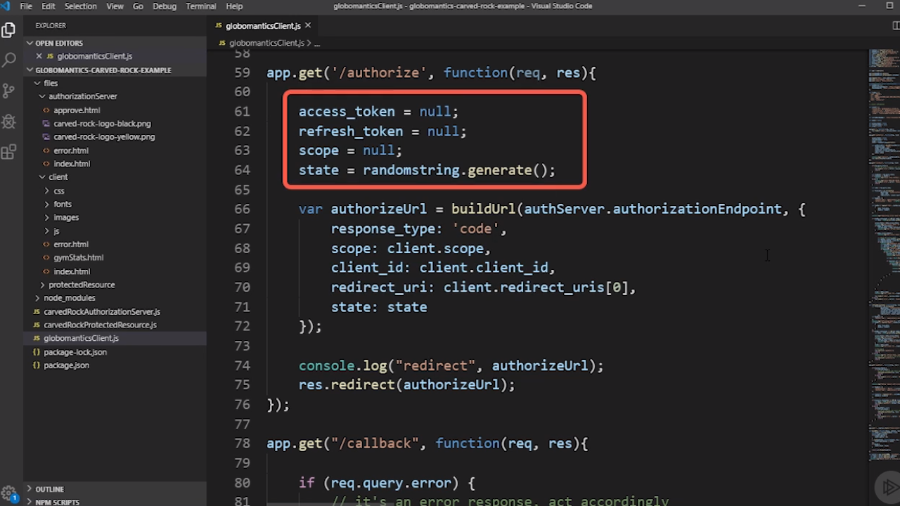

 

El siguiente paso será construir la url que nos servirá para generar la redirección que se encargará de realizar la redirección al Authorization Server donde a parte de establecer que el endpoint está definido el atributo `authorizationEndpoint` del objeto que recoge la información de configuración del Authorization Server, se establece un objeto con el resto de las opciones que serán pasadas como parámetro en la query string que se enviará al servidor.

  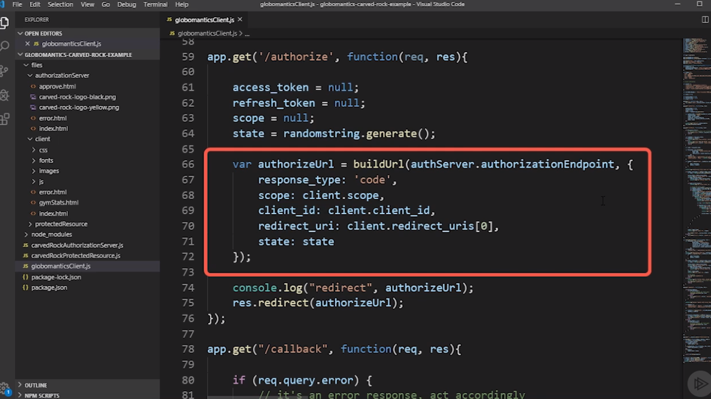

 

Por último lo que hacemos es escribir por la consola la información de la url que a la que vamos a realizar la redirección y no solamente esto sino que enviamos como respuesta al navegador del usuario una petición de redirección la url que hemos construido.

Ahora en el navegador del usuario se mostrará una página como la que se muestra en la siguiente imagen:

  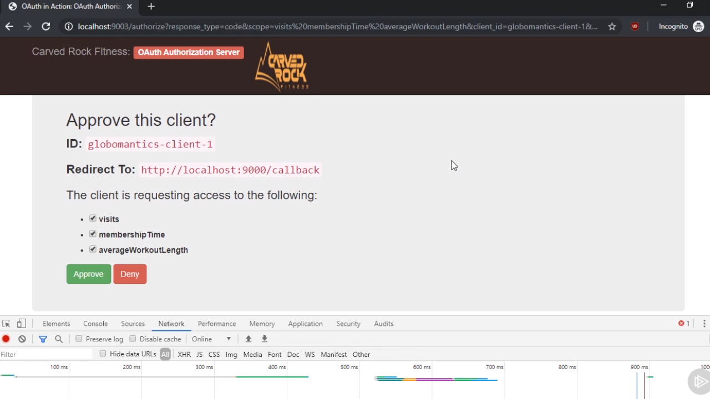

 

De tal manera que cuando el usuario pulsa sobre el botón *Aprove* lo que estará simulando que el Authorization Server da su autorización a la petición además de cotejar de entre toda la información que se ha solicitado que se puede acceder a cuál de la misma vamos a tener acceso desde al authorization server se producirá una redirección a http://localhost:9000/callback la cual es atendida por la aplicación cliente de Globomantics.

Dentro de esta función lo que se hace es en primer lugar chequear si junto con la respuesta se envía la información asociada a que se ha producido un error y en el caso de que así sea lo que se hace es mostrárselo al usuario:

  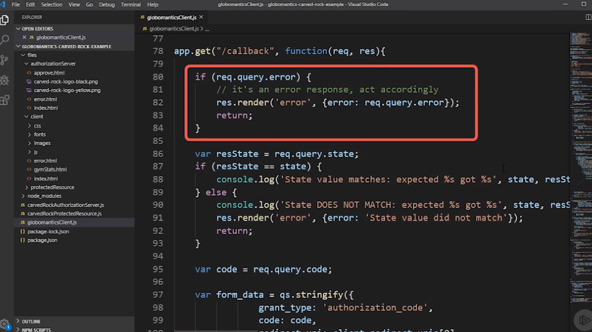

 

La siguiente comprobación que llevamos a cabo es comprobar que el valor del parámetro `state` que se ha recibido es el mismo que se ha enviado en la petición que hemos realizado anteriormente ya que si no fuese así podría estarse tratando de un ataque del tipo **[cross-site request forgery (CSRF)](https://en.wikipedia.org/wiki/Cross-site_request_forgery)** y por lo tanto mostramos un error:

  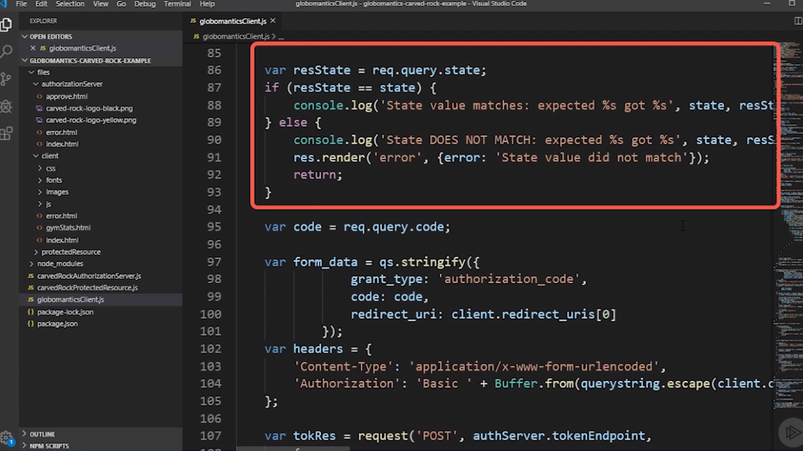

 

---
**Nota:** recordemos que la especificación OAuth dice que si junto con una petición al Authorization Server se envía el parámetro `state` es obligación de este servidor retornar el mismo valor que se ha recibido.

---

A continuación lo que hacemos es recoger el código de autorización que nos viene en la query string (recordemos que este ha de venir recogido en parámetro `code`) y con el mismo lo que vamos a hacer es crear un objeto que va a contener la información que será enviada a través de la petición que se realiza en un formulario donde establemos el campo `grant_type` con el valor `authorization_code` (uno de los valores que entenderá el Authorization Server en la siguiente petición que vamos a llevar a cabo para generar el token de acceso), el código con el que nos ha respondido el Authorization Server en la petición que se acaba de realizar y por último la información de nueva redirección que ha de ser llevada a cabo.

  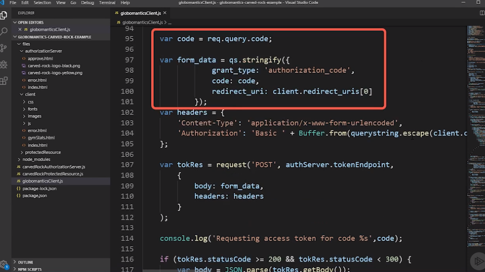

 

Aquí es importante destacar que se ha de volver a enviar el mismo valor en el atributo `redirection_url` que el que ha sido enviado previamente para generar el código de con el que se ha de pedir el token ya que el Authorization Server va a hacer alguna verificación adicional para comprobar que el código ha sido generado a partir de una petición a dicha url.

El siguiente paso consestirá en crear la petición que servirá para probar que el usuario (en este caso la aplicación cliente de Globalmatics) es quien realmente dice que es para lo cual vamos a crear las cabeceras http que acompañarán a la petición y que utilizarán la autentificación básica de http para llevarlo a cabo:

  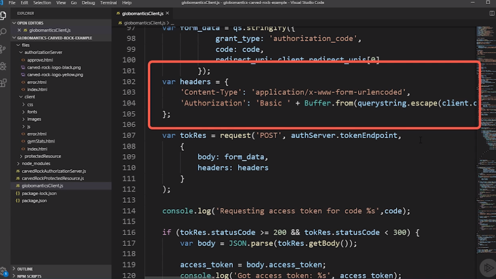

 

---

 <a href="03_03.md">Next: Common OAuth Client Vulnerabilities ▶</a>

