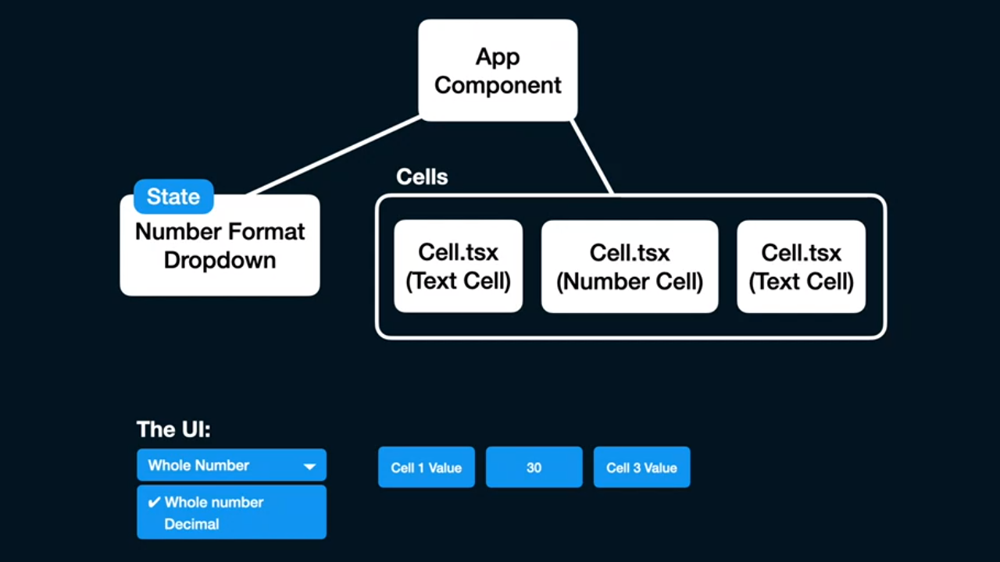
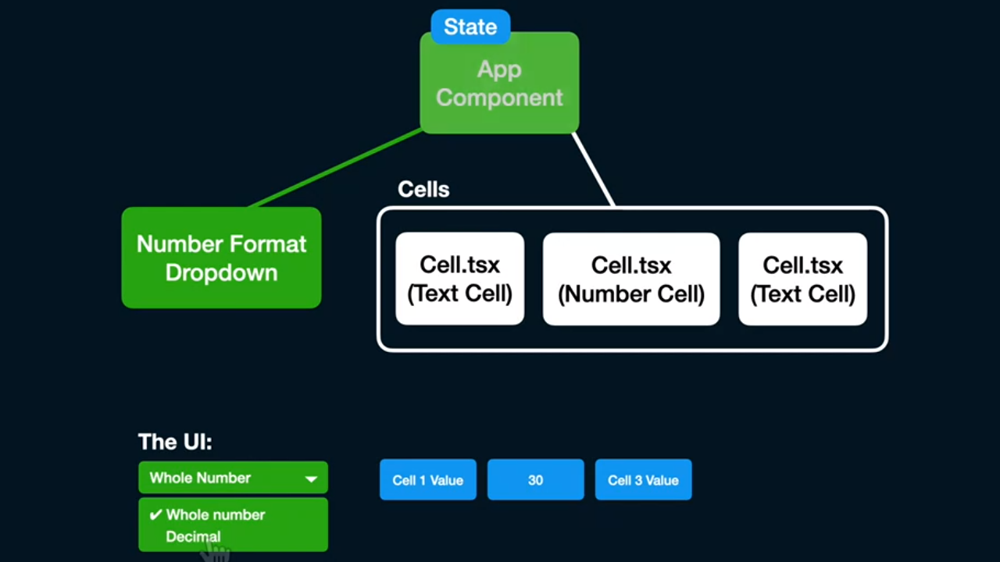
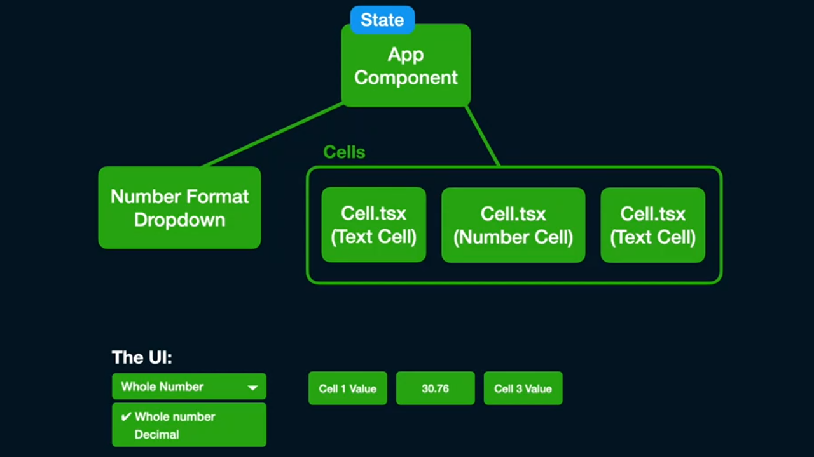
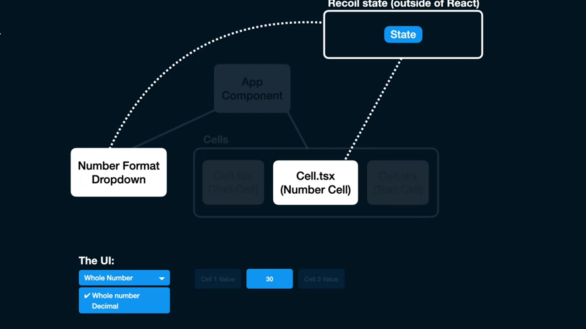
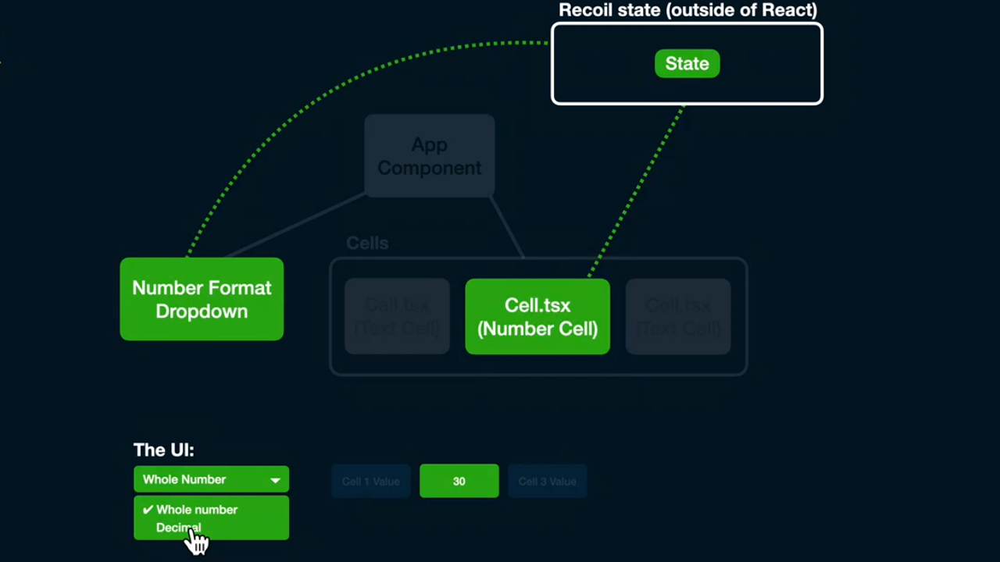

 <a href="01_00.md">◀ Back: Chapter Index.</a>

---

# Course Intro.

Recoil fue creado por el React Team como herramienta interna para medir el rendimiento de las aplicaciones en React y en mayo del 2020 uno de los creadores de la misma Dave McCabe dió una [charla en React Europe 2020](https://www.youtube.com/watch?v=_ISAA_Jt9kI) en la que presentaba la librería a la comunidad anunciando que el acceso a la misma se hacía de forma experimental y que poco a poco se irían añadiendo más funcionalidades a la misma.

La pregunta que nos puede aparecer ahora es ¿por qué crear una nueva solución para gestionar el estado de nuestras aplicaciones en React cuando ya tenemos a nuestra disposición varias soluciones para ello? La respuesta no es otra que el lograr un rendimiento mejor en cómo se renderizan los componentes en nuestras aplicaciones ya que vamos a poder llegar al nivel de detalle concreto en el que indicaremos qué componentes necesitarán ser re-renderizados y cuáles no a medida que nuestra aplicación cambia su estado mientras que en otras soluciones (como por ejemplo Redux) podemos hacerlo. De hecho a lo largo de todo este manual nos ocuparemos de ver cómo podemos realizarlo.

React Team se puso a crear Recoil basándose en las siguientes premisas que nos ayudarán a la hora de construir nuestras aplicaciones:

1. **Flexible data state**: es decir, que el poder compartir el estado entre los diferentes componentes de nuestras aplicaciones tiene que ser una tarea simple de realizar y muy flexible (en el sentido de que ha de ser capaz de proporcionarnos una gran cantidad de posibilidades). Además querían que la forma de acceder a la información del estado se hiciese de forma muy simple lo que implicaría el tener que estar tecleando el mismo tipo de código una y otra vez (*boilerplate free*) como sucede cuando estamos trabajando con Redux y tenemos que escribir el código de todos los reducers de nuestra aplicación lo que se traduce al final en la forma en la que se accederá a la información del estado será a través de llamadas a métodos `get` y `set` como veremos más adelante. Y no solamente eso sino que el acceso al estado ha de ser tan sencillo que facile las tareas de *code splitting* cuando estemos construyendo nuestros entregables.

2. **Derived data**: Recoil nos va a ofrecer unos mecanismos sencillos que nos han de permitir el poder obtener datos derivados dentro del estado de nuestra aplicación a partir de la propia información que esté recogida dentro del mismo como desde otros orígenes de datos (de hecho la forma en que vamos a poder acceder a esta información derivada va a ser la misma que tenemos a nuestra disposición para acceder a la información que esté recogida dentro de Recoil). Y no solamente eso sino que esta información derivada puede tener un origen síncrono o asíncrono como ya veremos más adelante.

3. **App-Wide state bbservation**: lo que quiere decir que desde cualquier parte de nuestra aplicación se va a poder leer la información que esté recogida dentro del Recoil además de observar qué cambios se producen dentro de dicho estado (y reaccionar a dicho cambio) y además permitir persistir el estado en el que se encuentra la aplicación enviando recogida en Recoil a una API, a un fichero o cualquier otro mecanismo que se nos pueda ocurrir. Esta característica nos viene además a mostrar que gracias a la técnica que se conoce como **Rehydration** va a ser posible recuperar la información persistida y establecerla como la información del estado.

Ahora bien la siguiente pregunta que nos puede venir a la mente es ¿por qué utilizar Recoil y no otra de las soluciones que ya tenemos a nuestra disposición en React (no solamente dentro de la propia librería, como el Context, sino con las capacidades que nos ofrece otra librería como Redux)? Y aquí es donde tenemos que detenernos unos instantes más en explicarlo.
 ci
Vamos a suponer que hemos construido una aplicación (representada por el componente `App`) y que dentro de la misma se está presentando al usuario un desplegable en el que se le pide que elija el formato de los datos numéricos que se van a mostrar en las filas de una tabla. La elección de ese tipo de datos será recogida dentro del estado del componenente `App`. Para la construcción de las filas filas con los datos vamos a hacer uso de un componente `Cell` el cual será el encargado de renderizar el contenido de cada una de las celdas de la fila siendo los valores posibles un string o un número y en este último caso, tendrá que aplicar el formato de los datos que ha elegido el usuario. 

  

 

Lo que tenemos que enteder es que en el momento en el que el usuario cambia la información dentro de la variable del estado que recoge cómo es el formato en el que se han de mostrar los datos numéricos dentro de las celdas de la tabla (es decir, que cambia la selección en el dropdown en el que se le pide que escoja una de ellas) esto va a provocar que el componente `App` deba ser re-renderizado.

  

 

Y no solamente eso sino que sabemos por el propio mecanismo de cómo funciona el ciclo de re-renderizado de React que todos los componentes hijos de `App` a su vez han de ser re-renderizados:

  

 

y, como es fácil de imaginar, este ciclo de re-renderizado se convierte en que se han de renderizar nuevos componentes dentro de la interfaz de usuario en el caso de que el árbol de los mismo sea más y más complejo. Entonces ¿cuál podría ser la solución? Pues la respuesta pasa por pensar en guardar la información correspondiente al estado (en este caso la elección del formato en el que queremos que se muestren los datos numéricos dentro de las celdas de la aplicación) fuera de React de tal manera que un cambio en la misma solamente le afecte a los componentes que pudieran estar interesados en ella.

  

 

Con este planteamiento cada vez que se produzca un cambio en alguno de los valores que están recogidos en el estado únicamente aquellos componentes que pudieran estar interesados en dicho cambios van a recogerlo y por lo tanto ser re-renderizados optimizando el rendimiento de nuestra aplicación notablemente.

  

 

Este planteamiento en el funcionamiento es el que se hace tanto para el React Context como en librerías como Redux por lo que Recoil no viene a añadir nada nuevo en lo que respecta a los conceptos de alto nivel que hay detrás de la gestión del estado dentro de las aplicaciones de React.

Y un último apunte que deberíamos tener en cuenta a la hora de definir el mecanismo con el que gestionar el estado dentro de nuestras aplicaciones y es que si el estado se basa en la gestión de entidades que esté recogidas en una base de datos y a las cuales se acceden a través de una API externa, las mejores aproximaciones para ello probablemente consistirán en el uso de otras librerías como podría ser Apollo Client (en el caso de estar accediendo a una API GraphQL) o react-query (en el caso de estar accediendo a API Rest).

Con esto lo que queremos decir es que el decidir con qué mecanismo de gestión del estado vamos a trabajar en cada una de las partes de nuestra aplicación es una tarea que hay que tener muy en cuenta a la hora de definirla ya que perfectamente pueden convivir una solución como Apollo Client para gestionar la información de las entidades que tenemos que recoger dentro del estado y que provienen de una API GraphQL y por otra parte Recoil para recoger todas aquellas partes que también forman parte del estado de nuestra aplicación pero que no son entidades.

>
> Deberíamos utilizar Recoil en todos aquellos escenarios en los que el árbol de componentes de nuestra aplicación y la estructura de datos que estamos utilizando para guardar la información del estado no coincide.
>

---

  <a href="01_01.md">Next: Overview of Recoil ▶</a>

