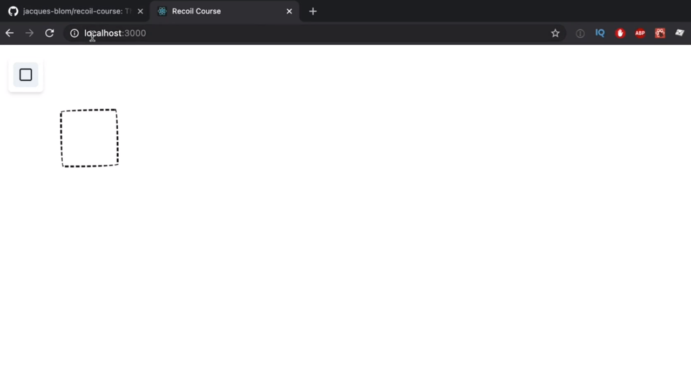

<p align="left">
 <a href="01_02.md">◀ Back: Overview of Recoil.</a>
</p>

---

# Project Setup.

A lo largo de este manual nos vamos a basar en la utilización del proyecto que base que podemos encontrar dentro de GitHub [https://github.com/jacques-blom/recoil-course](https://github.com/jacques-blom/recoil-course). Así lo primero que vamos a hacer es clonarlo en nuestro equipo:

```bash
$ git clone https://github.com/jacques-blom/recoil-course.git
```

Una vez el proyecto es descargado en nuestra máquina el siguiente paso va a consistir en acceder al directorio `recoil-course` que se habrá creado e instalar todas las dependencias de nuestro proyecto gracias al uso de npm:

```bash
$ cd recoil-course
$ npm install
```

Terminada la instalación el siguiente paso va a consistir en abrir el proyecto en nuestro editor de código favorito (en nuestro caso será VSCode) y desde la terminal del sistema arrancarlo con la ejecución del siguiente comando desde la consola:

```bash
$ npm run start

Compiled successfully!

You can now view recoil-course in the browser.

  Local:            http://localhost:3000
  On Your Network:  http://192.168.0.5:3000
```

Vemos por lo tanto que el proyecto se a construido y a arrancado sin problemas lo que nos va a permitir acceder al mismo si nos vamos a la url [http://localhost:3000](http://localhost:3000) desde un navegador lo que nos mostrará una imagen como al siguiente:

<div style='text-align: center'>
  
</div>
<br />

La aplicación es muy simple ya que únicamente nos muestra un lienzo (canvas) y un botón que al ser pulsado va a permitir dibujar un rectángulo dentro del mismo.

Si ahora nos fijamos en los archivos que forman parte del proyecto dentro del directorio `src` es donde nos vamos a encontrar todos los archivos que forman el código fuente de nuestra aplicación. En concreto tenemos el archivo `index.tsx` que es el punto de entrada para nuestra aplicación. El código del mismo es el que se muestra a continuación:

```js
import React from 'react'
import ReactDOM from 'react-dom'
import './index.css'
import Canvas from './Canvas'
import {ChakraProvider} from '@chakra-ui/react'
import {BrowserRouter as Router, Route, Switch} from 'react-router-dom'

ReactDOM.render(
  <React.StrictMode>
    <ChakraProvider>
      <Router>
        <Switch>
          <Route>
            <Canvas />
          </Route>
        </Switch>
      </Router>
    </ChakraProvider>
  </React.StrictMode>,
  document.getElementById('root'),
)
```

Vemos que estamos utilizando el *Strict Mode* de React ya que estamos envolviendo toda al aplicación con el componente `React.StrictMode` para que React realice comprobaciones adiciones durante el desarrollo dentro de nuestros componentes. También estamos envolviendo nuestra aplicación con el componente `ChakraProvider` porque vamos a utilizar esta librería para proporcionar los estilos CSS para la aplicación. Lo siguiente con lo que nos encontramos es que con la definición de un `Router` de **react-router** en el que únicamente estamos definiendo una ruta de navegación que renderizará el componente `Canvas`, componente que este ya es propio de nuestro código.

---
**Nota:** se puede obtener más información acerca de cómo funciona y para qué se utiliza el *Strict Mode* de React leyendo [la documentación oficial](https://reactjs.org/docs/strict-mode.html#gatsby-focus-wrapper).

---
**Nota:** Chakra es una librería para React que nos va a permitir crear interfaces de usuario accesibles de forma sencilla. Se puede obtener más información consultando [la web](https://reactjs.org/docs/strict-mode.html#gatsby-focus-wrapper) del proyecto.

---
**Nota:** **react-router** es una librería muy popular en el desarrollo de aplicaciones en React que sirve para establecer rutas (url de enlace) de forma sencilla. En este manual no vamos a profundizar en ella pero se puede obtener más información consultando [la web](https://reactrouter.com/) oficial.

---

El siguiente paso que tenemos que dar es instalar Recoil para lo cual simplemente tenemos que abrir una terminal del sistema y ejecutar lo siguiente:

```bash
$ npm install recoil
```

Hecho esto tenemos que modificar nuestra aplicación para que pase a utilizar Recoil como la librería que nos va a permitir gestionar el estado de la misma. Lo primero que vamos a tener que hacer es importar el componente `RecoilRoot` dentro del código del archivo que forma el punto de entrada de la aplicación (es decir, el archivo que hemos visto anteriormente):

```js
import { RecoilRoot } from 'recoil'
```

Hecho lo cual el siguiente paso que tenemos que dar será envolver a toda nuestro árbol de componente de la aplicación con el mismo. Por lo tanto vamos a escribir algo como lo siguiente:

```js
<React.StrictMode>
  <RecoilRoot>
    <ChakraProvider>
```

Con esto lo que estamos logrando es que todos los componentes que son hijos de `RecoilRoot` van a tener acceso al estado que esté gestionado por Recoil lo que se traduce, por el lugar en el que lo hemos situado en que todos los componentes de nuestra aplicación van a poder acceder a este estado.

El código completo del fichero `index.tsx` una vez hemos realizado todas las modificaciones que hemos ido explicando a lo largo de este punto es el que se muestra a continuación:

```js
import React from 'react'
import ReactDOM from 'react-dom'
import './index.css'
import Canvas from './Canvas'
import {ChakraProvider} from '@chakra-ui/react'
import {BrowserRouter as Router, Route, Switch} from 'react-router-dom'
import {RecoilRoot} from 'recoil'

ReactDOM.render(
  <React.StrictMode>
    <RecoilRoot>
      <ChakraProvider>
        <Router>
          <Switch>
            <Route>
              <Canvas />
            </Route>
          </Switch>
        </Router>
      </ChakraProvider>
    </RecoilRoot>
  </React.StrictMode>,
  document.getElementById('root'),
)
```

---

<p align='right'>
  <a href='../00_00.md'>Finish. Go to Index</a>
</p>
