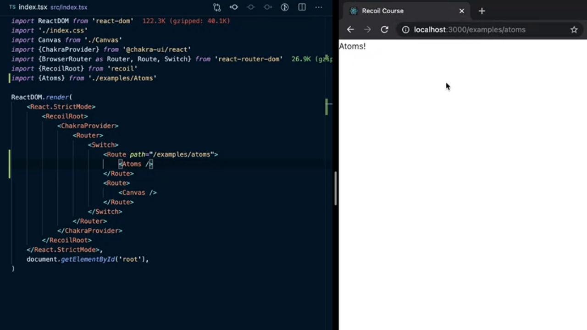
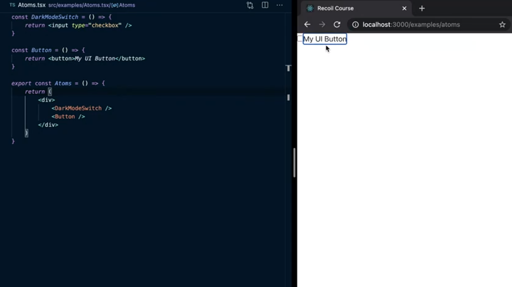
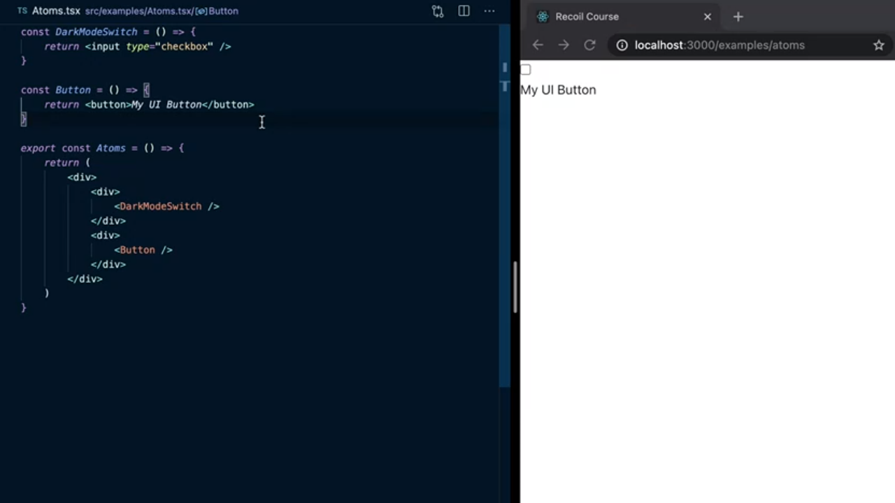

<p align="left">
 <a href="02_00.md">◀ Back: Chapter Index.</a>
</p>

---

# Atoms - Basics.

Vamos a continuación con el desarrollo de la aplicación de ejemplo que hemos configurado en el [capítulo anterior](../ch01/01_03.md). En concreto dentro del directorio `src` vamos a crear un subdirectorio `examples` y en el mismo creamos el fichero `Atoms.tsx`. Este archivo lo que va a contener es un nuevo componente de React que en principio solamente va a renderizar un mensaje muy simple en la pantalla:

```js
export const Atoms = () => {
  return <div>Atoms!</div>
}
```

Hecho esto nos vamos a dirigir al fichero `index.tsx` situado en el directorio raíz de nuestra aplicación (y que recordemos que es el punto de entrada a la aplicación de React) con el fin de añadir una nueva ruta de navegación como sigue:

```js
<Router>
  <Switch>
    <Route path='/examples/atoms'>
      <Atoms />
    </Route>
    <Route>
      <Canvas />
    </Route>
  </Switch>
</Router>
```

es decir, que cada vez que el usuario navege hacia la ruta `/examples/atoms` el componente de React que se le mostrará a nuestro usuario va a ser `Atoms`, es decir el componente que acabamos de definir y que por lo tanto tenemos también que importar en `index.tsx`:

```js
import { Atoms } from './atoms'
```

Esto quiere decir que si ahora dirigimos nuestro navegador hacia `http://localhost:3000/examples/atoms` lo que nos va a aparecer dentro de mismo es algo como lo que se puede ver a continuación:

<div style='text-align: center'>
  
</div>
<br />

Vamos ahora a crear un nuevo componente dentro del fichero `Atoms.tsx` el cual va servir para poder registrar dentro del estado si el usuario que está utilizando nuestra aplicación está utilizando el modo oscuro (Dark Mode) o no de la misma. Inicialmente el contenido de este componente lo único que va a hacer es mostrarnos un checkbox que permitirá activarlo o desactivarlo.

```js
const DarkMode = () => {
  return <input type='checkbox' />
}
```

También vamos a definir un nuevo componente dentro de este archivo que se encargará de mostrar en la interfaz de usuario un botón de html. Esto supone que inicialmente el contenido de este componente va a ser tan sencillo como lo siguiente:

```js
const Button = () => {
  return <button></button>
}
```

El siguiente paso va a ser modificar ligeramente el marcado del componente `Atoms` para que renderice el *toggle* que va a permitir activar o no el dark mode en la aplicación y un botón, ambos gracias a los dos componentes que acabamos de definir. Por lo tanto escribiremos:

```js
export const Atoms = () => {
  return (
    <div>
      <DarkMode />
      <Button />
    </div>
  )
}
```

Ahora si guardamos los cambios en la aplicación y volvemos a cargarlo en el navegador vamos a comprobar que tenemos el checkbox y el botón tal y como esperábamos:

<div style='text-align: center'>
  
</div>
<br />

De hecho ahora mismo cada uno de los elementos se muestran en la interfaz de usuario uno a continuación del otro por lo que parece que se verá mucho mejor en el caso de que cada uno de ellos esté en una nueva fila por lo que los envolveremos en elementos `div` como sigue:

```js
export const Atoms = () => {
  return (
    <div>
      <div>
        <DarkMode />
      </div>
      <div>
        <Button />
      </div>
    </div>
  )
}
```

Si ahora guardamos nuestro trabajo y lo volvemos a recargar dentro del navegador vamos a obtener un resultado como el que se muestra en la siguiente imagen:

<div style='text-align: center'>
  
</div>
<br />

Lo que estamos intentando lograr con esta implementación es que cada vez que el usuario pulse sobre el *toggle* que activa o desactiva el dark mode todos los componentes de la aplicación que forman parte de la interfaz de usuario han de ser capaz de cambiar la forma en la que son renderizados para que pasen de estar en el estado *light* o *dark* en función de lo que haya elegido el usuario. Para lograrlo lo primero que tenemos que hacer es el componente `DarkModeSwitch` tenga definido una variable de estado en el que se recogerá si el usuario ha marcado o no el checkbox que recogerá la elección del usuario. Esto simplemente lo lograremos gracias al uso del hook `useState`:

```js
import React from 'react'

const DarkModeSwitch = () => {
  const [darkMode, setDarkMode] = React.useState(false)
  return <input type='checkbox' />
}
```

---
**Nota:** como se puede ver en el código anterior hemos tenido que importar `React` de la librería **react** para poder tener acceso a los hooks que podamos ir necesitando mientras avanzamos en la construcción de nuestro proyecto.

---

El siguiente paso consistirá en establecer que el valor del atributo `checked` de nuestro checkbox ha de ser el mismo que tenemos recogido en el estado del componente además de establecer el evento sobre el mismo que va a permitir cambiar el valor del estado en función de cómo se encuentre nuestro checkbox. Por lo tanto escribiremos:

```js
import React from 'react'

const DarkModeSwitch = () => {
  const [darkMode, setDarkMode] = React.useState(false)
  return (
    <input
      type='checkbox'
      checked={ darkMode }
      onChange={ e => setDarkMode(e.currentTarget.checked) }
    />
  )
}
```

Con esto tenemos recogida la información del modo que prefiere el usuario dentro del estado del componente `DarkModeSwitch` pero ¿cómo podemos hacer para que compartir esta información de las preferencias con el componente que hemos definido para renderizar un botón dentro de la aplicación y que de esta manera se muestre de color oscuro?

Una de forma de hacerlo es *subir* la pieza del estado que recoge esta información un nivel en la jerarquía de componentes que tenemos definida lo que en nuestro caso supondría situarlo dentro del componente `Atoms` (componente padre tanto del componente `DarkModeSwitch` como del componente `Button`) dejándolo como se puede ver a continuación:

```js
export const Atoms = () => {
  const [darkMode, setDarkMode] = React.useState(false)
```

Esto provoca que tengamos que pasar tanto el valor del atributo del estado `darkMode` como la función que nos va a permitir cambiarlo `setDarkMode` como props del componente `DarkModeSwitch`:

```js
export const Atoms = () => {
  const [darkMode, setDarkMode] = React.useState(false)
  return (
    <div>
      <div>
        <DarkModeSwitch
          darkMode={ darkMode }
          setDarkMode={ setDarkMode }
        />
```

Y lo mismo pasaría con el valor del atributo `darkMode` que lo vamos a tener que pasar como una prop del atributo `Button` para que sepa cómo ha de tener que renderizarlo:


```js
export const Atoms = () => {
  const [darkMode, setDarkMode] = React.useState(false)
  return (
    <div>
      <div>
        <DarkModeSwitch
          darkMode={ darkMode }
          setDarkMode={ setDarkMode }
        />
      </div>
      <div>
        <Button darkMode={ darkMode } />
      </div>
    </div>
  )
}
```

Esto que acabamos de describir es un patrón bastante común a la hora de crear las aplicaciones de React en el que simplemente lo que estaremos haciendo es situar en el componente padre toda la información del estado de la que depende los componentes hijos y que puede llegar a funcionar en la mayoría de las situaciones pero que se vuelve especialmente compleja en el caso de que el componente que la precisa esté profundamente en el árbol de componentes ya que dicho valor va a tener que pasar por diferentes componentes que no lo precisan para nada (simplemente sirven de puente) pero que ante un cambio en un valor de una de sus props provoca un re-renderizado del mismo cuando en realidad no sería necesario.


El código completo del archivo `Atoms.tsx` tras la realización de todos los cambios que han sido realizados a lo largo de este punto es el que se puede ver a continuación:

```js
import React from 'react'

const DarkModeSwitch = () => {
  const [darkMode, setDarkMode] = React.useState(false)
  return (
    <input
      type='checkbox'
      checked={ darkMode }
      onChange={ e => setDarkMode(e.currentTarget.checked) }
    />
  )
}
```


---

<p align="right">
  <a href="02_02.md">Next: Selectors - Basics ▶</a>
</p>
