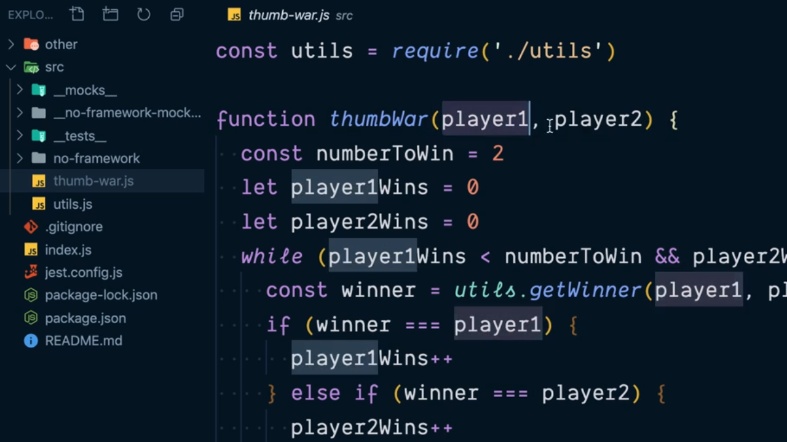
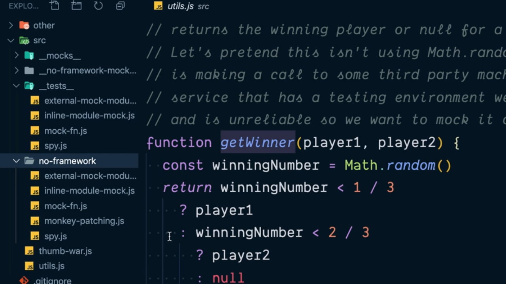
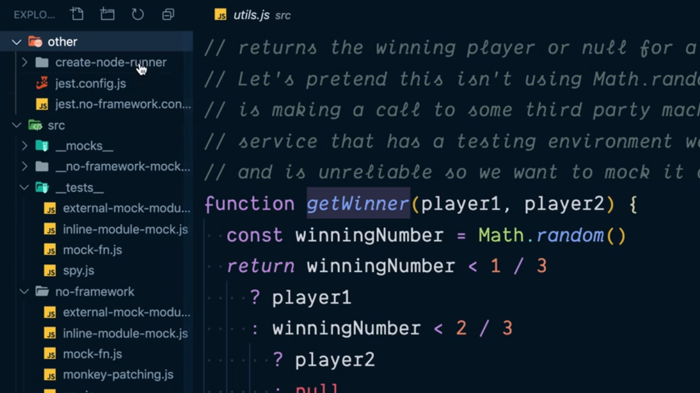

# Intro to JavaScript Mocking Fundamentals.

El concepto de Mock es uno de los más importantes a la hora de realizar los test dentro de nuestras aplicaciones y también uno de los que suele ser más desconocido (o al menos menos comprendido) por parte de los desarrolladores. Para ello vamos a ver cómo podríamos crear nuestras propias funcionalidades de Mock en NodeJS para al final ver como lo implementa la librería **[Jest](https://jestjs.io/)**.

De forma general podemos entender el Mock de un módulo dentro de un proyecto de JavaScript (o en cualquier otro lenguaje de programación) como un mecanismos que tenemos a nuestra disposición y que nos va servir para simular alguno de los módulos con los que trabajaremos respondiendo de la manera que a nosotros nos pueda interesar. Un ejemplo que nos puede ayudar a entenderlo es pensar en que nuestra aplicación esté haciendo uso de un módulo que actúe como pasarela de pago a un banco y para hacer nuestras pruebas no deseamos llamar al módulo concreto porque nos cargarían con transaciones que son de prueba y no llevadas a cabo por nuestros clientes.

Para la explicación de este capítulo vamos a hacer uso de un nuevo proyecto de JavaScript cuya estructura de directorios se puede ver en la siguiente imagen:

<div style='text-align: center'>
  
</div>
<br />

El archivo que contiene el código que queremos testear es `thumb-war.js` y dentro del mismo nos encontramos con lo siguiente:

```js
const utils = require('./utils')

function thumbWar(player1, player2) {
  const numberToWin = 2
  let player1Wins = 0
  let player2Wins = 0
  while (player1Wins < numberToWin && player2Wins < numberToWin) {
    const winner = utils.getWinner(player1, player2)
    if (winner === player1) {
      player1Wins++
    } else if (winner === player2) {
      player2Wins++
    }
  }
  return player1Wins > player2Wins ? player1 : player2
}

module.exports = thumbWar
```

Básicamente lo que hace esta función es determinar cuál de los dos jugadores será el que ganará una competición necesitando un total de 2 victorias para que pueda ser considerado el ganador. Es más para poder determinar qué jugador es el que gana se está haciendo uso de la función `getWinner` que está siendo exportada desde el fichero `utils.js` y cuya apariencia es la siguiente:

```js
// returns the winning player or null for a tie.
// Let's pretend this isn't using Math.random() but instead
// is making a call to some third party machine learning
// service that has a testing environment we don't control
// and is ureliable so we eant to mock it out for tests.
function getWinnder(player1, player2) {
  const winningNumber = Math.random()
  return winningNumber < 1 / 3
    ? player1
    : winningNumber < 2 / 3
      ? player2
      : null
}

module.exports = { getWinner }
```

La idea que vamos a perseguir durante el estudio de este capítulo es poder mockear la función `getWinner` comenzando por los mecanismos más fáciles que vamos a tener a nuestra disposición para poderlo llevar a cabo y acabar viendo las formas más complejas de lograr nuestro objetivo.

En el proyecto vamos a definir el directorio `__tests__` para recoger dentro del mismos todos los mock que vamos a realizar utilizando para ello Jest y también el directorio `no-framework` donde vamos a estudiar cómo realizarlo sin hacer uso de ninguna librería. Al finalizar el capítulo dentro de cada uno de estos dos directorios vamos a tener los mismos archivos para lograr la funcionalidad perseguida:

<div style='text-align: center'>
  
</div>
<br />

Por otra parte el proyecto tiene definido otro directorio denominado `other` donde vamos a ir depositando la información y funcionalidad adicional que vamos a necesitar para lograr realizar y trabajar con los mocks dentro del proyecto tanto si estamos utilizando Jest como si no hacemos uso de ningún framework:

<div style='text-align: center'>
  
</div>
<br />

<br />

----
<div>
  <div style="float: left">
    <a href="./03_00.md">
      < Chapter Index
    </a>
  </div>
  <div style="float: right">
    <a href="./03_01.md">
      Override Object Properties to Mock with Monkey Patching >
    </a>
  </div>
</div>
