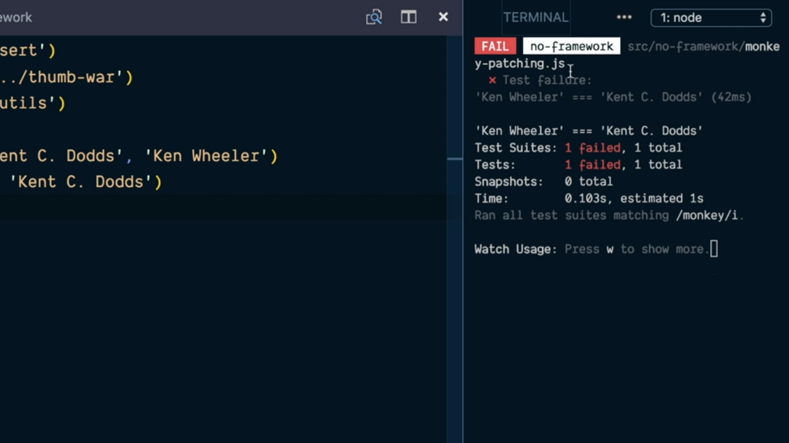
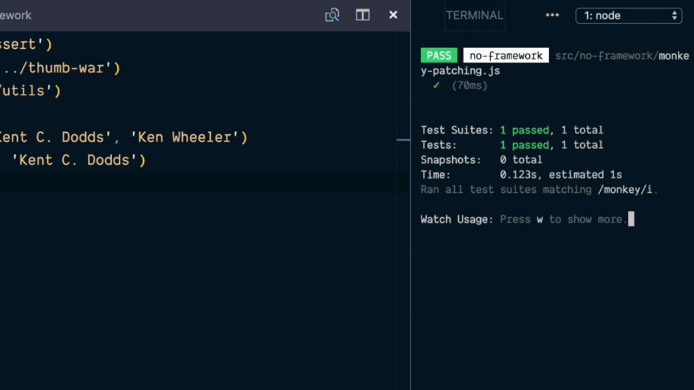

# Override Object Properties to Mock with Monkey Patching.

Comencemos recordando el aspecto que tiene la función que queremos probar dentro del código de nuestro proyecto la cual está contenida dentro del fichero `thumb-war.js`:

```js
const utils = require('./utils')

function thumbWar(player1, player2) {
  const numberToWin = 2
  let player1Wins = 0
  let player2Wins = 0
  while (player1Wins < numberToWin && player2Wins < numberToWin) {
    const winner = utils.getWinner(player1, player2)
    if (winner === player1) {
      player1Wins++
    } else if (winner === player2) {
      player2Wins++
    }
  }
  return player1Wins > player2Wins ? player1 : player2
}

module.exports = thumbWar
```

Como se puede deducir esta función lo único que hace es llamar a la función `getWinner` que está recodiga dentro del módulo `utils` la cual determinar cuál de los dos jugadores que recibe como parámetro será el ganador y en el caso de que gane el jugador 1 incrementa en una unidad el número de victorias que ha conseguido el primero de los jugadores que ha recibido como parámetro la funciṕon `thumbWar` mientras que si el jugador que gana es el jugador 2 incrementará en una unidad el número de victorias del segundo de los jugadores recibidos como parámetro.

Esta llamada se sigue realizando hasta el momento en el que alguno de los dos jugadores alcanza un total de 2 victorias memento en el cual finalizará el bucle `while` y la función retornará el jugador que ha alcanzado dicha cantidad de victorias.

Para la realización de nuestros test sobre la función `thumbWar` no nos tiene que importar cómo está implementada la función `getWinner` pero lo que sí que sabemos es que es invocada y como tal tenemos que controlar de alguna manera qué resultado retornará para poderlo utilizar en nuestros test. Este tipo de control es lo que se conoce como mockear la función.

Vamos a ver cómo podemos realizar esto sin utilizar para ello ningún framework. Para ello vamos a crear el archivo `no-framework.js` dentro del directorio `src` donde lo que queremos hacer es recoger los test que vayamos realizando y que no dependerán de ninguna librería concreta.

Y no solamente esto sino que tenemos que añadir una librería que nos permita ser utilizada para la realización de los test. Como estamos utilizando NodeJS para poder realizar los test de nuestras aplicaciones vamos a poder utilizar directamente el módulo **[assert](https://nodejs.org/api/assert.html)** que nos proporciona el lenguaje sin que tengamos que instalar ninguna librería adicional para ello. 

Comenzamos por lo tanto importando todos aquellos módulos que vamos a utilizar para la realización de los test por lo que las primeras líneas del fichero serán las siguientes:

```js
const assert = require('assert')
const thumbWar = require('../thumb-war')
const utils = require('../utils')
```

Lo siguiente que tendremos que hacer es llamar a la función que vamos a probar, que en nuestro caso es `thumbWar` pasándole como parámetro dos string que representen los nombres de los dos jugadores que se están enfrentando:

```js
const winner = thumbWar('Kent C. Dodds', 'Kent Wheeler')
```

Y ahora podemos hacer uso de los métodos que nos proporciona la libería `assert` para realizar aserciones sobre los resultados que estamos obteniendo. Así, por ejemplo, si lo que queremos es asegurar que tras la invocación de la función el ganador de la partida habrá sido el primero de los dos jugadores escribiríamos lo siguiente:

```js
const winner = thumbWar('Kent C. Dodds', 'Kent Wheeler')
assert.strictEqual(winner, 'Kent C. Doods')
```

Si nos dirigimos a la terminal del sistema podremos ver que se produce un error en la ejecución del test ya que es más que probable que el ganador de la partida no haya sido el primero de los dos jugadores:

<div style='text-align: center'>
  
</div>
<br />

---
**Nota:** para obtener más información de cómo funciona el método `scrictEquals` que nos proporciona la librería assert de NodeJS se recomienda consultar la [documentación oficial](https://nodejs.org/api/assert.html#assert_assert_strictequal_actual_expected_message).

---

Pero no solamente esto, sino que debido a la que no tenemos control hacerca de la función que determina cuál de los dos jugadores ganará la partida es posible que alguna de las ejecuciones de nuestro test este pase sin problemas porque se esté dando la situación de que sea el primero de los dos jugadores el que está ganando la partida:

<div style='text-align: center'>
  
</div>
<br />

Es decir que no tenemos control sobre el resultado de la llamada a la función porque la función que se utiliza para ello (la función `getWinner` que está incluida dentro del fichero `utils.js`) lo está determinando de forma aleatoria y este tipo de mecanismo no ayuda a poder determinar cuál de los dos jugadores ganará la partida. De hecho en el contenido de este fichero `utils.js` se hace uso de la función `random` del objeto `Math` para determinar quién es el ganador como se puede ver a continuación:

```js
// returns the winning player or null for a tie.
// Let's pretend this isn't using Math.random() but instead
// is making a call to some third party machine learning
// service that has a testing environment we don't control
// and is ureliable so we eant to mock it out for tests.
function getWinnder(player1, player2) {
  const winningNumber = Math.random()
  return winningNumber < 1 / 3
    ? player1
    : winningNumber < 2 / 3
      ? player2
      : null
}

module.exports = { getWinner }
```

Entonces ¿qué podemos hacer para poder mockear el comportamiento de la función que nos proporciona el módulo `utils`? Pues simplemente sobreescribirla de tal manera que podamos asegurar que el código que se ejecutará será el que nosotros definimos dentro del fichero:

```js
const assert = require('assert')
const thumbWar = require('../thumb-war')
const utils = require('../utils')

utils.getWinner = (p1, p2) => p1

// ... rest of code
```

Es decir que lo que hacemos es que el método `getWinner` en este caso la función que está invocando `thumbVar` quedará sobreescrita con la funcionalidad de esta función que lo que hace es retornar siempre el primer argumento que recibe como parámetro, que en nuestro caso es garantizar que se determinará que el ganador de la partida será el jugador uno.

Con esto lo que garantizamos es que en absolutamente todas las ejecuciones de los test que llevemos a cabo en sobre la aplicación siempre finalizarán de forma correcta (entendiendo como tal que el test pasa o que no finaliza con un error).

Así hemos logrado que nuestros test se ejecuten siempre de forma determinista (no aleatoria) por lo que podemos asegurar y hacer aserciones sobre los resultados que estamos esperando ya que conoceremos las condiciones sobre las que se estarán ejecutando.

El problema aquí es que hemos sobreescrito el función `getWinner` del módulo `utils` por lo que en cualquier otra parte de la aplicación donde se esté utilizando (lo que incluirá el resto de los test que podamos tener) quedará sobreescrita lo que se traduce a que como último paso en la ejecución del código recogido en el fichero `no-framework.js` será reestablecer la función que tenía asignada en el principio del mismo (la función real). Esto implicará que al inicio de la ejecución del archivo recojamos la función antes de realizar el mock:

```js
const assert = require('assert')
const thumbWar = require('../thumb-war')
const utils = require('../utils')

const originalGetWinner = utils.getWinner
utils.getWinner = (p1, p2) => p1

// ... rest of code
```

Y lo que tendremos que hacer es justo al final del archivo volver a reestablecer el código de la función `getWinner` de la siguiente manera:

```js
// ...rest of code
assert.strictEqual(winner, 'Kent C. Doods')

utils.getWinner = originalGetWinner
```

---
**Nota:** Nos interesa conocer es que este mecanismo para realizar el mock estableciendo de forma determinística por nosotros mismos con una nueva función que la substituya para posteriormente recuperar el código original es lo que se conoce como **Monkey Patching**

---

El código completo del fichero `no-framework.js` que recoje el test que acabamos de construir a lo largo de este punto es el que mostramos a continuación:

```js
const assert = require('assert')
const thumbWar = require('../thumb-war')
const utils = require('../utils')

const originalGetWinner = utils.getWinner
utils.getWinner = (p1, p2) => p1

const winner = thumbWar('Kent C. Dodds', 'Kent Wheeler')
assert.strictEqual(winner, 'Kent C. Doods')

utils.getWinner = originalGetWinner
```

<br />

----
<div>
  <div style="float: left">
    <a href="./03_01.md">
      < Intro to JavaScript Mocking Fundamentals
    </a>
  </div>
  <div style="float: right">
    <a href="./03_03.md">
      Ensure Functions Are Called Correctly with JavaScript Mocks >
    </a>
  </div>
</div>
