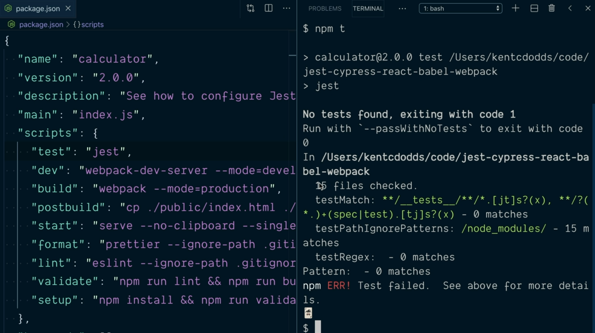
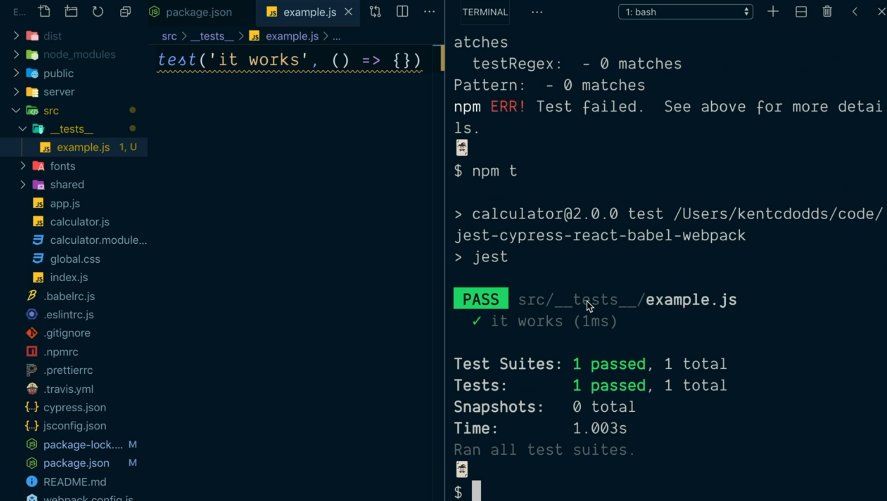
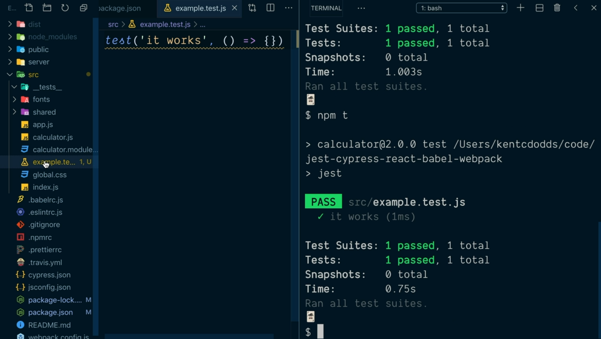
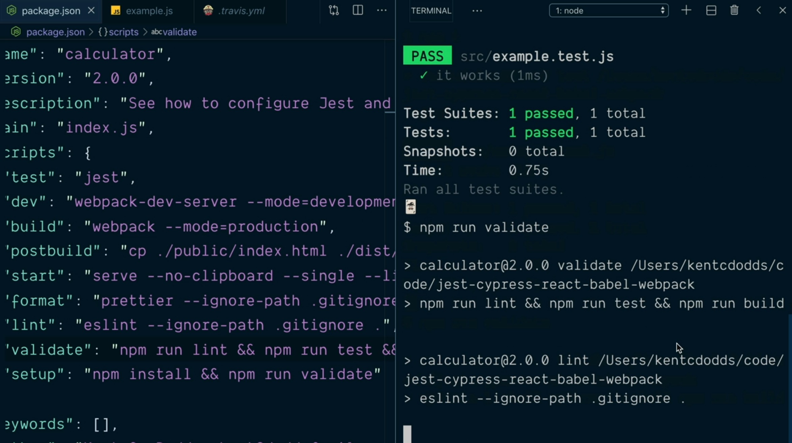
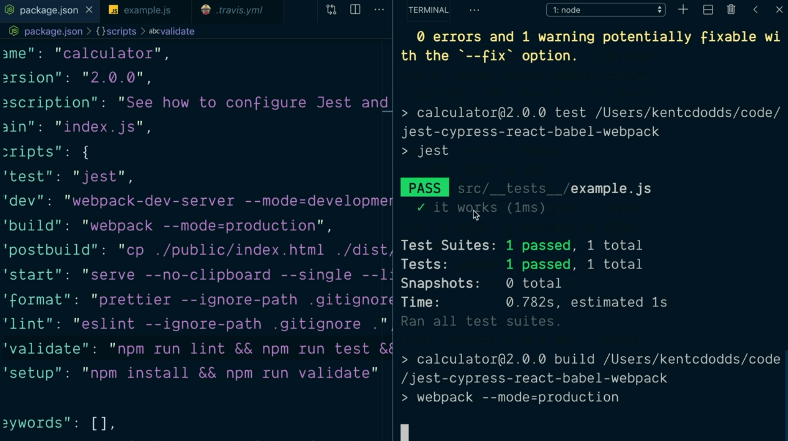
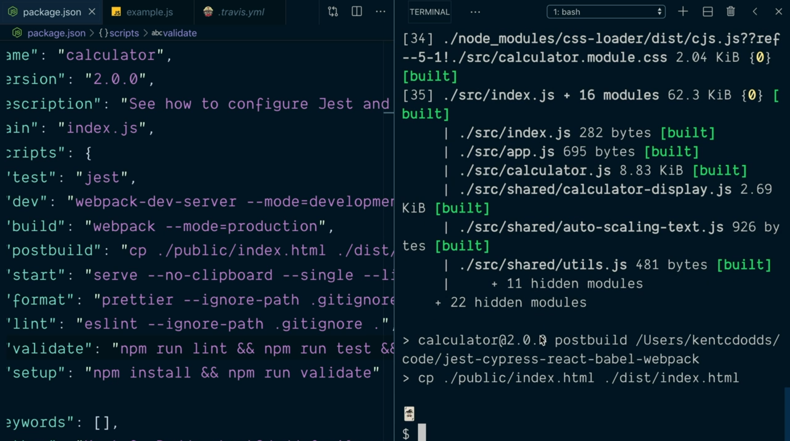

# Install and Run Jets.

Como sucede con cualquier otra librería que vayamos a utilizar en nuestros proyectos y siempre en el caso de que no haya sido instalada previamente lo primero que vamos a tener que hacer es instalar Jest como una dependencia de desarrollo dentro de nuestro proyecto:

```console
$ npm install --save-dev jest
jest@24.9.0
[...]
```

Cuando el proceso de instalación finalice correctamente dentro del fichero `package.json` veremos que se ha añadido una nueva dependecia de desarrollo que incidará no solamente la librería que hemos instalado sino la versión de la misma con la que estaremos trabajando que en nuestro caso será la 24.9.0.

---
**Nota:** si queremos realizar una comprobación adicional para que ver que Jest se ha instalado correctamente simplemente nos podemos ir al directorio `node_modules` de nuestro proyecto para ver a su vez que dentro del directorio `.bin` tenemos el fichero `jest` que sirve para invocar el CLI (Command Line Interface) que ejecutará Jest.

---

Hecho esto el siguiente paso será añadir una nuevo script dentro de los que tenemos recogidos en el fichero `package.json` de tal manera que cuando lo invoquemos lo que hagamos sea invocar al CLI de Jest. Por añadimos siente atributo al nodo `scripts` del objeto recogido en el fichero `package.json`:

```json
"scripts": {
  "test": "jest",
  /* ... otro contenido */
```

Con la definición anterior lo que hacemos es invocar el CLI de Jest de la forma más sencilla posible, es decir, con todas las opciones que tiene por defecto configuradas. Con esta configuración ahora podemos ejecutar todos los test de nuestra aplicación de tres formas diferentes desde la raíz de nuestro proyecto:

```console
$ npm run test
$ npm test
$ npm t
```

Si ahora mismo lo ejecutamos Jest nos informará de que no ha encontrado ningún test para ejecutar y para el que no haya ningún test dentro del proyecto es algo que considera un error informándonos de ello.

<div style='text-align: center'>
  
</div>

Por defecto Jest busca los test en cualquier subdirectorio dentro de los que conforman nuestro proyecto que se denomine `__tests__` por lo que vamos a crear un directorio con este nombre del directorio `src` y dentro del mismo creamos el fichero `example.js` para recoger los test que queremos que sean ejecutados.

Dentro del código de este fichero simplemente lo que vamos a hacer es invocar a la función `test` que nos proporciona Jest (la cual está disponible sin tener que hacer ningún tipo de importación ya que es una función que Jest pone a nuestra dispoción de forma global) la cual espera recibir como primer parámetro un string que identifique de alguna manera el test que se va a ejecutar y como segundo parámetro la función que recoge el conjunto de de instrucciones que forman el test.

```js
test('it works', () => {})
```

Si guardamos la información y volvemos a ejecutar los test deste el directorio raíz del proyecto la salida que obtendremos ya no será un error porque ahora mismo hay un test que se ha de ejecutar y este además no finaliza con un error (o dicho de otra manera, el test pasa).

<div style='text-align: center'>
  
</div>

Jest, por defecto, también ejecutará todos los test que estén recogidos en cualquiera de los directorios de nuestro proyecto que finalicen con la extensión `*.test.js`. Así, si en nuestro caso movemos el fichero `example.js` del direction `__tests__` que hemos creado anteriormente y lo situamos en la raíz del proyecto renombrándolo como `example.test.js` y ejectamos de nuevo Jest el resultado que obtendremos volverá a ser el mismo:

<div style='text-align: center'>
  
</div>

---
**Nota:** se recomienda tomar una decisión acerca de si se prefiere utilizar el directorio `__tests__` o la extensión `*.test.js` a la hora de describir los test de la aplicación con el fin de ser consistente a la largo del desarrollo del proyecto.

---

Nos queda una modificación adicional que tiene que ver con indicarle al proceso de integración continua que estamos siguiendo en el manual que queremos que se ejecuten los test como parte del proceso de construcción del entregrable del proyecto. Así, en el fichero `.travis.yml` tenemos recogido que el script que se ha de ejecutar para construir el entregable de la siguiente manera:

```yml
script: npm run setup
```

Si nos vamos al fichero `package.json` y más concretamente a ver qué es lo que se ejecuta en este script: 

```json
"scripts": {
  "test": "jest",
  /** ... Otra configuración ... */
  "validate": "npm run lint && npm run built",
  "setup": "npm install  && npm run validate"
}
```

Aquí tenemos que recordar que dentro del script `validate` lo que hemos agrupado son todas aquellas configuraciones que nos ayuden a garantizar que nuestro proyecto se encuentra en un estado válido por lo que parece lógico añadir la ejecución de todos estos test como parte de dicho proceso de valicación. Así, en el caso de que se pasen todas las validaciones por parte de los *Lint* que tengamos configurados el siguiente paso será que Jest ejecute todos los test que hayamos definido:

```json
"scripts": {
  "test": "jest",
  /** ... Otra configuración ... */
  "validate": "npm run lint && npm run test && npm run built",
  "setup": "npm install  && npm run validate"
}
```

Ahora si desde la terminal del sistema ejecutamos el script `validate` podemos ver por la salida como en primer lugar se ejecutan las operaciones de *Lint*:

<div style='text-align: center'>
  
</div>

seguidos de todos los test que hayamos definido:

<div style='text-align: center'>
  
</div>

para finalizar ejecutando el built del entregable:

<div style='text-align: center'>
  
</div>

