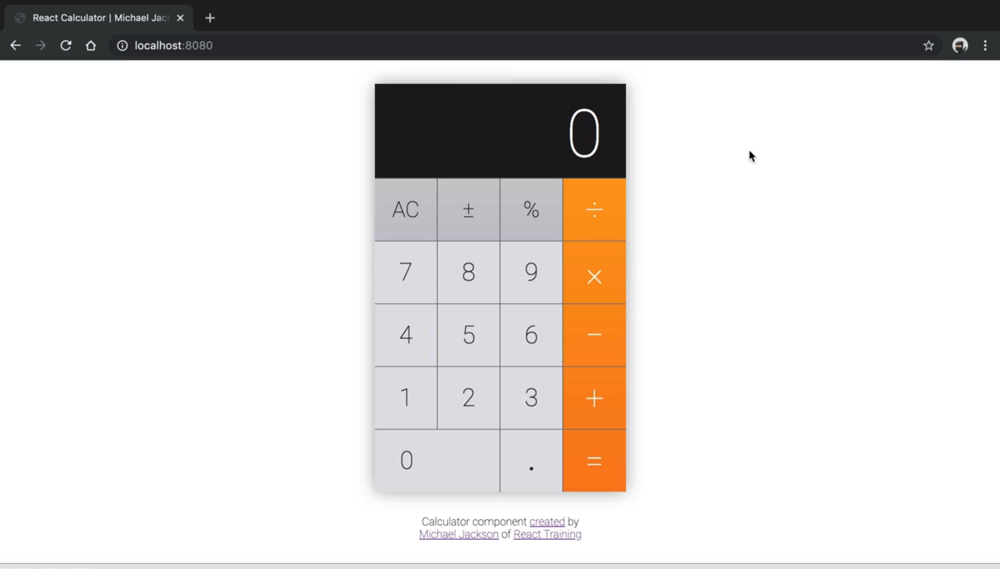
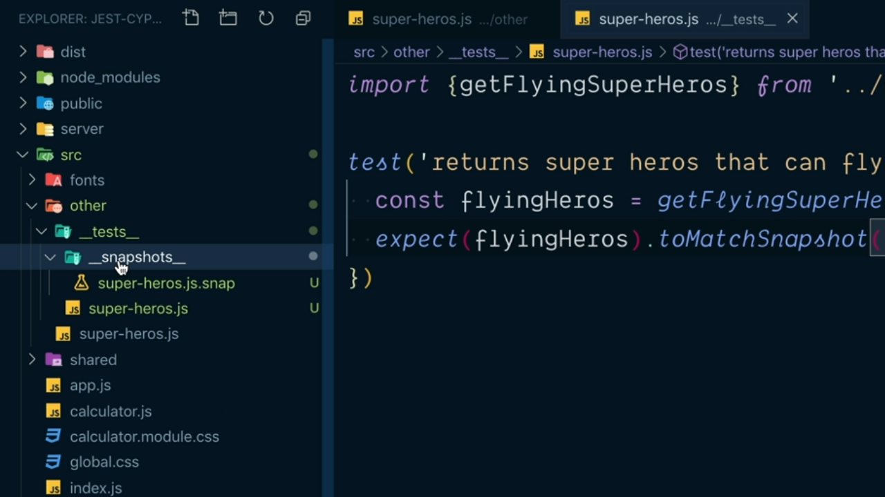

# Configure Jest for Testing JavaScript Applications.

- Introduction.
- Install and Run Jest.
- Compile Modules with Babel in Jest Tests.
- Testing Browser or NodeJS.
- Support Importing CSS Files.
- Generate a Serializable Value.

# Introduction.

En este capítulo vamos a aprender a configurar y utilizar Jest para realizar nuestros test dentro de las aplicaciones JavaScript. A lo largo de los ejemplos que vamos a ir desarrollando a lo largo del capítulo nos vamos a apoyar en la definición de una aplicación de React que ha sido creada y configurada utilizando webpack (en otras palabras, que no ha sido creada utilizando `create-react-app` ni ninguna otra utilidad).

La aplicación una vez que arranca lo que hará será mostrar en el navegador de usuario una interfaz de una calculadora con la que podrá actuar cuyo aspecto será muy parecido al que se muestra en la siguiente imagen.

<div>
  
</div>
<br/>

## Install & Run Jest.

Lo primero que tendremos que hacer para poder trabajar con Jest dentro de nuestros proyectos es instalar la libería como una dependencia de desarrollo lo cual lo haremos mediante la ejecución del siguiente comando desde la terminald el sistema:

```bash
$ npm install --save-dev jest
```

Cuando todo el proceso de instalación de las dependecias de desarrollo finalice en el fichero `package.json` del proyecto vamos a poder ver como se ha añadido el atributo la versión de la librería con la que estaremos trabajando (que en nuestro caso será la 24.9.0):

```json
"devDependencies": {
  "jest": "^26.6.3"
}
```

De hecho una vez finaliza la instalación de Jest si ahora nos vamos al directorio `node_modules` de nuestro proyecto y dentro del mismo a la directorio `bin` donde se recogerán todos aquellos comandos que van a poder ser invocados desde la línea de comandos gracias al uso de npm vemos que tenemos el archivo `jest`. ¿Qué significará esto? Pues simplemente que ahora dentro del archivo `package.json` vamos a poder añadir un nuevo script que sirva para ejecutar la librería de la siguiente manera:

```json
"script": {
  "test": "jest"
}
```

¿Qué quiere decir esto? Pues que ahora si abrimos una nueva terminal de nuestro sistema vamos a poder ejecutar jest sin más que hacer uso de una de las siguientes tres alternativas:

```bash
$ npm run test
$ npm test
$ npm t
```

Sin embargo ¿qué es lo que ocurre si ahora lo ejecutamos desde la terminal de comandos? Pues la respuesta la encontramos a continuación:

```bash
> testing@1.0.0 test
> jest

No tests found, exiting with code 1
[...]
```

donde podemos ver que Jest nos informa de que no ha encontrado ningún fichero que contenga al menos un test que haya de ser ejecutado. Ahora bien, ¿cómo podemos crear un test dentro de Jest? Uno de los parámetros que tiene configurados por defecto Jest es que cualquiera de los archivos que esté contenido en cualquiera de los directorios `__tests__` de nuestro proyecto va a poder ser considerado como un test (realmente como una suite de test ya que puede contener más de uno) y ejecutará el código que hay definido dentro del mismo y que esté establecido por defecto.

Por lo tanto vamos a crear el directorio `__tests__` dentro del directorio `src` de nuestro proyecto y dentro del mismo vamos a crear un nuevo fichero al que denominaremos `example.js` que contiene el siguiente código (en este momento no nos interesará mucho entenderlo sino comprobar que se ejecuta correctamente por lo que dejaremos su explicación para más adelante):

```js
test('it works', () => {})
```

Si ahora guardamos la información del fichero y volvemos a pedirle a Jest que ejecute nuestros test gracias a npm podemos ver cómo ahora sí que tenemos un único test, que dicho test es ejecutado y que este no lanza ningún error durante su ejecución (o dicho de otra manera, nuestro test pasa).

```bash
$ npm run test

> testing@1.0.0 test
> jest

 PASS  src/__tests__/example.js
  ✓ it works (2ms)

Test Suites: 1 passed, 1 total
Tests:       1 passed, 1 total
Snapshots:   0 total
Time:        3.361s
Ran all test suites
```

Por lo tanto la configuración de Jest para la ejecución de los test sobre nuestras aplicaciones es realmente sencilla siempre y cuando utilicemos las convenciones por defecto para detectar en qué lugar están situados los test que van a ser ejecutados. Acabamos de ver la primera de ellas que es situar los archivos que van a contener los test dentro de un directorio `__tests__` como hemos visto anteriormente, pero existe una segunda convención que consiste en que cualquier fichero de la aplicación que finalice con la extensión `.test.js` va a ser considerado por Jest como un fichero que va a contener una suite de test y por lo tanto lo va a ejecutar.

---
**Nota:** normalmente en los proyectos se utilizará una de las dos convenciones para utilizar Jest como framework para la ejecución de nuestros test por lo que una vez adoptado una de ellas se ha de seguir durante toda la vida del proyecto.

---

### CI/CD

Como parte del proyecto que hemos estado desarrollando a lo largo de los capítulos anteriores hemos visto que estamos utilizando Travis para hacer uso de las características que se nos ofrece de hacer Continuous Integration y Continuous Deployment. Además hemos visto que es gracias a las especificaciones que recogemos en el fichero `travis.yml` donde vamos a especificar qué comandos se han de ejecutar para lograr nuestro objetivo. Si ahora abrimos este fichero veremos que el atributo `script` se está recogiendo lo siguiente:

```js
script: npm run setup
```

es decir que el script que queremos que se ejecute como parte del proceso de CD/CI es el que está recogido como `setup` dentro de la sección `scripts` del fichero `package.json`. Ahora, si nos vamos al fichero `package.json` para ver qué es lo que se ejecuta en este script vemos lo siguiente:

```json
"scripts": {
  "setup": "npm install && npm run validate"
}
```

La ejecución de `npm install` servirá para poder instalar todas las dependencias del nuestro proyecto (es decir, todas las librerías que son necesarias para su ejecución) mientras que en la segunda parte del script lo que se está pidiendo es la ejecución del script `validate` que también está recogido dentro del fichero (gracias a la ejecución de `npm run`). ¿Cuál es el aspecto de este script? Lo vemos a continuación:

```json
"scripts": {
  "validate": "npm run lint && npm run build",
  "setup": "npm install && npm run validate"
}
```

es decir que se están pidiendo la ejecución del script `lint` que se encargará de hacer el análisis estático del código fuente de nuestro proyecto:

```json
"scripts": {
  "lint": "eslint --ignore-path .gitignore .",
  "validate": "npm run lint && npm run build",
  "setup": "npm install && npm run validate"
}
```

y por último el script denominado `build` en el que se está pidiendo la ejecución de webpack para construir el entregable de nuestra aplicación indicando que el entorno para el cual queremos construirlo es producción:

```json
"scripts": {
  "build": "webpack --mode=production",
  "lint": "eslint --ignore-path .gitignore .",
  "validate": "npm run lint && npm run build",
  "setup": "npm install && npm run validate"
}
```

Lo que nosotros queremos hacer es que en el caso de que se pase la fase de análisis del código estático de nuestra aplicación (la ejecución del script `lint`) lo que vamos a pedir es que también se ejecuten todos los test gracias a la ejecución del script `test` que hemos definido anteriormente antes de construcción del entregable. Así pues modificamos el script `validate` para que quede tal y como sigue:

```json
"scripts": {
  "test": "jest",
  "build": "webpack --mode=production",
  "lint": "eslint --ignore-path .gitignore .",
  "validate": "npm run lint && npm run test && npm run build",
  "setup": "npm install && npm run validate"
}
```

Así garantizamos que cuando se ejecute el script `validate` se realizará el análisis del código estático, se ejcutarán todos los test y, si no se ha producido ningún error, se construirá el entregable de nuestra aplicación cosa que es lo que pretendemos conseguir gracias a nuestro proceso de CD/CI.

## Compile Modules with Babel in Jest Tests

Vamos a ahora a ver cómo podemos aplicar lo estudiado en los puntos anteriores dentro de nuestro proyecto de la calculadora. Lo primero que vamos a hacer es probar una de la funciones que está recogida en el fichero `utils.js` situado en el directorio `shared` dentro de `src` para lo cual, el equipo de desarrollo ha decidido que dentro de los directorios con el código fuente de la aplicación se va a crear un subdirection `__tests__` donde se recogerán los archivos con los test sobre los ficheros de dicho directorio.

Es más, se decide que dentro de este directorio `__tests__` el nombre de los archivos que va a contener será igual al nombre del archivo que contiene el código que se va a comprobar. Por lo tanto, crearemos el fichero `utils.js` dentro de este directorio y dentro del mismo escribiremos un test muy sencillo:

```js
import { getFormattedValue } from '../utils'

test('formats the value', () => {
  expect(getFormattedValue('1234.0')).toBe('1,234.0')
})
```

Es decir, que lo que estamos haciendo es importar la función `getFormattedValue` del fichero `utils.js` y pasar a utilizar dentro de un test. ¿Qué sucede ahora si ejecutamos los test dentro de nuestra aplicación?

```bash
$ npm run test
  [...]
FAIL  src/shared/__tests__/utils.js
  ● Test suite failed to run

    Jest encountered an unexpected token
```

la ejecución del test estará fallando porque Jest nos informa de que se está encontrando con un token (elemento dentro del código del archivo con los test) que no entiende que en nuestro caso es la palabra reservada `import`. Pero ¿por qué? Pues la razón no es otra que Jest se ejecuta utilizando NodeJS y por defecto NodeJS no entiende el significado de esta palabra por lo que vamos a tener que hacer algunas acciones para poder configurarlo.

En nuestro proyecto de ejemplo ya hemos dicho que estamos utilizando webpack para lograr construir el bundle con el código de nuestra aplicación. Es más, sabemos que el archivo que contiene la configuración de webpack para un proyecto es `webpack.config.js`. Sin entrar en demasiados detalles acerca de lo que nos podemos encontrar dentro de este archivo nos centraremos únicamente en las regla (`rule`) que está definida para todos los archivo con la extensión `.js` del proyecto:

```js
{
  test: /\.js$/,
  exclude: /node_modules/,
  use: 'babel-loader'
}
```

básicamente lo que estamos diciendo aquí es que para todos los archivos con la extensión `.js` que haya en el proyecto lo que queremos es que Webpack pase a utilizar el loader `babel-loader` y dejando las opciones de transpilación del mismo a Babel. Ahora ¿qué opciones de configuración tenemos recogidas en el fichero `.babelrc.js`? Pues de todas ellas la que nos interesa es la siguiente:

```js
presets: [
  ['@babel/preset-env', { modules: false }]
]
```

en el que estamos indicando que no queremos de Babel compile los módulos que formarán parte de nuestra aplicación ya que vamos a confiar en Webpack para que se encargue de realizar esta tareas y por lo tanto que nuestro código entienda perfectamente las sentencias `import`.

Bien ¿cuál es aquí el problema? Pues Jest toma el contenido del archivo `.babelrc` para determinar la opciones de compilación que ha de llevar a cabo y las aplica a todos los archivos de test. Así, cuando en nuestro test se encuentra con la sentencia `import` no sabe interpretarla y nos lanza el mensaje de error. Es más, si quitamos esta opción dentro del fichero `.babelrc.js` dejándola como sigue:

```js
presets: [
  ['@babel/preset-env']
]
```

Si ahora volvemos a ejecutar nuestros test desde la terminal del sistema podremos ver como el error ha desaparecido y el test pasa sin problemas:

```bash
$ npm run test

 PASS  src/shared/__tests__/utils.js
  ✓ formats the value (3ms)
```

Claro está que hemos conseguido arreglar el problema derivado de no poder ejecutar los test dentro de nuestra aplicación pero a costa de perder los beneficios que nos proporciona Webpack a la hora de gestionar los módulos de nuestra aplicación y en concreto lo que se conoce como [Tree Shaking](https://webpack.js.org/guides/tree-shaking/) que, básicamente, viene a ser un mecanismo por el que es capaz de detectar todas aquellas partes del código de nuestro entregable de la aplicación con código duplicado y gestionarlo de tal manera que no sea así.

¿Qué podemos hacer para resolver esta situación? Es decir, ¿qué podemos hacer par que cargue la gestión de módulos sea llevada a cabo por Webpack en el caso de estar construyendo el entregable de la aplicación y en qué casos dejar que sea Babel quien los gestione (sobre todo cuando vamos a ejecutar los test de la aplicación)? Pues la solución pasa por determinar si se están ejecutando los test o no gracias a la comprobación de una variable de entorno que Jest introduce cuando se está ejecutando. Dicha variable es `NODE_ENV` y el valor que Jest le asignará será `test`.

Así pues en el fichero `.babelrc.js` escribiremos lo siguiente:

```js
const isTest = String(process.env.NODE_ENV) === 'test'
```

Una vez tenemos que el valor de esta variable ya pordemos establecer el valor de las opciones que se le pasan al *preset* `preset-env` de tal manera que si esta variable es `true` lo que queremos es que los módulos sean compilados por NodeJS (lo que implicará que se establezca la opción `commonjs`) y en el caso de que no sea así no querremos que los módulos sean compilados (lo que implica asignarle el valor `false`) y por lo tanto será Webpack quien al final se encargará de ello.

```js
presets: [
  [
    '@babel/preset-env',
    {
      modules: isTest ? 'commonjs' : false
    }
  ]
]
```

Hecho este cambio si ahora volvemos a ejecutar los test que de la aplicación veremos que todos pasan ya que la opción de compilación de los módulos ahora está bien configurada.

```bash
$ npm run test
  [...]
FAIL  src/shared/__tests__/utils.js
  ● Test suite failed to run

    Jest encountered an unexpected token
```

>
> Jest toma por defecto las opciones de configuración que hayan sido establecidas en el fichero `.babelrc.js` lo que viene a quitar mucho trabajo de configuración dentro de nuestros proyectos.
>

## Testing Browser or NodeJS

Jest hace una gran cantidad de cosas por nosotros en lo que respecta a las opciones de ejecución siendo una de ellas el simular un entorno de ejecución de un navegador dentro de NodeJS (que recordemos que es donde realmente se está ejecutando Jest) apoyándose en un módulo que denominado jsdom. Pero ¿qué es lo que estamos queriendo decir con esto? Pues que dentro de código de nuestros test vamos a poder hacer algo como lo siguiente:

```js
test('formats the value', () => {
  console.log(window)
})
```

y cuando ejecutásemo este test por la consola se nos va a mostrar el objeto `window` que está disponible en cualquier navegador. Lo que aquí tenemos que entender es que Jest se ejecuta en NodeJS y sabemos que en este entorno de ejecución no existe algo como el objeto `window` del navegador por lo que el hecho de que no se produzca un error cuando estamos ejecutando el código anterior.

Si volvemos al ejemplo de la función que estamos intentando probar en el test que hemos definido y más concretamente nos fijamos en el código de la misma:

```js
function getFormattedValue(value, language = 'en-US') {
  let formattedValue = parseFloat(value).toLocaleString(language, {
    useGrouping: true,
    maximumFractionDigits: 6
  })

  // Add back missing .0 in e.g 12.0
  const match = value.match(/\.\d*?(0*)$/)

  if (match) {
    formattedValue += /[1-9]/.test(match[0]) ? match[1] : match[0]
  }

  return formattedValue
}

export { getFormattedValue }
```

podemos observar que se trata de un código genérico en el sentido de que no precisa del uso de algún ejemplo concreto de un entorno de ejecución para ser ejecutado (no hace uso de objetos propios del navegador o de NodeJS para hacer su trabajo). Esto quiere decir que si la estamos utilizando en un entorno NodeJS debería existir una forma de indicarle a Jest que así se trata y por lo tanto que este pueda hacer una serie de optimizaciones que hagan que los test se ejecuten mucho más rápido y que precisen de menos recursos ya que no hará falta hacer uso de la librería jsdom.

¿Cómo podemos lograr esto? Pues pasándole el valor `node` al flag `env` a la hora de invocar nuestros test. Como en nuestro caso hemos visto que los test se ejecutan gracias a npm para poder pasárle un flag a su invocación necesitaremos utilizar el doble guión `--` y posteriormente para indicarle el flag para Jest deberemos escribir `--env=node`. Así desde la terminal de comandos escribiremos:

```bash
$ npm run test -- --env=node
```

siendo el resultado el mismo que en el punto anterior (es decir, que el único test que se ejecuta pasa) pero el tiempo de ejecución del mismo ha sido mucho menor ya que Jest no ha tenido que inicializar en ningún momento jsdom. Es más, si volvemos a pedir en nuestro test que se escriba el objeto `window` y lo ejecutamos se nos mostrará un error como el siguiente en el que se nos indicará que dicho objeto no está definido:

```bash
$ npm run test -- --env=node

 FAIL  src/shared/__tests__/utils.js
  ● Test suite failed to run

    ReferenceError: window is not defined
```

El problema aquí es que vamos a tener que acordarnos de pasar este flag cada vez que ejecutemos nuestros test y esto no suele ser práctico. La solución pasa por crear un nuevo fichero configuración para Jest en la raíz de nuestro proyecto con el nombre `jest.config.js` donde únicamente lo que vamos a hacer es exportar un objeto con la configuración que vamos a aplicar.

En nuestro caso como queremos decir que nuestro entorno de ejecución es NodeJS lo que tenemos que establecer es el valor del atributo `testEnvironment` del objeto con el valor `jest-environment-node` y de esta manera quedará establecido por defecto que el entorno de ejecución será NodeJS:

```js
module.exports = {
  testEnvironment: 'jest-environment-node'
}
```

Con este fichero dentro de nuestro sistema si ahora desde la terminal de nuestro sistema volvemso a llamar al script para la ejecución de los test (sin pasarle ningún tipo de flag) Jest pasa a tomar las opciones declaras dentro del mismo, determinará que el entorno de ejecución es NodeJS y por lo tanto no sabe de la existencia del objeto `window` mostrándonos el mismo error que cuando estabamos trabajando con el flag.

```bash
$ npm run test

 FAIL  src/shared/__tests__/utils.js
  ● Test suite failed to run

    ReferenceError: window is not defined
```

---
**Nota:** podíamos especificar de forma explícita que queremos que Jest incluya jsdom a la hora de ejecutar nuestros test sin más que escribir lo siguiente en el fichero de configuración `jest.config.js`

```js
module.exports = {
  testEnvironment: 'jest-environment-jsdom'
}
```

pero al tratarse de la opción por defecto no se suele hacer.

---
**Nota:** ¿dónde están estos dos posibles valores para el entorno de ejecución? En otras palabras, ¿cómo los determina Jest? Pues la respuesta es que dentro del directorio `node_modules` de nuestro proyecto nos vamos a encontrar con los directorios `jest-environment-jsdom` y `jest-environment-node` con las opciones y herramientas necesarias para la ejecución de cada uno de ellos.

Y no solamente eso sino que la razón por la que existen estos entornos de ejecución para nuestros test es que vamos a poder utilizar cualquier otro que cumpla con las características que especifica Jest (un entorno de ejecución propio o de terceros) pero este es un aspecto que se escapa de ámbito de explicación de este manual.

---

>
> Por lo general y siempre y cuando el rendimiento a la hora de ejecutar nuestros test no sea una cuestión de vital importancia en el proyecto se suele dejar la opción de utilizar jsdom para que los test de Jest corran en gran parte de los entornos de ejecución.
>

## Support Importing CSS Files.

Vamos a intentar avanzar un poco más en la forma de realiazar los test en nuestras aplicaciones y vamos a centrarnos en cómo podríamos reaizar el test sobre un componente de React que esté recogido dentro del directorio `shared` de nuestro proyecto y que se denomine `AutoScalingText`.

Siguiendo con el patrón que hemos descrito en los puntos anteriores lo primero que tendríamos que hacer sería crear un nuevo archivo dentro del directorio `__tests__` que está asociado al directorio `shared` y dentro del mismo escribiríamos el siguiente test:

```js
import React from 'react'
import { render } from '@testing-library/react'
import AutoScalingText from '../auto-scaling-text'

test('renders', () => {
  render(<AutoScalingText />)
})
```

---
**Nota:** en este punto no nos interesa detenernos en entender cómo se están realizando los test sobre los componentes de React ya que es algo que vamos a dejar para un capítulo posterior. Lo que sí que tenemos que tenemos que aclarar en este punto es que para realizar los test de React vamos a apoyarnos en el utilización de la librería `testing-library/react` por lo que el primer paso será instalarla como una dependencia de desarrollo:

```bash
$ npm install --save-dev testing-library/react
```

comprobando además que tanto Jest como esta librería están recogidas dentro del fichero `package.json`:

```json
"devDependencies": {
  "@testing-library/react": "^9.5.0",
  "jest": "^24.9.0"
}
```

---

Si ahora ejecutamos los test que tenemos recogidos en nuestra aplicación como hemos hecho hasta ahora veremos que se produce un error porque no se está pasando uno de ellos:

```bash
$ npm run test

 PASS  src/shared/__tests__/utils.js
 FAIL  src/shared/__tests__/auto-scaling-text.js
  ● Test suite failed to run

    Jest encountered an unexpected token
```

¿Cuál es el problem aquí? Pues básicamente que dentro del archivo que tiene el código de React para nuestro componente se están haciendo las siguientes importaciones:

```js
import React from 'react'
import PropTypes from 'prop-types'
import styles from './auto-scaling-text.module.css'
```

y si nos vamos al archivo en el que se definen los estilos CSS para nuestro componente lo que nos vamos a encontrar es algo parecido a lo siguiente, lo cual es correcto.

```css
.auto-scaling-text {
  display: inline-block;
  padding: 0 30px;
  position: absolute;
  right: 0;
  transform-origin: right;
}
```

¿Qué problema hay entonces? Pues que como hemos explicado anteriormente Jest trata de solucionar todas las sentencias `import` que se encuntra en el código que se está ejecutando gracias a la resolución de módulos de NodeJS y por lo tanto cuando va a importar el contenido del fichero `auto-scaling-text.module.css` se encuentra con la palabra `.auto-scaling-text` no siendo esta un identificador válido para JavaScript (dicho de otra manera Jest espera encontrar código JavaScript pero se está encontrando con código CSS lo que provoca un error).


```bash
Details:
  /media/josemanuel/data/learning/testing-react/src/shared/auto-scaling-text.module.css:1
  ({"Object.<anonymous>":function(module,exports,require,__dirname,__filename,global,jest){.auto-scaling-text {
                                                                                           ^

  SyntaxError: Unexpected token .
```

Jest no solamente nos está informando del problema que se encuentra sino que además del mensaje de error también nos está ofreciendo una serie de alternativas que permitan ayudarnos a corregirlo:

```bash
Here's what you can do:
  • To have some of your "node_modules" files transformed, you can specify a custom "transformIgnorePatterns" in your config.
  • If you need a custom transformation specify a "transform" option in your config.
  • If you simply want to mock your non-JS modules (e.g. binary assets) you can stub them out with the "moduleNameMapper" config option.
```

En este caso en concreto de entre las tres que tenemos a nuestra disposición la que a nosotros nos interesa es lo que se conoce como la utilización de los `moduleNameMapper` que básicamente viene a indicar que cuando nos encontremos con un determinado módulo durante la realización de los test queremos que Jest utilice una versión mock del mismo evitando este tipo de problemas. Pero ¿donde vamos a indicarle esto a Jest? Pues nuevamente en el archivo `jest.config.js` dentro de la aplicación.

En concreto el el objeto que exportamos dentro de este fichero lo que vamos a hacer es definir el atributo `moduleNameMapper` el cual va a recibir como valor un objeto en el que podemos expresar como atributos o bien el nombre de un fichero o bien una expresión regular qué fichero es el que será utilizado en vez del que originalmente se está importando. Por ejemplo, en nuestro caso lo que vamos a querer hacer es que todos los archivos CSS que están recogidos en el proyecto y son importados por los componentes de React (cosa que recogeremos con una expresión de regular) se resuelvan con el archivo `style-mock.js` que vamos a crear dentro del directorio `test` de nuestro proyecto (cosa que logramos gracias al uso del método `require` del objeto `resolve` que NodeJS pone a nuestra disposición de forma global):

```js
module.exports = {
  testEnvironment: 'jest-environment-jsdom',
  moduleNameMapper: {
    '\\.css$': require.resolve('./test/style-mock.js')
  }
}
```

Nos queda por crear el fichero `style-mock.js` dentro del directorio `test` de nuestra aplicación donde simplemente vamos a exportar un objeto completamente vacío.

```js
module.exports = {}
```

Con todos estos cambios en el proyecto si ahora volemos a ejecutar los test de nuestra aplicación nos vamos a encontrar con los siguiente:

```bash
$ npm run test

 PASS  src/shared/__tests__/utils.js
 PASS  src/shared/__tests__/auto-scaling-text.js
```

Es más, si dentro del código de nuestro componente de React y a efectos únicamente de realización de los test escribimos por la consola el contenido del objeto `styles` que ha sido importado cuando ejecutemos los test veremos cómo se el valor dle mismo será el objeto vacío. Es decir, si escribimos lo siguiente:

```js
import React from 'react'
import PropTypes from 'prop-types'
import styles from './auto-scaling-text.module.css'

console.log(styles)
```

Y ejecutamos nuevamente los test nos vamos a encontrar con el siguiente mensaje en la consola:

```bash
$ npm run test

 PASS  src/shared/__tests__/utils.js
 PASS  src/shared/__tests__/auto-scaling-text.js
  ● Console

    console.log src/shared/auto-scaling-text.js:5
      {}
```

Por lo tanto si además modificamos el contenido del fichero que hace de mock (el fichero `style-mock.js` en los archivos CSS escribiendo lo siguiente:

```js
module.exports = {
  hello: 'world'
}
```

nos vamos a encontrar que cuando volvamos a ejecutar nuestro test por la consola del sistema va a aparecer un mensaje como el siguiente:

```bash
$ npm run test

 PASS  src/shared/__tests__/utils.js
 PASS  src/shared/__tests__/auto-scaling-text.js
  ● Console

    console.log src/shared/auto-scaling-text.js:5
      { hello: 'world' }
```

---
**Nota:** ¿cómo puede nuestra aplicación gestionar correctamente la importación de módulos con contenido CSS? Pues aquí es nuevamente donde entra en juego Webpack ya que lo en la configuración del mismo se le está indicando que en el caso de los archivos que tienen las extensiones `.css` o `.module.css` se ha de aplicar los loaders `style-loader` y `css-loader` como sigue:

```js
rules: [
  {
    test: /\.css$/,
    exclude: /\.module\.css$/,
    use: [
      { loader: 'style-loader' },
      { loader: 'css-loader' }
    ]
  },
  {
    test: /\.module\.css$/,
    use: [
      { loader: 'style-loader' },
      {
        loader: 'css-loader',
        options: {
          modules: true,
          localsConvention: 'camelCase'
        }
      }
    ]
  }
]
```

No obstante, el código anterior se muestra con el propósito de tener la información completa de la explicación que se está llevando a cabo pero en ningún momento se trata de una explicación detallada de cómo funciona o cómo se configura Webpack.

---

Vamos a ir paso más adelante en lo que respecta en la importanción de CSS y lo que vamos a hacer es quedarnos con el método `debug` que se obtiene como resultado de la invocación del método `render` en la ejecución de nuestro test con el fin de invocarlo y poder así obtener por la consola cuál es el marcado html que realmente se está obteniendo como resultado de la renderización del componente:

```js
test('renders', () => {
  const { debug } = render(<AutoScalingText />)
  debug()
})
```

Si ahora volvemos a ejecutar nuestro test en la consola obtendremos la siguiente información:

```bash
$ npm run test

 PASS  src/shared/__tests__/utils.js
 PASS  src/shared/__tests__/auto-scaling-text.js
  ● Console

    console.log node_modules/@testing-library/react/dist/pure.js:94
      <body>
        <div>
          <div
            data-testid="total"
            style="transform: scale(1,1);"
          />
        </div>
      </body>
```

A continuación mostramos únicamente el código del componente `AutoScalingText` que se encarga de generar el marcado del elemento que se renderizará dentro del DOM:

```js
<div
  className={ styles.autoScalingText }
  style={{ transform: `scale(${ scale },${ scale })` }}
  ref={ nodeRef }
  data-testid='total'
>
  { children }
</div>
```

¿Qué diferencias hay? Tenemos el atributo `data-testid`, tenemos el atributo `style` (con los valores calculados), no tenemos el atributo `ref` (cosa que esperábamos ya que se trata de un atributo que únicamente tiene sentido para React y no se le pasa al elemento html que se renderiza) pero ha desaparecido el atributo `class` que debería ser generamos como consecuencia de la interpretación del atributo `className` dentro del código JSX. 

Pero ¿por qué sucede esto? Pues porque dentro del código JSX se está haciendo referencia al objeto `styles` que hemos mapeado para la ejecución de nuestros test como un objeto vacío por lo que en ningún momento va a poder encontrar el atributo `autoScalingText` dentro del mismo. Es decir, que cuando el código JSX va a evaluar `styles.autoScalingText` comprueba que es `undefined` (no existe el atributo) y un valor `undefined` que es asignado a un atributo (en este caso `className`) hace que en la traducción del elemento a código html lo que suceda en última instancia es que no se escriba el atributo en el marcado html.

Lo realmente interesante aquí es que podría darse la situación en la que el nombre de la clase CSS que se asignara al elemento fuese dada en función de un expresión o mediante código (algo como lo siguiente):

```js
className={ styles.autoScalingText ? 'something' : null }
```

y por lo tanto que fuésemos capaces de realizar test sobre la existencia o no esta clase independientemente de luego como las gestione Webpack a la hora de realizar el bundle de la aplicación. Pero ¿cómo lo vamos a lograr? 

Lo primero es instalar una nueva dependencia de desarrollo dentro de nuestro proyecto, en concreto la librería `identity-obj-proxy`:

```bash
$ npm install --save-dev identity-obj-proxy
```

y una vez instalada ya podemos irnos a nuestro fichero con la configuración de Jest para definir un nuevo `moduleNameMapper` en este caso para todas las importaciones de los archivos que tienen la extensión `.module.css` ya que son los que serán importados dentro del código de nuestros componentes. Así pues, cuando nos encontremos con una importación de este tipo el mock que se ha de utilizar es el que va a proporcionar la librería que acabamos de instalar.

```js
module.exports = {
  testEnvironment: 'jest-environment-jsdom',
  moduleNameMapper: {
    '\\.module\\.css$': 'identity-obj-proxy',
    '\\.css$': require.resolve('./test/style-mock.js')
  }
}
```

>
> El orden de los atributos es importante ya que Jest los chequea en el orden en el que se está describiendo y aplicará el primero que cumpla la expresión regular. En definitiva deberíamos escribir siempre en primer lugar los que sean más especifícos hasta llegar a los más generales.
>

Hecho esto si ahora volvemos a ejecutar nuestros test en la consola nos encontramos con lo siguiente:

```bash
$ npm run test

 PASS  src/shared/__tests__/utils.js
 PASS  src/shared/__tests__/auto-scaling-text.js
  ● Console

    console.log node_modules/@testing-library/react/dist/pure.js:94
      <body>
        <div>
          <div
            class="autoScalingText"
            data-testid="total"
            style="transform: scale(1,1);"
          />
        </div>
      </body>
```

Es decir, que `identitity-obj-proxy` lo que está haciendo es devovler un string cuyo valor es el mismo que el del path de la propiedad a la que se quiere acceder dentro del objeto proxy. Así, si el objeto proxy es `styles` y estamos accediendo a `styles.autoScalingText` el valor del path que retornará será `autoScalingText`.

Esta técnica nos va a permitir realizar aserciones dentro del valor de las clases CSS que se asignarán al marcado de los elementos de nuestros componentes incluso si estas se asignan en tiempo de ejecución.

## Generate a Serializable Value

Supongamos ahora que tenemos un archivo dentro de nuestro proyecto en el que recogemos la lista de superhéroes que apaceren en la película Los Increíbles de Disney y dentro del mismo además definimos una función que se encargará de devolvernos cuáles de ellos tienen la capacidad de volar. El aspecto del código de este fichero podría ser algo como lo siguiente:

```js
const superHeros = [
  { name: 'Dynaguy', powers: ['disintegration ray', 'fly'] },
  { name: 'Apogee', powers: ['gravity control', 'fly'] },
  { name: 'Blazestone', powers: ['control of fire', 'pyrothechinc dischargers'] },
  { name: 'Frozone', powers: ['freeze water'] },
  { name: 'Mr. Incredible', powers: ['physical stretch'] },
  { name: 'Elastigirl', powers: ['physical stretch'] },
  { name: 'Violet', powers: ['invisibility', 'force fields'] },
  { name: 'Dash', powers: ['speed'] }
  // { name: 'Jack Jack', powers: [ 'shapeshifting', 'fly' ]}
]

function getFlyingSuperHeros() {
  return superHeros.filter(hero => {
    return hero.powers.includes('fly')
  })
}

export { getFlyingSuperHeros }
```

Nuesto objetivo va a ser testear la función `getFlyingSuperHeros` por lo que siguiendo el patrón que hemos estado utilizando hasta ahora y suponiendo que el contenido anterior está recogido dentro del fichero `super-heros.js` en el directorio `other` que a su vez es un subdirectorio de `src` dentro de nuestro proyecto, lo que vamos a hacer es crear el subirectorio `__tests__` dentro de `other` y en el mismo el archivo que va a contener el código de nuestro test (archivo que llamamos `super-heros.js`) empezando con algo como esto:

```js
import { getFlyingSuperHeros } from '../super-heros'

test('returns super heros that can fly', () => {
  const flyingHeros = getFlyingSuperHeros()
})
```

donde lo que queremos hacer es verificar que todos los elementos que forman parte del array que es retornado por la invocación de la función `getFlyingSuperHeros` van a ser superhéroes que poseen el superpoder de volar. Pero ¿cómo lo vamos a lograr? 

En una primera aproximación lo que vamos a poder hacer es irnos al fichero que contiene toda la definición de los superhéroes con los que estamos trabajando y de forma manual copiar y pegar todos aquellos que tienen el superpoder de volar para realizar la comparación, es decir, algo como lo siguiente:

```js
import { gegetFlyingSuperHeros } from '../super-heros'

test('returns super heros that can fly', () => {
  const flyingHeros = getFlyingSuperHeros()
  expect(flyingHeros).toEqual([
    { name: 'Dynaguy', powers: ['disintegration ray', 'fly'] },
    { name: 'Apogee', powers: ['gravity control', 'fly'] }
  ])
})
```

Si en este momento ejecutamos los test dentro del proyecto vamos a ver que el resultado de que obtenemos es que todos ellos pasarán sin problemas:

```bash
$ npm run test

 PASS  src/other/__tests__/super-heros.js
 PASS  src/shared/__tests__/auto-scaling-text.js
 PASS  src/shared/__tests__/utils.js
```

Como en este momento todos los test con los que estamos trabajando estarán correctos lo que haríamos sería incluir los cambios que hemos llevado a cabo dentro de nuestro repositorio de git como sigue:

```bash
$ git add .
$ git commit -m 'add assertion'
[master (root-commit) 4010bd2] add assertion
 14 files changed, 14307 insertions(+)
```

¿Qué es lo que puede ocurrir a partir de este punto? Pues simplemente que a medida que avanza la vida de la aplicación alguien se puede dar cuenta de que nos hemos olvidado de uno de los personajes de la película, Jack Jack, y por lo tanto lo introducimos en el array con todos los personajes de las mismas junto con los superpoderes que tiene asociados entre los que se encuentra el de volar. Esto nos deja la lista de personajes de partida tal y como sigue:

```js
const superHeros = [
  { name: 'Dynaguy', powers: ['disintegration ray', 'fly'] },
  { name: 'Apogee', powers: ['gravity control', 'fly'] },
  { name: 'Blazestone', powers: ['control of fire', 'pyrothechinc dischargers'] },
  { name: 'Frozone', powers: ['freeze water'] },
  { name: 'Mr. Incredible', powers: ['physical stretch'] },
  { name: 'Elastigirl', powers: ['physical stretch'] },
  { name: 'Violet', powers: ['invisibility', 'force fields'] },
  { name: 'Dash', powers: ['speed'] },
  { name: 'Jack Jack', powers: ['shapeshifting', 'fly'] }
]
```

¿Qué es lo que va a ocurrir ahora si ejecutamos nuevamente nuestros test? Pues que van a fallar porque se ha icluido un nuevo personaje con el superpoder de volar y este no está recogido en la aserción que estamos realizando.

```bash
$ npm run test

 FAIL  src/other/__tests__/super-heros.js
  ● returns super heros that can fly
```

¿Qué tendriamos que hacer para corregir esta situación? Pues añadir el elemento que representa al nuevo personaje en el array con el que vamos a realizar la aserción de forma manual. Así escribiríamos algo como lo siguiente:

```js
import { gegetFlyingSuperHeros } from '../super-heros'

test('returns super heros that can fly', () => {
  const flyingHeros = getFlyingSuperHeros()
  expect(flyingHeros).toEqual([
    { name: 'Dynaguy', powers: ['disintegration ray', 'fly'] },
    { name: 'Apogee', powers: ['gravity control', 'fly'] },
    { name: 'Jack Jack', powers: ['shapeshifting', 'fly'] }
  ])
})
```

y si ahora volvemos a ejecutar los test de nuestra aplicación nos vamos a encontrar con que pasarán de forma correcta:

```bash
$ npm run test

 PASS  src/other/__tests__/super-heros.js
 PASS  src/shared/__tests__/auto-scaling-text.js
 PASS  src/shared/__tests__/utils.js
```

Como nuevamente se están pasando todos los test lo que haremos será guardar todos los cambios que tenemos dentro de nuestro repositorio de git como sigue:

```bash
$ git add .
$ git commit -m 'jack-jack can fly!'
[master 58ecd76] jack-jack can fly!
 2 files changed, 4 insertions(+), 4 deletions(-)
```

y el siguiente paso que deberíamos dar sería realizar un pull request a nuestro reposotorio compartido (pudiendo estar, por ejemplo, en GitHub) en el que indicaríamos cuáles son las diferencias que hay en nuestro código.

Como se puede observar son varios los pasos que tenemos que dar para poder realizar un test similar al que acabamos de describir, pasos que además se nos pueden olvidar o que pueden tener fallos, por lo que sería fantástico que existiera una herramienta que nos permitiera realizarlo por nosotros y es aquí donde entran lo que se conoce como los **Test Snapshot** (test de instantánea).

Vamos a retrocer un poco en nuestro ejemplo al momento en el que todavía no sabíamos de la existencia del personaje de Jack-Jack (lo que se traduce en que comentaremos su elemento del array de superhéroes dentro del fichero `super-heros.js` que contiene el código que estamos probando) además de que vamos a modificar el código de nuestro test para que quede tal y como sigue:

```js
import { getFlyingSuperHeros } from '../super-heros'

test('returns super heros that can fly', () => {
  const flyingHeros = getFlyingSuperHeros()
  expect(flyingHeros).toMatchSnapshot()
})
```

es decir que en vez de hacer una comprobación con alguno de los métodos que nos ofrece la librería de aserciones de Jest (como era el caso de la invocación del método `toEqual` que hemos visto anteriormente) lo que vamos a hacer es invocar al método `toMatchSnapshot`. Si ahora volvemos a ejecutar nuestro test obtenemos lo siguiente:

```bash
$ npm run test

 PASS  src/shared/__tests__/auto-scaling-text.js
 PASS  src/shared/__tests__/utils.js
 PASS  src/other/__tests__/super-heros.js
 › 1 snapshot written.

 Snapshot Summary
 › 1 snapshot written from 1 test suite.
```

¿Qué diferencia podemos apreciar en los mensajes que se escriben en la consola? Pues que asociado a la ejecución del último de los test (el que está relacionado con los superhéroes) Jest nos informa de que se ha escrito una snapshot y no solamente eso sino que además nos informa de que como resultado de la ejecución de todos los test se ha escrito una nueva snapshot. Pero ¿esto en qué se traduce? Pues en que dentro del directorio `__tests__` donde está nuestro archivo con los test que se están ejecutando se ha creado un nuevo directorio `__snapshots__` y en el mismo nos encontraremos con el fichero `super-heros.js.snap`

<div>
  
</div>
<br/>

¿Y qué es lo que contiene este archivo? Pues algo parecido a lo siguiente:

```js
// Jest Snapshot v1, https://goo.gl/fbAQLP

exports[`returns super heros that can fly 1`] = `
Array [
  Object {
    "name": "Dynaguy",
    "powers": Array [
      "disintegration ray",
      "fly",
    ],
  },
  Object {
    "name": "Apogee",
    "powers": Array [
      "gravity control",
      "fly",
    ],
  },
]
`;
```

En lo primero que tenemos que fijarnos es en el nombre del array que acompaña a `exports` que no es más que el nombre de nuestro test *returns super heros that can fly* seguido del número de snapshot que se ha realizado (en este caso al ser la primera vez que se realiza una snapshot va a ser 1). El valor del elemento va a ser un string que se corresponde con la serialización de la salida de la ejecución de la función que se está testeando (en este caso se trata de la serialización de los objetos que retorna la invocación de la función `getFlyingSuperHeros` la primera vez).

Con este nuevo cambio vamos a volver a realizar un commit a nuestro repositorio local ya que nuevamente estaremos pasando todos los test para nuestra aplicación:

```bash
$ git add .
$ git commit -m 'add assertion'
[master 1432652] add assertion
 3 files changed, 23 insertions(+), 7 deletions(-)
 create mode 100644 src/other/__tests__/__snapshots__/super-heros.js.snap
```

Si ahora nos damos cuenta de la existencia del personaje Jack-Jack y además que este puede volar (es decir, volvemos a establecer el elemento del array de superhéroes con el que estamos trabajando) si ejecutamos nuestros test nos vamos a encontrar con lo siguiente:

```bash
$ npm run test

 PASS  src/shared/__tests__/auto-scaling-text.js
 FAIL  src/other/__tests__/super-heros.js
  ● returns super heros that can fly

    expect(received).toMatchSnapshot()

    Snapshot name: `returns super heros that can fly 1`

    - Snapshot
    + Received
```

es decir, que Jest nos informa de que el test no se ha podido ejecutar de forma correcta ya que el valor que tiene recogido dentro del snapshot no es el mismo que el que ahora ha proporcionado como resultado la ejecución de la función. Pero podemos ir un poco más allá ya que también Jest en la salida nos está informando de lo siguiente:

```bash
Snapshot Summary
 › 1 snapshot failed from 1 test suite. Inspect your code changes or run `npm test -- -u` to update them.
```

En nuestro caso está claro que lo que sucede es que Jest debería actualizar la snapshot que está asociada a la ejecución del test para que incluya al nuevo persona por lo que tendríamos que volver a ejecutar lo siguiente:

```bash
$ npm run test -- -u

 PASS  src/other/__tests__/super-heros.js
 › 1 snapshot updated.
 PASS  src/shared/__tests__/auto-scaling-text.js
 PASS  src/shared/__tests__/utils.js

Snapshot Summary
 › 1 snapshot updated from 1 test suite.
```

y lo que hace Jest es ejecutarse con el flag `-u` que se hace únicamente con el propósito de que actualizar la información de todas las posibles snapshots que pudiésemos tener asociadas a nuestros test. Es más, esto lo podemos comprobar si nos vamos a la snapshot con la que estamos trabajando donde veremos que se incluye al nuevo persona:

```js
// Jest Snapshot v1, https://goo.gl/fbAQLP

exports[`returns super heros that can fly 1`] = `
Array [
  Object {
    "name": "Dynaguy",
    "powers": Array [
      "disintegration ray",
      "fly",
    ],
  },
  Object {
    "name": "Apogee",
    "powers": Array [
      "gravity control",
      "fly",
    ],
  },
  Object {
    "name": "Jack Jack",
    "powers": Array [
      "shapeshifting",
      "fly",
    ],
  },
]
`;
```

Por lo tanto podemos decir que una **Snapshot** es un tipo de aserción especial dentro de Jest que vive en dos lugares dentro del código: por una parte en el propio código que forma parte de la ejecución del test y por una parte en el fichero que contiene la información de la misma.

Uno de los problemas al que nos enfrentaremos cuando estamos utilizando este tipo de test es que el tamaño de los archivos que contienen nuestras snapshot puede ser bastante elevado (el ejemplo que hemos puesto es relativamente sencillo) por lo que una de las recomendaciones que se hace es utilizar el método `toMatchInlineSnapshot` a la hora de hacer la aserción como sigue:

```js
import { getFlyingSuperHeros } from '../super-heros'

test('returns super heros that can fly', () => {
  const flyingHeros = getFlyingSuperHeros()
  expect(flyingHeros).toMatchInlineSnapshot()
})
```

Si ahora lo que hacemos es volver a ejecutar los test de nuestra aplicación la salida que obtenemos por la consola es algo parecido a lo siguiente:

```bash
$ npm run test

 PASS  src/shared/__tests__/auto-scaling-text.js
 PASS  src/shared/__tests__/utils.js
 PASS  src/other/__tests__/super-heros.js
 › 1 snapshot written.
 › 1 snapshot obsolete.
   • returns super heros that can fly 1
```

pero aquí lo realmente interesante es que la ejecución de Jest ha sido capaz de identificar el snapshot contra el que realizar la comprobación y establecerlo como parámetro de del método `toMatchInlineSnapshot` por nosotros de forma automática. Esto hace que el contenido de nuestro fichero de test quede como sigue:

```js
import { getFlyingSuperHeros } from '../super-heros'

test('returns super heros that can fly', () => {
  const flyingHeros = getFlyingSuperHeros()
  expect(flyingHeros).toMatchInlineSnapshot(`
    Array [
      Object {
        "name": "Dynaguy",
        "powers": Array [
          "disintegration ray",
          "fly",
        ],
      },
      Object {
        "name": "Apogee",
        "powers": Array [
          "gravity control",
          "fly",
        ],
      },
      Object {
        "name": "Jack Jack",
        "powers": Array [
          "shapeshifting",
          "fly",
        ],
      },
    ]
  `)
})
```

---
**Nota:** para poder utilizar el método `toMatchInlineSnapshot` es necesirio tener instalado como una dependencia de desarrollo `prettier` tal y como sigue:

```bash
$ npm install --save-dev prettier 
```

---

Por lo tanto de forma automática estaremos realizando nuestro test de snapshot, se estará formateando el código y no deberíamos preocuparnos más por el directorio y los archivos que contienen nuestros snapshot. De hecho si ejecutamos Jest con el flag `--u` se actualizará la snapshot en el parámetro que se está pasando al método por nosotros.

Ahora bien, la ejecución del test anterior nos está reportando también que hay una serie de errores derivados de la existencia de vistas obsoletas, como se puede apreciar a continuación:

```bash
Snapshot Summary
 › 1 snapshot written from 1 test suite.
 › 1 snapshot obsolete from 1 test suite. To remove it, run `npm test -- -u`.
   ↳ src/other/__tests__/super-heros.js
       • returns super heros that can fly 1
```

Para solucionarlo simplemente deberemos ejecutar Jest pasándole el flag `--u` como podemos ver a continuación:

```bash
$ npm run test -- -u

 PASS  src/shared/__tests__/auto-scaling-text.js
 PASS  src/other/__tests__/super-heros.js
 › snapshot file removed.
 PASS  src/shared/__tests__/utils.js

Snapshot Summary
 › 1 snapshot file removed from 1 test suite.
```

lo que provocará que Jest borre por nosotros el archivo que contiene la información de nuestro snapshot porque ya no la vamos a utilizar más.

### Snapshot Test & DOM.

Vamos ahora a centrarnos en la aplicación de los test Snapshot pero esta vez aplicado a los nodos del DOM dentro de una página web para lo cual vamos a testear el componente de React `CalculatorDisplay` que está recogido en el directorio `shared` dentro de nuestro proyecto y cuyo contenido es el que se muestra a continuación:

```