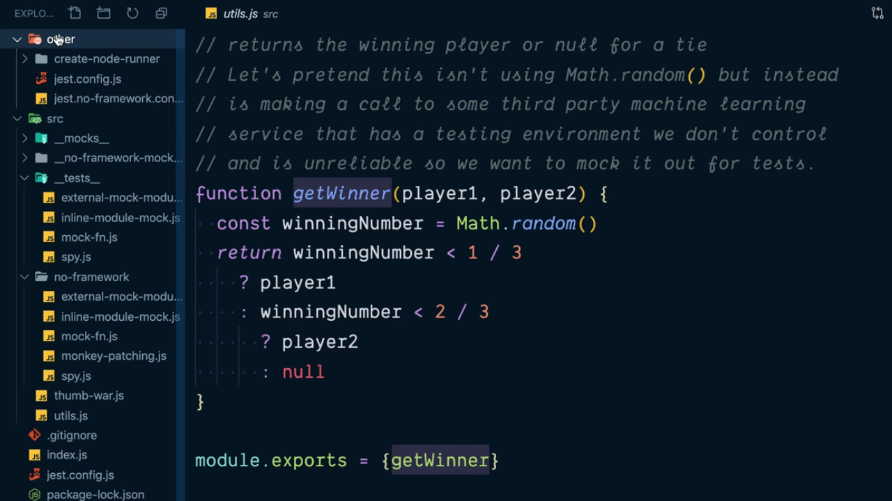

<p align="left">
  <a href="03_00.md">◀ Back: Chapter Index.</a>
</p>

---

# Introduction.

En este capítulo vamos a centrarnos en el estudio de la realización de lo que en el ambiente de desarrollo se conoce como *mocking*. La idea que hay detrás de ello es pensar en que tenemos un módulo en JavaScript que realizará algo en nuestra aplicación pero que dicho módulo a su vez se está apoyando en algún otro módulo que, por ejemplo, podría estar haciendo un cargo en una cuenta asociada a un tarjeta de crédito lo que no sería deseable es que los cargos derivados de la realización de los test fuesen una consecuencia en el saldo de la tarjeta.

El ejemplo anterior es un caso de uso habitual de cuándo estaremos ante una situación en la que queremos crear un mock de alguno de los módulos de la aplicación (en este caso el módulo de pago con tarjeta) con el fin de poder simular el funcionamiento del mismo sin que llegue a ejecutarse realmente.

A lo largo del capítulo vamos a implementar nuestra propia versión de la funcionalidad que nos ofrece [Jest](https://jestjs.io/) para realizar nuestros test dobles ya que si somos capaces de tener un conocimiento profundo sobre ello será muy sencillo aplicarlo en nuestro día a día como desarrolladores.

## Example Project

A lo largo de este capítulo vamos a crear los test que nos van a permitir probar que el siguiente código JavaScript functiona correctamente.

```js
const utils = require('./utils')

function thumbWar(player1, player2) {
  const numberToWin = 2
  let player1Wins = 0
  let player2Wins = 0

  while (player1Wins < numberToWin && player2Wins < numberToWins) {
    const winner = utils.getWinner(player1, player2)
    if (winner === player1) {
      player1Wins++
    } else if (winner === player2) {
      player2Wins++
    }
  }

  return player1Wins > player2Wins ? player1 : player2
}

module.exports = thumbWar
```

La función `thumbWar` es sencilla ya que esta va a recibir dos parámetros que representan a dos jugadores y retornará aquel de los dos que es capaz de ganar dos de tres partidos. El juego que se estará disputando no importa ya que para determinar quién gana la función hace uso del método `getWinner` correspondiente al objeto `utils` que ha sido importado anteriormente y de la cual no sabemos cómo funciona (o al menos esta función no sabe cómo está implementada).

Es más, en nuestro proyecto la función `getWinner` está implementada en el archivo `utils.js` situado en el mismo directorio que el archivo que contiene nuestra función a probar (y que se denomina `thumb-war.js`) y cuyo aspecto es el que se muestra a continuación:

```js
/*
 * Returns the winning player or null for a tie
 * Let's pretend this isn't using Math.random() but instead
 * is making a call to some third party machine learning
 * service that has a testing environment we don't control
 * and is unreliable so we want to mock it out for tests.
 */
function getWinner(player1, player2) {
  const winningNumber = Math.random()
  return winningNumber < 1 / 3
    ? player1
    : winningNumber < 2 / 3
      ? player2
      : null
}

module.exports = { getWinner }
```

La idea que vamos a perseguir para la realización de los test es que queremos realizar un mock de la función `getWinner` y para ello vamos a tener muchas técnicas para lograrlo que van desde las más sencilla (como es el denominado *mocking patching*) a las más sofisticadas (como puede ser la utilización de una librería que nos proporcione todas las capacidades para realizar el mock en nuestros test).

## Jest Config

Para poder ejecutar los test que tenemos definidos en nuestra aplicación de ejemplo dentro del capítulo vamos a tener que crearnos nuestra propia configuraciṕon de Jest para el proyecto y crear un *runner* para la ejecución de los test. 

Aunque en este capítulo no vamos a profundizar en ello sí que conviene saber que si queremos poder realizar los ejercicios que vamos a ir planteando en en nuestro proyecto deberíamos clonar el siguiente [repositorio de GitHub](https://github.com/kentcdodds/js-mocking-fundamentals.git).

```bash
$ git clone https://github.com/kentcdodds/js-mocking-fundamentals.git
Cloning into 'js-mocking-fundamentals'...
remote: Enumerating objects: 53, done.
remote: Counting objects: 100% (53/53), done.
remote: Compressing objects: 100% (40/40), done.
remote: Total 139 (delta 23), reused 34 (delta 11), pack-reused 86
Receiving objects: 100% (139/139), 164.75 KiB | 1.37 MiB/s, done.
Resolving deltas: 100% (60/60), done.
```

Una vez finalizado el clonado del proyecto ya simplemente nos quedará hacer la instalación de las dependencias mediante la ejecución del siguiente comando:

```bash
$ npm install
added 809 packages, and audited 810 packages in 4s

5 low severity vulnerabilities

To address all issues (including breaking changes), run:
  npm audit fix --force

Run `npm audit` for details.
```

En lo que respecta a la configuración para poder ejecutar los test con Jest en nuestro proyecto la información y archivos necesarios estará dentro del directorio `other` por lo que dejamos al lector que pueda estar interesado en ello que lo explore.

<div style='text-align: center'>
  
</div>
<br />

---
**Nota:** cuando tengamos instalado Jest en un proyecto toda esta configuración que va a permitir realizar el mock ya estará echa y por lo tanto podremos pasarnos directamente a trabajar en nuestros test.

---

<p align="right">
  <a href="03_02.md">Next: Override Object Properties to Mock ▶</a>
</p>
