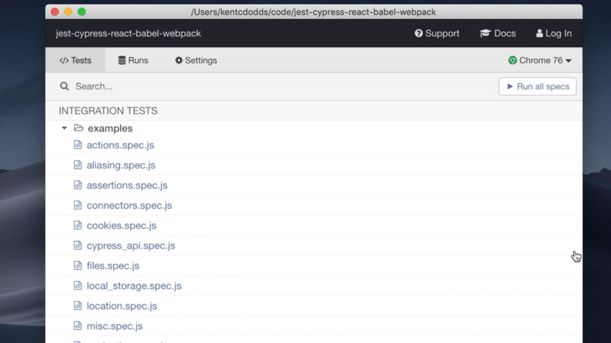
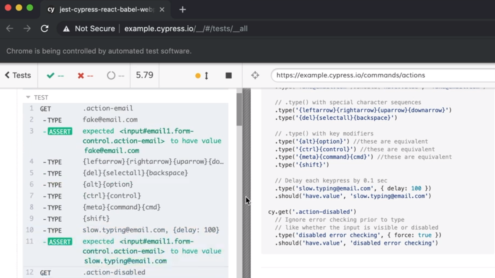
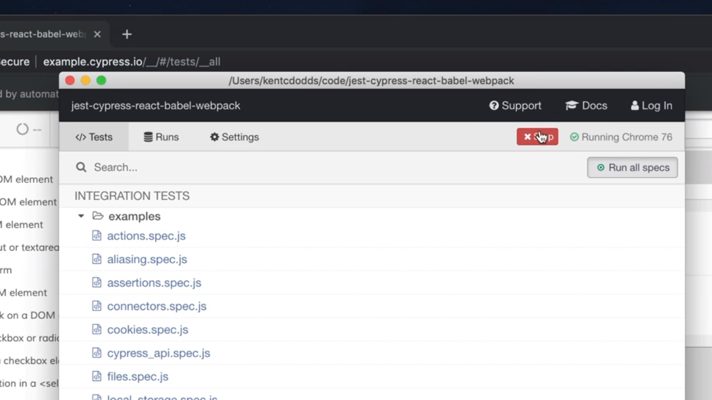
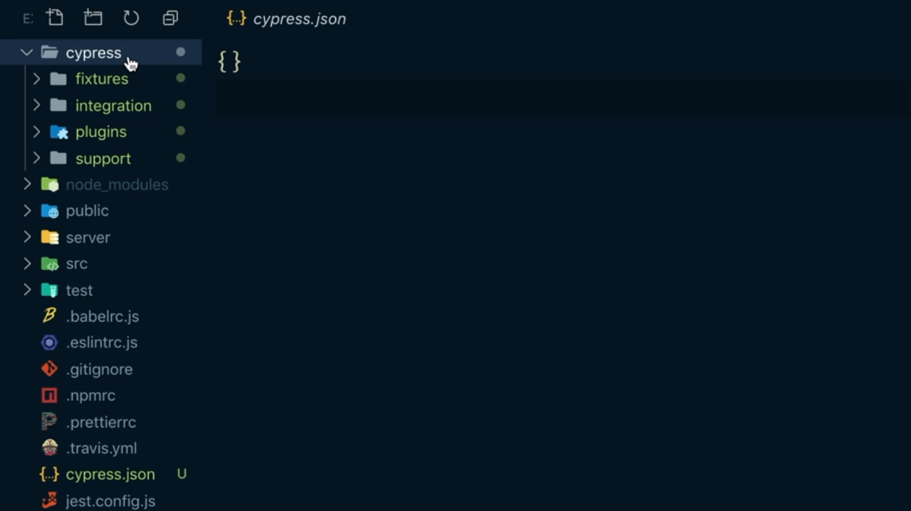

<p align="left">
 <a href="06_01.md">◀ Back: Introduction.</a>
</p>

---
# Install and Run Cypress.

Para poder instalar Cypress en nuestro proyecto lo haremos de la misma forma que instalamos cualquier otra librería o dependencia en nuestro proyecto. En nuestro caso, al tratase de una herramienta de test lo que vamos a hacer es incorporarla como una dependencia de desarrollo por lo que ejecutaremos lo siguiente desde la terminal del sistema:

```bash
$ npm install --save-dev cypress
```

Una vez finaliza la instalación del mismo ya vamos a poder invocar a la herramienta gracias al CLI (Command Line Interface) que nos proporciona que se denomina `cypress`. De hecho si la invocamos proporcionándole el como flag `--help` la herramienta nos va a mostrar todas las opciones que tenemos a nuestra dispsición para que trabajar con ella. 

```bash
$ npx cypress --help
Usage: cypress <command> [options]

Options:
  -v, --version      prints Cypress version
  -h, --help         display help for command

Commands:
  help               Shows CLI help and exits
  version            prints Cypress version
  run [options]      Runs Cypress tests from the CLI without the GUI
  open [options]     Opens Cypress in the interactive GUI.
  install [options]  Installs the Cypress executable matching this package's version
  verify [options]   Verifies that Cypress is installed correctly and executable
  cache [options]    Manages the Cypress binary cache
  info [options]     Prints Cypress and system information
```

Entre todas las opciones que nos ofrece vemos que al pasarle el parámetro `open` lo que va a hacer es que dentro de nuestro equipo se abra la herramienta gráfica que va a permitir Cypress de forma visual a la hora de trabajar en nuestros test. Así si escribimos:

```bash
$ npx cypress open
It looks like this is your first time using Cypress: 6.8.0

  ✔  Verified Cypress! /home/josemanuel/.cache/Cypress/6.8.0/Cypress

Opening Cypress...
```

Y lo que sucederá es que se nos abrirá una ventana del navegador que por defecto esté configurado en nuestro sistema mostrando algo parecido a lo que podemos ver en la siguiente imagen:

<div style='text-align: center'>
  
</div>
<br />

La lista de test que nos aparece recogida en la pantalla son varios test de integración que Cypress trae configurados y que nosotros podemos ejecutar directamente si pulsamos sobre el botón *Run all specs* situado en la parte superior derecha de la pantalla. Si nos fijamos, por encima de este botón se indica además el navegador y versión del mismo en el que queremos que corran los test lo que nos va a permitir simular varios escenarios posibles. El aspecto que presenta la ejecución de la estos test en un instante determinado podría ser algo parecido a lo siguiente:

<div style='text-align: center'>
  
</div>
<br />

Si mientras están corriendo los test nos volvemos a la herramienta gráfica de Cypress podemos ver como nos ha aparecido un nuevo botón denominado *Stop* que al pulsarlo nos va a permitir finalizar con la ejecución de todos los test que se están ejecutando en un momento dado.

<div style='text-align: center'>
  
</div>
<br />

Y simplemente para finalizar la ejecución de Cypress cerraría la ventana con la interfaz gráfica de usuario como cerraríamos cualquier otra ventana de cualquier otra aplicación.

## New Files in the Project.

Ahora que hemos visto cómo funciona Cypress vamos a centrarnos unos instantes en ver qué es lo que ha añadido a nuestro proyecto como consecuencia de su instalación y ejecución. En primer en la raíz de nuestro proyecto ha aparecido el fichero `cypress.json` que si lo abrimos no tendrá más que un objeto json vacío.

```json
{}
```

y también se nos habrá añadido un nuevo directorio en la raíz del proyecto denominado `cypress` que es donde realmente vamos a depositar nuestro trabajo cuando estemos realizando los test end-to-end. De hecho si abrimos el directorio en cuestión nos vamos a encontrar con varios subdirectorios asociados como se puede ver en la siguiente imagen:

<div style='text-align: center'>
  
</div>
<br />

Con el fin de aclarar un poco lo que nos vamos a ir encontrando en cada uno de ellos decir que en el directorio `fixtures` nos encontraremos con varios archivos JSON que serán utilizados la hora de realizar nuestros test. Un ejemplo del aspecto de estos archivos es el siguiente:

```json
{
  "name": "Using fixtures to represent data",
  "email": "hello@cypress.io",
  "body": "Fixtures are a great way to mock data for responses to routes"
}
```

En el directorio `ingration` es donde vamos a tener la creación de los test que iremos realizando. En este caso se tratará de una serie de archivos JavaScript conde iremos creando nuestros test para que sean ejecutados por Cypress y que a lo largo de este capítulo profundizaremos en su apariencia, configuración, etc.

---
**Nota:** en el caso de estar utilizando eslint como herramienta para la realización del análisis del código estático de nuestras aplicaciones podemos encontrarnos con que no va a entender y por lo tanto va a considerar como un error los método y objetos globales que nos proporciona Cypress lo que puede acabar derivando en que no nos permita construir nuestro bundle en el caso de estar utilizando una herramienta de integración continua.

Para solucionarlo deberemos instalar el pluging para eslint denominado `eslint-plugin-cypress` como una dependencia de desarrollo tal y como sigue:

```bash
$ npm install --save-dev eslint-plugin-cypress
```

y dentro del directorio `cypress` situado en la raíz de nuestro proyecto (que habrá sido creado por la herramienta) vamos a definir un nuevo fichero `.eslintrc.js` que contendrá la siguiente información:

```js
module.exports = {
  plugins: ['eslint-plugin-cypress'],
  env: {
    'cypress/globals': true
  }
}
```

es decir que estamos definiendo un nuevo plugin para ser utilizado por eslint (en nuestro caso el plugin que se encarga de gestionar el análisis del código estático para la definición de los test de Cypress) y al establecer como atributo del `env` que el valor `cypress/globals` sea `true` lo que venimos a decir es que queremos que las variables que son declaradas como globales dentro de Cypress sean reconocidas por eslint y por lo tanto no deriven un en error a la hora de analizar el código estático de nuestros test. 

Además estaremos diciendo que queremos extender `extends` el conjunto de reglas recomendadas por el plugin de Cypress además de las definidas en la configuración que hemos ido visto en otros capítulos de este mismo manual:

```js
module.exports = {
  plugins: ['eslint-plugin-cypress'],
  extends: ['kentcdodds', 'kentcdodds/import', 'plugin:cypress/recommened'],
  env: {
    'cypress/globals': true
  }
}
```

Ahora bien, como eslint lo que hará en última instancia será fusionar el cojunto de reglas recomendadas recogidas en el este archivo con le conjunto de reglas que están recogidas en el fichero de configuración de eslint situado en la raíz de nuestro proyecto nos vamos a encontrar con conflictos a la hora de fusionar las reglas de Cypress y Jest por lo que vamos a indicarle a eslint que en este caso no realice el fusionado de los ficheros y que considere a este como el fichero raíz para la configuración de eslint de todos los ficheros que estén contenidos en este directorio y en cualquier subdirectorio que cuelgue del mismo. Esto se hace estableciendo el valor del atributo `root` con el valor `true`.

```js
module.exports = {
  root: true,
  plugins: ['eslint-plugin-cypress'],
  extends: ['kentcdodds', 'kentcdodds/import', 'plugin:cypress/recommened'],
  env: {
    'cypress/globals': true
  }
}
```

---
**Nota:** otro de los aspectos de configuración que deberíamos tener en cuenta tiene que ver con el hecho de que Cypress guardará durante la ejecución de los test imágenes y videos que podrán ser consultados posteriormente y por lo general no resulta una buena práctica guardarlos dentro de nuestros repositorios de control de versiones por lo que conviene añadir las siguiente líneas en nuestro fichero `.gitignore` como sigue:

```js
node_modules
dist
coverage
cypress/videos
cypress/screenshots
```

es decir que hemos añadido las dos últimas líneas que hacen referencias al directorio con los vídeos y las imágenes que ha utilizado Cypress durante la realización de los test.

---

<p align="right">
 <a href="06_03.md">Next: Write Your First Cypress Test ▶</a>
</p>
