<p align="left">
  <a href="06_02.md">◀ Back: Install and Run Cypress.</a>
</p>

---
# Write Your First Cypress Test.

Lo habitual es que en nuestras aplicaciones no vayamos a necesitar para nada los ejemplos de los test de integración que Cypress instala por defecto por lo que borramos todo el contenido del directorio `examples` dentro del directorio `cypress/integration` y en lugar de eso en este directorio vamos a crear un nuevo archivo denominado `calculator.js` donde recogeremos los test de integración para nuestra aplicación de calculadora.

Aquí lo que tenemos que pensar es que la forma en la que se definen los test en Cypress es muy similar a lo que se hace en otros frameworks como [Mocha](https://mochajs.org/) lo que viene a decir que podemos agrupar varios test en un bloque `describe`, por lo que comenzaremos con ello:

```js
describe('anonymous calculator', () => {

})
```

Una vez tenemos una función `describe` dentro del mismo podemos comenzar a describir los test que vamos a llevar a cabo los cuáles se consiguen gracias a la invocació de una o más veces (una por cada test) la función `it`. Siguiendo con nuestro ejemplo podríamos describir algo como lo siguiente:

```js
describe('anonymous calculator', () => {
  it('can make calculations', () => {})
})
```

Tras guardar esta información si ahora nos dirigimos a la línea de comandos para ejecutar Cypress como sigue mediante la siguiente instrucción:

```bash
$ npx cypress open
```

Una vez se nos abre la herramienta de Cypress podemos ver cómo en la lista de los test que podemos elegir está el archivo que acabamos de definir:

<div style='text-align: center'>
  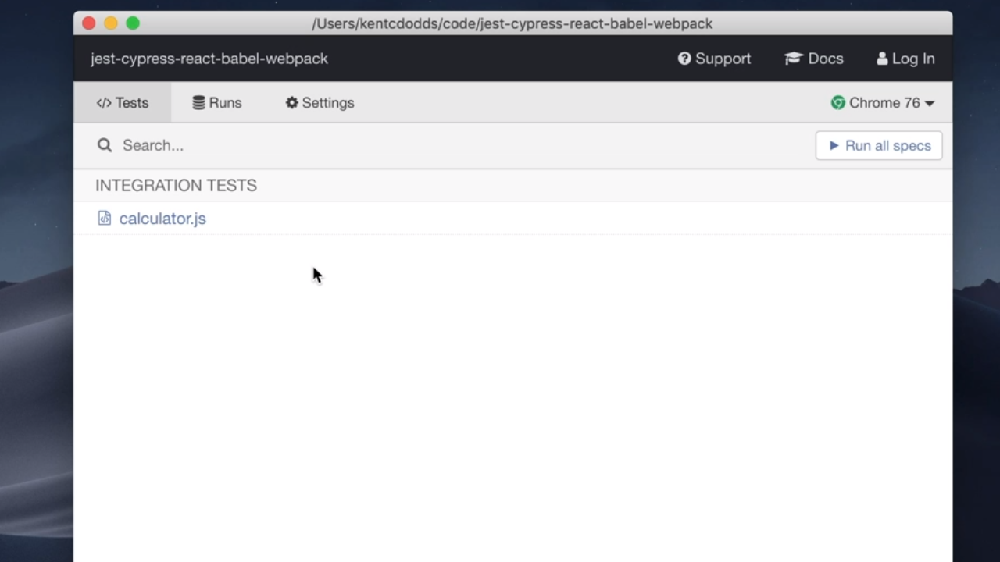
</div>
<br />

y no solamente esto sino que además podemos pulsar el botón *Run all specs* veremos como se ejecutan los test que tengamos definidos mostrándose una pantalla similar a lo que se recoge en la siguiente imagen:

<div style='text-align: center'>
  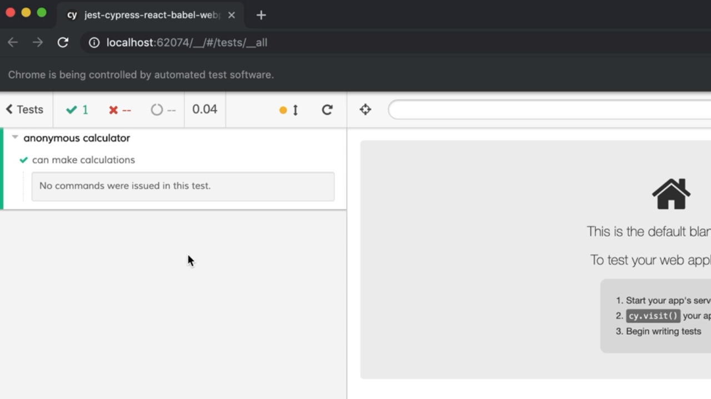
</div>
<br />

Si ahora lo que hacemos es abrir una nueva terminal dentro de nuestro sistema y ejecutar nuestra aplicación de ejemplo gracias al uso del siguiente script:

```bash
$ npm run dev
```

si ahora accedemos desde otra ventana del navegador a http://localhost:8080 (es decir, al puerto en el que estará escuchando por peticiones) nos encontraremos con la aplicación de la calculadora que hemos estado utilizando a los largo de todo el manual:

<div style='text-align: center'>
  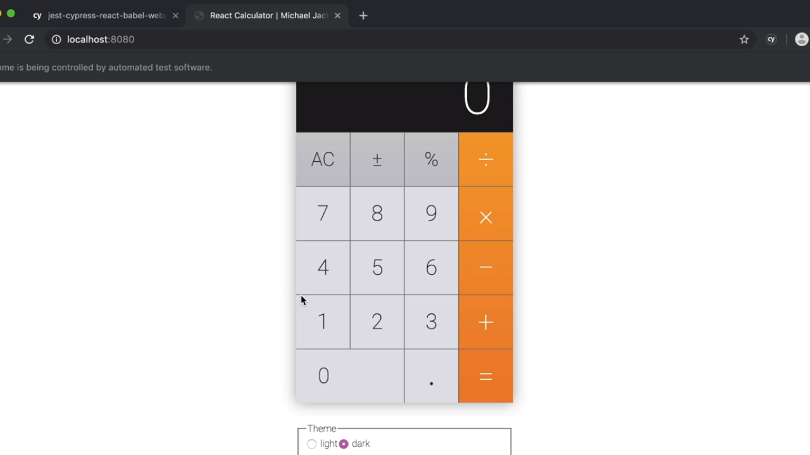
</div>
<br />

Para poder realizar los test con Cypress en nuestra aplicación lo primero que tenemos que hacer es lograr que dicha aplicación se ejecute dentro del Cypress. ¿Cómo se lograr esto? Pues para ello tenemos que volver al código del primero de los test que estamos desarrollando y conocer, en primer lugar, que Cypress pone a nuestra disposición el objeto global `cy` que será la base para la realización de los test. En concreto el primer paso que tenemos que dar será invocar al método `visit` método al que le tenemos que pasar un string que represente la url de la aplicación que vamos a probar, lo que hace que en nuestro caso quede como sigue:

```js
describe('anonymous calculator', () => {
  it('can make calculations', () => {
    cy.visit('http://localhost:8080')
  })
})
```

Si ahora pasamos a ejecutar de nuevo nuestros test desde la herramienta de Cypress podemos ver cómo en la parte de la derecha se estará cargando nuestra aplicación de la calculadora además de informarnos en la parte de la derecha del test que se está ejecutando y de los pasos que se están llevando a cabo dentro del mismo. 

<div style='text-align: center'>
  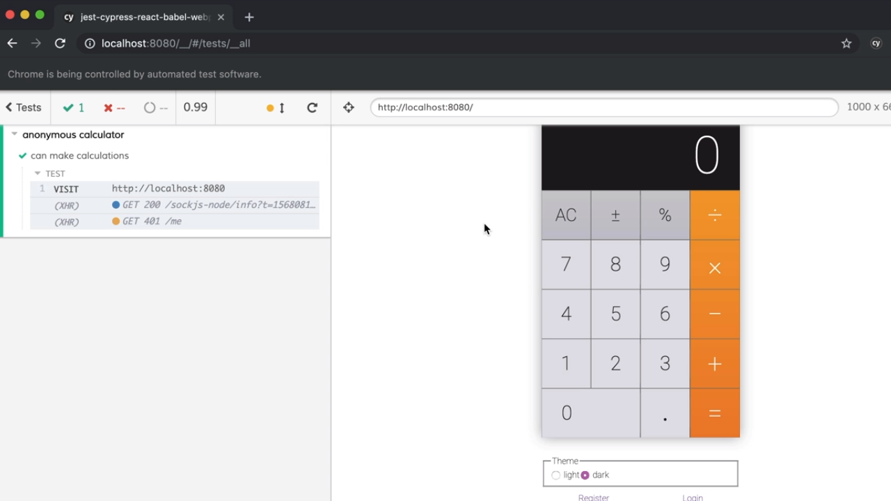
</div>
<br />

Supongamos ahora que queremos hacer un test que verifique que si el usuario pulsa en el botón que se corresponde con el número 1, posteriormente pulsa sobre el botón que se corresponde con el símbolo suma (el botón +), luego el botón 2 y finaliza con la pulsación de la tecla igual (=) el resultado que se ha de mostrar por la pantalla de la calculadora ha de ser el número 3. Para poderlo lograr vamos a tener que hacer uso de otra de las herramientas que nos ofrece Cypress en su interfaz gráfica y que consiste en activar lo que se conoce como *Open Selector Playground*:

<div style='text-align: center'>
  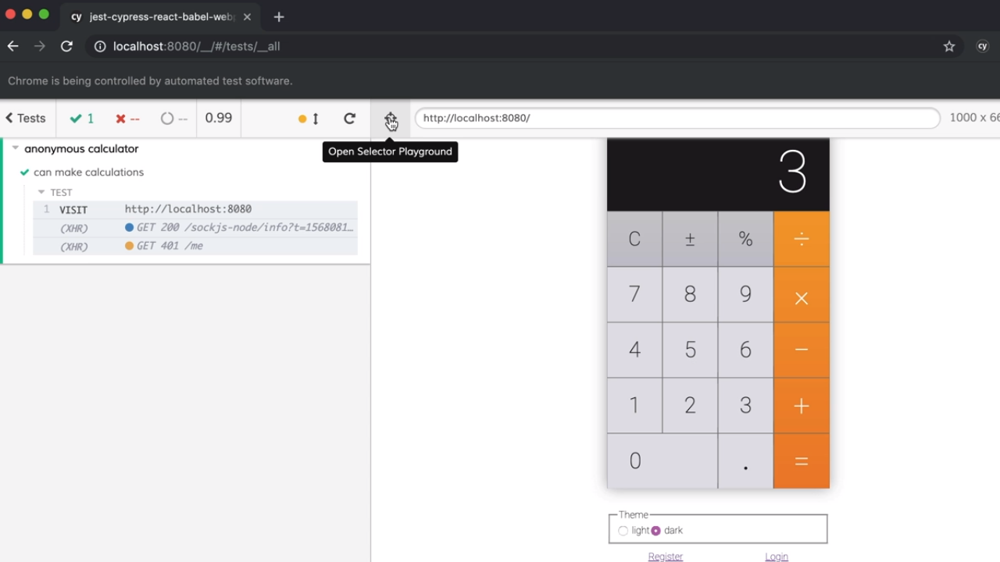
</div>
<br />

Si ahora pulsamos sobre el botón de la calcula que representa al número 1 podemos ver cómo en la parte superior de la misma se está haciendo referencia al método `get` que nos ofrece el objeto `cy` de Cypress y que sirve para identificar al elemento dentro del DOM que se está renderizando:

<div style='text-align: center'>
  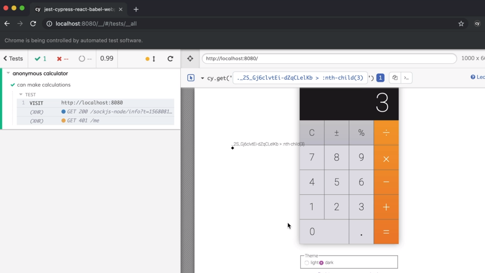
</div>
<br />

De hecho el nombre que se le pasa como parámetro al método `get` es un poco extraño pero representa a la cadena CSS que nos va a permitir determinar el botón que contiene el número 1 y como tal lo podemos copiar en el código de nuestro test como sigue:

```js
describe('anonymous calculator', () => {
  it('can make calculations', () => {
    cy.visit('http://localhost:8080')
    cy.get('._2S_Gj6clvtEi-dZqCLelKb > :nth-child(3)')
  })
})
```

---
**Nota:** Es más, que el nombre sea así de extraño es debido a que se está utilizando CSS in JavaScript lo que hace que se genere un string aleatorio para las diferentes clases CSS que acompañan a los elementos del DOM. Más adelante veremos cómo se puede cambiar esto para que los nombres sean mucho más legibles.

---
**Nota:** se pueden encadenar perfectamente las llamadas a los métodos que estamos utilizando del objeto `cy`, es decir, que acada llamada devuelve a su vez el mismo objeto por lo que es normal que encontremos dichas llamadas encadenadas dejando el código mucho más límpio:

```js
cy.visit('http://localhost:8080')
  .get('._2S_Gj6clvtEi-dZqCLelKb > :nth-child(3)')
```

---

Si ahora volvemos a ejecutar nuestro test en la interfaz gráfica de Cypress podemos ver como se está en primer lugar visitando la página en cuestión para posteriormente acceder al botón que representa al número 1 dentro de la calculadora:

<div style='text-align: center'>
  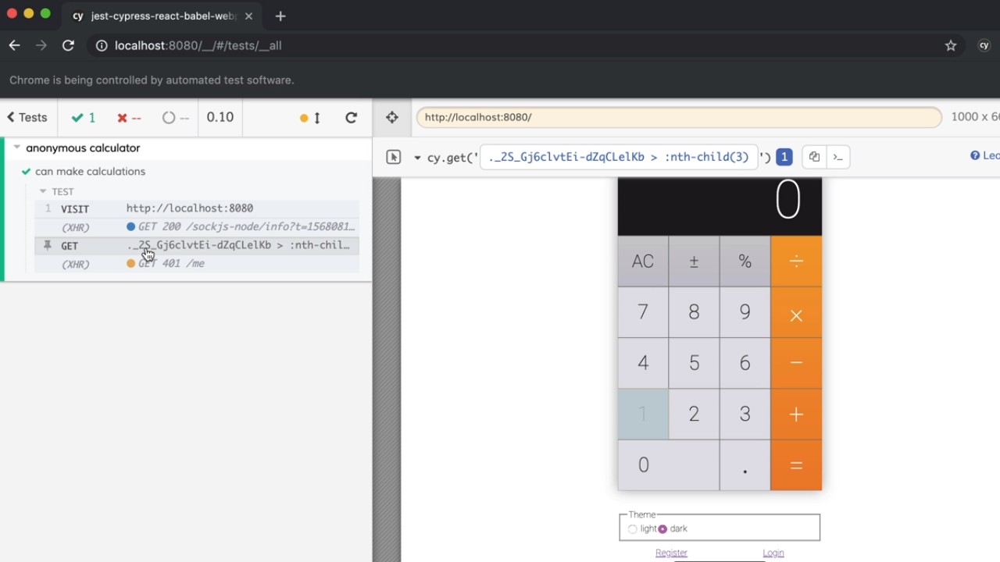
</div>
<br />

El siguiente paso consistiría en simular que se pulsa sobre dicho botón cosa que lograremos llamando al método `click` que pone a nuestra disposición el objeto `cy`:

```js
describe('anonymous calculator', () => {
  it('can make calculations', () => {
    cy.visit('http://localhost:8080')
      .get('._2S_Gj6clvtEi-dZqCLelKb > :nth-child(3)')
      .click()
  })
})
```

¿y cómo podemos saber que se ha pulsado sobre dicho botón? Pues de una forma visual y debido al funcionamiento de la aplicación el número 1 aparecerá recogido en la pantalla de la calculadora como se puede ver en la siguiente imagen:

<div style='text-align: center'>
  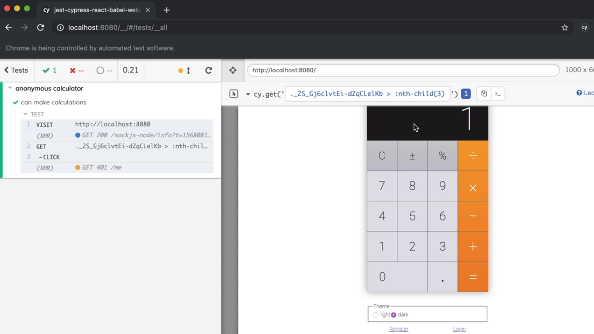
</div>
<br />

Ahora tenemos que simular que se pulsa sobre el botón correspondiente a la realización de la suma (el botón +) por lo que vamos a volver a pulsar sobre el botón *Open Selector Playground*, pulsamos sobre el botón suma en la interfaz de nuestra calculadora y posteriormente copiamos el selector en dentro del código de nuestro test como hemos hecho anteriormente. Así dentro de Cypress tendríamos:

<div style='text-align: center'>
  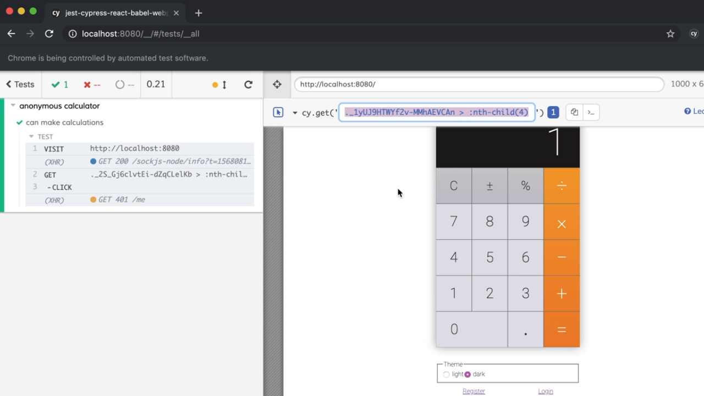
</div>
<br />

Y si lo incorporamos a nuestro código del test nos quedará como sigue:

```js
describe('anonymous calculator', () => {
  it('can make calculations', () => {
    cy.visit('http://localhost:8080')
      .get('._2S_Gj6clvtEi-dZqCLelKb > :nth-child(3)')
      .click()
      .get('._1yUJ9HTWYf2v-MMhAEVCAn > :nth-child(4)')
  })
})
```

Ahora simulamos el hecho de que se produzca un click en este botón por lo que invocaremos al método `click` del objeto `cy` como hemos visto anteriormente:

```js
describe('anonymous calculator', () => {
  it('can make calculations', () => {
    cy.visit('http://localhost:8080')
      .get('._2S_Gj6clvtEi-dZqCLelKb > :nth-child(3)')
      .click()
      .get('._1yUJ9HTWYf2v-MMhAEVCAn > :nth-child(4)')
      .click()
  })
})
```

Es más, si ahora volvemos a ejecutar nuestro test y nos fijamos en la interfaz en el momento en el que se produce el click en el lugar en el que se está produciendo el click se muestra una especie de punto rojo para reflejarlo.

<div style='text-align: center'>
  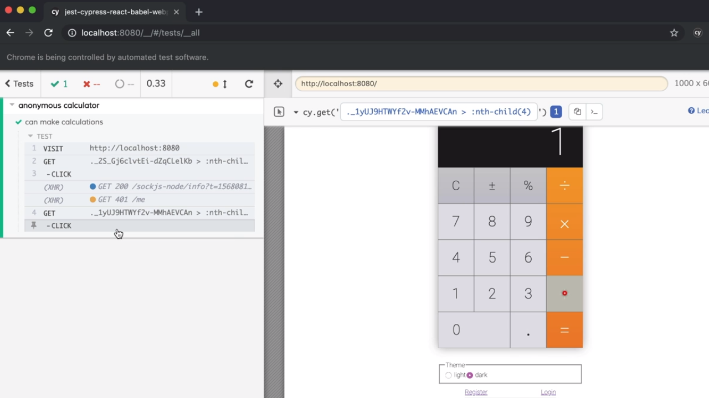
</div>
<br />

Vamos a respetir los mismos pasos para simular la pulsación del botón que representa al número 2 dentro del teclado de la calculadora:

```js
describe('anonymous calculator', () => {
  it('can make calculations', () => {
    cy.visit('http://localhost:8080')
      .get('._2S_Gj6clvtEi-dZqCLelKb > :nth-child(3)')
      .click()
      .get('._1yUJ9HTWYf2v-MMhAEVCAn > :nth-child(4)')
      .click()
      .get('._2S_Gj6clvtEi-dZqCLelKb > :nth-child(4)')
      .click()
  })
})
```

Y lo mismo hacemos con la pulsación del botón que se corresponde con la pulsación del tecla igual (=) por lo que añadimos el siguiente código a nuestro test:

```js
describe('anonymous calculator', () => {
  it('can make calculations', () => {
    cy.visit('http://localhost:8080')
      .get('._2S_Gj6clvtEi-dZqCLelKb > :nth-child(3)')
      .click()
      .get('._1yUJ9HTWYf2v-MMhAEVCAn > :nth-child(4)')
      .click()
      .get('._2S_Gj6clvtEi-dZqCLelKb > :nth-child(4)')
      .click()
      .get('._1yUJ9HTWYf2v-MMhAEVCAn > :nth-child(5)')
      .click()
  })
})
```

Terminado esto tendremos que verificar que el valor que se está mostrando como resultado de la operación en la calculadora es 3. Para ello simplemente volvemos a seleccionar el elemento del DOM que recogerá la información del resultado la operación gracias a *Open Selector Playground* como en todos los casos anteriores:

<div style='text-align: center'>
  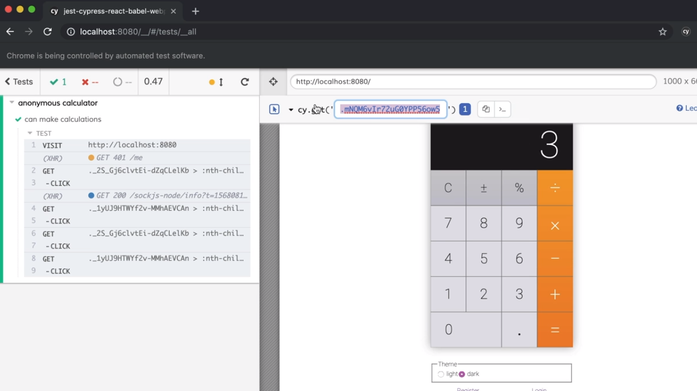
</div>
<br />

Lo incorporamos como argumento del método `get` del objeto `cy` para así acceder al mismo como cuando queríamos acceder a los botones:

```js
describe('anonymous calculator', () => {
  it('can make calculations', () => {
    cy.visit('http://localhost:8080')
      .get('._2S_Gj6clvtEi-dZqCLelKb > :nth-child(3)')
      .click()
      .get('._1yUJ9HTWYf2v-MMhAEVCAn > :nth-child(4)')
      .click()
      .get('._2S_Gj6clvtEi-dZqCLelKb > :nth-child(4)')
      .click()
      .get('._1yUJ9HTWYf2v-MMhAEVCAn > :nth-child(5)')
      .click()
      .get('.mNQM6vIr72uG0YPP56ow5')
  })
})
```

¿Qué es lo que tenemos que hacer ahora? Pues una aserción sobre el resultado que se está mostrando que en este caso ha de ser el valor 3. Pero ¿cómo lo logramos en Cypress? Pues la forma de hacerlo es utilizando el método `should` que también nos proporciona el objeto `cy` el cual recibe dos parámetros siendo el primero de ellos el tipo de aserción que queremos realizar (en este caso representado por el string `have.text`) y el segundo el texto que esperamos que se esté mostrando (en este caso el texto `3`). Por lo tanto escribimos los siguiente:

```js
describe('anonymous calculator', () => {
  it('can make calculations', () => {
    cy.visit('http://localhost:8080')
      .get('._2S_Gj6clvtEi-dZqCLelKb > :nth-child(3)')
      .click()
      .get('._1yUJ9HTWYf2v-MMhAEVCAn > :nth-child(4)')
      .click()
      .get('._2S_Gj6clvtEi-dZqCLelKb > :nth-child(4)')
      .click()
      .get('._1yUJ9HTWYf2v-MMhAEVCAn > :nth-child(5)')
      .click()
      .get('.mNQM6vIr72uG0YPP56ow5')
      .should('have.text', '3')
  })
})
```

Y si ahora vamos a la interafaz de Cypress podemos ver cómo la aserción se está cumpliendo y por lo tanto el test pasará correctamente:

<div style='text-align: center'>
  
</div>
<br />

Pero ¿qué ocurre en el caso de que no se esté cumpliendo la aserción? Supogamos, por ejemplo, que esperamos que el resultado de la operación de la suma que se ha llevado a cabo sea un 4 escribiendo lo siguiente:

```js
.should('have.text', '4')
```

Pues lo primero es que Cypress siempre realiza una verificación inicial del mismo y en vez de finalizar con un fallo nos informa de que el test no ha sido pasado:

<div style='text-align: center'>
  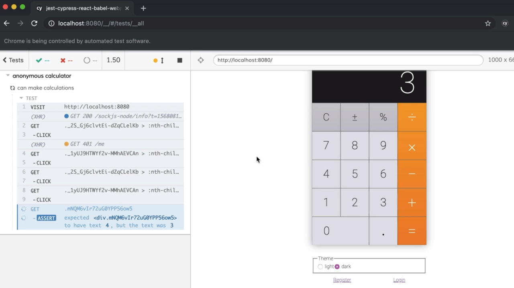
</div>
<br />

Y no es hasta que no pasan cuatro segundos que realmente no informa de que el test no ha pasado y que por lo tanto tiene que haberse producido algún tipo de error en el código:

<div style='text-align: center'>
  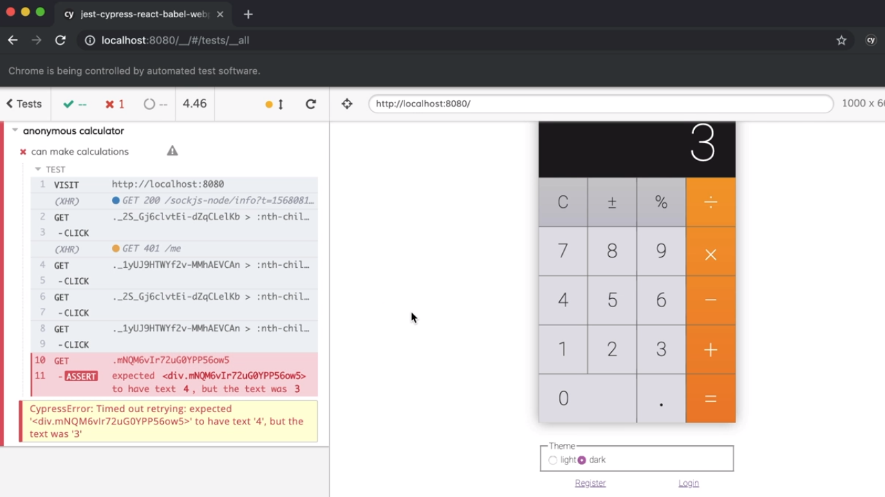
</div>
<br />

## Cypress Subject.

En Cypress siempre existe un elemento de la interfaz de usuario que es quien tiene el **subject** dentro de la realización del test (entendiendo este concepto como una especie de foco pero sin llegar a serlo) y es gracias a las llamadas a los métodos `get` que la librería es capaz de ir cambiando qué elemento está asumiendo este rol y por lo tanto sobre el que se van a producir los eventos.

Por su parte Cypress define otro tipo de métodos que siempre se ejecutarán sobre el **subject** y que bien servirán para realizar acciones sobre el mismo (como en nuestro ejemplo han sido los métodos `click`) o bien han servido para realizar aserciciones sobre su contenido (como es el caso del método `should`). 

Y no solamente esto sino que cada uno de estos métodos se ejecutará de forma asíncrona aunque lo hacen de forma tan rápida que va a parecer que se están ejecutando de forma síncrona. Pero ¿por qué este mecanismos de ejecución asíncrona? Pues aquí es donde tenemos que pensar que Cypress está pensado para la realización de test end-to-end y por lo tanto simular la interacción de un usuario con nuestra aplicación lo que viene a ser, por naturaleza, algo asíncrono. De hecho es fácil encontrarse en situaciones en las que se renombra el objeto global `cy` como `user` para simular que quién está interactuando con la aplicación es un usuario dejando los test como siguen:

```js
describe('anonymous calculator', () => {
  it('can make calculations', () => {
    const user = cy
    user.visit('http://localhost:8080')
        .get('._2S_Gj6clvtEi-dZqCLelKb > :nth-child(3)')
        .click()
        .get('._1yUJ9HTWYf2v-MMhAEVCAn > :nth-child(4)')
        .click()
        .get('._2S_Gj6clvtEi-dZqCLelKb > :nth-child(4)')
        .click()
        .get('._1yUJ9HTWYf2v-MMhAEVCAn > :nth-child(5)')
        .click()
        .get('.mNQM6vIr72uG0YPP56ow5')
        .should('have.text', '3')
  })
})
```

lo que deja mucho más claro que se trata de un usuario quién está visitando la web que estamos probando y el que está pulsando sobre los botones de la interfaz.

---

<p align="right">
  <a href="06_04.md">Next: Configure Cypress in Cypress JSON ▶</a>
</p>
