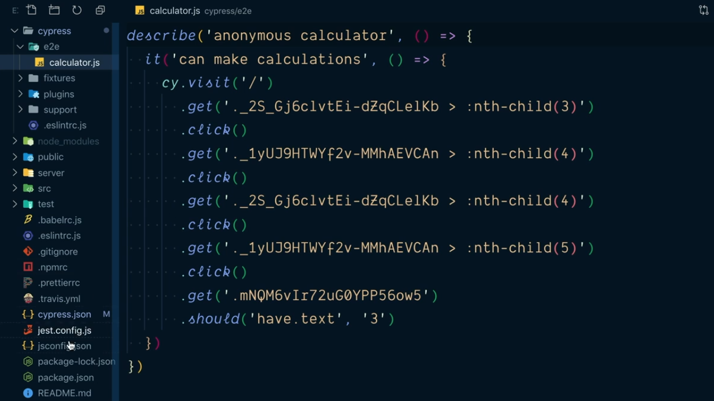
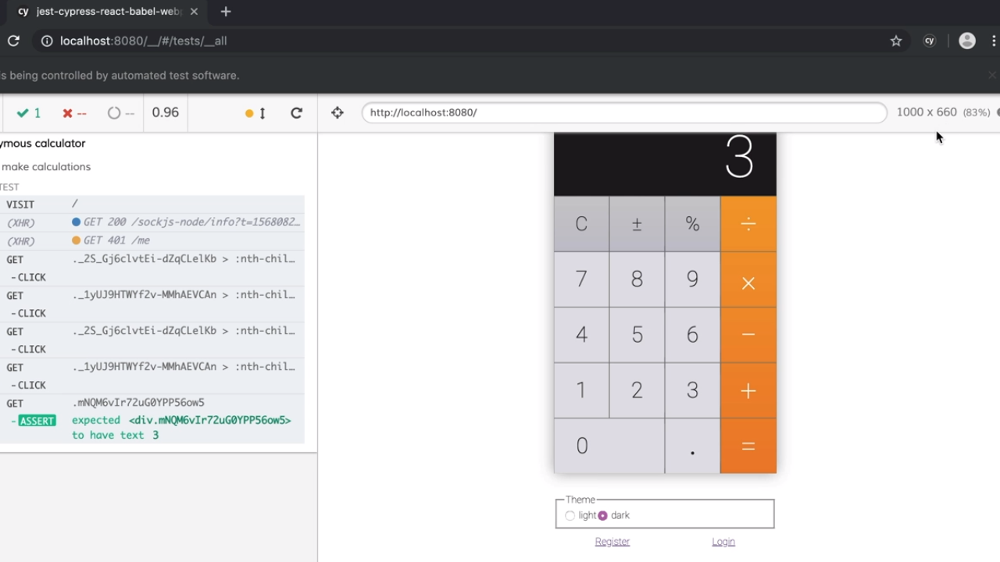
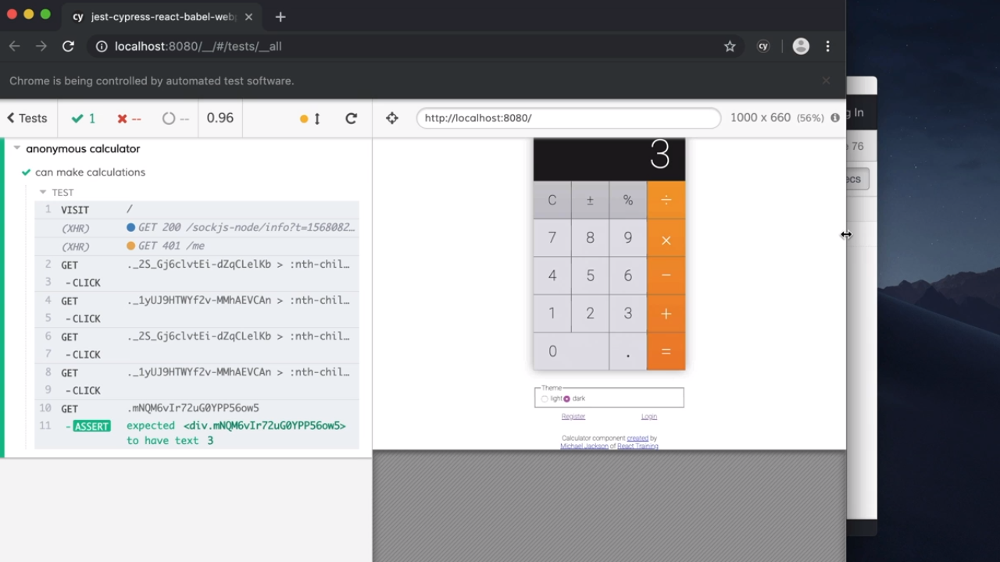
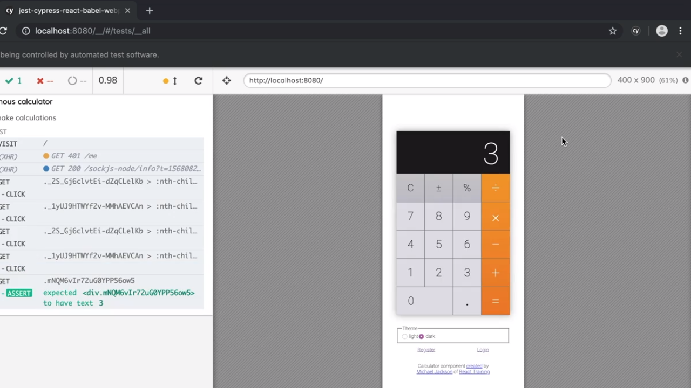
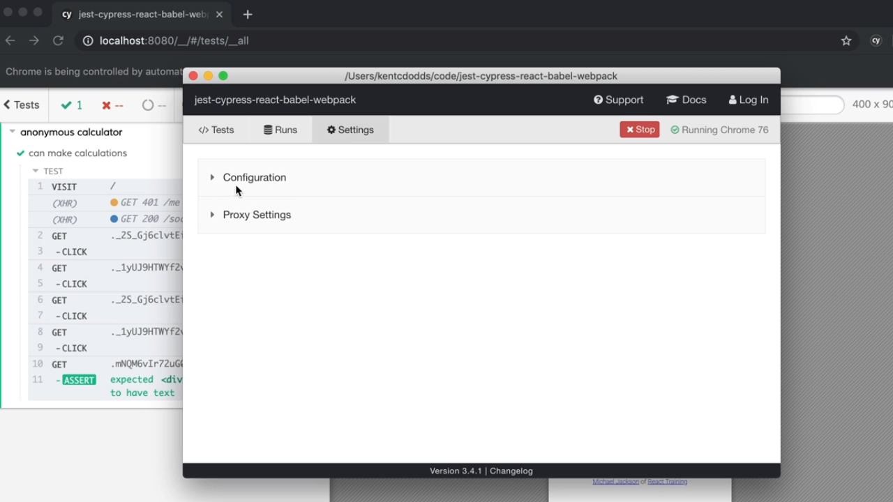
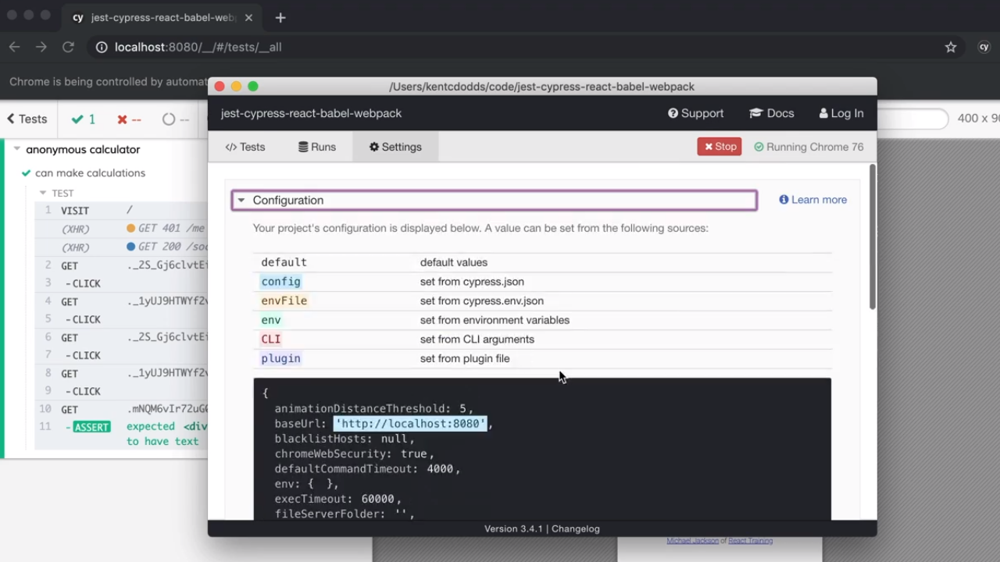

<p align="left">
  <a href="06_03.md">◀ Back: Write Your First Cypress Test.</a>
</p>

---
# Configure Cypress in Cypress JSON.

En el [punto anterior](./06_03.md) hemos visto cómo al inicio de nuestros test le hemos tenido que especificar al objeto `cy` que ha de visitar una url concreta:

```js
describe('anonymous calculator', () => {
  it('can make calculations', () => {
    cy.visit('http://localhost:8080')
```

Lo que como desarrolladores nos gustaría poder indicar en nuestros test end-to-end es que lo que queremos hacer en este caso es simular que el usuario está visitando la página principal de nuestra aplicación, es decir, que nos gustaría poder escribir algo como lo siguiente:

```js
describe('anonymous calculator', () => {
  it('can make calculations', () => {
    cy.visit('/')
```

¿Cómo podemos hacer esto? Pues gracias al fichero de configuración que [Cypress ha creado](./06_02.md) por nosotros durante el proceso de instalación denominado `cypress.json` y que está situado en la raíz del proyecto. Inicialmente este fichero contiene un objeto JSON vacío en el que podemos ir definiendo atributos con sus correspondientes valores para configurar Cypress con el fin de ajustarlo a nuestras necesidades.

Uno de los atributos que tenemos a nuestra disposición en `baseUrl` al cual le podemo asignar de forma directa la url que se antepondrá a todas las peticiones que el objeto `cy` va a realizar con las llamadas al método `visit`. Así, para lograr nuestro objetivo, en el objeto de configuración escribiremos:

```json
{
  "baseUrl": "http://localhost:8080"
}
```

Y con ello ya podemos modificar nuestro test para que haga uso de esta caraterística indicando así que queremos que visite la página de inicio sin especificar la url completa.

```js
describe('anonymous calculator', () => {
  it('can make calculations', () => {
    cy.visit('/')
      .get('._2S_Gj6clvtEi-dZqCLelKb > :nth-child(3)')
      .click()
      .get('._1yUJ9HTWYf2v-MMhAEVCAn > :nth-child(4)')
      .click()
      .get('._2S_Gj6clvtEi-dZqCLelKb > :nth-child(4)')
      .click()
      .get('._1yUJ9HTWYf2v-MMhAEVCAn > :nth-child(5)')
      .click()
      .get('.mNQM6vIr72uG0YPP56ow5')
      .should('have.text', '3')
  })
})
```

---
**Nota:** hay un aspecto más a la hora de realización de nuestros test con Cypress y que tiene que ver con un refresco que se produce en la página cuando se está cargando en el navegador desde la interfaz gráfica de Cypress. Inicialmente cuando se carga el navegador Cypress desconoce cuál es la url a la que se ha de dirigir para la realización de los test por lo que muestra una página vacía y es en el momento en el que comienza a ejecutar nuestro test que gracias a la invocación del método `visit` ya sabe dónde tiene que ir y realiza el refresco.

Ahora bien, si optamos por establecer el valor del atributo `baseUrl` en el objeto JSON de configuración Cypress ya puede saber de principio cuál es la url a la que se tiene que dirigir para la realización de los test desde un principio por lo que puede cargarla directamente. En otras palabras, estableciendo el valor de este atributo nos vamos a ahorrar una recarga de la página para la realización de los test.

---

## Change Test Directory.

Otro de los aspectos que nos puede interesar cambiar es el nombre del directorio en el que se depositan los test que por defecto lleva a cabo Cypress ya que, [como hemos visto](./06_02.md) estos se depositan en el directorio `integration` dentro de directorio `cypress` creado por la instalación. Este nombre puede llevar a confusión ya que para la realización de los test unitarios y test de integración normalmente nos vamos a apoyar en la utilización de Jest y react-testing-library y con Cypress lo que queremos es llevar a cabo los test end-to-end.

Así, lo que nosotros perseguimos es poder cambiar el nombre de este directorio `integration` por otro más adecuado al tipo de test que contendrá (por lo general se renombra como `e2e`) dejando la estructura de directorios como se puede ver en la siguiente imagen:

<div style='text-align: center'>
  
</div>
<br />

La forma de lograr esto es definiendo el atributo `integrationFolder` dentro del objeto JSON de configuración recogido en el fichero `cypress.json` en la raíz de nuestro proyecto, al que le vamos a tener que asignar como valor un string que represente a la ruta en la que se depositarán todos los archivos con los test. Así, en nuestro caso, definiriamos algo como lo siguiente:

```json
{
  "baseUrl": "http://localhost:8080",
  "integrationFolder": "cypress/e2e"
}
```

## Change Default Resolution.

Si nos fijamos en el navegador cuando ejecutamos los test con Cypress en la parte superior derecha del mismo se está mostrando la resolución en píxeles del dispositivo que sobre el que se estará renderizando nuestra aplicación, resolución que inicialmente es de 1000x660 píxeles:

<div style='text-align: center'>
  
</div>
<br />

y no solamente esto sino que además en el caso de que redimensionemos nuestro navegador la resolución con la que se muestra la aplicación seguirá siendo siempre la misma variando el porcentaje de zoom con el que se la representa al usuario.

<div style='text-align: center'>
  
</div>
<br />

Podemos configurar cuáles son las dimensiones del dispositivo con el que se está visualizando nuestra aplicación en el fichero de cofiguración de Cypress definiendo los atributo `viewportHeight` y `viewportWidth` como sigue:

```json
{
  "baseUrl": "http://localhost:8080",
  "integrationFolder": "cypress/e2e",
  "viewportHeight": 900,
  "viewportWidth": 400
}
```

Hecho esto Cypress nos va a mostrar nuestra aplicación teniendo en cuenta las nuevas dimensiones que hemos especificado para la misma.

<div style='text-align: center'>
  
</div>
<br />

## View Configuration.

Dentro de la aplicación de Cypress en la parte superior de la misma tenemos la pestaña *Settings* la cual nos presenta a su vez dos opciones: *Configuration* y *Proxy Settings*.

<div style='text-align: center'>
  
</div>
<br />

Si accedemos a la opción *Configuration* se nos mostrará las opciones de configuración que se están aplicando para Cypress destacando aquellas que han sido sobreescritas con respecto a los valores que están establecidos por defecto. Por ejemplo, en la siguiente imagen podemos ver cómo la opción `baseUrl` ha sido sobreescrita tomando como valor lo establecido en el fichero de configuración de Cypress.

<div style='text-align: center'>
  
</div>
<br />

y no solamente eso sino que aquí podemos ver las diferentes opciones de configuración que tenemos como es el fichero `cypress.json`, el fichero con las variables de entorno para Cypress `cypress.env.json`, variables de entorno, opciones establecidas desde la invocación de la línea de comandos o variables que están siendo establecidas por plugins de Cypress. Más adelante iremos viendo cómo influyen y cómo podemos establecer todas estas opciones de configuración.

---

<p align="right">
  <a href="06_05.md">Next: Installing Cypress Testing Library ▶</a>
</p>
