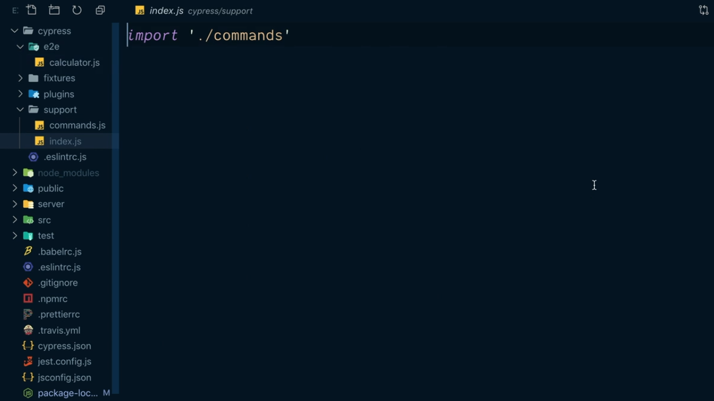
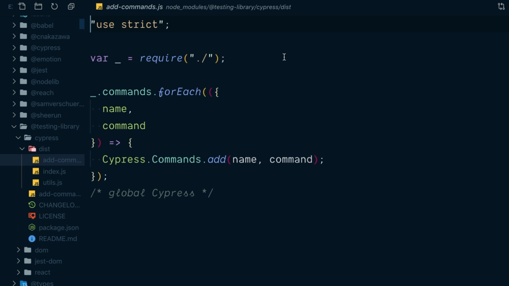
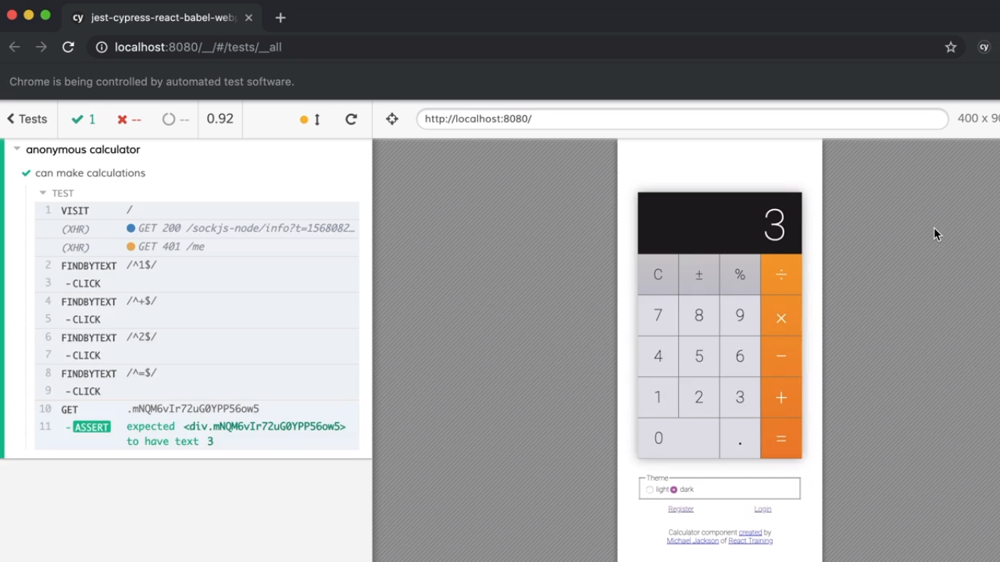
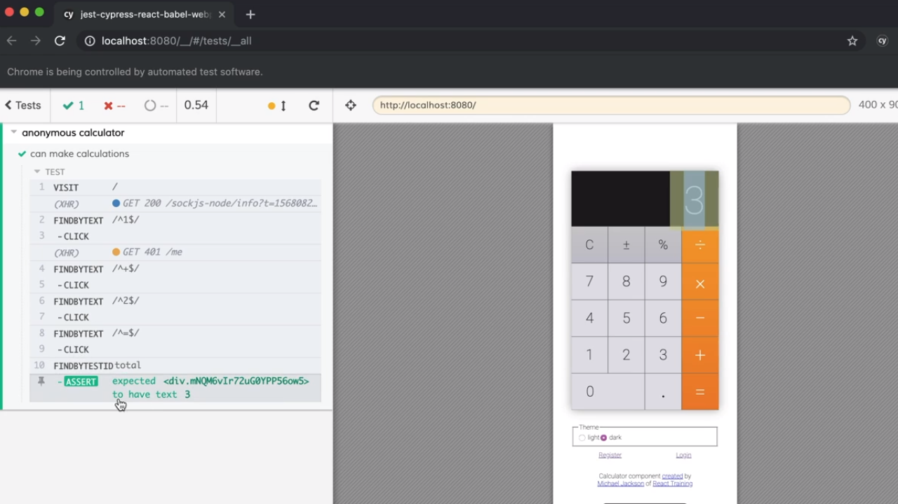

<p align="left">
  <a href="06_04.md">◀ Back: Configure Cypress in Cypress JSON.</a>
</p>

---
# Installing Cypress Testing Library.

Vamos a recordar aquí el test end-to-end que hemos definido en Cypress para describir uno de los problemsa a los que tenemos que enfrentarnos a la hora de mantenerlos:

```js
describe('anonymous calculator', () => {
  it('can make calculations', () => {
    cy.visit('/')
      .get('._2S_Gj6clvtEi-dZqCLelKb > :nth-child(3)')
      .click()
      .get('._1yUJ9HTWYf2v-MMhAEVCAn > :nth-child(4)')
      .click()
      .get('._2S_Gj6clvtEi-dZqCLelKb > :nth-child(4)')
      .click()
      .get('._1yUJ9HTWYf2v-MMhAEVCAn > :nth-child(5)')
      .click()
      .get('.mNQM6vIr72uG0YPP56ow5')
      .should('have.text', '3')
  })
})
```

Si nos fijamos cada una de las llamadas al método `get` espera recibir como parámtro un string que represente al selector CSS que permita elegir a uno de los elementos de la interfaz. Ahora bien, como estamos haciendo uso de CSS in JavaScript el nombre de estas clases no es que sea muy legible ya que es determinado durante la compilación y generación del bundle de la aplicación y puede yo llegar a ser mantenible. 

Para ayudarnos con ello vamos a instalar la librería `@testing-library/cypress` como una dependencia de desarrollo dentro de nuestro proyecto:

```bash
$ npm install --save-dev @testing-library/cypress
```

Una vez terminada la instalación lo que vamos a tener que hacer es añadir todas las funcionalidades que nos proporciona esta librería para que puedan ser utilizadas por Cypress. Esto se hace yendo al directorio `cypress` de nuestro proyecto (directorio que [recordemos](./06_02.md) ha sido creado durante la instalación de Cypress) y dentro del mismo al directorio `support` para editar el fichero `index.js` que tenemos definido.

<div style='text-align: center'>
  
</div>
<br />

Aquí lo que vamos a hacer es añadir una nueva instrucción `import` en concreto una que nos va a permitir establecer todos los comandos que queremos añadir a Cypress y que son propios de la librería `@testing-library/cypress`. Por lo tanto escribiremos:

```js
import '@testing-library/cypress/add-commands'
import './commands'
```

¿Y qué es lo que está haciendo realmente esta importanción? Pues si nos vamos al fichero `add-commands` que está recogido dentro del directorio de `node_modules` que se corresponde a `@testing-library/cypress` nos encontramos con algo como lo siguiente:

<div style='text-align: center'>
  
</div>
<br />

donde lo que vemos es que se están recorriendo todos los comandos que son propios de la librería y añadiendo a los comandos que están disponibles para Cypress y que por lo tanto podemos utilizar dentro de nuestros test. Dicho de otra manera, lo que estaremos haciendo es incorporar nuevos métodos al objeto global `cy` que Cypress pone a nuestra disposición para la realización de los test.

---
**Nota:** tenemos que recordar que la librería `@testing-library` pone a nuestra disposición una gran cantidad de métodos los cuáles son realemnte útiles para realizar los test teniendo algunos de ellos el prefijo `getXxx` y otros el prefijo `findByXxx`. En el caso de la realización de los test con Cypress el objeto `cy` va a tener acceso a los dos gracias a la configuración que acabamos de realizar pero lo que sí que tenemos que saber es que deberíamso utilizar siempre la versión `findByXxx` porque es la implementación asíncrona de su homónimo `getXxx` y por su naturaleza los test end-to-end debería ser asíncronos.

---

Tras la realización de la configuración uno de los métodos que tenemos a nuestra disposición es `findByText` que sirve para buscar dentro del DOM de la aplicación que estamos buscando un elemento cuyo texto sea igual al valor que se recibe como parámetro. Si pensamos en el texto como el valor que está asociado a las teclas de la calculadora y sabiend además que podemos hacer uso de expresiones regulares para especificiar el texto que estamos buscando podremos sustituir la secuencia de instrucciones que tienen que ver con la pulsación de las teclas de la calculadora por lo siguiente:

```js
describe('anonymous calculator', () => {
  it('can make calculations', () => {
    cy.visit('/')
      .findByText(/^1$/)
      .click()
      .findByText(/^\+$/)
      .click()
      .findByText(/^2$/)
      .click()
      .findByText(/^=$/)
      .click()
      .get('.mNQM6vIr72uG0YPP56ow5')
      .should('have.text', '3')
  })
})
```

y si ahora grabamos esta corrección y volemos a ejecutar nuestros test en Cypress veremos que seguimos obteniendo la misma respuesta pero el código de nuestro test es mucho más limpio:

<div style='text-align: center'>
  
</div>
<br />

En el caso de la obtención del resultado de la operación no vamos a poder utilizar el mismo método que para los botones porque si intentamos encontrar el elemento de la calculadora que tiene el texto 3 en su interior no nos vamos a encontrar únicamente con el resultado sino que también el botón que representa al número 3 tiene dicho valor y por lo tanto existirá una ambigüedad en la elección. ¿Qué es lo que se puede hacer ante una situación como esta? Pues aquí pasa por modificar el componente de React que muestra nuestra calculadora con el fin de añadir a uno de los elementos de la interfaz el elemento `data-testid` con un identificador que nos será de utilidad para poderlo manejar durante la realización de nuestros test.

En nuestro caso, el componente de React que muestra el resultado de la operación es `AutoScalingText` que inicialmente posee el siguiente código:

```js
function AutoScalingText({ children }) {
  const nodeRef = React.useRef()
  const scale = getScale(nodeRef.current)
  return (
    <div
      className={ styles.autoScalingText }
      style={{ transform: `scale(${ scale }, ${ scale })` }}
      ref={ nodeRef }
    >
      { children }
    </div>
  )
}
```

Lo que vamos a hacer es añadir un nuevo atributo al elemento `div` que denominaremos `data-testid` y al que le vamos a asignar el valor `total`. Esto nos dejará el código de nuestro componente como sigue:

```js
function AutoScalingText({ children }) {
  const nodeRef = React.useRef()
  const scale = getScale(nodeRef.current)
  return (
    <div
      className={ styles.autoScalingText }
      style={{ transform: `scale(${ scale }, ${ scale })` }}
      ref={ nodeRef }
      data-testid='total'
    >
      { children }
    </div>
  )
}
```

Con esto en el test de Cypress vamos a poder pasar a utilizar el método `findByTestId` al que le pasaremos el valor que tiene asignado el elemento del DOM en el atributo `data-testid`:

```js
describe('anonymous calculator', () => {
  it('can make calculations', () => {
    cy.visit('/')
      .findByText(/^1$/)
      .click()
      .findByText(/^\+$/)
      .click()
      .findByText(/^2$/)
      .click()
      .findByText(/^=$/)
      .click()
      .findByTestId('total')
      .should('have.text', '3')
  })
})
```

Y ahora podemos ver que si guardamos nuestro test y lo volvemos a ejecutar el resultado del mismo es similar a cuando no estábamos utilizando `findByTestId` pero el código del test es mucho más limpio y fácil de mantener.

<div style='text-align: center'>
  
</div>
<br />

>
> La utilización del atributo `data-testid` no tiene que ser la solución más frecuente a emplean a la hora de realizar los test sino que únicamente se debería tener en cuenta en aquellas situaciones en la sque existe una dualidad en los elementos de la interfaz que se quieren probar y que no se puede probar de otra manera.
>

---

<p align="right">
  <a href="06_06.md">Next: Script Cypress for Local Development and CI ▶</a>
</p>
