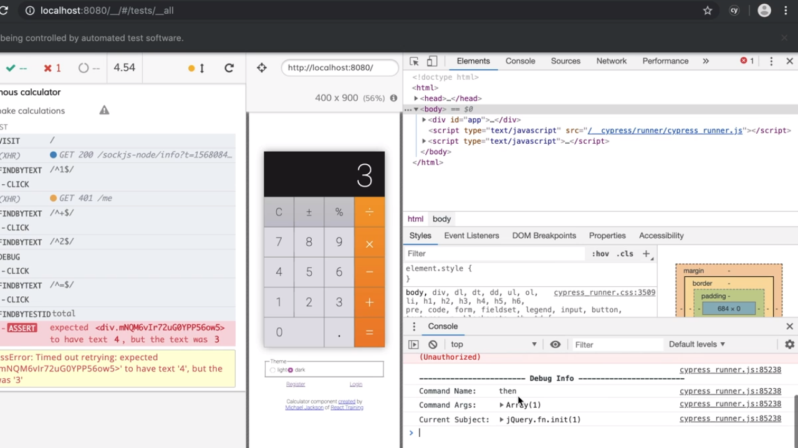

<p align="left">
  <a href="06_06.md">◀ Back: Script Cypress for Local Development and CI.</a>
</p>

---
# Debug a Test.

Uno de los aspectos más interesantes de Cypress es lo fácil que nos va a ayudar a corregir los posibles fallos en nuestro código y para verlo vamos a basarnos en el test que hemos estado realizando hasta ahora en el que, a propósito, vamos a hacer que falle cambiando nuestra aserción para que en vez de comprobar que el resultado de la suma de 1 más 2 sea 3 y pase a comprobar que sea 4.

```js
describe('anonymous calculator', () => {
  it('can make calculations', () => {
    cy.visit('/')
      .findByText(/^1$/)
      .click()
      .findByText(/^\+$/)
      .click()
      .findByText(/^2$/)
      .click()
      .findByText(/^=$/)
      .click()
      .findByTestId('total')
      .should('have.text', '4')
  })
})
```

Como ya hemos explicado anteriormente cada una de las llamadas a los métodos que tenemos a nuestra disposición en el objeto `cy` retorna lo que se conoce como el **subject** tras la ejecución del mismo pero tenemos que saber que se tratan de métodos asíncronos lo que nos viene a indicar que tras la ejecución de los mismos vamos a poder hacer uso de los métodos propios de la gestión de las promesas de JavaScript. Así, el esquema podría ser algo como lo siguiente:

```js
describe('anonymous calculator', () => {
  it('can make calculations', () => {
    cy.visit('/')
      .findByText(/^1$/)
      .click()
      .findByText(/^\+$/)
      .click()
      .findByText(/^2$/)
        .then(subject => {
          return subject
        })
      .click()
      .findByText(/^=$/)
      .click()
      .findByTestId('total')
      .should('have.text', '4')
  })
})
```

¿qué es lo realmente importante en el código anterior? Pues que no podemos olvidarnos de pasar (retornar) el objeto `subject` (el que se ha recibido como parámetro en el método `then` tras la resolución de la promesa) con el fin de no romper la cadena de las llamadas asíncronas. 

¿Y qué podemos hacer dentro de estas funciones? Pues una de las cosas es llamar al objeto `debugger` de JavaScript como sigue:

```js
describe('anonymous calculator', () => {
  it('can make calculations', () => {
    cy.visit('/')
      .findByText(/^1$/)
      .click()
      .findByText(/^\+$/)
      .click()
      .findByText(/^2$/)
        .then(subject => {
          debugger
          return subject
        })
      .click()
      .findByText(/^=$/)
      .click()
      .findByTestId('total')
      .should('have.text', '4')
  })
})
```

Y si ahora guardamos nuestro test y volemos a ejecutarlo dentro del navegador de Cypress abriendo las herramientas para desarrolladores vamos a ver cómo podemos trabajar en el modo debug como con cualquier otra aplicación.

<div style='text-align: center'>
  
</div>
<br />

y una vez tenemos la ejecución del test parada dentro del debugger ya podemos utilizarla como con cualquier otro proceso de depuración de cualquier aplicación. Así, en nuestro ejemplo, si dentro de la consola si pedimos el valor de la variable `subject` dentro de la consola veremos que se trata un array y si accedemos al primer elemento del mismo podemos obtener el código html del botón:

<div style='text-align: center'>
  
</div>
<br />

## `debug`

Otra de las posibilidades que tenemos a nuestras disposición para realizar el debug dentro de la realización de los test es realizar la invocación al método `debug` dentro de la cadena de llamadas a los métodos del objeto `cy`.

```js
describe('anonymous calculator', () => {
  it('can make calculations', () => {
    cy.visit('/')
      .findByText(/^1$/)
      .click()
      .findByText(/^\+$/)
      .click()
      .findByText(/^2$/)
      .debug()
      .click()
      .findByText(/^=$/)
      .click()
      .findByTestId('total')
      .should('have.text', '4')
  })
})
```

En este caso no se para la ejeución del código como en el caso visto anteriormente cuando estábamos haciendo uso de la llamada al `debugger` sino que el test se continuará ejecutando hasta el final de mismo pero lo que si hará será escribir por la consola una serie de información que puede sernos útil durante el proceso de test.

<div style='text-align: center'>
  
</div>
<br />

Si ahora dentro de la herramienta de ejecución de test de Cypress lo volvemos a recargar entonces sí que la ejecución del mismo pasará en el punto en el que se invocará al método `debug` y por lo tanto podremos hacer uso de todas las herramientas que nos proporciona para depurar el código.


## `pause`

El método `pause` es otra de las posibilidades que nos ofrece Cypress para ser invocadas durante la cadena de ejecución de los métodos que sirven para verificar el correcto funcionamiento lo test y lo que viene a hacer es pausar la ejecución de la ejecución del test en el lugar en el que se encuentre dicha invocación. Así si pasamos a utilizarlo en nuestro test:

```js
describe('anonymous calculator', () => {
  it('can make calculations', () => {
    cy.visit('/')
      .findByText(/^1$/)
      .click()
      .findByText(/^\+$/)
      .click()
      .findByText(/^2$/)
      .pause()
      .click()
      .findByText(/^=$/)
      .click()
      .findByTestId('total')
      .should('have.text', '4')
  })
})
```

lo guardamos y lo volvemos a ejecutar en el navegador de Cypress nos vamos a encontrar con la ejecución del test correrá hasta el punto en el que se ha invocado a `pause` y a partir de ahí vamos a poder accder a las herramientas de desarrolladores para ver el estado del DOM, variables de JavaScript, etc.

¿Qué utilidad puede tener esto? Pues que al estar la ejecución pausada podríamos interactuar con nuestra aplicación (podríamos, por ejemplo, pulsar otros botones de la calculadora, cambiar el texto de alguno de lo elementos, etc.) y posteriormente dejar que la ejecución continúe. Lo importante aquí es que una vez que terminemos de realizar todas aquellas acciones que consideremos necesarias deberíamos pasar a pulsar el botón *Resume* para continuar con la ejecución del test.

<div style='text-align: center'>
  
</div>
<br />

## `window.Cypress`

A la hora de ejecutar el código de los test end-to-end, Cypress lo que está haciendo es definir un nuevo objeto global denominado `Cypress` y como tal podemos comprobar su existencia dentro de nuestro componentes de React y en función del mismo realizar determinadas acciones. Por ejemplo,

```js
function App({ user, logout }) {
  const [theme, setTheme] = React.useState('dark')
  const handleThemeChange = ({ target: { value }}) => setTheme(value)

  if (window.Cypress) {
    window.theme = theme
    window.setTheme = setTheme
    debugger
  }
```

Es decir, que en el propio código de nuestro componente estaremos introduciendo códido que nos puede ayudar durante la realización de nuestros test end-to-end como, en nuestro ejemplo, el permitir que desde la consola se tenga acceso a la variable de estado `theme` así como a la función que permite cambiar su valor y por lo tanto provocar que el componente sea re-renderizado.

Sin embargo esta opción se desaconseja ya que estaríamos introduciendo código propio de nuestros test end-to-end en el código de nuestros componentes de React lo que provocará un acoplamiento entre ellos. No obstante conviene conocerlo ya que puede haber algún caso de uso en el que nos ayude a resolver los posibles problemas que se nos pueden presentar a la hora de realizar nuestros test end-to-end.

---

<p align="right">
  <a href="06_02.md">Next: Test User Registration ▶</a>
</p>
