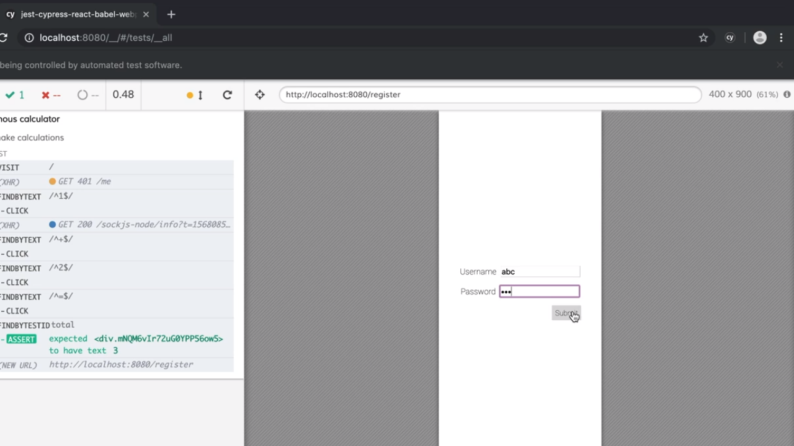
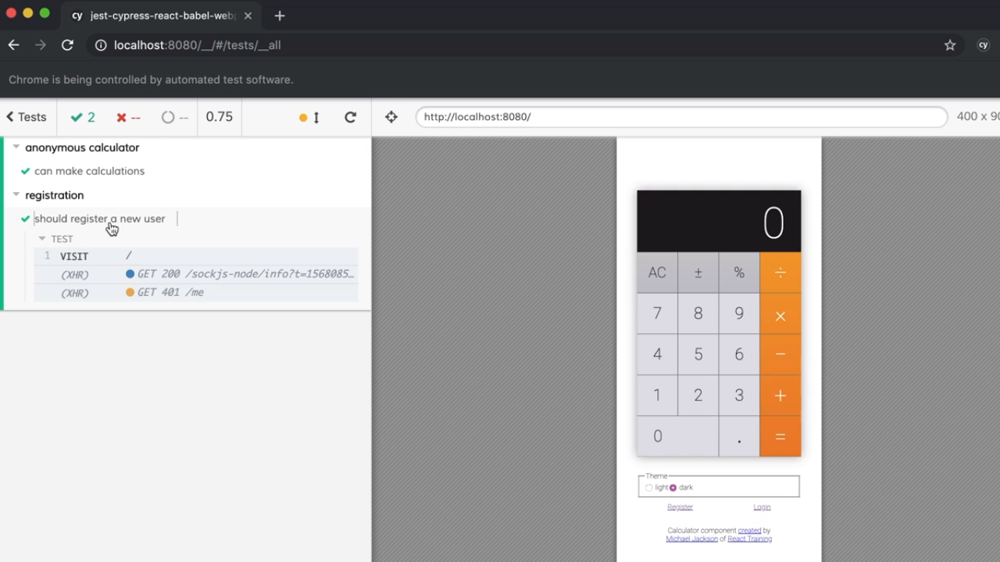
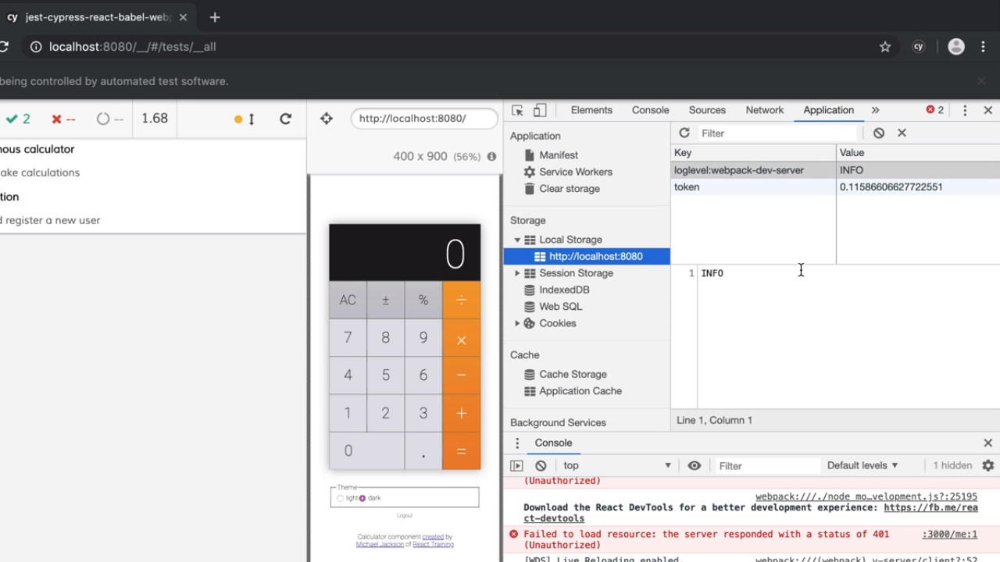
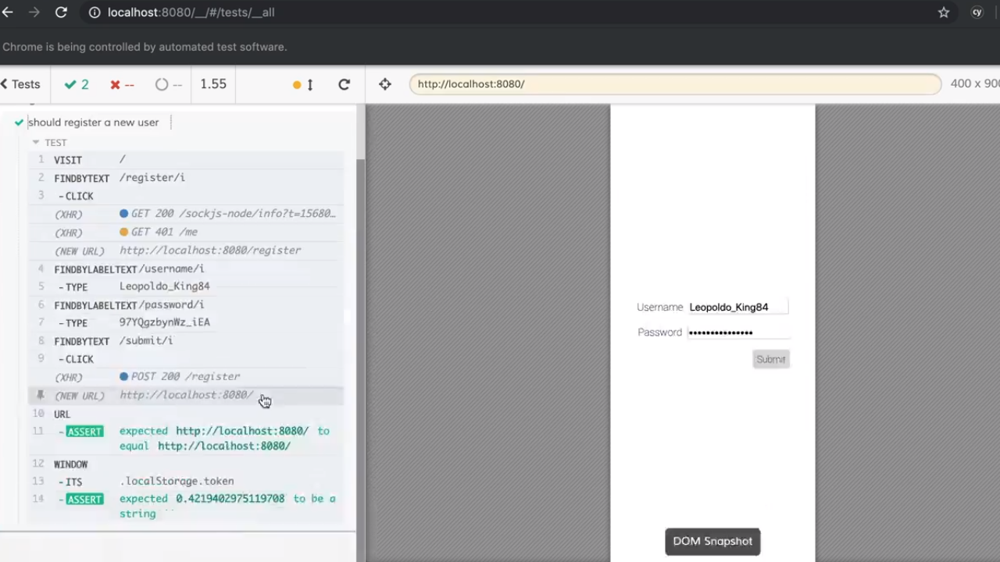

<p align="left">
  <a href="06_07.md">◀ Back: Debug a Test.</a>
</p>

---
# Test User Registration.

Vamos a testear una de las funcionalidades de nuestra aplicación de ejemplo mediante Cypress en lo que sería un ejemplo más cercano a la realidad de lo que es la realización de un test end-to-end dentro de nuestras aplicaciones. En concreto la funcionalidad que queremos probar es el proceso de registro de un usuario dentro de la nuestra aplicación de la calculadora.

El proceso de registro será muy sencillo ya que lo único que va a hacer es que, cuando se accede al mismo, se muestra al usuario un formulario formado por dos campos donde en el primero de ellos se le solicitará al usuario que introduzca un nombre de usuario y en otro la contraseña con la que va a querer acceder al sistema.

<div style='text-align: center'>
  
</div>
<br />

Lo primero que vamos a hacer es crear un nuevo archivo dentro del directorio `cypress/e2e` que sirva para recoger el test que queremos llevar a cabo. Vamos a llamar a este archivo `register.js`. El contenido de este archivo será muy sencillo ya que lo único que haremos será crear una suite de test con la aplicación del método `describe` y dentro del mismo un único que test:

```js
describe('registration', () => {
  it('should register a new user', () => {

  })
})
```

Para la realización del test lo primero que vamos a construir es un objeto que represente a nuestro usuario. El objeto en cuestión solamente va a tener dos atributos correspondiendo cada uno de ellos a cada uno de los campos del formulario de registro. Por lo tanto definimos:

```js
describe('registration', () => {
  it('should register a new user', () => {
    const user = { username: 'bob', password: 'yo' }
  })
})
```

Sin embargo esta aproximación que puede parecer la correcta si nos paramos a pensarlo un momento veremos que no es la correcta porque cada vez que se ejecutase nuestro test lo que sucedería es que dentro del sistema (y por lo tanto dentro de la base de datos de nuestra aplicación) volveríamos a intentar registrar un nuevo usuario con el nombre `bob` lo que acabaría dando un error porque previamente un usuario con dicho nombre ya habría sido registrado. Como solución se podría pensar en que habría que limpiar la base de datos previamente a la realización de cada uno de los test y sería correcto pero como estamos trabajando con Cypress tenemos un mecanismo mejor para lograrlo.

Lo primero para lograrlo es instalar como una dependencia de desarrollo la librería `test-data-bot` como sigue:

```bash
$ npm install --save-dev test-data-bot
```

Nos vamos al directorio `cypress/support` y dentro del mismo vamos a crear un nuevo archivo al que denominaremos `generate.js` y dentro del mismo vamos a importar dos funciones de la librería `test-data-bot`, en concreto las funciones `build` y `fake` como sigue:

```js
import { build, fake } from 'test-data-bot'
```

Ahora vamos a definir una función que se encargue de construir los objetos que representarán a los usuarioos de nuestras aplicaciones. Para ello lo que vamos a hacer es invocar a la función `build` la cual espera recibir como parámetro un string con el nombre que queremos darle a la clase a la que pertenece el objeto que va a ser contruido. En nuestro ejemplo como vamos a tratar de construir objetos que representen a usuarios de nuestra aplicación vamos a dar el nombre `User`:

```js
import { build, fake } from 'test-data-bot'

build('User')
```

La función `build` retornará un objeto con una serie de método que nos servirá para definir nuestra clase siendo uno de estos `fields` que, como se puede deducir por su nombre, servirá para establecer cada uno de los atributos que la forman. Este método espera recibir como parámetro un objeto con los atributos y valores que queremos que tenga nuestro objeto, es decir, que en nuestro caso, los atributos serán `username` y `password`.

```js
import { build, fake } from 'test-data-bot'

build('User').fields({ username, password })
```

Ahora bien, ¿cómo podemos generar los nombres de estos dos atributos? Aquí es donde nos apoyamos en la función `fake` que también hemos importardo la cual espera recibir como parámetor una función en la que se recibe como parámetro el objeto que permite generar valores aleatorios y dentro del mismo podemos acceder al objeto `internet` ya que nos va a proporcionar los métodos que permiten generar un nombre de usuario y contraseña de forma aleatoria. Esto se ve mejor en el código:

```js
import { build, fake } from 'test-data-bot'

build('User').fields({
  username: fake(f => f.internet.userName()),
  password : fake(f => f.internet.password())
})
```

Ya solamente nos queda saber que esta secuencia de invocación de funciones lo que hace es retornar a su vez una función que vamos a hacer que sea exportada por el archivo:

```js
import { build, fake } from 'test-data-bot'

const buildUser = build('User').fields({
  username: fake(f => f.internet.userName()),
  password : fake(f => f.internet.password())
})

export { buildUser }
```

Con esta función ya creada lo siguiente que podemos hacer es irnos a nuestro test e importarla para utilizarla de tal manera que en vez de crear de forma directa el objeto que represente a nuestro usuario lo que haremos será invocar a la función.

```js
import { buildUser } from '../support/generate'

describe('registration', () => {
  it('should register a new user', () => {
    const user = buildUser()
  })
})
```

Ahora es el momento en el que podemos comenzar a realizar nuestro test para lo cual lo primero que hacemos es indicarle a Cypress que ha de visitar nuestra aplicación:

```js
import { buildUser } from '../support/generate'

describe('registration', () => {
  it('should register a new user', () => {
    const user = buildUser()

    cy.visit('/')
  })
})
```

Y si ahora nos vamos a navegador de Cypress podemos ver en la parte izquierda de la interfaz la lista de las suite de test que se están ejecutando apareciendo la información de nuestra nueva suite (es decir, el nombre que le hemos otorgado, `registration`) y dentro del mismo la lista de los test que se están ejecutando que en nuestro caso solamente tendrá uno:

<div style='text-align: center'>
  
</div>
<br />

El siguiente paso que tenremos que hacer es que el usuario pulse sobre el enlace *register* que podemos encontrar en la parte inferior de la calculadora para que se le muestre el formulario de registro de una nueva cuenta. Por lo tanto vamos a hacer uso del método `findByText` para encontrarlo y posteriormente pulsar sobre el mismo:

```js
import { buildUser } from '../support/generate'

describe('registration', () => {
  it('should register a new user', () => {
    const user = buildUser()

    cy.visit('/')
      .findByText(/register/i)
      .click()
  })
})
```

Una vez sucede esto vamos a encontrar el campo del formulario que tiene asociada la etiqueta *username* (cosa que vamos a lograr gracias al uso del método `findByLabelText`) y una vez estamos en dicho campo lo que vamos a hacer es escribir en el mismo el nombre del usuario gracias a la invocación del método `type` que espera recibir como parámetro un string con la información que se desea escrubir, que en nuesro caso será el nombre del usuario:

```js
import { buildUser } from '../support/generate'

describe('registration', () => {
  it('should register a new user', () => {
    const user = buildUser()

    cy.visit('/')
      .findByText(/register/i)
      .click()
      .findByLabelText(/username/i)
      .type(user.username)
  })
})
```

Esto mismo lo hacemos también con el campo de texto *password* pero teniendo en cuenta que ahora la información que queremos proporcionar va a ser la contraseña para el usuario. Por lo tanto escribiremos algo como lo siguiente:

```js
import { buildUser } from '../support/generate'

describe('registration', () => {
  it('should register a new user', () => {
    const user = buildUser()

    cy.visit('/')
      .findByText(/register/i)
      .click()
      .findByLabelText(/username/i)
      .type(user.username)
      .findByLabelText(/password/i)
      .type(user.password)
  })
})
```

Lo siguiente que tenemos que hacer es pulsar sobre el botón *submit* para poder enviar el formulario de registro por lo que en este caso lo vamos a buscar utilizando el método `findByText` y una vez lo hemos encontrado haremos click en el mismo.

```js
import { buildUser } from '../support/generate'

describe('registration', () => {
  it('should register a new user', () => {
    const user = buildUser()

    cy.visit('/')
      .findByText(/register/i)
      .click()
      .findByLabelText(/username/i)
      .type(user.username)
      .findByLabelText(/password/i)
      .type(user.password)
      .findByText(/submit/i)
      .click()
  })
})
```

Si ahora guardamos el test y lo ejecutamos vemos que la ejecución se lleva a cabo de forma muy rápida pero que el test finaliza sin problemas. Ahora bien, una vez tenemos el test finalizado si abrimos las herramientas para desarrolladores y nos vamos a la pestaña *Application* y más dentro de la misma a *Local Storage* podemos ver como se ha creado un valor dentro del mismo con el nombre `token`:

<div style='text-align: center'>
  
</div>
<br />

Es este token el que nos va a permitir realizar las aserciones en nuestro test porque hasta ahora lo único que hemos hecho ha sido indicarle a Cypress que tiene que llevar a cabo una serie de acciones pero sin verificar las consecuencias de ello. Para lograrlo lo primero que tenemos que hacer es invocar al método `url` que nos proporciona Cypress ya que lo que vamos a testear es que sigamos dentro de la misma url de partida. Así escribiremos:

```js
import { buildUser } from '../support/generate'

describe('registration', () => {
  it('should register a new user', () => {
    const user = buildUser()

    cy.visit('/')
      .findByText(/register/i)
      .click()
      .findByLabelText(/username/i)
      .type(user.username)
      .findByLabelText(/password/i)
      .type(user.password)
      .findByText(/submit/i)
      .click()
      .url()
      .should('eq', 'http://localhost:8080')
  })
})
```

Ahora vamos a comprobar la existencia del token para lo cual hacemos uso del método `window` (para accder al objeto `window` del navegador de Cypress) y ahora podemos llamar al método `its` pasándole como parámetro el path a un atributo que queremos recuperar (en nuestro caso `localStorage.token`) y posteriormente pasamos a hacer la aserción (que en nuestro caso será comprobar que efectivamente se existe y que se trata de un string):

```js
import { buildUser } from '../support/generate'

describe('registration', () => {
  it('should register a new user', () => {
    const user = buildUser()

    cy.visit('/')
      .findByText(/register/i)
      .click()
      .findByLabelText(/username/i)
      .type(user.username)
      .findByLabelText(/password/i)
      .type(user.password)
      .findByText(/submit/i)
      .click()
      .url()
      .should('eq', 'http://localhost:8080')
      .window()
      .its('localStorage.token')
      .should('be.a', 'string')
  })
})
```

Si ahora ejecutamos de nuevo nuestros test end-to-end en Cypress podemos ver como las aserciones se cumplen y por lo tanto los test pasan correctamente:

<div style='text-align: center'>
  
</div>
<br />

---
**Nota:** la comprobación del token tiene además sentido en todos los casos en los que haya que comprobar alguna cosa más dentro del test como consecuencia de que el usuario esté autenticado (por poner un ejemplo).

---

Otro de los aspectos que podríamos cambiar para mejorar nuestro test es que no nos gustaría el tener que escribir de forma directa la dirección url en el código sino que Cypress la pudiera obtener de sus opciones de configuración. Para ello simplemente tenemos que recordar que en el código de los test tenemso a nuestra disposición el objeto `Cypress` y que este tiene el método `config` que al ser invocado retorna todas las opciones de configuración en la forma de un objeto de JavaScript. Si accedemos al atributo `baseUrl` de este objeto acaberíamos teniendo el valor que estamos buscando:

```js
import { buildUser } from '../support/generate'

describe('registration', () => {
  it('should register a new user', () => {
    const user = buildUser()

    cy.visit('/')
      .findByText(/register/i)
      .click()
      .findByLabelText(/username/i)
      .type(user.username)
      .findByLabelText(/password/i)
      .type(user.password)
      .findByText(/submit/i)
      .click()
      .url()
      .should('eq', `${ Cypress.config().baseUrl }/`)
      .window()
      .its('localStorage.token')
      .should('be.a', 'string')
  })
})
```

---

<p align="right">
  <a href="06_09.md">Next: Cypress Driven Development ▶</a>
</p>
