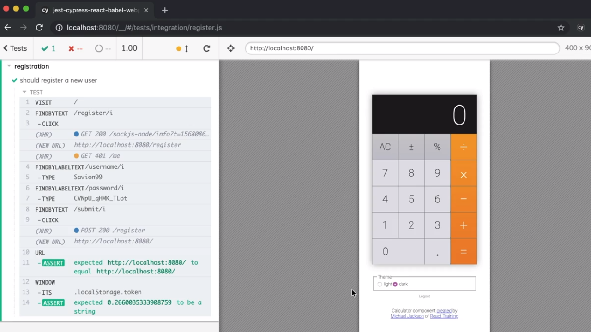
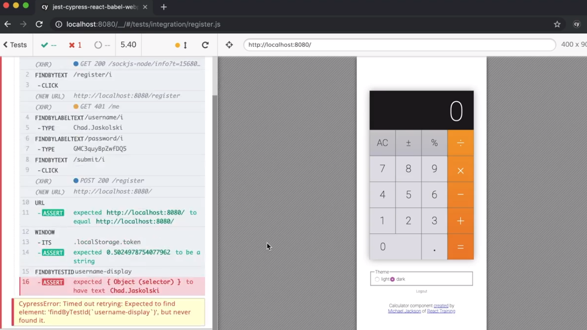
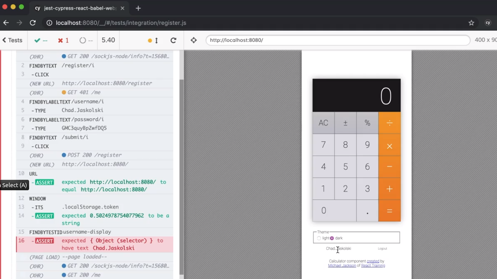
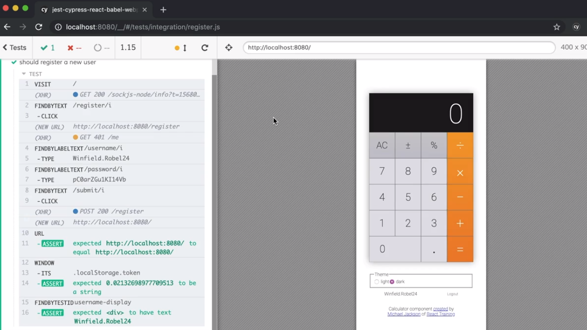

<p align="left">
  <a href="06_08.md">◀ Back: Test User Registration.</a>
</p>

---
# Cypress Driven Development.

Una de las ventajas que tenemos a la hora de trabajar con Cypress es que vamos a poderlo utilizar como herramienta que nos guía durante el proceso de diseño de nuestra aplicación utilizando los test end-to-end en cierta medida como se utilizar los test unitarios cuando estamos haciendo Test Driven Development (TDD).

Esto se puede entender mejor con un ejemplo. Supongamos que nuestra aplicación de la calculadora evoluciona de tal manera que queremos que cuando un usuario esté logueado dentro de su cuenta además de ofrecerle la posibilidad de hacer logout (pulsando en un enlace para ello) se muestre su nombre de usuario antes de dicho enlace. Partiremos de la interfaz que se muestra a continuación:

<div style='text-align: center'>
  
</div>
<br />

Lo primero que vamos a hacer es pensar en que el nombre del usuario lo vamos a mostrar dentro de un elemento html al que le vamos a aplicar el atributo `data-testid` para poder acceder al mismo a la hora de realizar nuestros test gracias a la invocación del método `findByTestId`. Así pues comenzamos ampliando nuestr último test tal y como sigue:

```js
import { buildUser } from '../support/generate'

describe('registration', () => {
  it('should register a new user', () => {
    const user = buildUser()

    cy.visit('/')
      .findByText(/register/i)
      .click()
      .findByLabelText(/username/i)
      .type(user.username)
      .findByLabelText(/password/i)
      .type(user.password)
      .findByText(/submit/i)
      .click()
      .url()
      .should('eq', `${ Cypress.config().baseUrl }/`)
      .window()
      .its('localStorage.token')
      .should('be.a', 'string')
      .findByTestId('username-display')
  })
})
```

y la aserción que queremos realizar dentro del mismo es que el texto que contiene será el nombre del usuario que ha accedido a la aplicación. Por lo tanto podremos escribir algo como siguiente:

```js
import { buildUser } from '../support/generate'

describe('registration', () => {
  it('should register a new user', () => {
    const user = buildUser()

    cy.visit('/')
      .findByText(/register/i)
      .click()
      .findByLabelText(/username/i)
      .type(user.username)
      .findByLabelText(/password/i)
      .type(user.password)
      .findByText(/submit/i)
      .click()
      .url()
      .should('eq', `${ Cypress.config().baseUrl }/`)
      .window()
      .its('localStorage.token')
      .should('be.a', 'string')
      .findByTestId('username-display')
      .should('have.text', user.username)
  })
})
```

Si ahora guardamos nuestro trabajo y volvemos a ejecutar los test end-to-end dentro de Cypress vemos como transcurridos unos segundos el test fallará porque no es capaz de encontrar el elemento html que tiene el atributo `data-testid` con el valor `username-display` y por lo tanto la última de las aserciones que hacemos no cumple.

<div style='text-align: center'>
  
</div>
<br />

Para lograr que nuestro test pase lo que tendremos que hacer es acudir a nuestra aplicación de ejemplo para mostrar la información del usuario dentro del código JSX. En concreto tendremos que ir al archivo `app.js` y dentro del mismo al `div` en el que se muestran los enlaces de *register* o *login* escribiedo lo siguiente:

```js
<div
  css={{
    display: 'flex',
    marginTop: 10,
    marginBottom: 10,
    justifyContent: 'space-around'
  }}
>
  {
    user ? (
      <>
        <div data-testid='username-display'>{ user.username }</div>
        <button type='button' onClick={ logout }>
          Logout
        </button>
      </div>
    ) : (
      <>
        <Link to='/register'>Register</Link>
        <Link to='/login'>Login</Link>
      </>
    )
  }
</div>
```

Sin embargo si ahora guardamos la información de nuestro componente de React no se va a refrescar de forma automática y aunque sí que se refresca la aplicación en el navegador de Cypress mostrando en la parte inferior de la página junto con el enlace que permite realizar el logout el nombre del usuario como esperábamos pero sin embargo el test que así lo tendría que verificar sigue mostrando un fallo debido a que Cypress pese a recargar la aplicación no vuelve a ejecutar los test hasta el momento en el que encuentra un cambio en el código de alguno de ellos.

<div style='text-align: center'>
  
</div>
<br />

Si queremos que se vuelvan a ejecutar los test y que estos pasen (como así esperamos) deberemos forzalo de forma manual pulsando sobre el botón *refresh* situado en la barra de navegación de la herramienta.

<div style='text-align: center'>
  
</div>
<br />

---
**Nota:** Cypress nos puede ayudar durante el proceso de relleno de los datos de un formulario de forma rápida durante nuestro proceso de desarrollo de una aplicación donde estemos, por ejemplo, rellenando un formulario con muchos campos o que realizando un proceso que conlleva muchos pasos, ya que la herramienta los realizará por nosotros lo que a la larga se traducirá en que tenemos más tiempo para seguir desarrollando la aplicación.

---

<p align="right">
  <a href="06_10.md">Next: Simulate Http Errors ▶</a>
</p>
