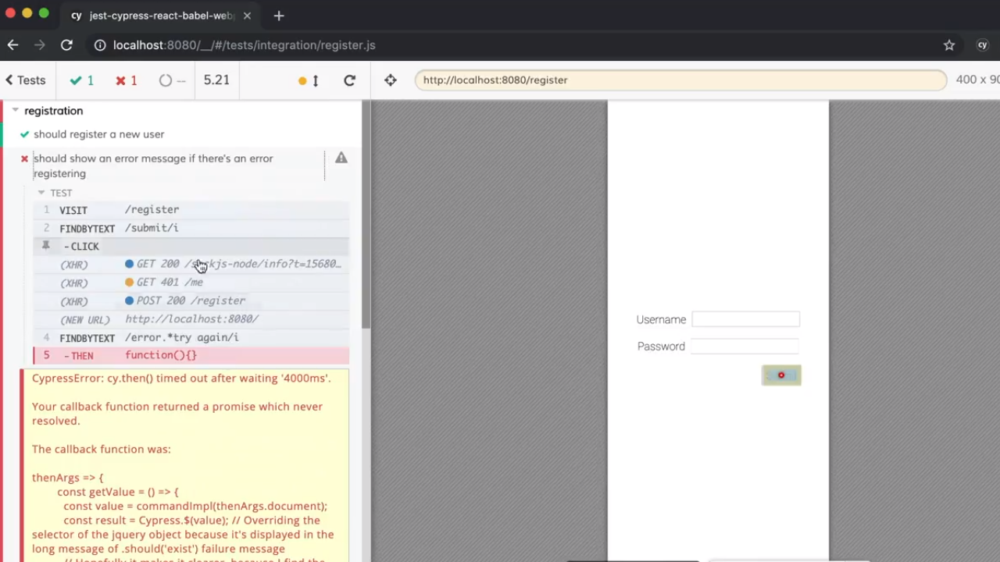
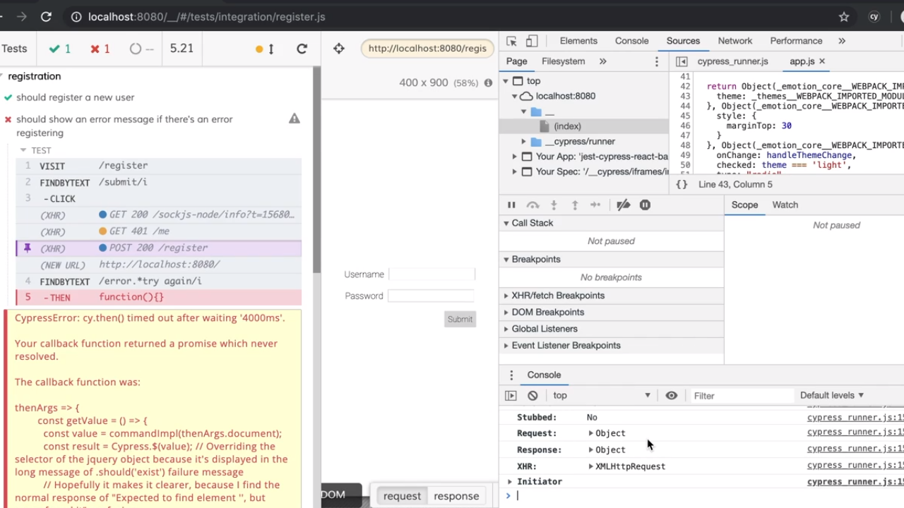
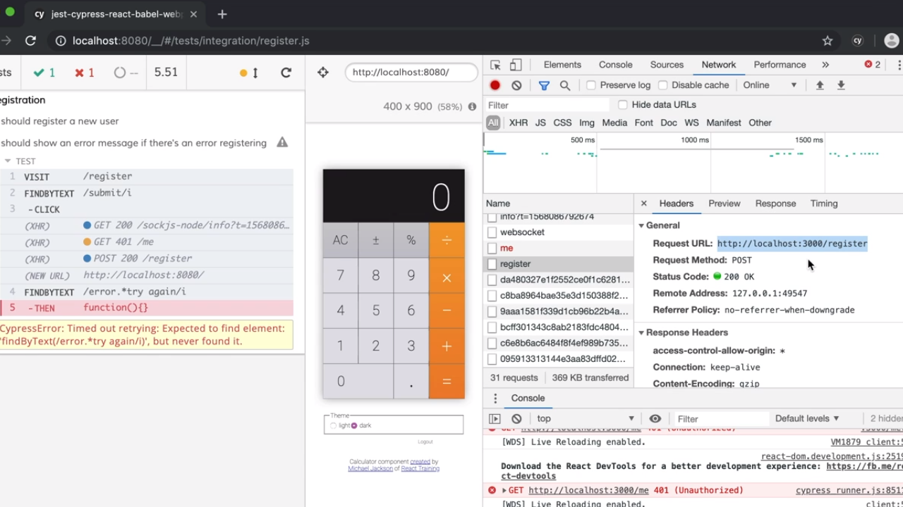
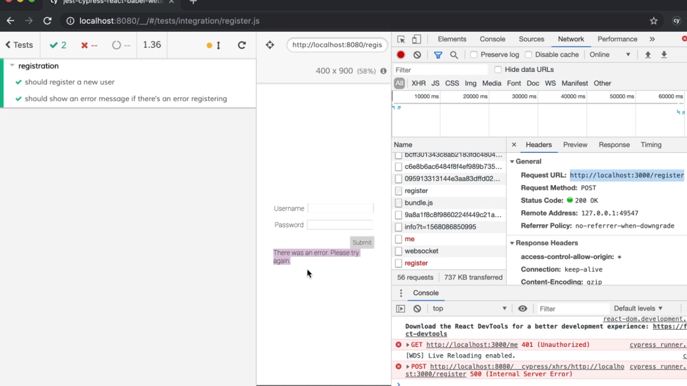
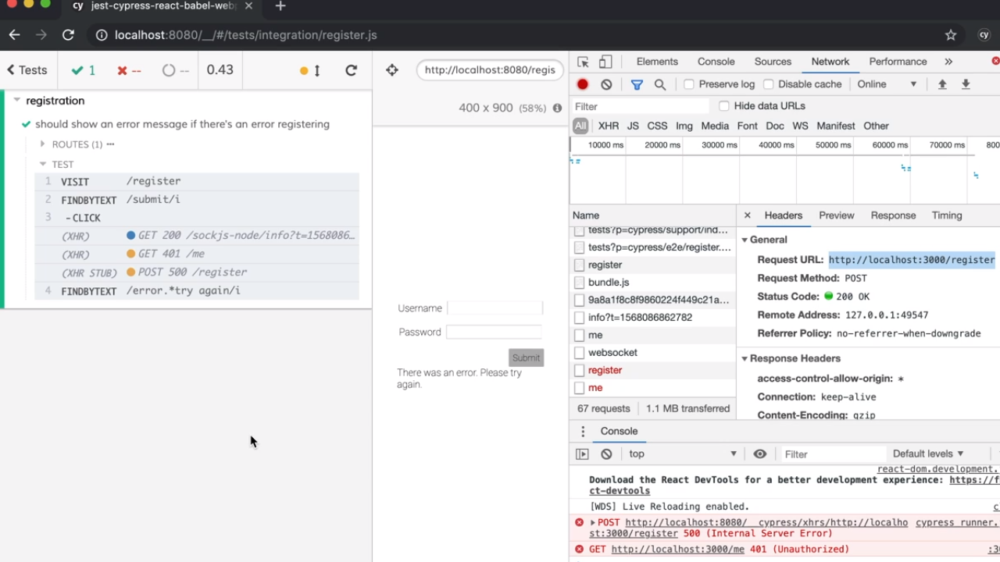
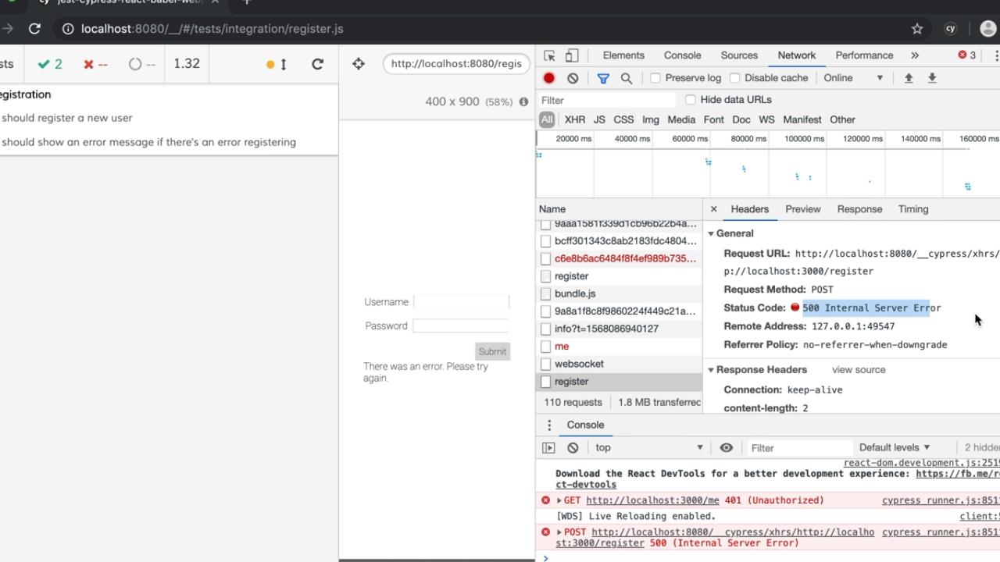

<p align="left">
  <a href="06_09.md">◀ Back: Cypress Driven Development.</a>
</p>

---
# Simulate Http Errors.

Hasta ahora visto cómo utilizar Cypress para probar el *happy path* asociado a la realización de una acción dentro de la aplicación por parte de un usuario y normalmente los test end-to-end tratarán precisamente de probar esto dejando que la detección de los errores o todos aquellos test que no corresponden al happy path queden recogidos en los test unitarios o en los test de integración que habremos realizado gracias a Jest.

Sin embargo hay ocasiones en las que nos interesa realizar algún tipo de test end-to-end sobre un *sad path* en concreto de nuestra aplicación. Por ejemplo, en la aplicación que estamos desarrollando nos podría interesar ver que la aplicación está respondiendo de forma correcta cuando al intentar hacer login en la cuenta de un usuario el servidor backend responde con un error 500 de tal manera que en la interfaz de usuario estemos seguros de que se va a mostrar un mensaje del tipo *ha habido un error, por favor inténtelo de nuevo* o algo similar.

Para ver cómo se hace esto vamos a añadir un nuevo test a nuestra suite de test asociada a las acciones que tiene que ver con el registro un nuevo usuario en el sistema, es decir, que añadimos un nuevo test dentro del fichero `register.js` situado en le directorio `cypress/e2e`:

```js
import { buildUser } from '../support/generate'

describe('registration', () => {
  it('should register a new user', () => {
    // ... previous code.
  })

  it(`should show an error message of there's an error registering`, () => {})
})
```

En este caso vamos a hacer que el test comience tras la visita a la página de registro de un nuevo usuario sin importar que se llegue allí desde la paǵina de inicio o directamente escribiendo la url en el navegador, por lo que comenzaremos simulando que el usuario visita esta página:

```js
import { buildUser } from '../support/generate'

describe('registration', () => {
  it('should register a new user', () => {
    // ... previous code.
  })

  it(`should show an error message of there's an error registering`, () => {
    cy.visit('/register')
  })
})
```

Y ahora lo que vamos a hacer es que el usuario pulse directamente en el botón *submit* del formulario de registro sin proporcionar ni el nombre de usuario ni la contraseña:

```js
import { buildUser } from '../support/generate'

describe('registration', () => {
  it('should register a new user', () => {
    // ... previous code.
  })

  it(`should show an error message of there's an error registering`, () => {
    cy.visit('/register')
      .findByText(/submit/i)
      .click()
  })
})
```

Y lo siguiente que queremos comprobar es que el se muestra un mensaje de error del tipo *error. try again* por lo que vamos a utilizar una expresión regular para hacerlo lo más específico posible denjando que la descripción del error quede más abierta. Esto se traduce en que vamos a buscar un elemento dentro del DOM con un texto parecido al que acabamos de describir.

```js
import { buildUser } from '../support/generate'

describe('registration', () => {
  it('should register a new user', () => {
    // ... previous code.
  })

  it(`should show an error message of there's an error registering`, () => {
    cy.visit('/register')
      .findByText(/submit/i)
      .click()
      .findByText(/error.*try again/i)
  })
})
```

Si ahora guardamos estos cambios y regresamos al navegador de Cypress podemos ver que el test que acabamos de escribir fallará porque no es capaz de encontrar un elemento dentro del DOM de la aplicación cuyo texto pueda hacer *match* con la expresión regular que hemos pasado al método `findByText`.

<div style='text-align: center'>
  
</div>
<br />

Es más, si analizamos algo más la información que nos proporciona Cypress podemos ver que hemos obtenido una respuesta como resultado de la petición POST que se ha realizado como consecuencia del envío del formulario dentro de la aplicación y no solamente eso sino que podemos irnos a las herramientas para desarrolladores del navegador ya que en la consola de JavaScript vamos a tener más información al respecto:

<div style='text-align: center'>
  
</div>
<br />

Es decir que en la consola tenemos la información de la petición que hemos realizado y de la respuesta de la misma. Esta información además estará recogida en la pestaña *Network* dentro de las herramientas para desarrolladores lo que nos puede hacer es dar más información al respecto del tipo de petición que se está llevando a cabo:

<div style='text-align: center'>
  
</div>
<br />

Lo que nosotros vamos a querer simular es que en la respuesta a esa petición concreto para la ejecución del test el servidor nos responda con un código 500 y por lo tanto nuestra aplicación sea capaz de mostrar el mensaje de error. Pero ¿cómo podemos hacer esto si la llamada al servidor backend se está produciendo realmente en el test y este está respondiendo correctamente? La respuesta es que tememos que utilizar el método `server` que nos ofrece el objeto `cy`.

Este método al ser invocado nos va a retornar a su vez un objeto con una serie de métodos que podemos invocar de forma encadenada. Para el propósito que estamos persiguiendo en la realización de nuestro test el método que tenemos que utilizar será `route` el cual espera recibir como parámetro un objeto donde cada uno de los atributos será una de las características de la petición. Así tendremos el atributo `method` para especificar el método http con el que se estará realizando la petición, el atributo `url` para especificar la url a la que se va a realizar al petición, el atributo `status` en el que recogeremos el código del estado con el que va a responder el servidor y el atributo `response` que a su vez puede tener asociado un objeto con la información de la respuesta. 

Si aplicamos este mecanismo al test que estamos definiendo escribiremos algo como lo siguiente:

```js
import { buildUser } from '../support/generate'

describe('registration', () => {
  it('should register a new user', () => {
    // ... previous code.
  })

  it(`should show an error message of there's an error registering`, () => {
    cy.server()
      .route({
        method: 'POST',
        url: 'http://localhost:3000/register',
        status: 500,
        response: {}
      })

    cy.visit('/register')
      .findByText(/submit/i)
      .click()
      .findByText(/error.*try again/i)
  })
})
```

es decir que estamos definiendo que cada vez que dentro del test se haga una petición a la url `http://localhost:3000/register` utilizando el método POST el servidor ha de responder con el código de estado 500. 

Tras realizar este cambio si ahora guardamos el test y nos vamos al navegador de Cypress podemos ver como el test sí que pasa porque sí que se está mostrando el mensaje de error como esperábamos:

<div style='text-align: center'>
  
</div>
<br />

---
**Nota:** al tratarse de un tipo de test en el que se modifica el tipo de respuesta del servidor lo habitual es que dentro de la suite de test se quiera ejecutar de forma aislada al resto de los test por lo que se suele definir con la llamada a la función `it.only` en vez de la invocación directa de la función `it` garantizando que sea el único que se llame cuando estemos trabajando en el mismo.

```js
import { buildUser } from '../support/generate'

describe('registration', () => {
  it('should register a new user', () => {
    // ... previous code.
  })

  it.only(`should show an error message of there's an error registering`, () => {
    cy.server()
      .route({
        method: 'POST',
        url: 'http://localhost:3000/register',
        status: 500,
        response: {}
      })

    cy.visit('/register')
      .findByText(/submit/i)
      .click()
      .findByText(/error.*try again/i)
  })
})
```

Si ahora guardamos la definición del test nos encontraremos con que este test es el único que se estará ejecutando dentro del navegador de Cypress lo que puede ser interesante para avanzar en el desarrollo de forma mucho más rápida.

<div style='text-align: center'>
  
</div>
<br />

---
**Nota:** en las herramientas para desarrolladores del navegador podemos ver como Cypress es capaz de interceptar cualquier tipo de petición que vaya encaminada hacia la ruta que hemos definido y cuál es la respuesta que va a enviar de vuelta como resultado de su invocación que en nuestro caso será un error 500.

<div style='text-align: center'>
  
</div>
<br />

---

<p align="right">
  <a href="06_02.md">Next: Test User Login ▶</a>
</p>
