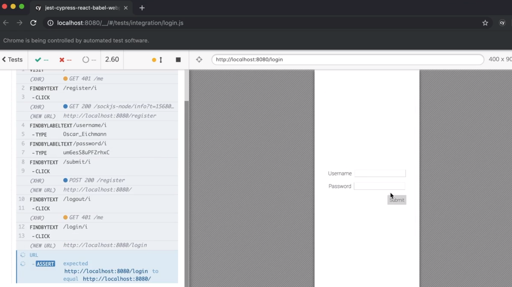

<p align="left">
  <a href="06_10.md">◀ Back: Simulate Http Errors.</a>
</p>

---
# Test User Login.

Vamos ahora a ver cómo podemos realizar los test end-to-end pero en este caso para el proceso de login en la aplicación. Para ello, y como siempre que vamos a crear una nueva suite de test, nos dirigiremos al directorio `cypress/e2e` de nuestro proyecto y dentro del mismo definimos un nuevo archivo al que vamos a denominar `login.js`.

Ahora tenemos que definir una suite de test y dentro de la misma el test que queremos llevar a cabo por lo que comenzaremos con el siguiente código:

```js
describe('login', () => {
  it('should login an existing user', () => {})
})
```

Para poder realizar nuestro test de forma correcta lo primero que tenemos que garantizar es que esteremos haciendo login con uno de los usuarios que previamente han sido registrados en el sistema por lo que previamente tendríamos que asegurarnos de estar trabajando con un usuario registrado o, lo que viene siendo lo mismo, que estamos trabajando con un usuario que ha sido registrado antes de realizar las comprobaciones en nuestro test. Así, si nos paramos a pensarlo, si simplemente lo que hacemos es realizar todos los pasos que permiten registrar un nuevo usuario en el sistema vamos a poder utilizarlo para comprobar el login. Comenzamos copiando todos los pasos del [test para registrar un usuario](./06_09.md)) que hemos visto previamente en nuestro test.

```js
import { buildUser } from '../support/generate'

describe('login', () => {
  it('should login an existing user', () => {
    const user = buildUser()

    cy.visit('/')
      .findByText(/register/i)
      .click()
      .findByLabelText(/username/i)
      .type(user.username)
      .findByLabelText(/password/i)
      .type(user.password)
      .findByText(/submit/i)
      .click()
  })
})
```

Como el proceso de creación de una cuenta finaliza con el usuario dentro de la misma lo siguiente que vamos a hacer es simular el proceso de logout para así garantizar que tenemos un usaurio que está autorizado y además que dicho usuario está fuera de su cuenta. Por lo tanto añadimos las siguientes instrucciones al código de nuestro test:

```js
import { buildUser } from '../support/generate'

describe('login', () => {
  it('should login an existing user', () => {
    const user = buildUser()

    cy.visit('/')
      .findByText(/register/i)
      .click()
      .findByLabelText(/username/i)
      .type(user.username)
      .findByLabelText(/password/i)
      .type(user.password)
      .findByText(/submit/i)
      .click()
      .findByText(/logout/i)
      .click()
  })
})
```

Ahora es cuando podemos empezar a realizar nuestro test. Lo primero que tenemos que saber es que tras el proceso de logout el usuario habrá sido redirigido a la página principal y lo que queremos es buscar el enlace que nos dirija a la paǵina que nos permita hacer login como sigue:

```js
import { buildUser } from '../support/generate'

describe('login', () => {
  it('should login an existing user', () => {
    const user = buildUser()

    cy.visit('/')
      .findByText(/register/i)
      .click()
      .findByLabelText(/username/i)
      .type(user.username)
      .findByLabelText(/password/i)
      .type(user.password)
      .findByText(/submit/i)
      .click()
      .findByText(/logout/i)
      .click()
      // now our test can start...

      .findByText(/login/i)
      .click()
  })
})
```

Si ahora arrancamos Cypress y de la lista de suite de test que tenemos a nuestra disposición elegimos la que está recogida en el fichero `login.js` sin más que hacer click en la misma:

<div style='text-align: center'>
  
</div>
<br />

Lo que va a hacer es cargar dicha suite de test que con el código que tenemos recogido hasta ahora podemos ver como al ejecutarse lo que hace es mostrarnos el formulario de acceso al sistema ademaś de que previamente se habrán realizado todos los pasos para registrar al nuevo usuario de la aplicación el cual tiene el aspecto parecido a lo que se muestra a continuación que:

<div style='text-align: center'>
  
</div>
<br />

El siguiente paso que daremos será volver a escribir el nombre de usuario y la contraseña en los campos de texto que se están mostrando para posteriormente hacer click en el botón submit por lo que el código que se ha de ejecutar será el siguiente:

```js
import { buildUser } from '../support/generate'

describe('login', () => {
  it('should login an existing user', () => {
    const user = buildUser()

    cy.visit('/')
      .findByText(/register/i)
      .click()
      .findByLabelText(/username/i)
      .type(user.username)
      .findByLabelText(/password/i)
      .type(user.password)
      .findByText(/submit/i)
      .click()
      .findByText(/logout/i)
      .click()
      // now our test can start...

      .findByText(/login/i)
      .click()
      .findByLabelText(/username/i)
      .type(user.username)
      .findByLabelText(/password/i)
      .type(user.password)
      .findByText(/submit/i)
      .click()
      .findByText(/logout/i)
      .click()
  })
})
```

Y ya solamente con el fin de comprobar que el usuario en cuestión está dentro de su cuenta tendremos que buscar el nodo que muestra su nombre de usuario el cual estará situado al lado del enlace de logout y que se puede identificar porque posee el atributo `data-testid` con una valor determinado, en este caso el valor `username-display`. Además, vamos a hacer todas las aserciones que tienen que ver con el que el proceso de registro del nuevo usuario ha finalizado correctamente y que serán las mismas que hemos [visto anteriormente](./06_09.md) para el proceso de creación de una nueva cuenta de usuario en el sistema. Por lo tanto la aserción que vamos a realizar será:

```js
import { buildUser } from '../support/generate'

describe('login', () => {
  it('should login an existing user', () => {
    const user = buildUser()

    cy.visit('/')
      .findByText(/register/i)
      .click()
      .findByLabelText(/username/i)
      .type(user.username)
      .findByLabelText(/password/i)
      .type(user.password)
      .findByText(/submit/i)
      .click()
      .findByText(/logout/i)
      .click()
      // now our test can start...

      .findByText(/login/i)
      .click()
      .findByLabelText(/username/i)
      .type(user.username)
      .findByLabelText(/password/i)
      .type(user.password)
      .findByText(/submit/i)
      .click()
      .findByText(/logout/i)
      .click()

      // Now let's verify things are set after login.
      .url()
      .should('eq', `${ Cypress.config().baseUrl }/`)
      .window()
      .its('localStorage.token')
      .should('be.a', 'string')
      .findByTestId('username-display')
      .should('have.text', user.username)
  })
})
```

Y si guardamos la información del test y volvemos a ver como se cumplen todas las aserciones y por lo tanto el test pasará perfectamente:

<div style='text-align: center'>
  
</div>
<br />

---

<p align="right">
  <a href="06_12.md">Next: Test Create a User with `cy` Request. ▶</a>
</p>
