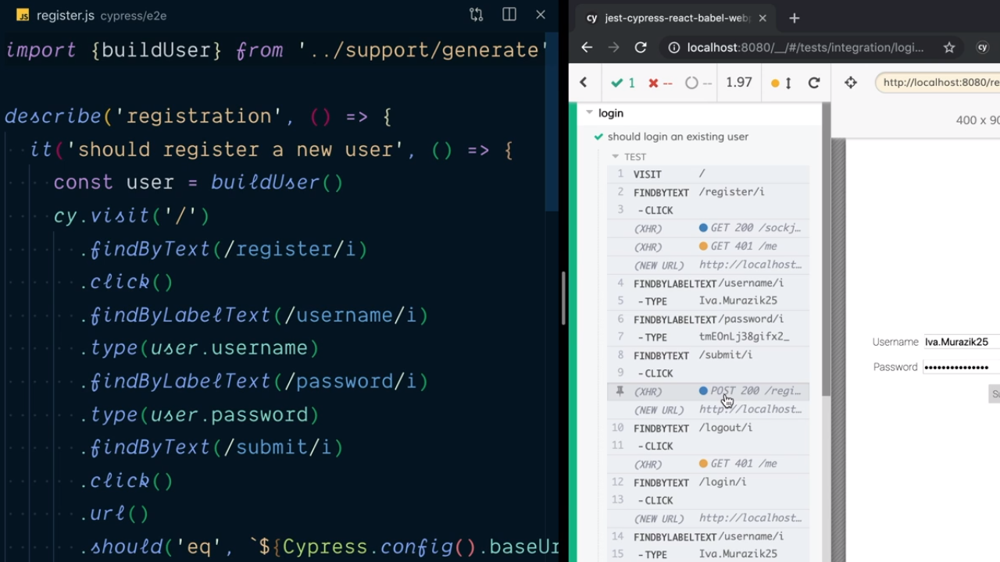
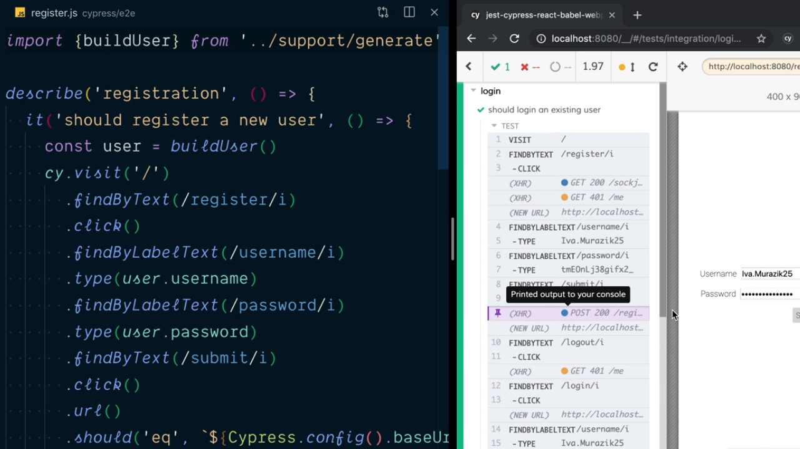
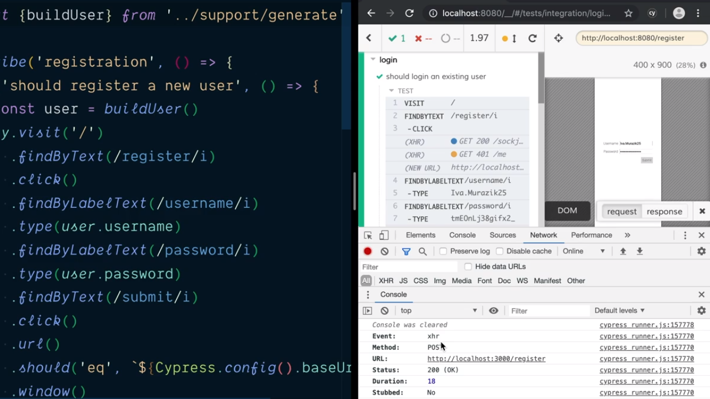
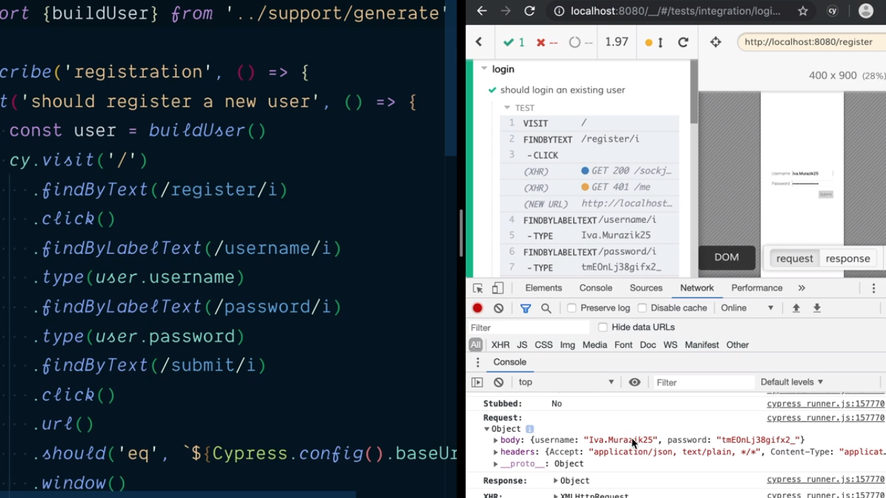
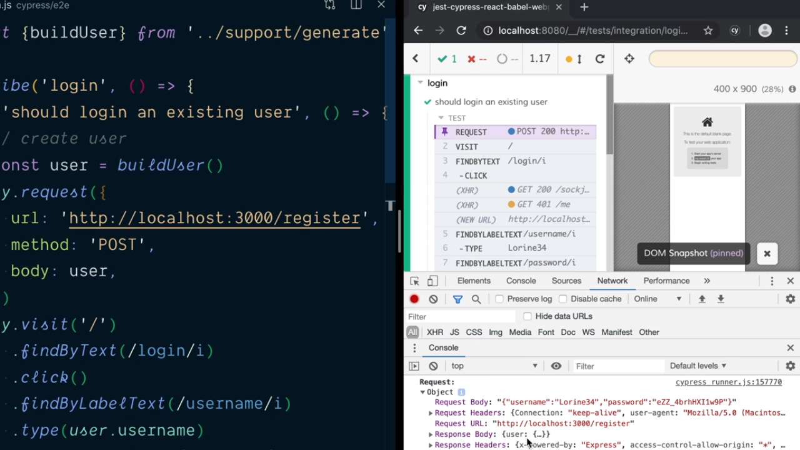

<p align="left">
  <a href="06_11.md">◀ Back: Test User Login.</a>
</p>

---
# Test Create a User with `cy` Request.

En el [punto anterior](./06_11.md) hemos visto que para realizar el test que nos verifica el proceso de login de un usario previamente hemos tenido que realizar varios pasos destinados exclusivamente a la creación de la cuenta del usuario de prueba en el sistema. Recordemos el código de nuestro último test:

```js
import { buildUser } from '../support/generate'

describe('login', () => {
  it('should login an existing user', () => {
    const user = buildUser()

    cy.visit('/')
      .findByText(/register/i)
      .click()
      .findByLabelText(/username/i)
      .type(user.username)
      .findByLabelText(/password/i)
      .type(user.password)
      .findByText(/submit/i)
      .click()
      .findByText(/logout/i)
      .click()
      // now our test can start...

      .findByText(/login/i)
      .click()
      .findByLabelText(/username/i)
      .type(user.username)
      .findByLabelText(/password/i)
      .type(user.password)
      .findByText(/submit/i)
      .click()
      .findByText(/logout/i)
      .click()

      // Now let's verify things are set after login.
      .url()
      .should('eq', `${ Cypress.config().baseUrl }/`)
      .window()
      .its('localStorage.token')
      .should('be.a', 'string')
      .findByTestId('username-display')
      .should('have.text', user.username)
  })
})
```

De hecho las primeras líneas de este test lo que estamos haciendo es crear el nuevo usuario cosa para lo cual ya tenemos otro test end-to-end dentro del archivo `register.js` que se encarga de realizarlo. Por lo tanto estaremos duplicando nuesto código y, lo que es peor, estaremos duplicando nuestro test porque estamos haciendo lo mismo en dos sitios diferentes.

Es en estos casos donde Cypress nos ofrece la posibilidad de poderle establecer de forma directa con una petición http qué es lo que queremos que realice sin tener que hacer uso de los pasos por la interfaz de usuario. En nuestro caso estos sería decirle algo así como *registra este usuario* de forma directa sin tener que ir a la página de registro, rellenar los campos del formulario y por último pulsar sobre el botón submit.

Para lograrlos nos vamos a la interfaz gráfica de usuario de Cypress y en concreto nos centramos en el resultado de la ejecución del test end-to-end que se encarga de verificar el proceso de login dentro de nuestro sistema y más concretamente nos centramos en el momento en el que se hace click en el botón submit (esto es fácil de tracear siguiendo la lista de acciones en el panel de la izquierda):

<div style='text-align: center'>
  
</div>
<br />

Para ver qué es lo que está sucediendo en este punto en concreto lo siguiente que vamos a tener que hacer es pulsar sobre ese paso en la secuencia de acciones para que Cypress lo marque:

<div style='text-align: center'>
  
</div>
<br />

tras lo cual ya vamos a poder acudir a las herramientas para desarrolladores del navegador ya que en la pestaña de la consola de JavaScript vamos a poder encontrarnos con toda la información asociada a la petición que se ha llevado a cabo.

<div style='text-align: center'>
  
</div>
<br />

En concreto nos tenemos fijar en que estamos llevando a cabo una petición de tipo POST a la url que sirve para realizar el registro de nuestro usuario y, si desplegamos la información que está asociada a la petición (la información que está recogida dentro del objeto `request`) podemos además ver los campos y los valores de los mismos con los que se ha enviado el formulario.

<div style='text-align: center'>
  
</div>
<br />

Lo que nosotros queremos lograr es que el test que comprueba que el proceso de login se realiza correctamente este tipo de petición se pueda llevar a cabo de forma directa sin que en ningún momento se tengan que producir los pasos de rellenar el formulario para el registro del usuario. Dicho de otra manera, queremos realizar directamente la petición POST para el registro del nuevo usuario y luego continuar con el test.

Para lograrlo lo que vamos a hacer es utilizar el método `request` del objeto `cy` con el fin de simular una petición http. Este método espera recibir como parámetro un objeto en el que cada uno de sus atributos se utilizará para establecer los parámetros de configuración que están asociados a dicha petición siendo el atributo `url` el que sirve para establecer la url a que queremos realizar la petición (en nuestro caso la url de registro de un usuario), el atributo `method` recoge la información del método http con el que se está realizando la petición (en nuestro caso POST) y en el atributo `body` recogeremos los datos que acompañarán a dicha petición en la forma de un objeto JavaScript.

```js
import { buildUser } from '../support/generate'

describe('login', () => {
  it('should login an existing user', () => {
    // create user
    const user = buildUser()
    cy.request({
      url: 'http://localhost:3000/register',
      method: 'POST',
      body: user
    })
    // ...
```

Con el proceso de creació del usuario ya recogido en la invocación del método `request` podemos continuar con el refactor de nuestro test eliminando todos aquellos pasos que utilizábamos para ello. Esto nos deja el test con el siguiente código:

```js
import { buildUser } from '../support/generate'

describe('login', () => {
  it('should login an existing user', () => {
    // create user
    const user = buildUser()
    cy.request({
      url: 'http://localhost:3000/register',
      method: 'POST',
      body: user
    })

    // now our test can start...
    cy.visit('/')
      .findByText(/login/i)
      .click()
      .findByLabelText(/username/i)
      .type(user.username)
      .findByLabelText(/password/i)
      .type(user.password)
      .findByText(/submit/i)
      .click()
      .findByText(/logout/i)
      .click()

      // Now let's verify things are set after login.
      .url()
      .should('eq', `${ Cypress.config().baseUrl }/`)
      .window()
      .its('localStorage.token')
      .should('be.a', 'string')
      .findByTestId('username-display')
      .should('have.text', user.username)
```

Si ahora guardamso nuestro trabajo y volvemos a ejecutar el test lo que podemos ven Cypress es que como paso previo a la realización del mismo se está realizando una petición POST para realizar el registro del usuario tal y como esperábamos que así sucediese que si la exploramos (marcándola y abriendo las herramientas para desarrolladores) podemos ver que tiene exactamente la misma información que los datos que se enviaban en la primera versión del test para el registro de los usuarios.

<div style='text-align: center'>
  
</div>
<br />

Además el test seguirá pasando como hasta ahora pero habremos logrado que se ejecute de una forma mucho más rápida ya que la cantidad de pasos que se tiene que dar para ello es mucho menor que la que teníamos hasta ahora, consiguiendo hacer que nuestros test sean mucho más mantenibles y sencillos.

---

<p align="right">
  <a href="06_13.md">Next: Keep Tests Isolated and Focused. ▶</a>
</p>
