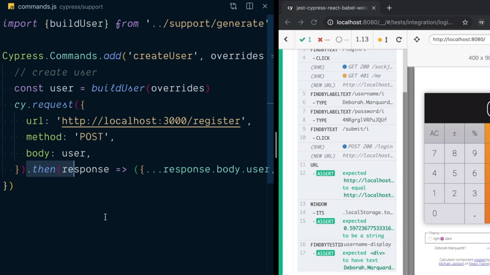

<p align="left">
  <a href="06_12.md">◀ Back: Test Create a User with `cy` Request.</a>
</p>

---
# Keep Tests Isolated and Focused.

Siengo con las mejoras que podemos llevar a cabo para la implementación de nuestros test y centrándonos en nuestra aplicación de ejemplo podemos llegar a entender que habrá muchos de ellos que van a precisar que previamente se cree un usuario antes de poderlo utilizar para la realización de nuestros test. Es decir, que si revisamos el test de nuestro [último punto](./06_12.md) el código de creación de usuario lo vamos a utilizar varias veces en nuestros test:

```js
import { buildUser } from '../support/generate'

describe('login', () => {
  it('should login an existing user', () => {
    // create user
    const user = buildUser()
    cy.request({
      url: 'http://localhost:3000/register',
      method: 'POST',
      body: user
    })

    // now our test can start...
    cy.visit('/')
      .findByText(/login/i)
      .click()
      .findByLabelText(/username/i)
      .type(user.username)
      .findByLabelText(/password/i)
      .type(user.password)
      .findByText(/submit/i)
      .click()
      .findByText(/logout/i)
      .click()

      // Now let's verify things are set after login.
      .url()
      .should('eq', `${ Cypress.config().baseUrl }/`)
      .window()
      .its('localStorage.token')
      .should('be.a', 'string')
      .findByTestId('username-display')
      .should('have.text', user.username)
  })
})
```

Cypress nos va a permitir sacar este código para la creación del usuario como un comando que vamos a poder invocar en todos aquellos test en los que lo necesitemos. Para lograrlo nos tendremos que dirigir al directorio `cypress/support` y dentro del mismo abrir el fichero `commands.js` (que se habrá generado con la propia instalación de Cypress) el cual estará inicialmente vacío (o con un código comentado).

Aquí dentro de nuestro objetivo será añadir un nuevo comando a los que ya tenemos disponibles. Para ello tenemos que entender que el objeto global `Cypress` tiene definido en su atributo `Commands` todos los comandos que están disponibles para ser ejecutados y además que dicho atributo es un objeto y nos ofrece el método `add` para añadir nuevos comandos.

```js
Cypress.Commands.add()
```

Pero ¿qué parámetros espera recibir este método? Pues dos, siendo el primero de ellos un string que identificará el comando que vamos a crear y el segundo una función que que se encargará de ejecutar los comandos que nosotros queremos que ejecute Cypress cuando invoquemos el comando que estamos creando.

```js
Cypress.Commands.add('createUser', () => {})
```

En nuestro caso ¿qué es lo que queremos que se ejecute cuando se realice el comando `createUser` que estamos definiendo? Pues para ello nos vamos al código del test del que estamos partiendo para recoger aquella parte del mismo que se encargará de la creación de un nuevo usuario (además de las sentencias `import` que sean necesarias para ejecutar el código) lo que nos deja con algo como lo siguiente:

```js
import { buildUser } from '../support/generate'

Cypress.Commands.add('createUser', () => {
  const user = buildUser()
  cy.request({
    url: 'http://localhost:3000/register',
    method: 'POST',
    body: user
  })
})
```

Con esto ya tenemos definido el comando `createUser` que lo que hace es crear un nuevo objeto que represente a un usuario del sistema y a continuación llamará al endpoint que se encargará de registrarlo dentro de nuestro sistema.

---
**Nota**: la función que se recibe como parámetro para el método `add` puede recibir un parámetro adicional el cual puede ser utilizado para pasar información que sea necesaria para la ejecución del método. En nuestro caso, por ejemplo, si queremos que sea posible pasar a nuestro comando un objeto con la información del usuario a crear (o una parte de la misma, como por ejemplo el nombre del usuario) podríamos escribir algo como lo siguiente:

```js
import { buildUser } from '../support/generate'

Cypress.Commands.add('createUser', overrides => {
  const user = buildUser(overrides)
  cy.request({
    url: 'http://localhost:3000/register',
    method: 'POST',
    body: user
  })
})
```

---

¿Cómo podemos hacer ahora para invocar a este comando? Pues aquí es donde tenemos que entender que todos los comandos que están disponibles van a ser métodos del objeto `cy` que estamos utilizando para la realización de nuestros test, siendo el nombre de dicho método el nombre del comando que hemos definido. Así pues, reescribimos nuestro test de la siguiente manera:

```js
describe('login', () => {
  it('should login an existing user', () => {
    // create user
    cy.createUser()

    // now our test can start...
    cy.visit('/')
      .findByText(/login/i)
      .click()
      .findByLabelText(/username/i)
      .type(user.username)
      .findByLabelText(/password/i)
      .type(user.password)
      .findByText(/submit/i)
      .click()
      .findByText(/logout/i)
      .click()

      // Now let's verify things are set after login.
      .url()
      .should('eq', `${ Cypress.config().baseUrl }/`)
      .window()
      .its('localStorage.token')
      .should('be.a', 'string')
      .findByTestId('username-display')
      .should('have.text', user.username)
  })
})
```

El problema con esto es que el test no se puede ejecutar por el código del resto de la función no sabe qué es el objeto `user` y por lo tanto fallará. Entonces ¿qué es lo que tenemos que hacer? Pues aquí es donde tenemos que recordar que todos los métodos del objeto `cy` retornan siempre una promesa y como tal vamos a poder llamar al método `then` asociada a la misma. Pero ¿cómo le pasamos el objeto `user`? Pues como el parámetro de la función que se ejecuta en el método `then` dejando nuestro código como sigue:

```js
describe('login', () => {
  it('should login an existing user', () => {
    // create user
    cy.createUser()
      .then(user => {
        // now our test can start...
        cy.visit('/')
          .findByText(/login/i)
          .click()
          .findByLabelText(/username/i)
          .type(user.username)
          .findByLabelText(/password/i)
          .type(user.password)
          .findByText(/submit/i)
          .click()
          .findByText(/logout/i)
          .click()

          // Now let's verify things are set after login.
          .url()
          .should('eq', `${ Cypress.config().baseUrl }/`)
          .window()
          .its('localStorage.token')
          .should('be.a', 'string')
          .findByTestId('username-display')
          .should('have.text', user.username)
          })
      })
  })
})
```

Pero esto no es suficiente por JavaScript no pasará de forma automática el objeto `user` que ha sido declarado en el comando al método `then`. ¿Qué tenemos que hacer? Pues en la definición de nuestro comando vemos que también estamos invocando a un método del objeto `cy`, en concreto el método `request` y como tal sabemos que este va retornar una promesa con la respuesta de dicha invocación.

Vamos a recoger la respuesta en el método `then` asociado a la promesa (al que le pasamos el parámetro `response` con los datos de la misma) para quedarnos con los datos del usuario que se obtiene en la respuesta de la petición combinados con los datos del usuario que hemos generado de forma aleatoria:

```js
import { buildUser } from '../support/generate'

Cypress.Commands.add('createUser', overrides => {
  const user = buildUser(overrides)
  cy.request({
    url: 'http://localhost:3000/register',
    method: 'POST',
    body: user
  }).then(response => ({ ...responde.body.user, ...user }))

})
```

esto lo que hará es que todos los métodos `then` que se ejecuten a partir de la invocación de esta promesa (en nuestro caso de la ejecución de este comando) van a recibir como parámetro el usuario que ha sido creado y nuestro test funcionará de forma correcta como se puede ver en la siguiente imagen:

<div style='text-align: center'>
  
</div>
<br />

>
> lo realmente importante que tenemos que recordar de este punto es que al contruir nuestros propios comandos para ser ejecutados en Cypress podemos cambiar el *subject* de Cypress con la invocación del método `then` dentro código del comando.
>

---

<p align="right">
  <a href="06_14.md">Next: Use Custom Cypress Commands. ▶</a>
</p>
