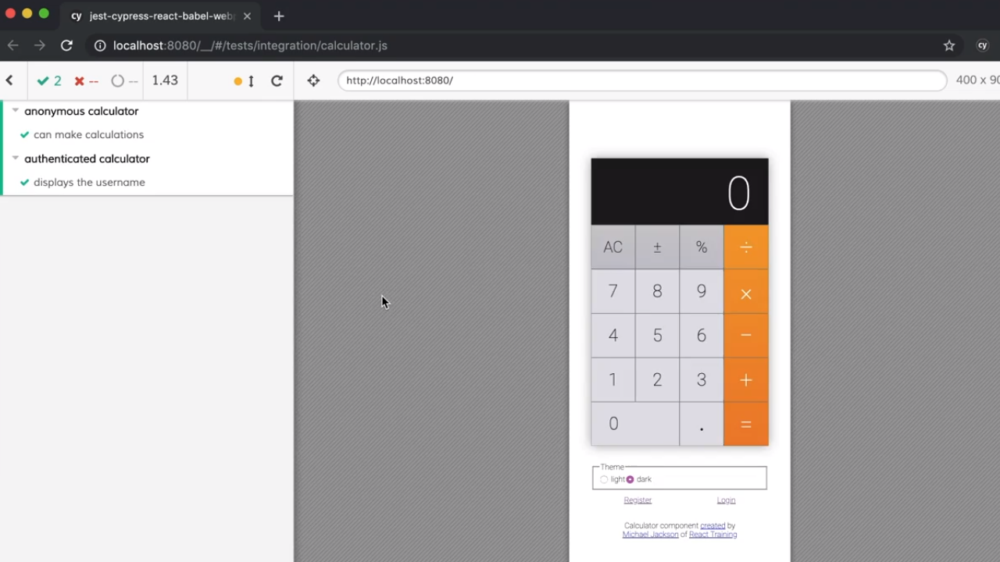
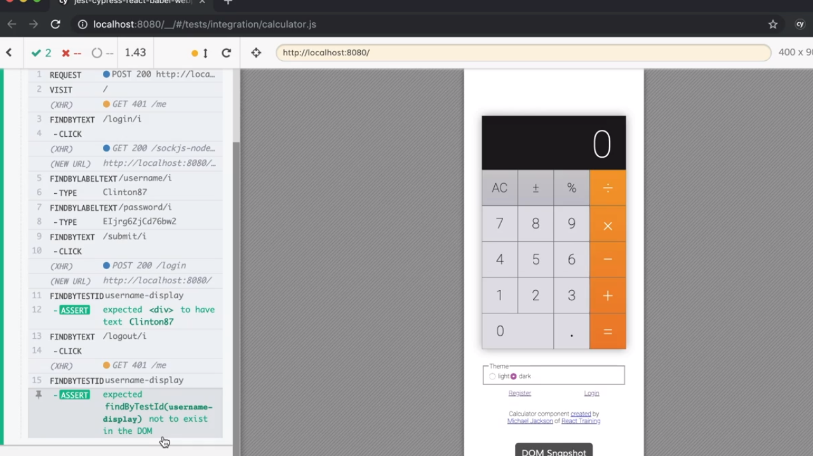

<p align="left">
  <a href="06_14.md">◀ Back: Reusable Assertions.</a>
</p>

---
# Run Test as an Authenticated User.

Dentro de nuestro fichero `calculator.js` recogido en el directorio `cypress/e2e` vamos a crear una nueva suite de test en este caso para recoger todos aquellos que tienen que ver con los test relacionados con el uso de la calculadora por parte de los usuarios que están autentificados en el sistema. 

Partimos del siguiente código donde habíamos comprobado el uso de nuestra calculadora de forma anónima gracias a la realización de una operación de suma de dos números con la misma:

```js
describe('anonymous calculator', () => {
  it('can make calculations', () => {
    cy.visit('/')
      .findByText(/^1$/)
      .click()
      .findByText(/^\+$/)
      .click()
      .findByText(/^2$/)
      .pause()
      .click()
      .findByText(/^=$/)
      .click()
      .findByTestId('total')
      .should('have.text', '4')
  })
})
```

Y lo que vamos a hacer es añadir un segundo bloque `describe` para crear una nueva suite de test dentro del mismo tal y como sigue:

```js
describe('anonymous calculator', () => {
  // ...
}

describe('authenticated calculator', () => {})
```

---
**Nota:** a partir de este punto solamente mostraremos los test correspondientes a esta segunda suite con el fin de que la explicación quede mucho más clara pero no podemos olvidar en ningún caso que en el fichero `calculator.js` están recogidos los test tanto para usuario autenticados como para los que no lo están.

---

El primero de los test que vamos a recoger dentro de esta nueva suite consitirá simplemente en comprobar que una vez que nuestro usuario está autenticado dentro de la interfaz gráfica de usuario se estará mostrando su nombre de usuario. Así pues definimos el test dentro de la suite como sigue:

```js
describe('authenticated calculator', () => {
  it('displays the username', () => {})
})
```

El código que estará recogido dentro de este test es muy similar al que hemos visto en el [punto anterior](./06_14.md) relacionado con el test end-to-end para probar el proceso de login en el sistema cambiando la aserción que se realizará dentro del mismo:

```js
describe('authenticated calculator', () => {
  it('displays the username', () => {
    cy.createUser()
      .then(user => {
        // now our test can start...
        cy.visit('/')
          .findByText(/login/i)
          .click()
          .findByLabelText(/username/i)
          .type(user.username)
          .findByLabelText(/password/i)
          .type(user.password)
          .findByText(/submit/i)
          .click()
          .findByText(/logout/i)
          .click()

          // Now let's verify things are set after login.
          .findByTestId('username-display')
          .should('have.text', user.username)
      })
  })
})
```

Pero vamos a ir un paso más allá haciendo comprobando además que cuando se pulsa sobre el enlace que permite salir de la cuenta del usuario la información del nombre de usuario desaparece, es decir, que lo que vamos a hacer es buscar el elemento dentro de la interfaz que tiene el mensaje *logout*, haceremos click sobre el mismo y posteriormente comprobaremos que no existe el elemento que muestra el nombre del usuario.


```js
describe('authenticated calculator', () => {
  it('displays the username', () => {
    cy.createUser()
      .then(user => {
        // now our test can start...
        cy.visit('/')
          .findByText(/login/i)
          .click()
          .findByLabelText(/username/i)
          .type(user.username)
          .findByLabelText(/password/i)
          .type(user.password)
          .findByText(/submit/i)
          .click()
          .findByText(/logout/i)
          .click()

          // Now let's verify things are set after login.
          .findByTestId('username-display')
          .should('have.text', user.username)
          .findByText(/logout/i)
          .click()
          .findByTestId('username-display')
          .should('not.exist')
      })
  })
})
```

Si guardamos nuestros cambios y los ejecutamos dentro del Cypress la podemos comprobar que todos los test que hemos definido pasan son problemas:

<div style='text-align: center'>
  
</div>
<br />

Y, es más, si expandimos la información del test que acabamos de crear podemos ver como efectivamnete se está cumpliendo que no se puede encontrar dentro de la página un elemento que posea el atributo `data-testid` con el valor `username-display` como así esperamos:

<div style='text-align: center'>
  
</div>
<br />

---

<p align="right">
  <a href="06_02.md">Next: Use `cy` Request To Authenticate ▶</a>
</p>
