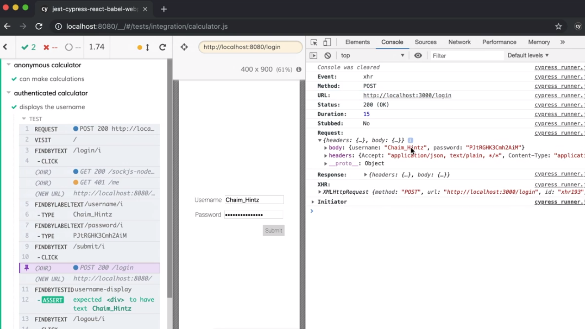
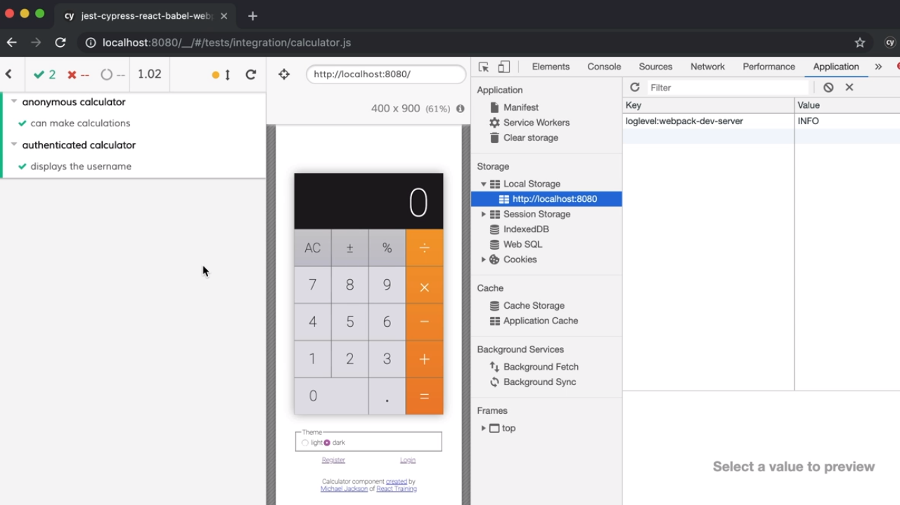

<p align="left">
  <a href="06_15.md">◀ Back: Run Test as an Authenticated User.</a>
</p>

---
# Use `cy` Request To Authenticate.

En el test que hemos descrito en el [punto anterior](./06_15.md) donde tratamos de comprobar que cuando un usuario accede a su cuenta de usuario se estará mostrando su nombre de usuario dentro de la aplicación y además, que cuando se hace logout este nombre no se muestra estamos volviendo a caer en el problema de tener que volver a repertir el código con otros de los test end-to-end que podamos tener recogidos en la aplicación y que van a permitir hacer login en la aplicación:

```js
describe('authenticated calculator', () => {
  it('displays the username', () => {
    cy.createUser()
      .then(user => {
        // now our test can start...
        cy.visit('/')
          .findByText(/login/i)
          .click()
          .findByLabelText(/username/i)
          .type(user.username)
          .findByLabelText(/password/i)
          .type(user.password)
          .findByText(/submit/i)
          .click()
          .findByText(/logout/i)
          .click()

          // Now let's verify things are set after login.
          .findByTestId('username-display')
          .should('have.text', user.username)
          .findByText(/logout/i)
          .click()
          .findByTestId('username-display')
          .should('not.exist')
      })
  })
})
```

Por lo tanto es una buena idea el tener este código en un único sitio y reutilizarlo cuando así lo necesitemos para lo cual vamos a volver a hacer uso del método `request` que nos ofrece el objeto `cy` con el fin de crear una petición al servidor que simule la que se está llevando a cabo cuando pulsamos sobre el botón *submit* en el formulario.

Para saber exáctamente qué es lo que ha de llevar esta petición tenemos que volver a ejecutar el test anterior dentro de Cypress y dirigirnos al evento *click* que se encargará de enviar el formulario de login. Al pulsar sobre el mismo iremos a la consola de JavaScript para obtener la información de la url y los parámetros que acompañarán a la petición.

<div style='text-align: center'>
  
</div>
<br />

Con esta información ya que podemos ir al código de nuestro test y crear la petición para realizarl acceso gracias a la invocación del método `request` del objeto `cy`. Este método va a recibir como parámetro un objeto donde cada uno de sus atributos van a ser los parámetros que sirven para configurar la petición que queremos hacer por lo que escribiremos:

```js
describe('authenticated calculator', () => {
  it('displays the username', () => {
    cy.createUser()
      .then(user => {
        cy.request({
          url: 'http://localhost:3000/login',
          method: 'POST',
          body: user
        })
```

Y no solamente esto sino que la aplicación con la que estamos trabajando lo que está haciendo es responder a la petición de login (siempre y cuando finalice correctamente) con un token de usuario que se guarda dentro del Local Storage del navegador del usuario. Por lo tanto, esto mismo lo tenemos que hacer como parte de la simulación de la petición de acceso que estamos llevando a cabo pero ¿cómo?

La respuesta una vez más tiene que ver con el hecho de que los métodos que nos proporciona el objeto `cy` siempre son asíncronos y por lo tanto responden con una promesa de JavaScript. En nuestro caso nos interesa acceder a la respuesta con la invocación del método `then` el cual recibe como parámetro una función que a su vez recibirá como parámetro la respuesta del servidor a la petición del login siendo parte de la misma (porque así lo establece la aplicación) un objeto que representará a un usuario el cual posee el atributo `token` donde se recogerá el token que se le ha asignado al usuario. Por lo tanto completamos la invocación del método tal y como sigue:

```js
describe('authenticated calculator', () => {
  it('displays the username', () => {
    cy.createUser()
      .then(user => {
        cy.request({
            url: 'http://localhost:3000/login',
            method: 'POST',
            body: user
            })
          .then(response => {
            window.localStorage.setItem('token', response.body.user.token)
          })
```

---
**Nota:** como se puede ver en el ejemplo anterior en nuestros test end-to-end tenemos acceso a todo los objetos y funcionalidades que nos proporciona el motor de JavaScript de un navegador web, como es el caso del objeto `localStorage` del objeto `window`.

---

Hecho esto ya podemos eliminar el código que no necesitamos de nuestro test lo que va a provocar que este sea mucho más mantenibles y además que se ejecute de forma mucho más rápida:

```js
describe('authenticated calculator', () => {
  it('displays the username', () => {
    cy.createUser()
      .then(user => {
        cy.request({
            url: 'http://localhost:3000/login',
            method: 'POST',
            body: user
            })
          .then(response => {
            window.localStorage.setItem('token', response.body.user.token)
          })
        // now our test can start...
        cy.visit('/')
          .findByTestId('username-display')
          .should('have.text', user.username)
          .findByText(/logout/i)
          .click()
          .findByTestId('username-display')
          .should('not.exist')
      })
  })
})
```

Si guardamos estos cambio y volvemos a ejecutar nuestros test dentro de Cypress podemos corroborar lo que acabamos de decir y es que los test se ejecutan más rápido y con el mismo resultado que anteriormente.

<div style='text-align: center'>
  
</div>
<br />

---

<p align="right">
  <a href="06_02.md">Next: Use a Custom Cypress Command to Login as a User ▶</a>
</p>
