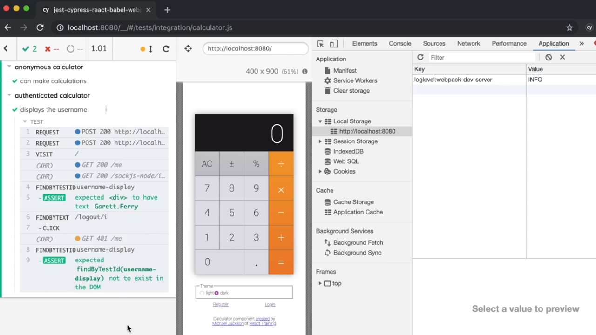

<p align="left">
  <a href="06_16.md">◀ Back: Use `cy` Request To Authenticate.</a>
</p>

---
# Use a Custom Cypress Command to Login as a User.

Si nos paramos a pensar unos instantes en los tipos de test end-to-end que tenemos que llevar a cabo en nuestra aplicación, el proceso de login de un usuario en una cuenta es uno de los aspectos que más se van a tener que repetir por lo que parece una buena idea el crear un comando personalizado dentro de Cypress que se encargue de llevar a cabo esta operación.

Recordemos cuál es el código del último test que hemos descrito en el [punto anterior](./06_16.md) para ver de dónde partimos:

```js
describe('authenticated calculator', () => {
  it('displays the username', () => {
    cy.createUser()
      .then(user => {
        cy.request({
            url: 'http://localhost:3000/login',
            method: 'POST',
            body: user
            })
          .then(response => {
            window.localStorage.setItem('token', response.body.user.token)
          })
        // now our test can start...
        cy.visit('/')
          .findByTestId('username-display')
          .should('have.text', user.username)
          .findByText(/logout/i)
          .click()
          .findByTestId('username-display')
          .should('not.exist')
      })
  })
})
```

Si ahora nos vamos al archivo `commands.js` dentro del directorio `cypress/support` donde ya hemos definido una serie de comandos personalizados para la aplicación. Nuestro objetivo ahora es añadir uno nuevo (recordemos que esto se hace invoncando al método `add` del objeto asignado al atributo `Commands` del objeto `Cypress`) de la siguiente manera:

```js
Cypress.Commands.add('login', () => {})
```

El primero de los parámetros viene a decirnos cómo queremos se llame al comando dentro de Cypress y el segundo será la función que se va a ejecutar, que en nuestro caso serán todos los pasos que son necesarios para lograr realizar el proceso de login en el sistema. Es más, si nos fijamos en el código de nuestro test podemos observar que para que este proceso finalice correctamente la función ha de recibir como parámetro el objeto que representa al usuario que realizará la petición por lo que escribiremos lo siguiente:

```js
Cypress.Commands.add('login', user => {
  cy.request({
      url: 'http://localhost:3000/login',
      method: 'POST',
      body: user
    })
    .then(response => {
      window.localStorage.setItem('token', response.body.user.token)
    })
})
```

Y ahora ya podemos hacer uso de este nuevo comando en nuestro test tal y como sigue donde vemos que el código del mismo es mucho más limpio y por lo tanto mucho más mantenible.

```js
describe('authenticated calculator', () => {
  it('displays the username', () => {
    cy.createUser()
      .then(user => {
        cy.login(user)
        // now our test can start...
        cy.visit('/')
          .findByTestId('username-display')
          .should('have.text', user.username)
          .findByText(/logout/i)
          .click()
          .findByTestId('username-display')
          .should('not.exist')
      })
  })
})
```

De hecho si volvemos a ejecutar nuestros test podremos comprobar que todos pasarán y que funcionan como esperábamos que así fuese.

<div style='text-align: center'>
  
</div>
<br />

El código completo que nos podemos encontrar dentro del archivo `commands.js` del directorio `cypress/support` y que va a contener todos los comandos personalizados con los que estaremos trabajando es el siguiente:


```js
import { buildUser } from '../support/generate'

Cypress.Commands.add('createUser', overrides => {
  const user = buildUser(overrides)
  cy.request({
    url: 'http://localhost:3000/register',
    method: 'POST',
    body: user
  }).then(response => ({ ...responde.body.user, ...user }))
})

Cypress.Commands.add('login', user => {
  cy.request({
      url: 'http://localhost:3000/login',
      method: 'POST',
      body: user
    })
    .then(response => {
      window.localStorage.setItem('token', response.body.user.token)
    })
})

Cypress.Commands.add('assertHome', () => {
   cy.url()
    .should('eq', `${ Cypress.config().baseUrl }/`)
})

Cypress.Commands.add('assertLoggedInAs', user => {
  cy.window()
    .its('localStorage.token')
    .should('be.a', 'string')
    .findByTestId('username-display')
    .should('have.text', user.username)
})
```

---

<p align="right">
  <a href="06_19.md">Next: Combine Custom Cypress Commands into a Single Cutom Command ▶</a>
</p>
