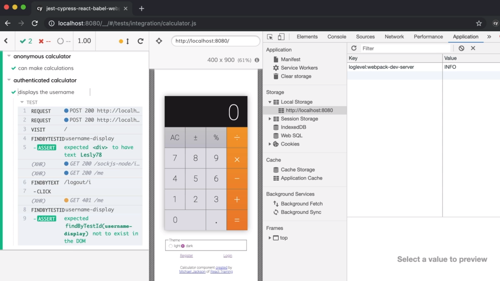

<p align="left">
  <a href="06_17.md">◀ Back: Use a Custom Cypress Command to Login as a User.</a>
</p>

---
# Combine Custom Cypress Commands into a Single Cutom Command.

Vamos a fijarnos en la última versión del código del test con el que estamos trabajando donde estamos comprobando que cuando un usuario hace login en su cuenta se está mostrando su nombre de usuario y cuando hace logout de la misma dicho nombre no aparece.

```js
describe('authenticated calculator', () => {
  it('displays the username', () => {
    cy.createUser()
      .then(user => {
        cy.login(user)
        // now our test can start...
        cy.visit('/')
          .findByTestId('username-display')
          .should('have.text', user.username)
          .findByText(/logout/i)
          .click()
          .findByTestId('username-display')
          .should('not.exist')
      })
  })
})
```

Si nos paramos a pensar en el código que estamos mostrando podemos entender que el proceso de creación de un usuario para posteriormente hacer login en su cuenta son dos pasos que se van a repetir en muchos de los test end-to-end de nuestra aplicación. Es más, hemos definido dos comandos propios en Cypress que se encargarán de realizar, por una parte el proceso de creación de un usuario, y por otra el proceso de login por lo que estaría muy bien para nuestros propósitos que ambos comandos pudiesen ser combinados de alguna manera y así lograr el que ambos se ejecuten como un único comando.

Para lograr nuestro propósito nos vamos a tener que ir al fichero `commands` dentro del directorio `cypress/support` de nuestro proyecto con la intención de crear un nuevo comando al que vamos a denominar `loginAsNewUser`. 

```js
Cypress.Commands.add('loginAsNewUser', () => {})
```

Como primera aproximación a la implementación del mismo lo que vamos a hacer es coger el código de nuestro test que se encarga de invocar en primer lugar al comando `createUser` para posteriormente llamar al comando `login` y copiarlo dentro del cuerpo de la función que se está recibiendo como el segundo de los parámetros.

```js
Cypress.Commands.add('loginAsNewUser', () => {
   cy.createUser()
      .then(user => {
        cy.login(user)
      })
})
```

Con esto ahora deberíamos irnos al fichero que contiene el código de nuestro test y sustituir la llamada a ambos comandos por la llama al comando que acabamo de crear lo que nos deja con lo siguiente:

```js
describe('authenticated calculator', () => {
  it('displays the username', () => {
    cy.loginAsNewUser()
    // now our test can start...
    cy.visit('/')
      .findByTestId('username-display')
      .should('have.text', user.username)
      .findByText(/logout/i)
      .click()
      .findByTestId('username-display')
      .should('not.exist')
  })
})
```

¿Cuál es el problema en el código anterior? Pues que vamos a necesitar el objeto `user` con el que se ha realizado el proceso de login ya que si no no vamos a poder realizar las aserciones que necesitamos porque no conoce cuál es. Para solucionarlo nuevamente tenemos que recordar que cada uno de los métodos del objeto `cy` que nos proporciona Cypress se ejecutan de forma asíncrona por lo que vamos a hacer una llamada a la función `then` asociada a la promesa de JavaScript que será retornada como consecuencia de la invocación de nuestro comando personalizado pasándole como parámetro una función que ha de recibir como parámetro el objeto `user` para garantizar que nuestro código se ejecutará sin problemas.

```js
describe('authenticated calculator', () => {
  it('displays the username', () => {
    cy.loginAsNewUser()
      .then(user => {
        // now our test can start...
        cy.visit('/')
          .findByTestId('username-display')
          .should('have.text', user.username)
          .findByText(/logout/i)
          .click()
          .findByTestId('username-display')
          .should('not.exist')
    })
  })
})
```

Pero ¿cómo hacemos ahora para retornar la información del usuario dentro de nuestros comandos? Pues aquí es donde tenemos que pensar en cuál es el último de los comandos personalizados que estamos combinando dentro del comando `loginAsNewUser` ya que es el responsable de retornar el objeto `user` que recibirá como parámetro la función que se establece como `then` en la promesa.

El comando personalizado del que estamos hablando es `login` (primero se crea el usuario y a continuación se hace login en su cuenta) por lo que tendremos que hacer que en el método `then` que está asociado a la promesa que se está ejecutando como consecuencia de la ejecución del mismo se retorne el objeto que representará al usario. Partimos de lo siguiente:

```js
Cypress.Commands.add('login', user => {
  cy.request({
      url: 'http://localhost:3000/login',
      method: 'POST',
      body: user
    })
    .then(response => {
      window.localStorage.setItem('token', response.body.user.token)
    })
})
```

Lo que vamos a tener que hacer es que la función asociada al `then` de la promesa que se ejecuta como consecuencia de la invocación del método `request` del objeto `cy` se retorne dicho objeto `user`, información que se obtendrá de realizar la mezcla de los atributos que representarán al usuario que responde a la petición del login junto con los del objeto que representa al usuario que se está recibiendo como parámetro. Esto nos deja el siguiente código:

```js
Cypress.Commands.add('login', user => {
  cy.request({
      url: 'http://localhost:3000/login',
      method: 'POST',
      body: user
    })
    .then(response => {
      window.localStorage.setItem('token', response.body.user.token)
      return { ...response.body.user, ...user }
    })
})
```

Si ahora volvemos a guardar el código de nuestros test y los ejecutamos dentro de Cypress nos vamos a encontrar con que todo sigue funcionando correctamente tal y como esperábamos pero el código de nuestros test se verá enormemente simplificado.

<div style='text-align: center'>
  
</div>
<br />

El código completo del fichero `commands.js` en el directorio `cypress/support` tras realizar las modificaciones que hemos descrito en este punto será el siguiente:

```js
import { buildUser } from '../support/generate'

Cypress.Commands.add('createUser', overrides => {
  const user = buildUser(overrides)
  cy.request({
    url: 'http://localhost:3000/register',
    method: 'POST',
    body: user
  }).then(response => ({ ...responde.body.user, ...user }))
})

Cypress.Commands.add('login', user => {
  cy.request({
      url: 'http://localhost:3000/login',
      method: 'POST',
      body: user
    })
    .then(response => {
      window.localStorage.setItem('token', response.body.user.token)
      return { ...response.body.user, ...user }
    })
})

Cypress.Commands.add('loginAsNewUser', () => {
   cy.createUser()
      .then(user => {
        cy.login(user)
      })
})

Cypress.Commands.add('assertHome', () => {
   cy.url()
    .should('eq', `${ Cypress.config().baseUrl }/`)
})

Cypress.Commands.add('assertLoggedInAs', user => {
  cy.window()
    .its('localStorage.token')
    .should('be.a', 'string')
    .findByTestId('username-display')
    .should('have.text', user.username)
})
```


---

<p align="right">
  <a href="06_18.md">Next: Install React Dev Tools with Cypress ▶</a>
</p>
