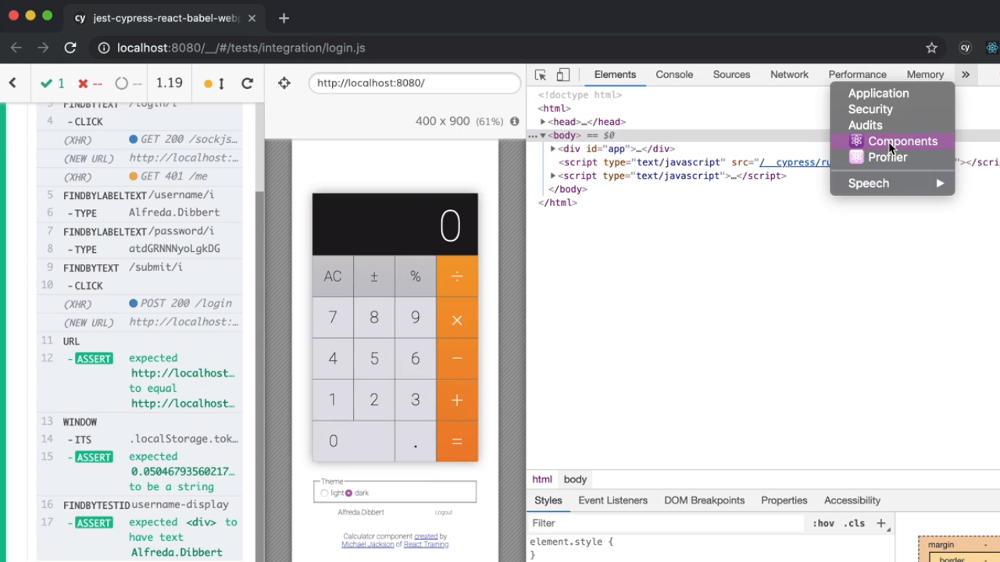
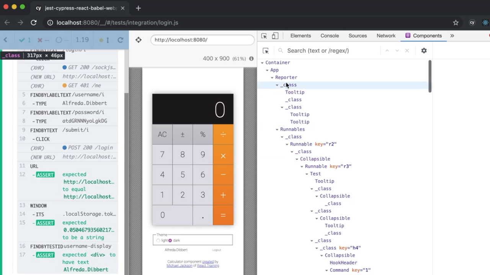
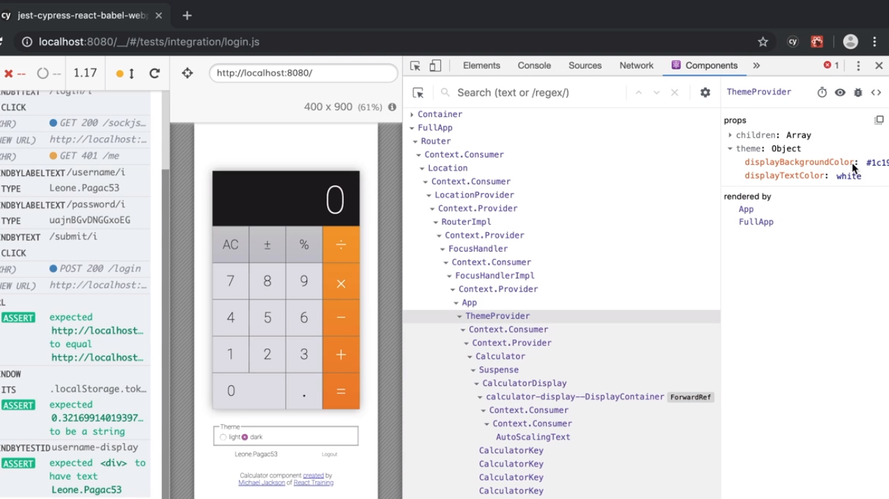

<p align='left'>
  <a href='06_18.md'>◀ Back: Combine Custom Cypress Commands into a Single Cutom Command.</a>
</p>

---
# Install React Dev Tools with Cypress.

Vamos a centrarnos ahora en un aspecto que tiene sentido en el caso de que la aplicación que estamos testeando sea una aplicación desarrollada en React ya que sería interesante el pode tener a nuestra disposición las **React Developer Tools** para poder trabajar dentro del navegador de Cypress pero ¿cómo las instalamos?

React Developer Tools es una extensión de nuestro navegador que nos va a ayudar durante el proceso de desarrollo de nuestras aplicaciones en React y, aunque ya las tuviésemos instaladas previamente en el navegador, cuando Cypress nos abre una nueva instancia del mismo podemos comprobar como no tenemos acceso a la misma.

De hecho si recargamos la aplicación con la que estamos trabajando dentro de Cypress volviendo a ejecutar los test en el navegador podremos ver que dentro de las herramientas para desarrolladores tenemos la posibilidad de acceder a la pestaña *Components* ya que las React Developer Tools detectan que estamos frente a una aplicación de React.

<div style='text-align: center'>
  
</div>
<br />

Una vez accedemos a esta pestaña se nos van a mostrar la información de todos los componentes con los que estamos trabajando. ¿Cuál es el problema ahora? Pues que la propia aplicación de Cypress está construida en React y el árbol de componentes que React Developer Tools nos está mostrando es el de esta aplicación y no el árbol de componentes de la aplicación que estamos probando.

<div style='text-align: center'>
  
</div>
<br />

¿Qué podemos hacer para que nuestra aplicación aparezca en las React Developer Tools? La respuesta es que la vamos a tener que registrar dentro de ella. Para lograrlo nos vamos a tener que dirigir al fichero que actúa como ráiz de nuestro proyecto, pero no el fichero JavaScript sino el fichero html que se carga en el momento en el que se realiza la petición de nuestra aplicación. En nuestro caso, este fichero se llama `index.html` y está situado en el directorio `public` de nuestro proyecto.

```html
<!DOCTYPE html>
<html lang='en'>
<head>
  <meta charset='UTF-8'>
  <meta http-equiv='X-UA-Compatible' content='IE=edge'>
  <meta name='viewport' content='width=device-width, initial-scale=1.0'>
</head>
<body>
  <div id='wrapper'>
    <div id='app'></div>
  </div>
  <script type='text/javascript' src='bundle.js'></script>
</body>
</html>
```

Lo que vamos a hacer es crear un nuevo script en la cabecera de este documento que será lo que va a permitir que nuestra aplicación se registre dentro de React Developer Tools. De hecho es necesario hacerlo aquí ya que el código que vamos a escribir ha de ser ejecutado previa a la carga de la aplicación de React.

¿Qué vamos hacer dentro de este script? Pues vamos a preguntarnos si se está ejecutando Cypress (cosa que sabermos simplemente por la existencia o no del objeto `Cypress` como un atributo del objeto `window`, objeto que sabemos que Cypress nos proporcionará de forma global al ejecutarlo para la realización de los test) y en el caso de que así sea tenemos que establecer algunos atributos más en el objeto `window` como sigue:

```html
<script>
  if (window.Cypress) {
    window.__REACT_DEVTOOLS_GLOBAL_HOOK__ = window.parent.__REACT_DEVTOOLS_GLOBAL_HOOK__
  }
</script>
```

Y simplemente con esta asignación lo que logramos es enganchar nuestra aplicación a las React Developer Tools para Cypress. Esto se traduce en que si ahora recargamos los test end-to-end en Cypress y volvemos a acceder a esta herramienta ya vamos a poder ver los componentes que forman parte de nuestra aplicación.

<div style='text-align: center'>
  
</div>
<br />

¿Y qué vamos a poder hacer ahora? Pues acceder a cualquiera de los componentes que forman parte de nuestra aplicación de React, ver con quién están enlazados (la jerarquía), quién los renderiza, etc. siendo uno de los aspectos más interesantes el hecho de que nos va a permitir cambiar el valor de las props que recibe directamente en la herramienta y ver el resultado de forma automática. Por ejemplo, podríamos cambiar el valor de la prop `displayTextColor` asociada al componente `ThemeProvider` y pasarlo a `blue` de forma sencilla:

<div style='text-align: center'>
  
</div>
<br />

De cualquer manera el código del script anterior está aclopando de alguna manera la existencia de Cypress en el html y esto no es una buena idea. ¿Qué podemos hacer para resolverlo? Pues si recordamos el código del script ha de ser ejecutado antes de que la aplicación de React es cargada así que vamos a tratar de reflejarlo en el código de nuestra aplicación. 

Dentro del directorio `src` de nuestro proyecto vamos a crear un nuevo archivo al que denominaremos como `react-devtools-hooks.js` y dentro del mismo copiamos el código del script que acabamos de describir:

```js
if (window.Cypress) {
  window.__REACT_DEVTOOLS_GLOBAL_HOOK__ = window.parent.__REACT_DEVTOOLS_GLOBAL_HOOK__
}
```

Y ahora lo que vamos a asegurar con una sentencia `import` al inicio del código de nuestra aplicación es que el contenido de este script se ejecuta antes de cualquier otra parte de nuestro código. Por lo tanto nos vamos al fichero `index.js` situado en el directorio `src` de la aplicación (fichero que contiene el código de entrada a la aplicación) y situamos la importación como la primera de las instrucciones del mismo.

```js
import './react-devtools-hook'
import './global.css'
import React from 'react'
import ReactDOM from 'react-dom'
import { Router } from '@reach/router'
import axios from 'axios'
import LoginForm from './fogin-form'
import App from './app'
```

Y de esta manera lograremos dejar el código recogido en el fichero `index.html` del directorio `public` del proyecto sin que hacer referencia en ningún momento al objeto `Cypress`.

---

<p align='right'>
  <a href='../00_00.md'>Finish. Go to Index</a>
</p>
