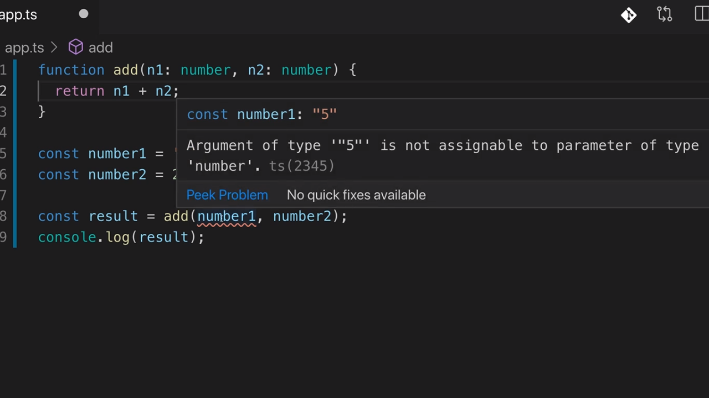

<p align="left">
 <a href="02_01.md">◀ Back: Module Introduction.</a>
</p>

---

# Using Types.

Una de las ventajas de la adopción de TypeScript en nuestros proyectos es que va a dotar a JavaScript de una serie de tipos que este último no tiene. Ahora bien, esto no quiere decir que, como veremos más adelante, JavaScript no posee por si mismo tipos de datos sino que lo hará TypeScript será enriquecerlos y no solamente eso, sino que además nos va a permitir que nosotros seamos capaces a su vez de escribir nuestros propios tipos de datos.

## JavaScrip Types

En primer lugar vamos a comenzar viendo cuáles son los tipos de datos que ya nos proporciona JavaScript teniendo claro además que TypeScript va a soportarlos todos haciendo especial hincapié en entender la diferencia que existe entre decir que JavaScript conoce (*knowing*) al tipo de datos y TypeScript usa (*using*) dicho tipo de datos.

### number

Tanto en JavaScript como en TypeScript existe un único tipo de datos que sirve para representar a los números dentro de nuestras aplicaciónes: el tipo de datos *number* (en otras palabras, al contrario de lo que ocurre en otros lenguajes de programación como por ejemplo Java, no habrá un tipo de datos especial para representar a los números enteros, número con decimales, etc.). Así desde el punto de vista tanto de TypeScript como de JavaScript los siguientes valores tienen el tipo de datos *number*:

```js
1
5.3
-10
```

### string

Tanto en JavaScript como en TypeScript el tipo de datos **string** que viene a represetar texto y sus valores pueden ser expresados de tres formas diferentes en función del caracter que utilicemos para delimitar sus valores:

```js
'Hi'
"Hi"
`Hi`
```

En el primer caso estaremos definiendo un string utilizando las comillas simples, en el segundo las comillas dobles y en el tercero el caracter que se conoce como *back ticks*. Esta última definición se puede utilizar en las versiones más modernas del lenguaje y nos va a permitir construir lo que se conoce como **template literals** que nos son más string que se construyen como cualquier otro pero con la patircularidad de que alguna parte de los mismos se va a poder definir de forma dinámica inyectando información dentro.

### boolean

El último tipo de datos que es común para JavaScript y Types son los **boolean** los cuales únicamente adminten un valor de entre dos posibilidades:

```js
true
false
```

Este tipo de datos es muy importante en el desarrollo de JavaScript ya que asociados a ellos están los conceptos de **truthy** o **falsy** que lo que vienen a hacer es que es que cualquier valor de otro tipo (un número, un string, etc.) va a tener asociado a un valor `true` o `false`. Así el número cero se considerará *falsy* y por lo tanto se puede usar en cualquier lugar dentro de nuestro código fuente que espere recibir un boolean porque siempre será evaluado como `false`.

Sin embargo es importante entender que los conceptos de truthy y falsy es algo propio del lenguaje JavaScript y que nada tiene que ver con los tipos de datos que están disponibles en el lenguaje ya que se trata de una concidición que se evalúa en tiempo de ejecución (runtime) y por lo tanto TypeScript no hará uso de ellos.

## Using Core Types.

Una vez que hemos expuesto los tipos de datos que se consideran el core de JavaScript vamos a centrarnos ahora en ver cómo los utiliza TypeScript y qué es lo que podemos hacer con ellos. En el proyecto de ejemplo con el que vamos a trabajar creamos un nuevo fichero al que vamos a llamar `app.ts` y dentro de mismo escribimos el código de una función que lo único que hará será sumar el valor de los parámetros y retornarlo:

```ts
function add(n1, n2) {
  return n1 + n2
}
```

El código de la función `add` que acabamos de definir simplemente utiliza el valor del operador `+` de JavaScript para sumar los dos parámetros que recibe y no tiene para nada ninguna referencia a los tipos de datos con los que está trabajando. Siguiendo con nuestro código vamos a suponer ahora que definimos variables que contienen dos valores numéricos (su tipo de datos será **number**):

```ts
const number1 = 5
const number2 = 2.8
```

Evidetemente vamos a poder invocar a nuestra función `add` pasándole como parámetros estas dos variables, guardar el resultado en una nueva variable y mostrarla por la cosola:

```ts
const result = add(number1, number2)
console.log(result)
```

Si ahora compilamos nuestro fichero con TypeScript y lo ejecutamos utilizando NodeJS el resultado que obtendremos por la consola será:

```bash
$ tsc app.ts
$ node app.js
  7.8
```

Hasta aquí no hay nada que nos pueda resultar extraño y el comportamiento de la función `add` que hemos creado es el que estaríamos esperando (realizar la suma de dos números). Pero ¿qué ocurriría en el caso de que nos hayamos equivocado a la hora de escribir nuestro código asignándole a la constante `number1` en vez de un valor numérico un string?

```ts
const number1 = '5'
const number2 = 2.8
```

¿Qué salida provocará ahora la ejecución de nuestro programa tras ser compilado? La respuesta la podemos ver a continuación:

```bash
$ tsc app.ts
$ node app.js
  52.8
```

Evidentemente este no es el resultado de realizar la suma de 5 más 2.8 como esperamos que así sea al interpretar el operador `+` como el encargado de realizar la suma aritmética de dos números. Sin embargo este operador también puede ser utilizado para realizar la concatenación de string y en la última invocación lo que ocurre es que el tipo de datos que tiene asignado la variable `number1` es un string por lo que en vez de realizar la suma aritmética lo que hace es pasar a interpretar el segundo de los operandos (en este caso la variable `number2`) también como un string resultado en el string final 52.8.

Por ello pese a que como desarrolladores nos gustaría que la función `add` sirviese para realizar la suma matemática de números nos estamos encontrando ante un escenario en el que somos nosotros mismos los que debido a un error en nuestro código estamos consiguiendo un comportamiento completamente diferente de la funcionalidad.

Y es este uno de los aspectos en los que TypeScript viene para ayudarnos ya que nos va a permitir definir asignaciones de tipos de datos a los parámetros de nuestra función impidiendo que el compilador convierta el código a JavaScript en el caso de que los tipos de datos que con los que se está invocando no sean los correctos. La pregunta que nos viene ahora a la mente es ¿cómo se le asigna un tipo de datos a un parámetro de una función? Pues simplemente utilizando los dos puntos `:` tras declarar el parámetro seguidos del tipo de datos que se espera recibir. Aplicándolo a nuestro ejemplo escribiríamos algo como lo siguiente:


```ts
function add(n1: number, n2: number) {
  return n1 + n2
}
```

La forma en la que podemos entender lo anterior es pensar en que estamos indicando que la función `add` que estamos declarando únicamente funcionará si se le pasan dos parámetros ambos teniendo un valor que ha de ser del tipo number. Así, si nuestro código contiene un error a la hora de invocarlo relacionado con que el tipo de datos no es el correcto VSCode nos podrá informar de ello ya que TypeScript está incorporado dentro del mismo:

<div style='text-align: center'>
  
</div>
<br />

Pero en el caso de que estemos utilizando otro editor o no exista una extensión para TypeScript con el que estemos acostumbrados a trabajar, si desde la terminal de comandos del sistema tratamos de lanzar la ejecución del compilador veremos que esta finaliza con un error:

```bash
$ tsc app.ts
  app.ts:8:20 - error TS2345: Argument of type 'string' is not assignable 
  to parameter of type 'number'.

  8 const result = add(number1, number2)
                       ~~~~~~~

  Found 1 error.
```

Por lo tanto TypeScript únicamente nos va a ayudar durante el proceso de compilación de nuestras aplicaciones ya que en ningún momento cambiará la manera en la que el código JavaScript que en última instancia acaba generando va a funcionar en el entorno de ejecución para el que ha sido desarrollado (navegador o servidor).

> Esto significa que el sistema de comprobación de los tipos de datos que proporiciona TypeScript únicamente va a tener sentido durante el proceso de compilación de nuestras aplicaciones y por lo tanto que únicamente tiene utilidad durante el proceso de desarrollo.

No obstante el que se lleve a cabo esta comprobación de tipos dentro de nuestro código añade una nivel adicional de comprobación lo que garantizará que el número de errores que se pueden producir se vea reducido.

Ahora bien, es extremadamente importante comprender que pese a que pueda haber errores en los tipos de datos que tenemos en nuestro código en TypeScript el compilador seguirá generando el código JavaScript equivalente por si existiera algún caso de uso en el que fuese necesario que se permitiese el error (no se nos ocurre alguno) ya que no tenemos que olvidar que JavaScript permite que su código sea ejecutado como se ha mostrado al inicio de este punto.

---

<p align="right">
 <a href="02_03.md">Next: TypeScript Types vs JavaScript Types ▶</a>
</p>
