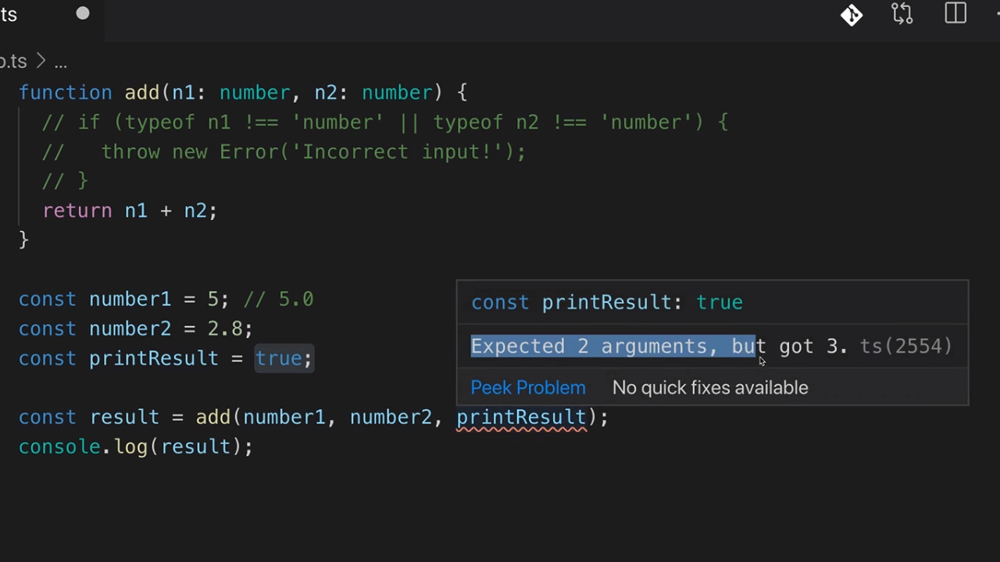

<p align="left">
 <a href="02_03.md">◀ Back: TypeScript Types vs JavaScript Types.</a>
</p>

---

# Working with Numbers, String & Booleans.

Vamos a profundizar un poco más en los tipos de datos básicos que forman el core de TypeScript y ver si existen o no diferencias con los tipos de datos básicos que nos ofrece JavaScript.

El primer de estos tipos de datos es *number* que al igual que en JavaScript no hay diferecian entre los números enteros y números decimales. De hecho al igual que sucede en JavaScript para TypeScript todos los números son float por defecto ¿qué quiere esto decir? Pues que desde el punto de vista de los dos lenguajes los siguientes dos números son iguales:

```ts
const number1 = 5       // 5.0
```

Junto con el tipo de datos number en TypeScript tenemos a nuestra disposición los tipos de datos básicos **string** (que hace referencia a un texto) y **bolean** (que hace referencia a un valor boolean). 

```ts
function add(n1: number, n2: number) {
  return n1 + n2
}

const number1 = 5
const number2 = 2.8
const printResult = true

const result = add(number1, number2, printResult)
console.log(result)
```

En el código anterior estamos utilizando una nueva variable `printResult` que es de tipo boolean y lo que queremos es pasársela a la función `add`. Si escribimos este código en un editor como VSCode este nos informará de que existe un error de compilación ya que estamos pasando un tercer parámetro o una función que únicamente espera recibir dos:

<div style='text-align: center'>
  
</div>
<br />

Si queremos que nuestro código compile tenemos que definir un tercer parámetro a la función `add` además de permitir que el tipo de datos sea boolean. Por lo tanto escribiremos lo siguiente:

```ts
function add(n1: number, n2: number, showResult: boolean) {
  if (showResult) {
    console.log(n1 + n2)
  } else {
    return n1 + n2
  }
}
```

Lo que hemos hecho ha sido modificar el comportamiento de nuestra función teniendo en cuenta el valor del parámetro `showResult` y así si es `true` lo que hace es escribir por la consola el resultado de realizar la suma de los dos primeros parámetros (sin retornar ningún valor, utilizando para ello el return implícito de JavaScript que viene a decir que todas las funciones han de retornar un valor y si no se escribe directaremente con una sentencia `return` JavaScript lo introducirá por nosotros haciendo que el valor retornado sea `undefined`) mientras que si es `false` lo que hará será retonar el resultado de la realización de dicha suma.

---
**Nota:** una función como la anterior no tendría mucho sentido en una aplicación que estuviese bien diseñada porque su comportamiento es más bien impredecible de antemano ya que unas veces escribirá un valor y otras retorna un número pero sí que nos interesa verla para poder seguir con nuestra explicación.

---

Si ahora modificamos nuestro código para que tenga en cuenta la nueva implementación de la función `add` escribiríamos algo como siguiente:

```ts
const number1 = 5
const number2 = 2.8
const printResult = true

add(number1, number2, printResult)
```

Si ahora compilamos el código y lo ejecutamos la salida que vamos a obtener por la consola será la siguiente:

```bash
$ tsc app.ts
$ node app.js
  7.8
```

¿Qué tendriamos que hacer para definir un cuarto parámetro que fuese de tipo string? Pues algo como lo siguiente:

```ts
function add(n1: number, n2: number, showResult: boolean, phrase: string) {
  if (showResult) {
    console.log(phrase + n1 + n2)
  } else {
    return n1 + n2
  }
}

const number1 = 5
const number2 = 2.8
const printResult = true
const resultPhrase = 'Result is: '

add(number1, number2, printResult, resultPhrase)
```

Y si ahora volvemos a compilar y a ejecutar nuestro código la salida que obtendremos por la consola será algo parecido a lo siguiente:

```bash
$ tsc app.ts
$ node app.js
  Result is: 52.8
```

Sin embargo tenemos que observar que hemos vuelto obtener como resultado de la concatenación de tres strings ya que al evaluar la expresión que contiene al operador `+` JavaScript sabe que el primero de los operandos es un string lo que provocará que tras ser sumado con el segundo (en este caso el número 5) se cree un nuevo string que al ser sumado con el tercer operando (ahora el número 2.8) finalice siendo el string que se muestra por la terminal del sistema.

Para poder solucionarlo lo que podemos hacer es definir una variable dentro de la función `add` que contenga el valor que se obtiene como resultado de la suma de los dos primeros parámetros (y por lo tanto tendremos al garantía de que será un number) y posteriormente utilizarlo dentro de las ramas de la sentencia `if-else`:

```ts
function add(n1: number, n2: number, showResult: boolean, phrase: string) {
  const result = n1 + n2
  if (showResult) {
    console.log(phrase + result)
  } else {
    return result
  }
}
```

Si volvemos a repetir los pasos de compilar y ejecutar el código el resultado que obtendremos será el siguiente:

```bash
$ tsc app.ts
$ node app.js
  Result is: 7.8
```

---

<p align="right">
 <a href="02_05.md">Next: Type Assignment & Type Interface ▶</a>
</p>
