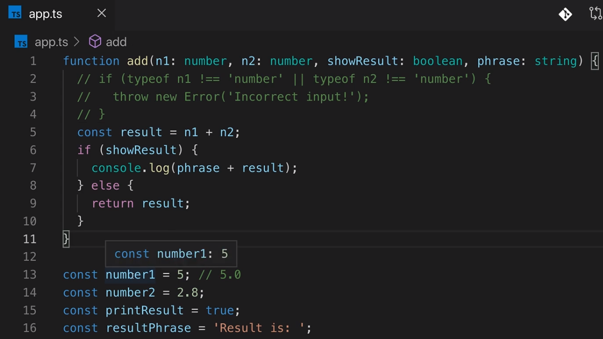
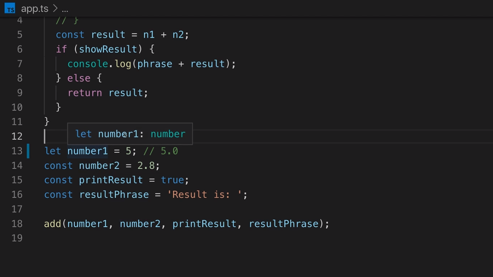
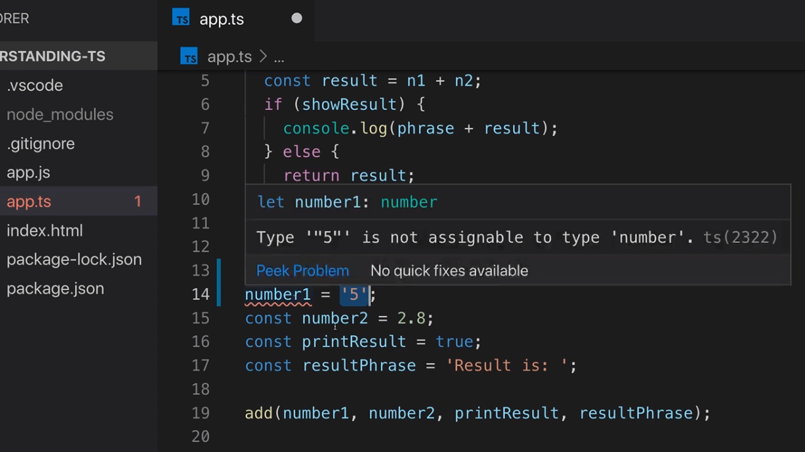

<p align="left">
 <a href="02_04.md">◀ Back: Working with Numbers, String & Booleans.</a>
</p>

---

# Type Assignment & Type Interface.

En el [punto anterior](./02_04.md) hemos visto que para poder utilizar los tipos básicos de TypeScript para poder ser asignados como los tipos que tendrán los parámetros de una función la notación que hemos de seguir es escribir el nombre del parámetro seguido de los dos puntos y el tipo de datos a asignar:

```ts
function add(n1: number, n2: number, showResult: boolean, phrase: string) {
```

---
**Nota:** es importante entender en todo momento que esta notación es propia de TypeScript y una vez que nuestro código es compilado para generar el código JavaScript equivalente desaperece toda la información asociada a la declaración de los tipos.

```js
function add(n1, n2, showResult, phrase) {
```

---

Ahora bien ¿por qué ante asignaciones como las siguientes el compilador de TypeScript no lanza un error cuando a la hora de definir las siguientes variables junto con sus valores no estamos definiendo los tipos que tienen asignado? ¿No estamos diciendo que en TypeScript todas las variables han de tener un tipo?

```ts
const number1 = 5
const number2 = 2.8
const printResult = true
const resultPhrase = 'Result is: '
```

La razón es que TypeScript posee una característica propia que se denomina **Type Inference** (inferencia de tipos) y lo que viene a hacer es que va a poder determinar el tipo de datos que ha de tener una variable siempre y cuando conozca el tipo de datos que queremos asignarle. Con esto lo que queremos decir es que, por ejemplo, en el caso e la declaración de la variable `number1` como el valor que le queremos asignar es el número 5 el compilador de TypeScript puede inferir que el tipo de datos que finalmente va a tener asignado va a ser number y así lo podemos comprobar en VSCode:

<div style='text-align: center'>
  
</div>
<br />

Es decir, que TypeScript nos está diciendo que el tipo que va a tener la variable `number1` va a ser number como consecuencia de que dicha variable ha sido inicializada con un número. Pero no queda ahí la cosa, porque si nos fijamos en el tool-tip que nos muestra VSCode tras los dos puntos `:` que sirven para identificar el tipo de datos no aparece la palabra number sino que aparece directamente el número 5. Esto es así porque `number1` está siendo declarado con como una constante gracias al uso de `const` por lo que TypeScript puede ser mucho más específico diciendo que el tipo de datos de la constante no es que vaya a ser un número (lo que englobaría a un montón de posibles valores) sino que de todos ellos el único que puede ser es el 5.

De hecho si cambiamos la declaración de la varibale `number1` para que utilice `let` en vez de `const` (lo cual no sería una buena decisión de diseño porque la variable no cambiará nunca en nuestro código fuente pero nos sirve para los propósitos de poder seguir con la explicación) aquí TypeScript no podrá ser tan sumamente específico porque sabe que una variable declarada de esta forma sí que pude cambiar, pero lo que si puede inferir es que como ha sido inicializada con un número (el valor 5) en este caso el tipo de datos que tendrá asignado va a ser number como nos muesta VSCode:

<div style='text-align: center'>
  
</div>
<br />

Gracias a la inferencia de tipos que nos ofrece TypeScripot nos vamos a ahorrar el tener que definir el tipo de datos que va a albergar una variable cuando la declaramos si en la propia declaración incluimos (con el operador de asignación, es decir, con el `=`) el valor que va a tener. Es decir, que las dos instrucciones siguientes sería equivalentes desde el punto de vista de la declaración del tipo de datos:

```ts
let number1 = 5
let number1: number = 5
```

---
**Nota:** se considera una mala práctica de programación el escribir el tipo de datos que tendrá asignado una variable cuando el compilador de TypeScript puede inferirlo.

---

Ahora bien, ¿no establecer el tipo de datos cuando estamos definiendo una variable es algo recomendable? La respuesta es que en la mayoría de los casos sí porque TypeScript lo va a inferir, pero ¿qué ocurre en el caso de que queramos declarar una variable pero sin asignarle un valor inicial? Es decir, ¿qué ocurre en una situación como la siguiente?

```ts
let number1
```

La respuesta es que TypeScript no puede decidir qué tipo de datos va a poder contener y por lo tanto le asigna el que puede contener a cualquier (el tipo de datos `any` que veremos con más detenimiento más adelante) lo que se traduce en que, en lo que respecta al tipo de información que puede contener, la variable `number1` va a poder contener cualquier cosa lo que le va a permitir que en un determinado momento tenga un número pero posteriormente podrá cambiar y tener un string, por poner un ejemplo.

Por lo tanto cuando estemos definiendo una variable como en el caso anterior, donde TypeScript no pueda inferir el tipo de datos que va a contener, se recomienda siempre que seamos nosotros los desarrolladores los que explícitamente especifiquemos cuál es el tipo de datos que va a tener asignado. Así, si queremos que `number1` solamente pueda contener números escribiríamos algo como:

```ts
let number1: number
```

Por lo tanto, los dos ejemplos siguientes muestran situaciones en las que desde el punto de vista de TypeScript los valores que se le asignan a las variables son correctos:

```ts
let number1
number1 = '5'

let number2: number
number2 = 5
```

En este caso el string 5 puede ser asignado a la variable `number1` porque TypeScript no puede inferir el tipo que va a tener y por lo tanto le asignará el mayor posible (`any`) mientras que en el segundo caso estamos diciendo explícitamente que la variable `number2` es del tipo number y por lo tanto le podemos asignar sin problemas el número 5.

¿Qué sucede ante una declaración como la siguiente en la que estaremos definiendo que la variable `number3` será de tipo number pero posteriormente le asignamos un string? Pues que simplemente el compilador nos dará un error:

```ts
let number3: number
number3 = '5'
```

De hecho si escribimos este código en VSCode podemos ver cómo nos informa de este error para que lo podamos corregir:

<div style='text-align: center'>
  
</div>
<br />

> El trabajo principal que esperamos que realice TypeScript por nosotros es que chequeo los tipos de datos de nuestra aplicación y que nos informe siempre que detecte que se produce un error en las asignaciones de los mismos.

---

<p align="right">
 <a href="02_06.md">Next: Object Types ▶</a>
</p>
