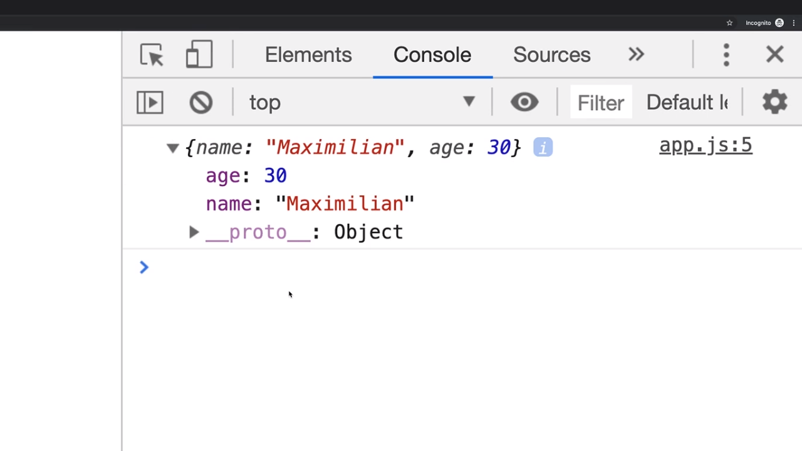
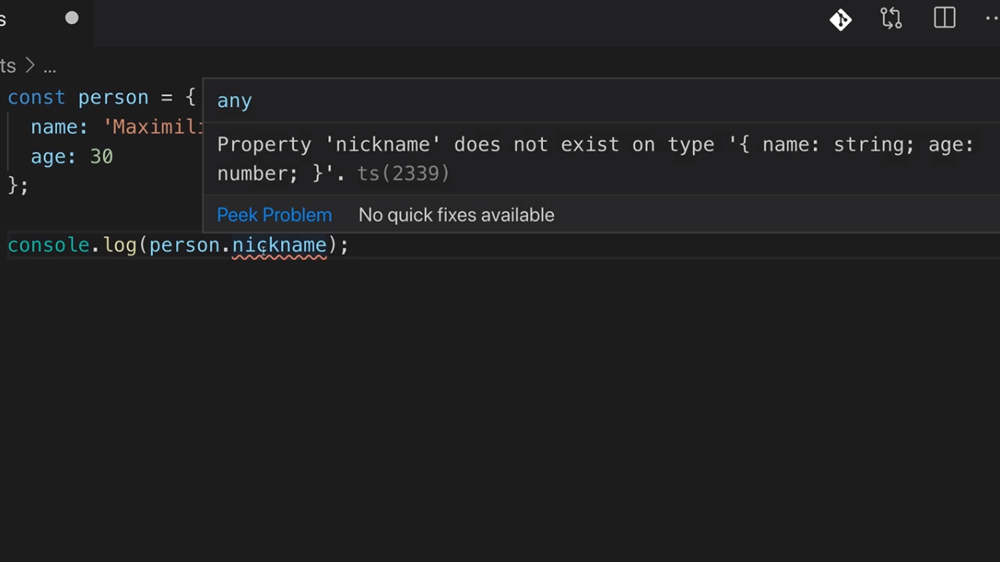
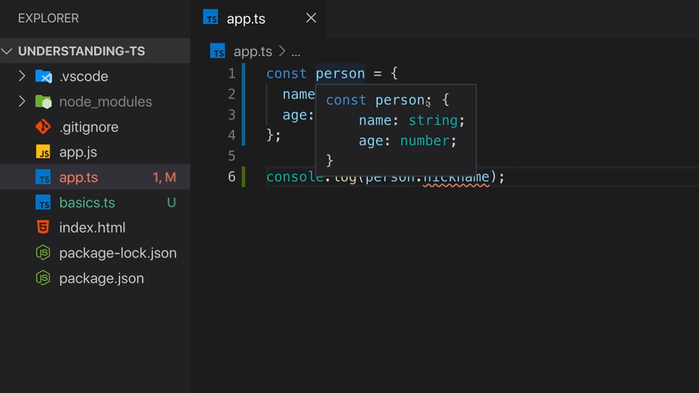
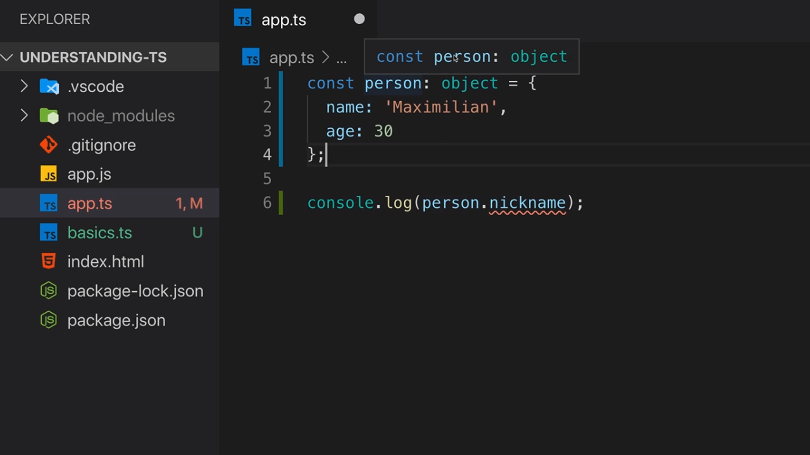
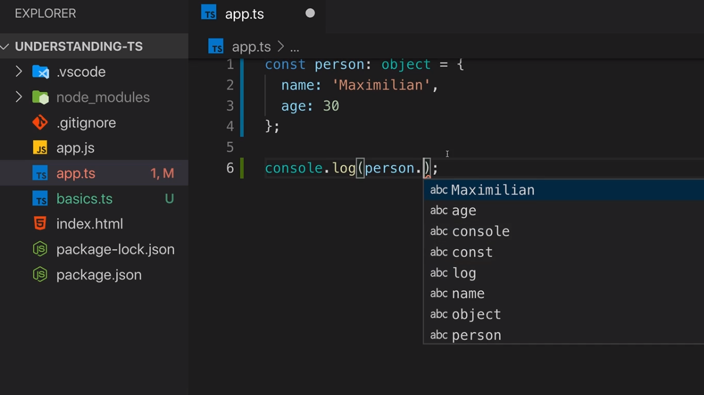
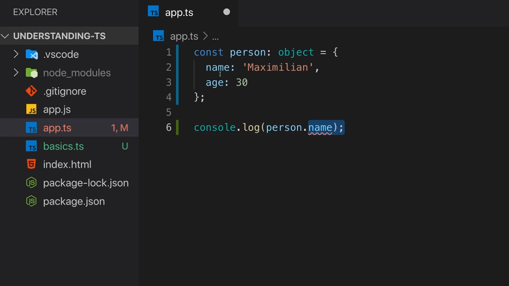
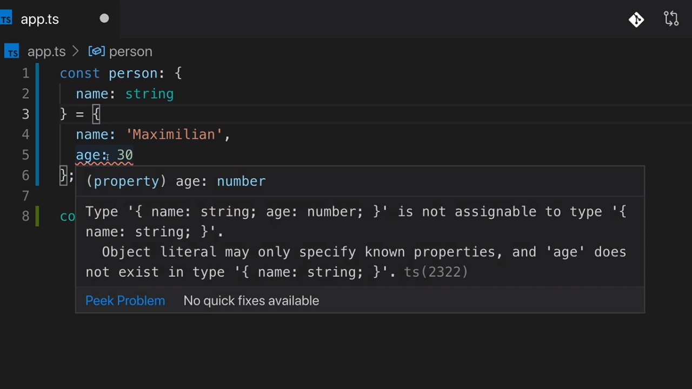
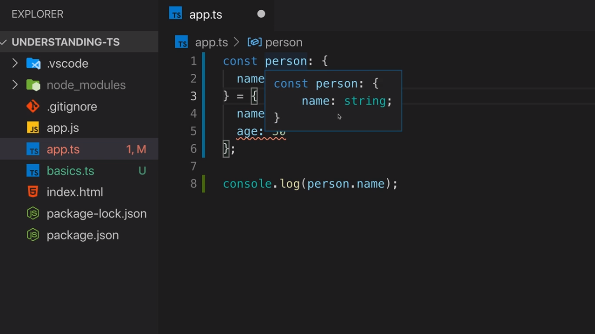
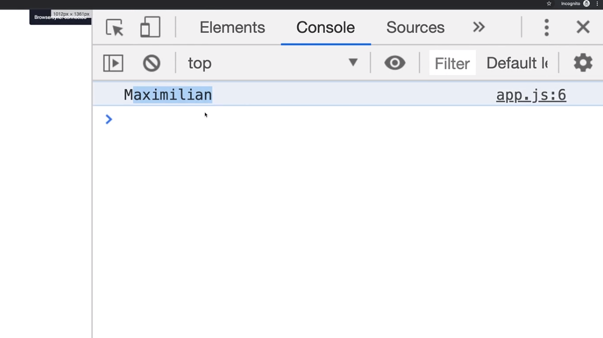

<p align="left">
 <a href="02_05.md">◀ Back: Type Assignment & Type Interface.</a>
</p>

---

# Object Types.

Vamos ahora a centrarno en el siguiente tipo de datos que forma parte del core de TypeScript y que viene a unirse a number, string y boolean. Estamos hablando del tipo de datos object.

Como ya sabemos un objeto en JavaScript es un literal que entre llaves recoge una serie de pares clave-valor donde las claves se conocen como las propiedades del objeto (ya sean estas atributos o métodos) y el valor pues realmente eso, el valor que tendrán asociado. Así, el siguiente código es una declaración válida de un objeto en JavaScript:

```js
{ age: 30 }
```

Mientras que en JavaScript todos los objetos son del tipo de datos object en TypeScript vamos a tener muchas más posibilidades para definirlos y más concretamente vamos a tener más posibilidades de ser mucho más específicos en su definición pudiendo concretar las propiedades que posee y el tipo de datos que tendrán asociados cada una de estas propiedades. Con esto lo que queremos decir es que en TypeScript pasaremos de la posibilidad de decir que una variable tiene asociado un objeto a decir que una variable tiene asociado un objeto que tiene una serie de propiedades concretos que además han de ser un tipo de datos determinado.

Para ver cómo funciona esta idea vamos a comenzar definiendo una variable en JavaScript a la que le vamos a asignar un objeto que queremos que represente a una persona en una aplicación de ejemplo:

```ts
const person = {
  name: 'Maximilian',
  age: 30
}

console.log(person)
```

Si compilamos el código anterior y lo ejecutamos en un navegador podremos que efectivamente la variable `person` contiene un objeto que está formado por estas dos propiedades:

<div style='text-align: center'>
  
</div>
<br />

Otra de las posibilidades que nos ofrece JavaScript a la hora de trabajar con los objetos es que podemos intentar acceder a una propiedad que no tiene por qué estar recogida en el objeto. Por ejemplo, nada nos impide en JavaScript hacer algo como lo siguiente:

```ts
console.log(person.nickname)
```

Sin embargo si estamos escribiendo nuestro código dentro de un fichero con la extesión `.ts` dentro de VSCode podemos observar como de forma inmediata el editor nos informa de la existencia de un error de compilación en el código:

<div style='text-align: center'>
  
</div>
<br />

donde en el tool-tip se nos estará indicando que la propiedad `nickname` no está definida dentro del objeto que está asociado a la variable `person`. Con esto lo que estamos viendo es que TypeScript puede inferir las propiedades y los tipos de datos que tendrán asignados por nosotros de la misma forma en lo que lo hacía con los tipos de datos básicos.

<div style='text-align: center'>
  
</div>
<br />

¿Por qué sabemos que está infiriendo un tipo? Pues porque la declaración de un tipo de datos para un objeto se realiza de forma análoga a como se hace para un tipo de datos básico, es decir, que tras escribir el nombre de la variable pondremos los dos puntos `:` y a continuación el tipo de datos del que se trata, pero en este caso en vez de escribir un tipo de datos básicos nos encontramos con unas llaves que indicarán que el tipo de datos va a ser un objeto.

Pero tampoco se queda ahí el compilador ya que no se trata de que el valor que se le asignará a `person` va a ser cualquier objeto que podamos crear sino que ha de ser uno que poseerá dos propiedades, una denomada `name` (cuyo tipo será un string porque inicialmente tiene asignado un string) y otra denominado `age` (cuyo tipo será number porque inicialmente tiene asignado un número).

Es inevitable pensar que el definir el tipo de datos junto con la declaración de la variable puede llevar a la confusión cuando estamos trabajando con TypeScript pero hay aspectos que nos tienen que hacer sospechar de que es un tipo de datos y no un valor. Lo primero en lo que tenemos que pensar es que para separar cada una de las propiedades estamos usando como caracter de separación `;` (aunque se podría utilizar la coma `,` o nada) lo que nos viene a indicar que no será un objeto de JavaScript ya que en este lenguaje las propiedades que los objetos se separan con comas.

Es por ello que el objeto que nos muestra VSCode en el tool-tip no va a ser un objeto de JavaScript sino lo que se conoce como un **Object Type** que en nuestro ejemplo ha sido inferido por TypeScript. Es más, por la forma que se nos está mostrando, los Object Type son muy similares a los objetos de JavaScript salvo que en el caso de esto últimos los que se asocia los pares clave-valor mientras que en los Object Types lo que se relaciona son pares calve-tipo.

> Un **Object Type** será utizado para describir el tipo de objeto que será utilizado dentro de nuestra aplicación en algún lugar de la misma.

TypeScript nos permite ser mucho más genéricos si necesitamos que una variable pueda ser asignada a más de un objeto y es gracias a la utilización del tipo object. En concreto podemos hacer algo como lo siguiente:

```ts
const person: object = {
  name: 'Maximilian',
  age: 30
}
```

En este caso la palabra reservada `object` reperesenta a uno de los tipos de datos del core de TypeScript que en este caso sirve para indicar que se trata de un objeto (de forma análoga a como `number` representa a los números, `string` representa a los textos o `boolean` representa a los valores booleanos). Si lo hacemos así en VSCode si nos situamos encima de la variable no se nos mostrarán las propiedades del objeto (y sus tipos de datos) sino que simplemente se nos indicará que se trata de un objeto:

<div style='text-align: center'>
  
</div>
<br />

Sin embargo, como podemos ver en la imagen anterior, el compilador de TypeScript nos seguirá informando de un error en el caso de que queramos acceder a un atributo que no posea el objeto que tiene asignado la variable `person` pese a que le hemos dicho que esta variable utiliza un tipo de datos genérico como lo es object.

Entonces ¿qué ventajas nos puede aportar utilizar el tipo de datos inferido por TypeScript sobrel generíco object? Una de ellas es que si TypeScript puede saber qué propiedades forman parte de nuestro objeto las herramientas de autocompletado de los editores nos podrán ayudar durante nuestro proceso de desarrollo. Con un tipo de datos object nos vamos a encontrar con que el editor no va a poder ayudarnos demasiado:

<div style='text-align: center'>
  
</div>
<br />

Pero no queda ahí la cosa ya que pese a que estemos al cien por cien seguros de que el objeto posee una determina propiedad como hemos establecido que el tipo de datos es object el compilador de TypeScript nos seguirá informando de un error:

<div style='text-align: center'>
  
</div>
<br />

Así pues como norma general no deberíamos utilizar el tipo de datos object a la hora de definir nuestros objetos porque TypeScript no a poder inferir las propiedades que posee lo que acabará provocando errores. La forma de ser más específico es utilizando un Object Type para definir el tipo de datos que está asociado a un objeto.

Simplemente recordar que para definir un Object Type tenemos o bien dejar que sea TypeScript quien pueda inferirlo en el código o bien describirlo con el nombre de la variable seguido de los dos punto `:` y las llaves de apertura y cierre entre las que se recogerán los atributos y los tipos de datos que formarán parte del objeto.

---
**Nota:** simplemente por recalcar, cuando TypeScript se encuentra con una instrucción como la siguiente:

```ts
const person: {} = { name: 'Maximilian', age: 30 }
```

las llaves `{}` que aparecen tras los dos punto `:` no van a provocar en ningún momento que JavaScript vaya a crear un objeto porque se trata de información asociada a la declaración de los tipos de datos y por lo tanto es información que va a desaparecer en el momento en el código es compilado de TypeScript a JavaScript.


---
**Nota:** las dos asignaciones siguientes desde el punto de vista de los tipos de datos con los que se está trabajando son exactamente las mismas

```ts
const person: object = { name: 'Maximilian', age: 30 }
const person: {} = { name: 'Maximilian', age: 30 }
```

---

Cuando estamos utilizando las llaves para establecer que el tipo de datos que tendrá asignado una variable será un objeto como propiedades contenidas dentro de dichas llaves vamos a poder recoger los pares clave-tipo de datos para describir las propiedes de los objetos que van a poder ser asignados. Así, siguiendo con nuestro ejemplo si lo que queremos es indicar que el tipo de datos objeto que representa a los objetos que podrán ser asignados a la variable `person` van a tener que tener una propiedad `name` y que esta ha de ser del tipo de datos string escribiríamos algo como lo siguiente:

```ts
const person: {
  name: string
} = {
  name: 'Maximilian',
  age: 30
}
```

Sin embargo si dejamos la declaración anterior para nuestro tipo de datos como está el compilador de TypeScript nos informará de un error porque a la variable `person` se le está asignando un objeto que no cumple con el tipo de datos que está establecido debido a que este objeto tiene una propiedad `age` y esta no aparece en el Object Type asociado:

<div style='text-align: center'>
  
</div>
<br />

De hecho si situamos el cursor sobre la variable `person` dentro de VSCode veremos que en el tool-tip que nos muestra la información del Object Type que tiene asignado y que este únicamente posee el atributo `name` y además este atributo ha de ser de tipo string:

<div style='text-align: center'>
  
</div>
<br />

Para solucionar el problema y que nuestro Object Type siga la estructura del objeto que asigna tendremos que definir dentro del mismo una nueva propiedad que se llame igual que la propiedad que no está recogiendo y el valor un tipo de datos que se amolde al valor que tiene asociado (recordemos que separándolo de con un `;` para así poder distinguir de forma fácil un objeto de JavaScript de un Object Type). Así pues escribiremos:

```ts
const person: {
  name: string;
  age: 30
} = {
  name: 'Maximilian',
  age: 30
}
```

Pero si dejamos la definición anterior el Object Type únicamente permitiría trabajar con objetos de JavaScript de JavaScript que lo cumplan y por lo tanto que tengan el valor del atributo `age` con el valor 30. Esto se traduce en que si más adelante nos encontramos con una asignación como la siguiente se produciría un un error:

```ts
const person: {
  name: string;
  age: 30
} = {
  name: 'Maximilian',
  age: 31
}
```

por haber sido demasiado específicos a la hora de definir los valores posibles para el atributo `age`. La solución pasa por utilizar un tipo de datos menos restrictivo y en este caso cabe pensar que la propiedad `age` sea de tipo number por lo que escribiríamos algo como lo siguiente:

```ts
const person: {
  name: string;
  age: number
} = {
  name: 'Maximilian',
  age: 31
}
```

Con esto al final lo que hemos hecho ha sido asignar el tipo de datos a la varibale `person` que TypeScript ha podido inferir por nosotros pero en este caso de forma explícita. La razón por la que lo mostramos es para entender cómo funcionan los Object Types pero como norma general se deberá dejar a TypeScript que sea el compilador el que infiera los tipos de datos que estarán asociados a los objetos.

Si ahora modificamos nuestro código para que además imprima el valor del atributo `name` dejándolo de la siguiente manera:

```ts
const person: {
  name: string;
  age: number
} = {
  name: 'Maximilian',
  age: 31
}

console.log(person.name)
```

Lo compilamos y lo ejecutamos veremos que efectivamente se está mostrando el valor atributo `name` tal y como esperaríamos:

<div style='text-align: center'>
  
</div>
<br />

Pero si vamos al código JavaScript que ha sido generado por TypeScript podemos ver como la asignación del tipo de datos ha sido eliminada del código:

```js
var person = {
  name: 'Maximilian',
  age: 31
}
console.log(person.name)
```

lo cual es algo que teníamos que esperar porque, una vez más, tenemos que tener siempre presente que toda la información que tiene que ver con los tipos de datos que son utilizados por la aplicación pertenecen al ámbito de TypeScript (ámbito de desarrollo de nuestra aplicación) y desaperecerá en el momento en el que la estemos ejecutando (ámbito de ejecución).

---

<p align="right">
 <a href="02_07.md">Next: Arrays Types ▶</a>
</p>
