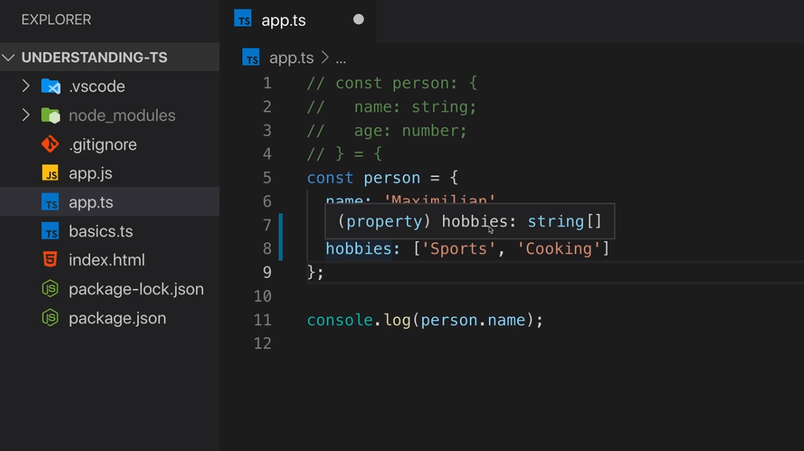
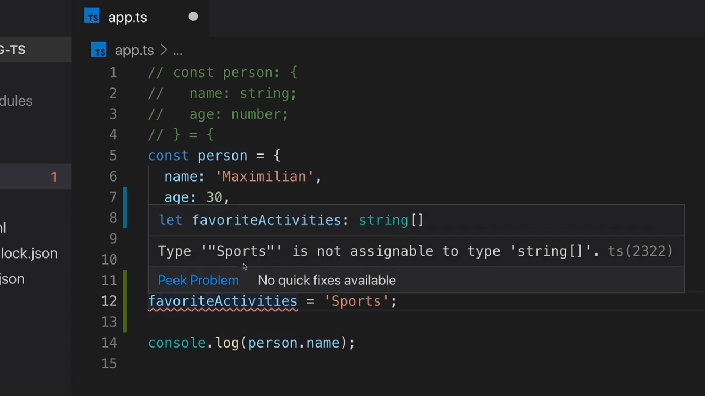
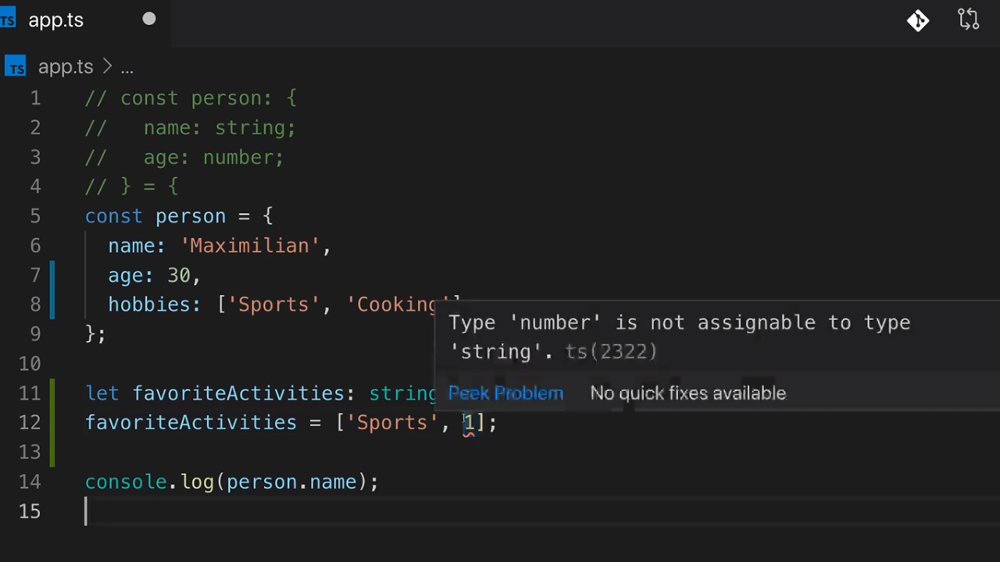
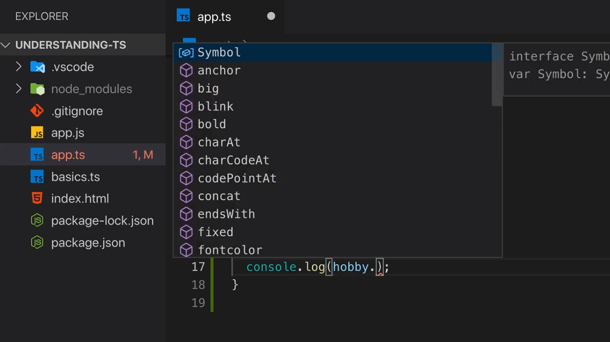
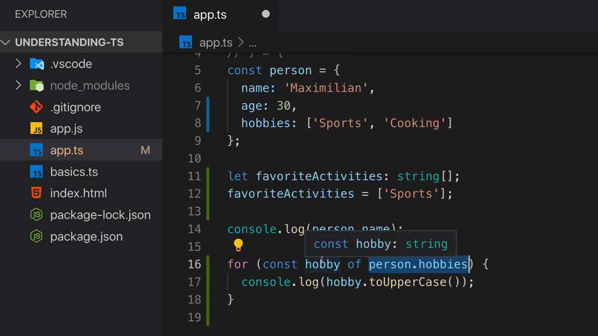
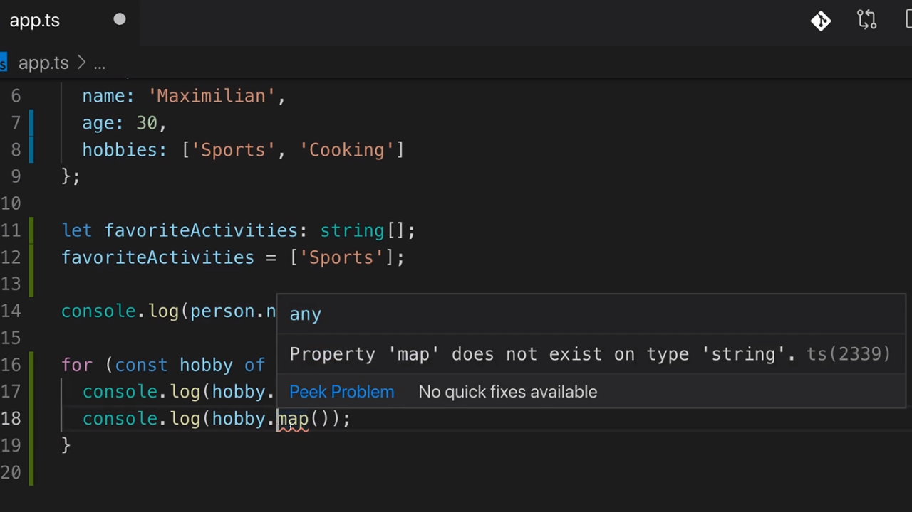

<p align="left">
 <a href="02_06.md">◀ Back: Object Types.</a>
</p>

---

# Arrays Types.

Otro de los tipos de datos que tenemos en JavaScript es **Array** los cuales se crean simplemente escribiendo algo como lo siguiente:

```js
[1, 2, 3]
```

Lo que tenemos que entender es que cuando definimos un array en JavaScript cada uno de los elementos que lo forman pueden ser de cualquiera de los otros tipos de datos que nos proporciona el lenguaje (es decir, podemos tenemos arrays con number, string, boolean, objects e incluso otros array) sin estar obligados a que todos los elementos del mismo tengan que ser del mismo tipo.

En TypeScript también disponemos de los arrays pero en este caso el tipo de datos que tendrá asociado puede o bien ser flexible como sucede con JavaScript (es decir, que admitirá cualquier tipo de datos) o más rígidos (en el sentido de que definimos el tipo de datos para los elementos que puede contener sin permitir ningún otro). 

```ts
const person = {
  name: 'Maximilian',
  age: 30, 
  hobbies: ['Sports', 'Cooking']
}
```

En el código anterior estamos definiendo un objeto que nos sirve para definir a una persona dentro de nuestra aplicación el cual posee un nombre (`name`), una edad (`age`) y un array en el que nuestra intención es recoger la lista de hobbies (`hobbies`) que tiene la persona que en el ejemplo anterior serán los deportes (`Sports`) y cocinar (`Cooking`) los cuáles están representados por dos string. En VSCode si situamos el cursor sobre el atributo `hobbies` podemos ver que TypeScript infiere que el tipo de datos que tendrá asociado el atributo será un array de string:

<div style='text-align: center'>
  
</div>
<br />

Lo primero en lo que tenemos que fijarnos es en la sintaxis que se ha de seguir para declarar que una variable o atributo de un objeto es de un determinado tipo de datos que es la misma que para la declaración de un tipo de datos normal pero finalizándolo con los corchetes de apertura o cierre:

```ts
const numberArray: number[] = [1, 2, 3]
```

---
**Nota:** recordemos que en un ejemplo como el anterior no se recomienda escribir de forma explícita el tipo de datos de la variable `numberArray` ya que está declarada como una constante y el compilador de TypeScript es capaz de inferirlo correctamente.

---

Ya hemos visto anteriormente que en todas aquellas situaciones en las que el compilador de TypeScript no es capaz de inferir el tipo de datos que tendrá una variable (por ejemplo, porque la declaramos utilizando `let`) estaremos en el escenario ideal para declarar cuál es.

```ts
let favoriteActivities: string[]
```

Con la declaración anterior lo que estamos diciendo es que la variable `favoriteActivities` lo que va a guardar es un array de string. Con esto si ahora intentamos asignar un string a esta variable TypeScript nos informará de un error porque el tipo de datos string no puede ser asignado al tipo de datos array de string.

<div style='text-align: center'>
  
</div>
<br />

El error que nos muestra el compilador de TypeScript no aparecerá si lo que estamos asignando es realmente un array de string:

```ts
let favoriteActivities: string[]
favoriteActivities = ['Sports']
```

Pero no tenemos que quedarnos aquí ya que TypeScript nos reportará tambíén un error en el caso de que el array que queramos asignar a la variable no esté formado únicamente por string ya que así está declarado el tipo de datos para la variable:

<div style='text-align: center'>
  
</div>
<br />

Si quisiésemos que nuestro array pueda recoger dentro del mismo tanto string como number una solución pasaría por establecer que el tipo de datos que admite para sus elementos sea cualquiera lo que en TypeScript se representa con el tipo de datos `any`. Así si definimos lo siguiente no habrá ningún error:

```ts
let favoriteActivities: any[]
favoriteActivities = ['Sports', 1]
```

---
**Nota:** más adelante estudiaremos con detalle qué significa el tipo de datos `any` pero en este punto simplemente nos interesa saber que sirve para expresar cualquier tipo de datos. 

Ahora lo que si que nos interesará saber es que al declarar el tipo de datos de cualquira de las variables de nuestra aplicación como `any` en cierta medida estaríamos quitando todo el sistemas de validación de tipos de datos en tiempo de compilación lo que deja que nuestro código se comportase como si directamente estuviese escrito en JavaScript.

---

En JavaScript podemos iterar por todos los elementos que forman un array haciendo uso de un bucle `for`. En nuestro ejemplo podríamos hacer algo como lo siguiente:

```js
for (const hobby of person.hobbies) {
  console.log(hobby)
}
```

Si ahora compilamos nuestro código y lo ejecutamos en un navegador podemos ver como por la consola de se nos muestra un mensaje por cada uno de los elementos que forman parte de nuestro array:

```bash
$ tsc
$ node app.js
  Sports
  Cooking
```

Lo realmente interesante en este momento es que cuando estamos iterando por cada uno de los elementos del array TypeScript sabe que el tipo de datos de cada uno de los elementos que lo forman es un string y por lo tanto podemos invocar sobre el mismo cualquiera de los métodos que JavaScript pone a nuestra disposición para operar sobre ellos:

<div style='text-align: center'>
  
</div>
<br />

Vemos nuevamente la potencia que nos ofrece TypeScript a la hora de ser capaz de inferir los tipos de datos de la variable. Así dentro del bucle podemos estar seguros de que al ser cada uno de los elementos un string (porque se verifican los tipos) no va a existir nunca el problema de que el método que queremos invocar no esté presente en el objeto.

<div style='text-align: center'>
  
</div>
<br />

Por lo que tanto TypeScript nos ayuda a mejorar nuestra velocidad de desarrollo haciendo que nuestro código sea mucho más seguro además de que al utilizar un editor como VSCode nuestra velocidad de desarrollo se verá incrementada gracias a las herramientas de autocompletado que nos ofrece. 

Al igual que TypeScript sabe qué método vamos a poder llamar en cada una de las interacciones que hemos visto anteriormente también nos puede informar de un error como consecuencia de estar intentando llamar a un método (o atributo) que no existe:

```js
for (const hobby of person.hobbies) {
  console.log(hobby.toUpperCase())
  console.log(hobby.map())
}
```

Y esto queda recogido en VSCode mostrándonos un error porque sabe que no se puede invocar al método `map` (método que es propio de un array) en un string:

<div style='text-align: center'>
  
</div>
<br />

---

<p align="right">
 <a href="02_08.md">Next: Working with Tuples ▶</a>
</p>
