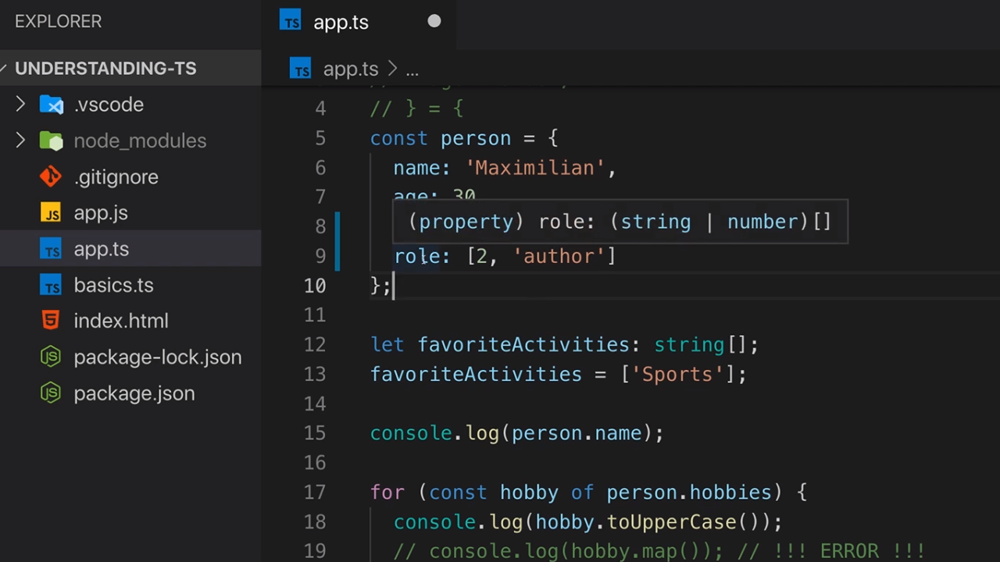
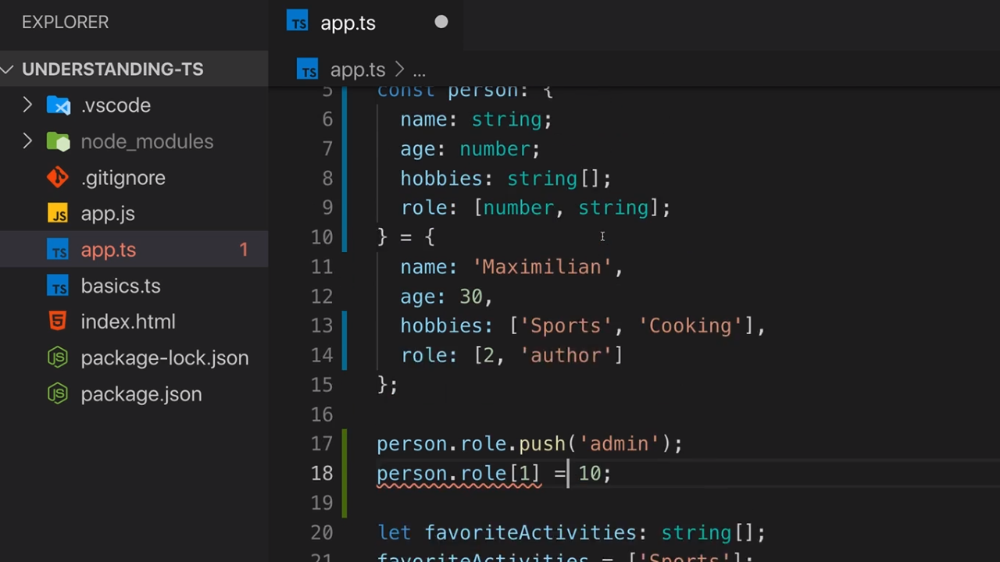

<p align="left">
 <a href="02_07.md">◀ Back: Array Types.</a>
</p>

---

# Working with Tuples.

En los puntos anteriores hemos visto todos los tipos de datos que están presentes en JavaScript y que por lo tanto también los tenemos a nuestra disposición en TypeScript:

  - number
  - string
  - boolean
  - object
  - array

TypeScript, por su parte, añade algún tipo de datos adicional que podemos utilizar en nuestras aplicaciones pero que no están disponibles en JavaScript y son estos tipos de datos los que vamos estudiar en este y los siguientes puntos.

En términos generales en TypeScript podemos entender que una tuple no es más que un array pero lo que lo define es que el número de elementos del mismo es fijo y ha de quedar definido a la hora de definir el tipo de datos.

Para entender mejor cómo lo podemos utilizar vamos a pensar que seguimos con la definición de un objeto que representa a una persona creando una nueva propiedad `role` a la cual le asignaremos un array en el que el primer elemento del mismo será un número (que supongamos que es el identificador de dicho role en el sistema) y el segundo un string (que es la descripción del role):

```ts
const person = {
  name: 'Maximilian',
  age: 30,
  hobbies: ['Sports', 'Cooking'],
  role: [2, 'author']
}
```

En nuestro diseño de la aplicación saber que la propiedad `role` siempre va a tener asignando un array pero no solamente eso sino que dicho array tiene que tener siempre dos elementos siendo el primero de ellos un número y el segundo un string. 

---
**Nota:** para simplificar las cosas hemos supuesto que una persona solamente puede tener un role dentro de nuestra aplicación pero en una real es posible que se pueda tener mucho más de uno.

---

En este punto si no hacemos nada más y dejamos que TypeScript gracias a la inferencia de tipos determine cuál es el tipo de datos que va a estar asociado a la propiedad `role` tendremos algo como lo siguiente:

<div style='text-align: center'>
  
</div>
<br />

Lo primero que tenemos que entender es lo que representa el tipo de datos que ha inferido ya que se trata de una notación que no hemos visto hasta ahora.

```ts
role: (string | number)[]
```

Con la notación anterior lo que se quiere decir es que la propiedad `role` puede o bien ser del tipo string o bien del tipo number (cosa que deducimos gracias al uso del operador `|`). Además estamos rodeando esta declaración con unos paréntesis (en otras palabras la estamos agrupando) para terminar escribiendo los corchetes de apertura y cierre `[]` para indicar que se trata de un array. Es decir, que lo que TypeScript está infieriendo es que la propiedad `role` tiene como tipo de datos un array que puede contener number o string.

---
**Nota:** el operador `|` se conoce como **Union Type** y más adelante lo exploraremos con detenimiento.

---

El problema aquí es que con el tipo de datos inferido por TypeScript nada nos impide que escribamos el siguiente código en el que llamamos al método `push` de nuestro array para añadir un nuevo elemento:

```ts
person.role.push('admin')
```

El código anterior se ejecutará sin problemas y añadirá un tercer elemento al array `role` lo que desde el punto de vista de cómo hemos especificado que ha de ser este atributo no debería producirse. Y no solamente esto sino que sería posible cambiar el valor de los elementos en las posiciones del array sin que se respete el tipo de datos que se supone que deberían tener:

```ts
person.role.push('admin')
person.role[1] = 10
```

¿Qué podemos hacer en estos casos? Ante situaciones como esta lo que vamos a tener que hacer es especificar de forma explícita a TypeScript que la propiedad `role` tiene que ser exactamente un array formado por dos elementos donde el primero ha de ser un number y el segundo un string, es decir, una tuple.

Vamos a comenzar recordando cómo se puede especificar el tipo de datos que está asociado a un objeto dentro de nuestro código:

```ts
const person: {
  name: string;
  age: number;
  hobbies: string[];
  role: [number, string];
} = {
  name: 'Maximilan',
  age: 30,
  hobbies: ['Sports', 'Cooking'],
  role: [2, 'author']
}
```

Con la declaración anterior lo que estamos recogiendo dentro del tipo de datos asociado al objeto son todos aquellos tipos de las propiedades que pueden ser inferidas por TypeScript excepto la declaración para la propiedad `role` donde estamos declarando una tuple formada por dos elementos (el número de elementos del array) y donde estamos indicando que el primer elemento ha de ser un número y el segundo un string.

Lo que es importante que entendamos es que una tuple de TypeScript solamente va a tener sentido en tiempo de compilación ya que en cuando este proceso finaliza generando el código JavaScript todas las tuplas que tengamos en la aplicación será interpretadas como arrays. 

¿Qué implicaciones tiene esto? Pues que dentro de nuestro código TypeScript no nos va a impedir llamar a los métodos de propios de un array (como por ejemplo `push`) lo que puede provocar que se dejen de cumplir las restricciones de la tupla (en el ejemplo anterior el array asociado a la propiedad `role` pasaría de tener 2 a tener 3 elementos) pero sí que es capaz de detectar los errores que tienen que ver con los tipos de los datos que están recogidos dentro de la tupla.

<div style='text-align: center'>
  
</div>
<br />

Estas restricciones se cumplen en el caso de que quisiésemos reasignar la propiedad a un nuevo array: la asignación ha de cumplir todas las comprobaciones de tipos recogidas en la definición de la tupla:

```ts
person.role = []                        // Error
person.role = [0, 'admin']              // Ok
person.role = [0, 'admin', 'user']      // Error
```

En el código anterior podemos ver cómo la comprobación del número de elementos que ha de contener la tupla es comprobada por TypeScript cuando se está realizando una asignación de forma directa en el código pero no, recordemos, que esta comprobación no se hará cuando se está llamando al método `push` asociado a la tupla.

Así, el tipo de datos tuple es ideal para su utilización en todos aquellos escenarios en los que sabemos que vamos que vamos a trabajar con un array de elementos en los que conocemos de inicio el número de elementos que lo formarán y el tipo de cada uno de ellos permitiéndonos ser mucho más restrictivos a la hora de definir los tipos de datos con los que se está trabajando. Para el resto de casos de uso en los que no se conoce el número de elementos la mejor opción siempre será utilizar el tipo de datos array.

---

<p align="right">
 <a href="02_09.md">Next: Working with Enums ▶</a>
</p>
