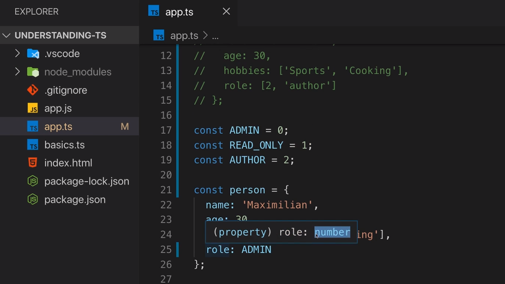
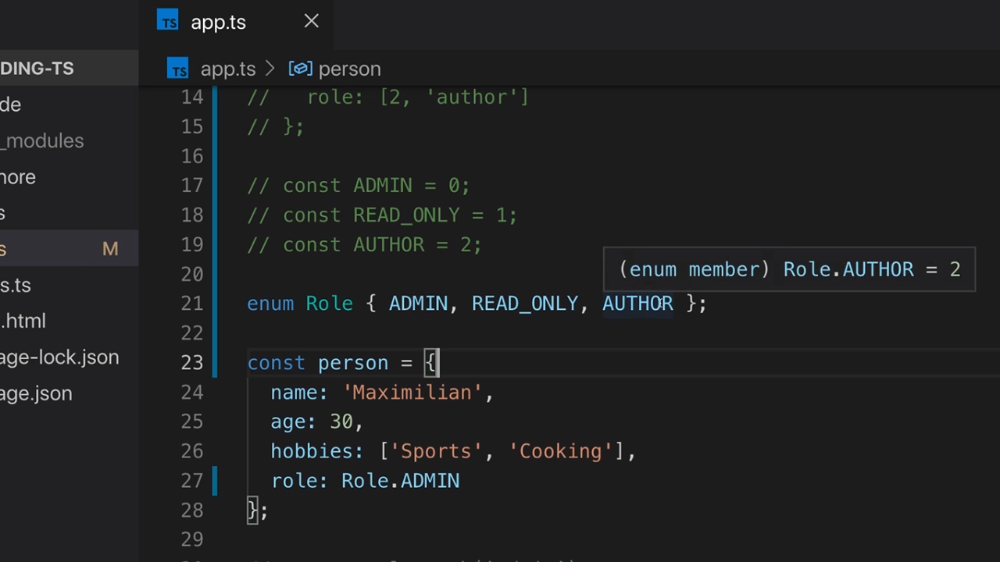
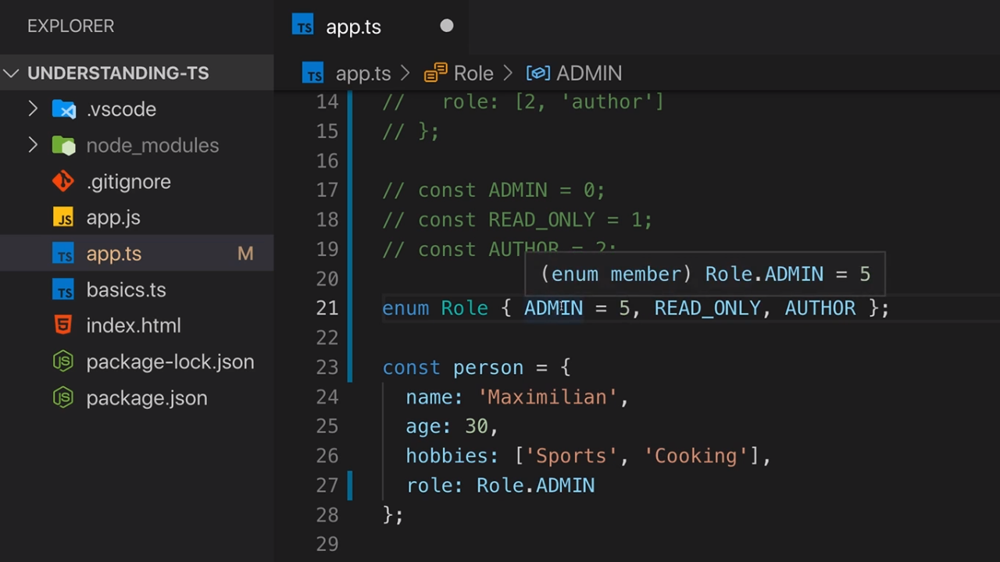
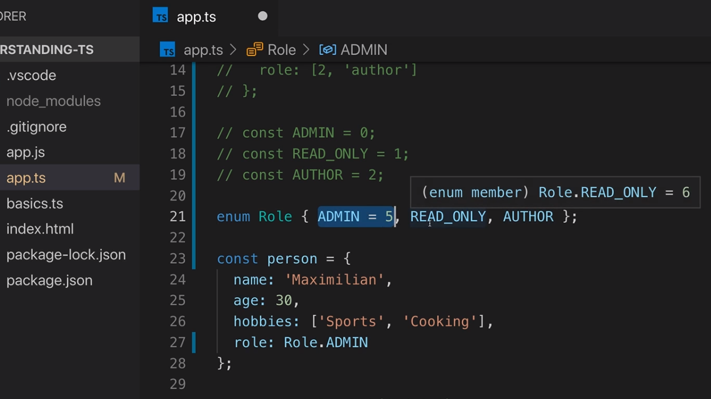

<p align="left">
 <a href="02_08.md">◀ Back: Working with Tuples.</a>
</p>

---

# Working with Enums.

En las aplicaciones en JavaScript con las que estamos acostumbrados a trabajar es bastante habitual encontrarnos con instrucciones en las que asignamos a un valor numérico a un identificador dentro de nuestro programa de tal manera que en vez de utilizar el número utilicemos el identificador lo que hará que nuestro código sea mucho más legible y mantenible (lo que siempre es una característica recomendable).

En TypeScript para facilitarnos esta asignación el lenguaje nos propone el tipo de datos **Enum** (tipo que no está presente en JavaScript). Para su creación tenemos que hacer uso de la palabra reservada `enum` (la cual solamente tiene sentido para TypeScript mientras que en JavaScript no existe como palabra reservada) seguido de las llaves de apertura y cierre, dentro de las cuales habrá una serie de strings separados por comas cada una de las cuales representará a un elemento del enum.

```ts
enum { NEW, OLD }
```

El compilador de TypeScript lo que hace es traducir cada uno de los elementos del enum en una lista de números que son accesibles de forma global en el módulo en el que son utilizados de tal manera que nosotros, como desarrolladores, no tengamos que preocuparnos por esos valores numéricos y simplemente tenemos que saber que las variables a las cuales asignemos ese tipo de datos solamente han de poder tomar como posibles valores cada uno de los elementos del enum.

Para ver un ejemplo de cómo utilizan los enum vamos supongamos que seguimos definiendo un objeto que representa a una persona similar al que hemos utilizado en el [capítulo anterior](./02_08.md) pero en este caso para representar el role que tiene asignado un usuario vamos a permitir que se elija un elemento de entre un conjunto de valores posibles. En una primera aproximación podríamos de alguna manera indicar que el valor 0 se corresponderá a un role de administrador, un valor 1 a un role de autor y un valor 2 un role de solo lectura:

```js
const person = {
  name: 'Maximilian',
  age: 30,
  hobbies: ['Sports', 'Cooking'],
  role: 2
}
```

Como desarrolladores otra posibilidad que tenemos es utilizar un string para representar cada uno de los posibles roles para un usuario en vez de un número dejando algo como lo siguiente:

```js
const person = {
  name: 'Maximilian',
  age: 30,
  hobbies: ['Sports', 'Cooking'],
  role: 'READ ONLY USER'
}
```

El problema en ambas aproxiomaciones es que en todas ellas tenemos que recodar la relación que existe entre la codificación que estamos usando y el role que realmente tiene el usuario añadiendo además, en el caso de los string, que el string que estemos utilizando en, por ejemplo, las comparaciones sea al mismo que hemos asignado a la hora de definir el role dentro del objeto. En otras palabras, es probable que caigamos en el siguiente error:

```ts
if (person.role === 'READ_ONLY_USER') {}
```

Vemos que el role del usuario que hemos asignado (el valor del string) y el string que se utiliza en la comparación pueden parecer el mismo pero se diferencian en que en el segundo caso estamos utilizando el caracter de subrayado para definir el role lo que hará que nunca se cumpla la condición establecida en el chequeo `if`. 

En estos casos de uso es habitual que en JavaScript definamos una serie de constantes que nos ayuden a establecer la realación entre las constantes y un valor. Hecho esto ya se puede asignar la constante al role del usario. Así tendríamos lo siguiente:

```js
const ADMIN = 0
const AUTHOR = 1
const READ_ONLY = 2

const person = {
  name: 'Maximilian',
  age: 30,
  hobbies: ['Sports', 'Cooking'],
  role: READ_ONLY
}
```

---
**Nota:** otra opción es asignar como valor de las contantes un string que sea único pero siempre que se pueda es preferible utilizar un números ya que el espacio que ocuparán en memoria en comparación con un string será siempre menor.

---

Hecha la asignación anterior ahora podemos hacer uso de estas constantes en nuestras comparaciones y así lograr la funcionalidad que estamos persiguiendo. Por lo tanto si escribimos:

```ts
if (person.role === READ_ONLY) {
  console.log('is read only')
}
```

y compilamos nuestro código y lo ejecutamos por la consola veremos que se muestra el mensaje que correspondinete por la consola:

```bash
$ tsc app.ts
$ node app.ts
  is read only
```

Entonces, si este es un patrón muy común dentro de JavaScript ¿qué desventaja nos ofrece? Pues aquí es donde tenemos que considerar el tipo de datos que TypeScript infiere por defecto para la propiedad `role` del objeto `person`:

<div style='text-align: center'>
  
</div>
<br />

Es decir, que como el tipo de datos que tiene tiene asignado la constante `READ_ONLY` es un number (más concretamente el valor 2) cuando el compilador substituye este valor en el objeto la propiedad adquiere el tipo de datos number. En otras palabras, TypeScript está considerando que `person` tiene los siguientes valores:

```ts
const person = {
  name: 'Maximilian',
  age: 30,
  hobbies: ['Sports', 'Cooking'],
  role: 2
}
```

Y ¿cuál es el problema que nos puede aparecer como consecuencia de que el tipo de datos sea number? Pues que a la propiedad `role` le podríamos asignar cualquier valor numérico que no tiene por qué ser uno de los que identifican a los roles posibles para un usuario. Es decir, que el compilador de TypeScript no va a lanzar ningún tipo de error si escribimos algo como lo siguiente:

```ts
person.role = 10
```

Así pues, estamos perdiendo la posibilidad de que en tiempo de compilación la propiedad pueda adquirir únicamente valores válidos además de que hemos tenido que hacer la tarea adicional consistente en tener que declarar explícitamente todas las constantes que definen los posibles valores para la propiedad. Este es por lo tanto un escenario ideal para utilizar el tipo de datos enum.

Para crear un enum dentro de nuestras aplicaciones tenemos que utilizar la palabra clave de TypeScript `enum` (palabra que no tiene ningún significado especial en JavaScript) seguido del nombre que le queremos dar al tipo de datos siguiendo las convenciones de creación de identificadores en JavaScript (el convenio es denominarlos como una variable o función pero con la primera letra en mayúsculas) más las llaves de apertura y cierre `{}`. Así si queremos crear un enum para recoger los roles de los usuarios lo declararemos de la siguiente manera:

```ts
enum Role {}
```

---
**Nota:** es importante fijarse en que tras establecer el nombre del enum y antes de las llaves no se está utilizando el signo igual.

---

Lo siguiente que tenemos que hacer será recoger entre las llaves los string que representa a cada uno de los posibles valores que puede adoptar el enum (elementos del enum) separando cada uno de ellos por comas:

```ts
enum Role { ADMIN, AUTHOR, READ_ONLY }
```

> Normalmente cuando estamos trabajando con enums lo más habitual es que nos encontremos los elementos que lo forman identificados en mayúsculas. Esto no es obligatorio pero sí que se trata de una convención que ha sido adoptada entre los desarrolladores.

---
**Nota:** cuando estamos definiendo el nombre de un tipo de datos donde el primer caracter es una letra mayúsculas la convención que existe entre los desarrolladores es que estamos haciendo referencia a un tipo de datos personalizado. Los enum son uno de estos tipos de datos pero existen más como iremos viendo a lo largo del manual.

---

Con una declaración como la anterior lo que hace el compilador de TypeScript por nosotros es asignar al primer elemento del enum el valor 0, al segundo el valor 1 y al tercero el valor 2 sin que nosotros tengamos que preocuparnos por saber esta conversión de valores. ¿Y cómo lo utilizamos? Pues siguiendo con nuestro ejemplo haríamos algo como lo siguiente:

```ts
enum Role { ADMIN, AUTHOR, READ_ONLY }

const person = {
  name: 'Maximilian',
  age: 30,
  hobbies: ['Sports', 'Cooking'],
  role: Role.READ_ONLY
}
```

Es decir, que lo que estamos haciendo es acceder a un objeto denominado `Role` y dentro del mismo a la propiedad `READ_ONLY`. Por lo tanto podemos concluir que para acceder a los posibles valores de un enum tenemos que seguir las mismas reglas que cuando estamos accediendo a los atributos de un objeto. Esto además se traduce en que vamos a poder utilizar los elementos de un enum en cualquier parte de nuestro código:

```ts
if (person.role === Role.READ_ONLY) {
  console.log('is read only')
}
```

---
**Nota:** ¿cómo traduce el compilar de TypeScript un enum? Pues vamos a verlo con el código que se genera a partir del ejemplo que hemos desarrollado hasta ahora

```js
var Role
(function (Role) {
  Role[Role['ADMIN'] = 0 ] = 'ADMIN'
  Role[Role['AUTHOR'] = 1 ] = 'AUTHOR'
  Role[Role['READ_ONLY'] = 2 ] = 'READ_ONLY'
})(Role || Role = {})
```

Al final esto se traduce en que tendremos un objeto que se denomina `Role` dentro de la aplicación el cual tiene una serie de propidades donde cada una de ellas representa a cada uno de los elementos del enum recogido en orden y asignándoles como valor la posición que ocupan dentro de la declaración de elementos del enum.

---

¿Qué tipo de datos tiene asignado cada uno de los elementos de un enum? Pues para saberlo simplemente lo que tenemos que hacer es dentro de VSCode situar el cursor sobre cualquiera de ellos donde además podremos ver el valor numérico que tendrá asignado:

<div style='text-align: center'>
  
</div>
<br />

Una consideración adicional que podemos tener en cuenta es que si, por la razón que sea, no queremos que la asignación de los números a cada uno de los elementos del enum comience por el 0 TypeScript nos ofrece la posibilidad de asignarle el valor que queramos haciendo además que el resto de elementos del enum se vean incrementado en una unidad el numérico que tenga el elemento anterior. ¿Cómo se hace esto? Pues utilizar el signo igual tras el elemento del enum y tras el mismo el valor que le queremos asignar. 

```ts
enum Role { ADMIN = 5, AUTHOR, READ_ONLY }
```

Con la definición anterior el valor número que tendrá asignado el elemento del enum `ADMIN` pasa a ser el número 5:

<div style='text-align: center'>
  
</div>
<br />

Y el resto de valores que tendrán los elementos del enum serán igual al que tiene el elemento anterior al que además se le sumará una unidad:

<div style='text-align: center'>
  
</div>
<br />

Nada nos impide que asignamos un valore numérico a cada uno de los elementos que forman parte de nuestro enum por lo que una declaración como la siguiente sería válida:

```ts
enum Role { ADMIN = 5, AUTHOR = 100, READ_ONLY = 200 }
```

Es más, por defecto los valores que se le asignan a cada uno de los elementos del enum son number pero nada nos impide que todos o algunos de ellos sean string. Esto quiere decir que la siguiente declaración sería correcta:

```ts
enum Role { ADMIN = 'ADMIN', AUTHOR = 100, READ_ONLY = 200 }
```

Lo que es importante que entendamos es que independientemente de que dejemos que el valor del elemento del enum sea asignado por el compilador o se lo asignemos nosotros mismos, lo que tenemos que tener presente es que las asignaciones de un elemento del role o su utilización en las comporaciones lo tenemos que hacer siempre a través del nombre del enum y el elemento que queremos utilizar.

---

<p align="right">
 <a href="02_10.md">Next: The `any` Type ▶</a>
</p>
