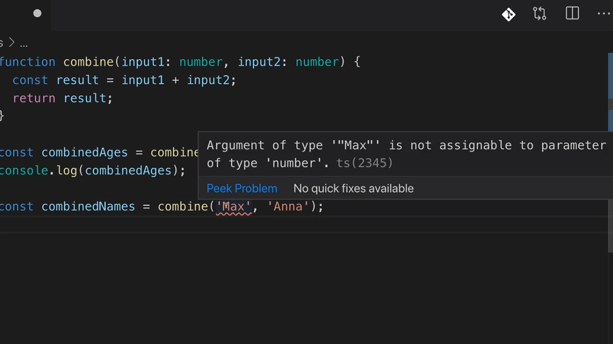
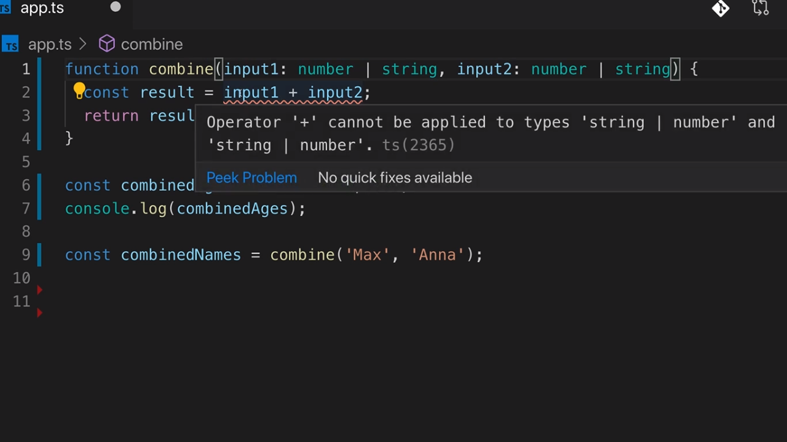
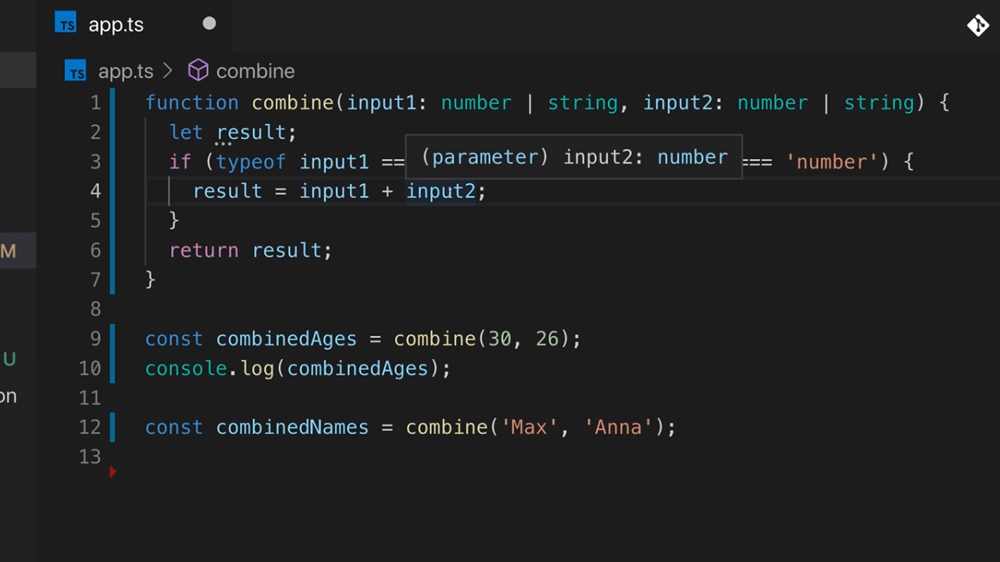

<p align="left">
 <a href="02_09.md">◀ Back: The any Type.</a>
</p>

---

# Union Types

Vamos a ocuparnos ahora de lo que se conoce como el **union type**. Para poder entenderlo vamos a partir del siguiente ejemplo donde tenemos definida una función utilizando TypeScript:

```ts
function add(n1: number, n2: number) {
  const result = n1 + n2
  return result
}
```

Como vemos la función `add` es realmente simple ya que lo único que hace es calcular el resultado de aplicar el operador `+` a los dos números que recibe como parámetro (lo que provocará que se realice la suma de ambos) y retornar el resultado de la operación. Lo que ahora pretendermos es permitir que nuestra función pueda aceptar otros tipos de datos (en este caso strings porque el operador `+` se puede utilizar con string).

Para lograrlo lo primero que vamos a hacer es crear una función nueva a partir de la anterior a la cual vamos a denominar `combine` y dentro de la misma lo que hacemos es renombrar los parámetros conservando de esta manera el código de nuestra función `add`:

```ts
function combine(input1: number, input2: number) {
  const result = input1 + input2
  return result
}
```

Si ahora escribimos el siguiente código:

```ts
const combinedAges = combine(30, 26)
console.log(combinedAges)
```

Lo compilamos y lo ejecutamos desde la terminal de nuestro sistema no nos tiene que sorprender que el resultado que obtengamos sea 56 siendo la suma de los parámetros:

```bash
$ tsc app.ts
$ node app.js
  56
```

El problema nos va a aparecer en el momento en el que invocamos a la función `combine` con el objetivo de que concatene los dos string que le vamos a pasar como parámetros:

```ts
const combinedNames = combine('Max', 'Anna')
```

El compilador de TypeScript sabe que no se puede invocar a la función `combine` con un tipo de datos string y por lo tanto informa de ello con un error:

<div style='text-align: center'>
  
</div>
<br />

Evidentemente una solución pasaría por definir que los tipos de datos que están asociados la función `combine` pasen a ser string en vez de number pero en este caso el error se nos presentaría a la hora de invocar a la función con parámetros de tipo number. Se trata pues de un escenario ideal para utilizar el union type.

Así cuando en cualquier punto de nuestra aplicación tenemos un elemento (variable, parámetro de función, etc.) que puede aceptar dos o más tipos de valores (como es el caso de nuestro ejemplo donde los parámetros tiene que poder aceptar tanto valores string como valores number) tendremos que hacer uso de union type con el fin de poderle indicar a TypeScript que es posible utilizar cualquira de ellos. Pero ¿cómo se define? Pues simplemente escribiendo los tipos de datos que son aceptables separados unos de otro con el operador `|`. En nuestor ejemplo:

```ts
function combine(input1: number | string, input2: number | string) {
  const result = input1 + input2
  return result
}
```

---
**Nota:** el union type no está limitado a dos tipos de datos pudiendo combinar el número de ellos que necesitamos siempre que los separemos con `|`.

---

Tras escribir el códdigo anterior y definir el union type para los parámetros vemos que TypeScript nos sigue reportando un error en este caso en la definición de la constante `result` dentro del código de la función:

<div style='text-align: center'>
  
</div>
<br />

Aquí lo que nos dice TypeScript es que el operador `+` no se puede utilizar con los tipos de datos `number | string` (se puede utilizar con el tipo de datos number o con el tipo de datos string pero no con el tipo de datos que representa la unión de los dos) cuando nosotros sí que sabemos que JavaScript va a permitir aplicarlo sobre el tipo de datos string o number e incluso sobre la combinación de cualquiera de ellos. Para solucionarlo comenzaremos realizando una comprobación de tipos en tiempo de ejecución de la siguiente manera:

```ts
function combine(input1: number | string, input2: number | string) {
  let result
  if (typeof input1 === 'number' && typeof input2 === 'number') {
    result = input1 + input2
  }
  return result
}
```

Con esta comprobación el compilador de TypeScript es capaz de acotar (narrow) que dentro del código de la rama `if` el tipo de datos de los dos posibles que pueden tener tanto el parámetro `input1` como el parámetro `input2` estaremos seguros de que ahí va a ser number.

<div style='text-align: center'>
  
</div>
<br />

¿Y qué podemos hacer en el resto de combinaciones posibles para los tipos de datos? Pues simplemente invocar a la función `toString` de JavaScript donde de forma explícita los estaremos convirtiendo en strings y por lo tanto el operador `+` lo que pasa a realizar es la concatenación de cadenas.

```ts
function combine(input1: number | string, input2: number | string) {
  let result
  if (typeof input1 === 'number' && typeof input2 === 'number') {
    result = input1 + input2
  } else {
    result = input1.toString() + input2.toString()
  }
  return result
}
```

Con esto lo que forzamos es a que el tipo de datos en la rama `else` para la variable `result` va a ser string. Por lo tanto si ahora invocamos a nuestra función con el siguiente código:

```ts
const combinedAges = combine(30, 26)
console.log(combinedAges)
const combinedNames = combine('Max', 'Anna')
console.log(combinedNames)
```

y guardamos nuestro trabajo, lo compilamos y lo ejecutamos la salida que vamos a obtener por la consola será la siguiente:

```bash
$ tsc app.ts
$ node app.js
  56
  MaxAnna
```

> Lo importante es recordar que vamos a utilizar los union type en todos aquellos lugares de nuestras aplicación en los que queremos ser más flexible acerca de los tipos de datos que permitimos.

---
**Nota:** aunque en el ejemplo anterior hemos tenido que hacer uso del chequeo en tiempo de ejecución del tipo de datos del que realmente se trata la razón por la que ha sido necesario es porque estamos utilizando dentro del código de la función el operador `+` y este obliga al compilador de TypeScript a que conozca el tipo de datos concreto con el que va a operar.

En la mayoría de las situaciones en las que trabajemos con un tipo de datos union nos vamos a encontrar con que no es necesario realizar esta comprobación de tipos en tiempo de ejecución.

---

<p align="right">
 <a href="02_10.md">Next: Literal Types ▶</a>
</p>
