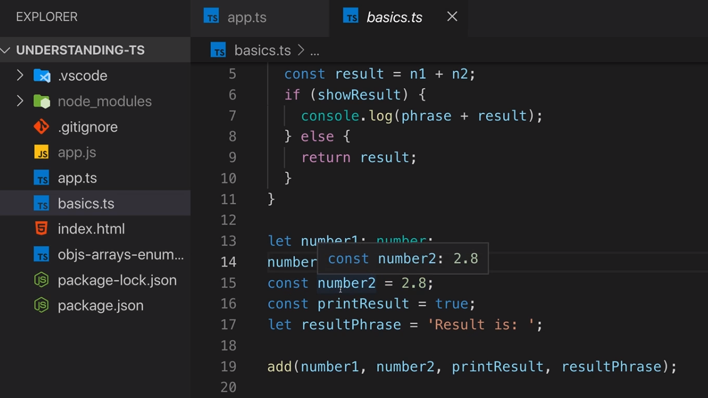
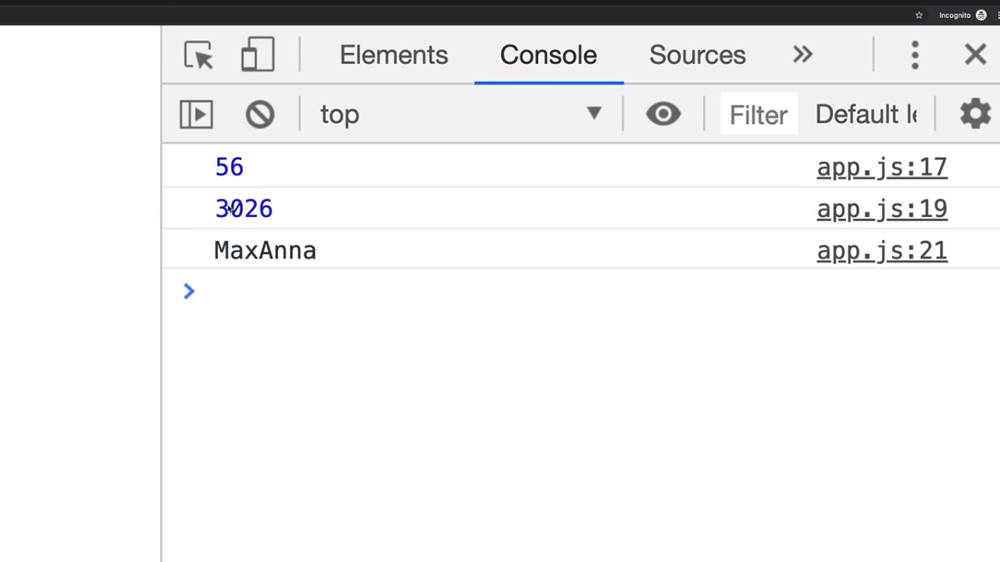
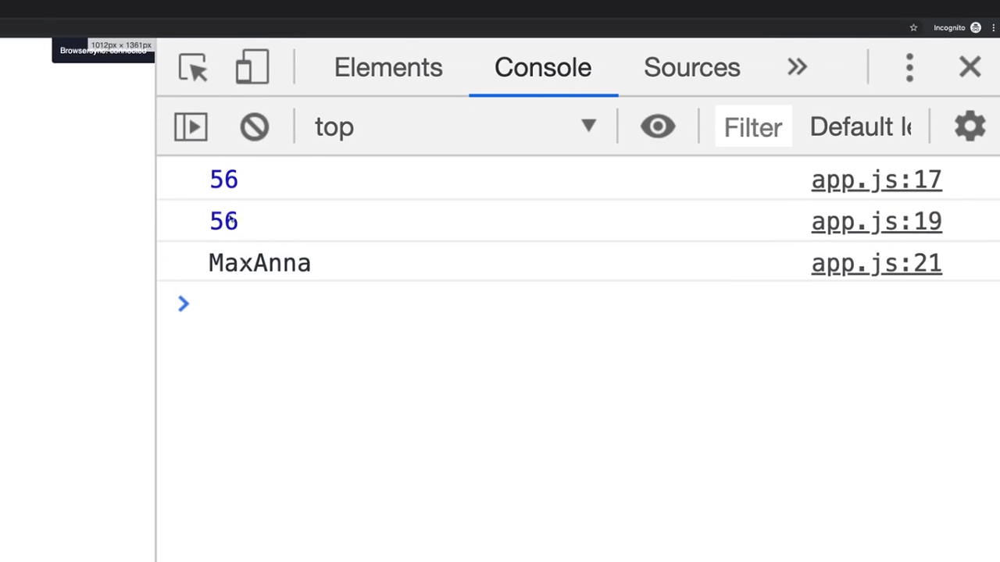
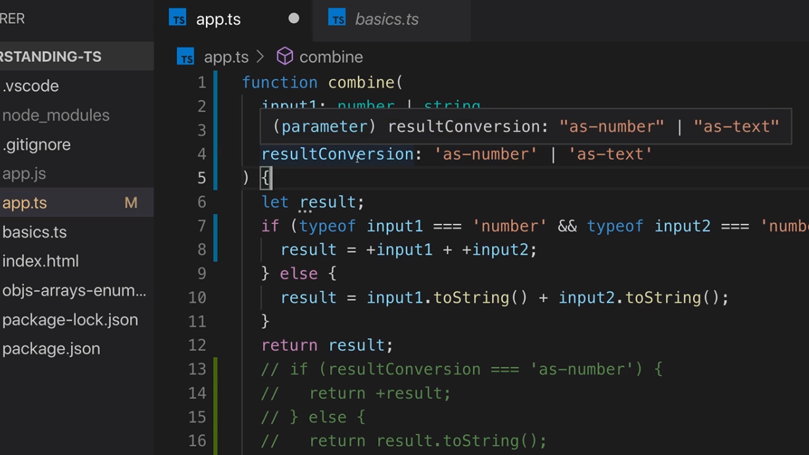
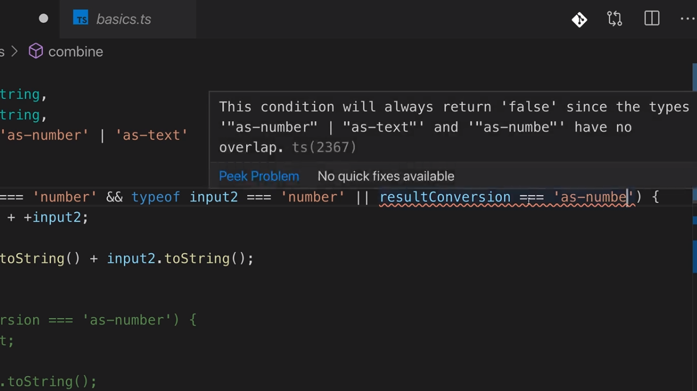
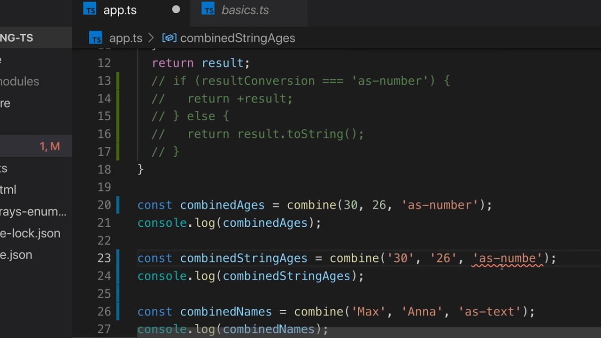

<p align="left">
 <a href="02_11.md">◀ Back: Union Types.</a>
</p>

---

# Literal Types.

Los literal types son utilizados en todas aquellas situaciones en las que queremos expresar de forma concreta el valor concreto de un tipo de datos que puede adoptar alguno de los elementos de nuestra aplicación. Lo que queremos decir es que estaremos aplicando un valor concreto de un tipo de datos (como por ejemplo un valor concreto de un number) como el valor que se considera el tipo de datos. Esto se entiende mucho mejor con un ejemplo:

<div style='text-align: center'>
  
</div>
<br />

Si nos finamos en la imagen que anterior vemos que VSCode (y por lo tanto TypeScript) nos está informando que el tipo de datos que infiere para la asignación de la constante `number2` no va a ser un number sino que es un valor concreto entre todos los posibles number, que en este caso es 2.8. Dicho de otra manera el valor 2.8 pasa a ser un literal type.

---
**Nota:** esta inferencia del literal type lo puede hacer TypeScript porque la variable está declarada como una constante `const` y por lo tanto su valor no va a cambiar en tiempo de ejecución siendo siempre el mismo.

---

Evidentemente la inferencia del literal type que TypeScript es capaz de hacer para un valor number también la realiza cuando declaramos una constante asignándole un string ya que en vez de ser el tipo de datos string general lo que hace es asignarle el literal type que representa el string asignado.

Vamos a ver un escenario en el que puede ser interesenta hacer uso de los literal types. Supongamos que continuamos desarrollando la función `combine` con la que hemos trabajado en el [punto anterior](./02_11.md) pero en este caso queremos definir un tercer parámetro en la misma que de alguna manera nos sirva para indicar cómo queremos que se lleve a cabo la combinación de los dos parámetros. La declaración podría ser como sigue:

```ts
function combine(
  input1: number | string,
  input2: number | string,
  resultConversion: string
) {
  let result
  if (typeof input1 === 'number' && typeof input2 === 'number') {
    result = input1 + input2
  } else {
    result = input1.toString() + input2.toString()
  }
  return result
}
```

Ahora las invocaciones de nuestra función `combine` tienen que recibir un tercer parámetro para que TypeScript no nos de un error de compilación por lo que podemos escribir algo como lo siguiente:

```ts
const combinedAges = combine(30, 26, 'as-number')
console.log(combinedAges)
const combinedNames = combine('Max', 'Anna', 'as-text')
console.log(combinedNames)
```

Y ahora queremos añadir una nueva posibilidad que será pasar como parámetro dos string pero queremos que la combinación se lleve a cabo interpretándolos como si se tratase de dos números. En otras palabras, escribiríamos algo como:

```ts
const combinedAges = combine(30, 26, 'as-number')
console.log(combinedAges)
const combinedStringAges = combine('30', '26', 'as-number')
console.log(combinedStringAges)
const combinedNames = combine('Max', 'Anna', 'as-text')
console.log(combinedNames)
```

Este caso de uso se trata de un claro escenario en el que la existencia del tercer parámetro tiene sentido porque estamos forzando a que el resultado de la operación que se lleva a cabo dentro del código de la misma se transforme a un tipo de datos diferente del que se recibe como parámetro.

El siguiente paso que tendremos que dar será aplicar la lógica de la conversión dentro del código de nuestra función. En una primera aproximación el código nos quedaría como sigue:

```ts
function combine(
  input1: number | string,
  input2: number | string,
  resultConversion: string
) {
  let result
  if (typeof input1 === 'number' && typeof input2 === 'number') {
    result = input1 + input2
  } else {
    result = input1.toString() + input2.toString()
  }
  if (resultConversion === 'as-number') {
    return +result
  } else {
    return result.toString()
  }
}
```

Vamos que el función del valor del parámetro `resultConversion` lo que estamos haciendo es trasformar el valor del resultado obtenido a un número (convertir su tipo de datos) o a un string.

---
**Nota:** en el código anterior hemos utilizado el operador `+` precediendo a la variable `result` para indicar que lo que queremos que se lleve a cabo es un conversión del valor que está recogido dentro del string a un numérico. Esta es una forma muy común (y muy abreviada) de convertir un string a un número. Otra alternativa sería utilizar la función `parseFloat` que nos proporciona JavaScript.

En el caso de que el string no pueda ser interpretado como un número el resultado que obtendremos al aplicarle el prefijo `+` va a ser el valor `NaN` (Not a Number).

---

Si ahora guardamos nuestro trabajo, lo compilamos y lo ejecutamos el resultado que obtendremos será parecido a lo siguiente:

```bash
$ tsc app.ts
$ node app.js
  56
  3026
  MaxAnna
```

Siendo lo importante aquí que en el caso de los dos primeros resultados el tipo de datos que está asociado al valor será un number y en el último caso será un string. Esto se puede ver mejor si ejecutamos nuestro código en un navegador donde el tipo de datos number se mostrará de un color diferente al tipo de datos string:

<div style='text-align: center'>
  
</div>
<br />

Vamos a ver otra manera de implementar el código de la función `combine` con el objetivo de lograr la misma funcionalidad. En este caso lo que vamos a hacer es no solamente verificar cuál es el tipo de datos en tiempo de ejecución sino que además vamos a verificar el valor del parámetro `resultConversion` en un mismo `if`. Veámoslo:

```ts
function combine(
  input1: number | string,
  input2: number | string,
  resultConversion: string
) {
  let result
  if (
    typeof input1 === 'number' && 
    typeof input2 === 'number' ||
    resultConversion === 'as-number'
  ) {
    result = +input1 + +input2
  } else {
    result = input1.toString() + input2.toString()
  }
  return result
}
```

En este caso cuando el parámetro `resultConversion` tiene el valor `as-number` el código se ejecutará por la rama del `if` y dentro del mismo lo primero que se está haciendo es convertir el valor de los parámetro `input1` y `input2` a number utilizando el operador `+` como prefijo (hay que pensar que si este operador se aplica sobre un number le valor que resultas será exactamente el mismo) y posteriormente se realizará la suma (el prefijo `+` tiene preferencia en ejecución sobre el operador `+` como suma).

Sin embargo si ahora volvemos a guardar nuestro trabajo, compilamos y lo volemos a ejecutar la salida que veremos será algo diferente:

<div style='text-align: center'>
  
</div>
<br />

En este caso la segunda salida muestra el resultado de realizar la suma de los dos string como números lo que da un resultado diferente que en el caso anterior. ¿Por qué? Pues porque la lógica es realmente diferente. En la primera implementación lo se está haciendo es aplicar en primer lugar el operador `+` a los parámetros y posteriormente hacer la conversión al tipo de datos que se quiere obtener (lo que provoca que el valor que se obtiene en este caso sea el número 3026) mientras que en el segundo caso en primer lugar se realiza la conversión (se pasa de un string a un número) y posteriormente se le aplica el operador `+` (lo que da el resultado de 56).

Pero centrémonos en los valores que puede tener el tercer parámetro la función que en este caso son `as-number` y `as-string`. El problema tal y como lo tenemos definido es que, como desarrolladores, vamos a tener que acordarnos siempre que estas son las posibilidades que tenemos para realizar la invocación. Ya hemos [visto anteriormente](./02_09.md) que una solución podría ser utilizar un enum para indicar las dos posibilidades pero en este caso el número de posibilidades es más bien pequeño (de hecho son solamente dos) y además se trata de valores que son específicos para la función por lo que parece un lugar idóneo para utilizar un literal type. 

Así pues a la hora de declarar nuestra función el tipo de datos que le vamos a definir para el tercer parámetro ya no va a ser un string sino que ha de ser o bien el literal `as-number` o bien el literal `as-text`:

```ts
function combine(
  input1: number | string,
  input2: number | string,
  resultConversion: 'as-number' | 'as-text'
) {
  let result
  if (
    typeof input1 === 'number' && 
    typeof input2 === 'number' ||
    resultConversion === 'as-number'
  ) {
    result = +input1 + +input2
  } else {
    result = input1.toString() + input2.toString()
  }
  return result
}
```

Como se puede ver hemos definido un union type combinado con un literal type. Con esto lo que estamos indicando es que esperamos que el parámetro `resultConversion` sea un string pero no nos sirve cualquier string sino que garantizaremos que o bien es el string `as-number` o bien es el string `as-text`.

<div style='text-align: center'>
  
</div>
<br />

¿Qué va a provocar esto? Pues que TypeScript sepa que el valor que puede adoptar este parámetro va a ser una de estos dos y si, por la razón que sea, nos equivocamos a la hora de realizar una comprobación el compilador nos podrá informar de ello:

<div style='text-align: center'>
  
</div>
<br />

Y de forma análoga esta capacidad también la va a tener el compilador cuando vamos a invocar a nuestra función pasándole un valor como tercer parámetro que no esté incluido dentro de los permitidos por el tipo de datos que ha sido definido:

<div style='text-align: center'>
  
</div>
<br />


> Un literal type no es más que un tipo de datos que está basado en los tipos básicos que tenemos en TypeScript a nuestra disposición (string, number, etc.) siendo un valor espífico de dicho tipo de datos.

---

<p align="right">
 <a href="02_13.md">Next: Type Aliases Custom Types ▶</a>
</p>
