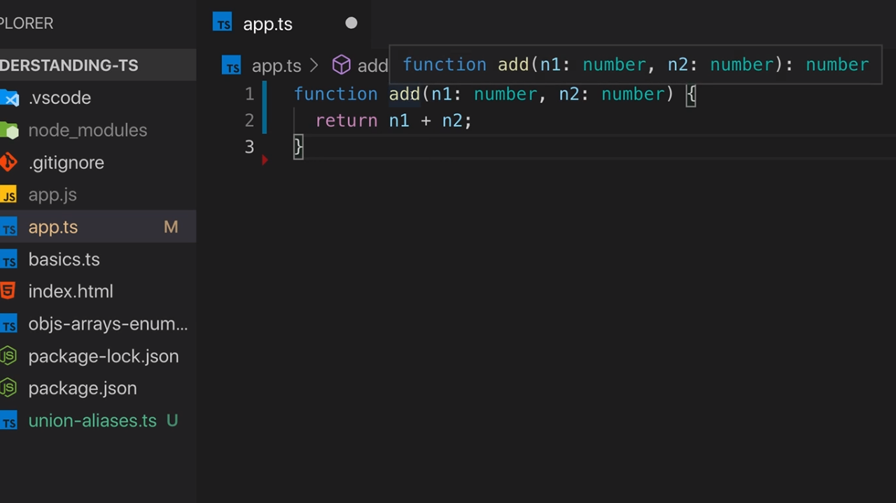
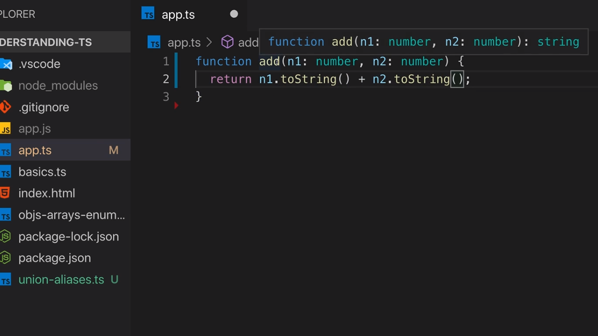
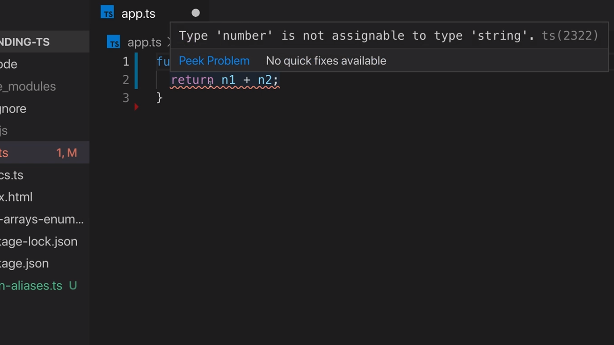
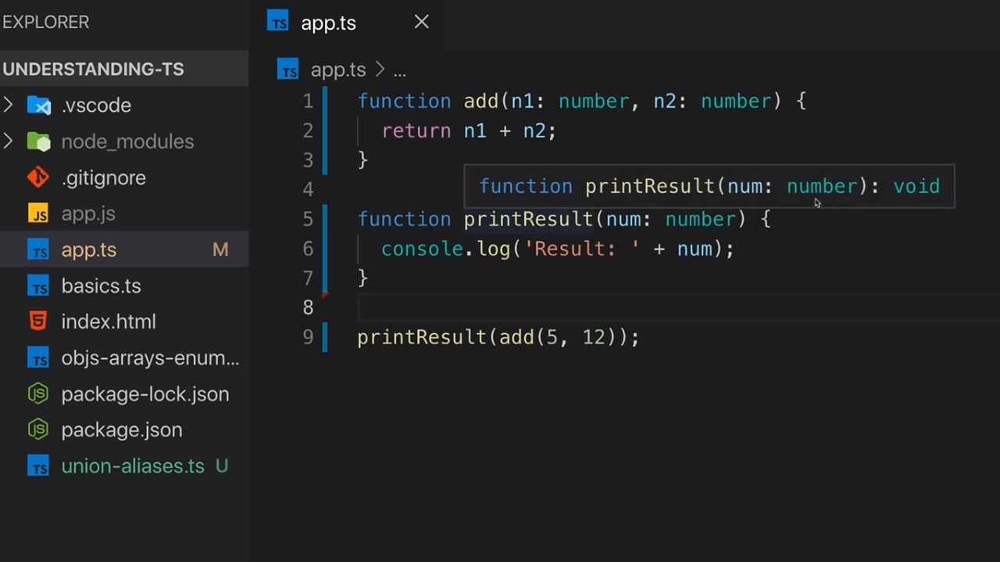
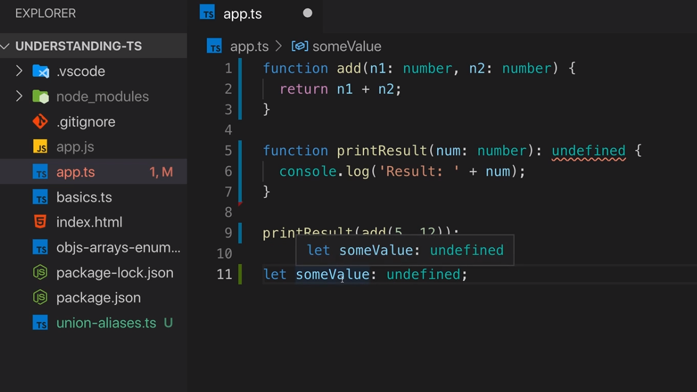

<p align="left">
 <a href="02_13.md">◀ Back: Type Aliases Custom Types.</a>
</p>

---

# Function Return Types & void.

En este punto vamos a profundizar en las funciones que podemos definir en nuestras aplicaciones. En los puntos anterior hemos visto cómo podemos utilizar TypeScript para definir los tipos de datos que estarán disponibles en los parámetros de las funciones pero todavía existen algunos aspectos adicionales que tenemos que conocer relacionados con los tipos de datos y las funciones.

Vamos comenzar nuestra explicación volviendo a la implementación de la función `add` que nos permite sumar dos números:

```ts
function add(n1: number, n2: number) {
  return n1 + n2
}
```

Todas la funciones en TypeScript tiene un tipo de datos por el mero hecho de serlo que es el que recoge el valor que va a retornar y que se conoce como el **return type**. En el ejemplo anterior el return type de la función `add` es inferido por TypeScript y lo podemos ver en el momento en el que en VSCode situamos el cursor sobre el nombre de la función:

<div style='text-align: center'>
  
</div>
<br />

En la imagen anterior vermos que en el tool-tip que se nos muestra tras la declaración de los parámtros y los tipos de datos que tienen asociados (o dicho de otra manera, tras el paréntesis de cierre `)`) nos encontramos con los dos puntos `:` seguidos de un tipo de datos que es el que indica el tipo de datos que retornará la función, que en el ejemplo es un number.

Y no solamente esto sino que la capacidad de TypeScript para inferir el tipo de datos que retorna una función es muy potente. Por ejemplo, si en nuestra implementación dentro del código lo que hacemos es convertir los parámtros en string y luego realizar la concatenación de los mismos utilizando el operador `+`:

```ts
function add(n1: number, n2: number) {
  return n1.toString() + n2.toString()
}
```

podemos ver cómo TypeScript es capaz de inferir que el tipo de datos que retornará la función `add` será un string como esperábamos que fuese:

<div style='text-align: center'>
  
</div>
<br />

Aunque TypeScript es muy bueno inferiendo el tipo de datos que retorna nuestra función nosotros siempre podemos establecer el tipo de datos que vamos a retornar. La nomenclatura para hacerlo es seguir las mismas indicaciones que hemos visto en el tool-tip que nos muestra VSCode, es decir, que tras el paréntesis de cierre tenemos que escribir los dos puntos `:` seguidos del tipo de datos que retornará nuestra función:

```ts
function add(n1: number, n2: number): number {
  return n1 + n2
}
```

Pero ¿qué ocurrirá en el caso de que el tipo de datos que indiquemos que va a retornar nuestra función no coincida con el que realmente retorna? Pues que TypeScript nos informará de ello con un error. Así si tenemos:

```ts
function add(n1: number, n2: number): string {
  return n1 + n2
}
```

En VSCode podemos ver cuál es el error con el que compilador de TypeScript nos informará del problema que existe en nuestro código (la operación que estamos realizando no finaliza con un tipo de datos que sea del mismo tipo que el que hemos definido como el tipo que ha de retornar):

<div style='text-align: center'>
  
</div>
<br />

---
**Nota:** aunque nosotros siempre podemos especificar el tipo de datos que retornan nuestras funciones en todos aquellos casos en los que es TypeScript el que puede inferir cuál será se considera una buena práctica de programación dejar que sea el propio compilador el que lo determine.

---

## void.

Vamos ahora a centrar en el estudio del tipo de datos **void** ya que es un tipo de datos propio de TypeScript sin equivalente en JavaScript. Supongamos que continuamos trabajando en nuestro código anterior y ahora añadimos el la función `printResult` que mostramos a continuación:

```ts
function add(n1: number, n2: number) {
  return n1 + n2
}

function printResult(num: number) {
  console.log('Result: ' + num)
}

printResult(add(5, 12))
```

Simplemente lo que estamos haciendo es invocar a la función `add` con los parámetro 5 y 12 y lo que sea que esta función nos retorna (que como hemos visto será del tipo de datos number) como resultando se lo pasamos como parámetro a la función `printResult` (que acepta como parḿetro el tipo de datos number) para que lo muestre por la consola. Si guardamos nuestro trabajo, lo compilamos y lo ejecutamos desde la consola obtendremos algo como lo siguiente:

```bash
$ tsc app.ts
$ node app.js
  Result: 17
```

¿Cuál es el tipo de datos que retorna la función `printResult`? Podríamos pensar que se trata de un string porque dentro de la función estamos creando un string mediante la concatenación de `Result: ` y el valor de parámetro `num` pero simplemente este string se está utilizando para mostrar el mensaje por la consola y nunca para retornarlo. Entonces ¿qué se está retornando? Lo vemos en VSCode:

<div style='text-align: center'>
  
</div>
<br />

Es decir, que en TypeScript para todas aquellas funciones que no retornan un valor de forma explícita el compilador infiere que el tipo de datos que retornará es void (recogido en la palabra reservada de TypeScript `void`).

---
**Nota:** JavaScript no posee el tipo de datos void.

---
**Nota:** aquellos lectores del manual que vengan de otros lenguajes de programación como Java estarán acostumbrados a trabajar con métodos que cuyo valor de retorno es void y por lo tanto no será un concepto nuevo para ellos.

---

Así pues podríamos haber declarado nuestra función de la siguiente manera aunque tenemos que recordar que en el caso de que TypeScript pueda inferir el tipo de datos que va a retornar se considera una buena práctica de programación dejar que sea el compilador el que determine cuál será dicho tipo de datos de retorno.

```ts
function printResult(num: number): void {
  console.log('Result: ' + num)
}
```

¿Qué queremos decir cuando se deteminar que el return type de una función es void? Pues lo que tenemos que entender es que estaremso indicando que dicha función no puede tener una instrucción `return` dentro de la misma porque nunca ha de retornar un valor. Es decir, que si la ejecución de la función finaliza correctamente (entendiendo como tal que no se lanza ningúne error dentro de la misma) no ha de retornar nada.

Ahora bien, en JavaScript siempre podemos escribir el resultado que retorna una función pese a que sepamos que dentro de la misma no existe ninguna instrucción `return`. En nuestro ejemplo la siguiente instrucción sería posible:

```ts
console.log(printResult(add(5, 12)))
```

Si ahora volvemos a guardar nuestro trabajo, lo compilamos y lo volvemos a ejecutar en la terminal de nuestro sistema veremos algo como lo siguiente:

```bash
$ tsc app.ts
$ node app.js
  undefined
```

Vemos que lo que se está imprimiendo es el valor `undefined` lo que nos viene a indicar que en JavaScript cuando una función no retorna un valor de forma explícita con una sentencia del tipo `return` el valor que retornará por defecto es `undefined`.

> Simplemente recordar que `undefined` es un valor válido dentro del lenguaje siendo este el que obtenemos, por ejemplo, cuando estamos intentando acceder a una propiedad de un objeto que no está definida dentro del mismo.

Entonces, cuando estamos declarando (o inferiendo) en TypeScript que el tipo de datos asociado al valor que retorna una función es `void` lo que estamos diciendo es que la función en términos de JavaScript va a retornar `undefined`. Pero, para hacer las cosas algo más confusas, es importante saber que TypeScript también posee el tipo de datos `undefined` y por lo tanto parece lógico que declarásemos nuestra función de la siguiente manera para ser coherentes con JavaScript:

```ts
function printResult(num: number): undefined {
  console.log('Result: ' + num)
}
```

¿Cuál es el problema aquí? ¿Por qué el compilador de TypeScript nos está reportando un error cuando estamos definiendo la función de esta manera?

<div style='text-align: center'>
  
</div>
<br />

La respuesta es que TypeScript no permite que una función retorne `undefined` pese que sabemos que JavaScript sí que permite que así sea por lo que en el caso de que queramos asegurar que una función no va a retornar ningún valor el tipo de datos que tendremos que asignarle como valor de retorno ha de ser `void` y la razón no es otra que de esta manera estaremos indicando que la función en cuestión no va a tener un instrucción `return`.

Entonces ¿no podemos utilizar `undefined` como valor de retorno? Sí que podemos pero TypeScript esperará que de forma explícita indiquemos con una instrucción `return` que no vamos a retornar nada como se puede ver a continuación:

```ts
function printResult(num: number): undefined {
  console.log('Result: ' + num)
  return
}
```

---
**Nota:** es posible incluir una instrucción `return` vacía en una función que hemos declarado que su tipo de datos de retorno es `void` sin que el compilador de TypeScript reporte ningún tipo de error. Por lo tanto, algo como lo siguiente sería correcto:

```ts
function printResult(num: number): void {
  console.log('Result: ' + num)
  return
}
```

Lo que provoca que el caso de uso en el que tengamos que indicar que el tipo de datos que retorna la función es `undefined` sea realmente raro.

---
**Nota:** esto que puede resultar curioso nos lleva a situaciones en las que podemos declarar una variable con el tipo de datos `undefined` pero posteriormente en el código solamente se le podrá asignar un valor `undefined` si no queremos que el compilador de TypeScript nos informe de un error.

<div style='text-align: center'>
  
</div>
<br />

En el ejemplo anterior la variable `somaValue` va a poder tener únicamente el valor `undefined` en la aplicación lo cual parece que no va a ser de mucha utilidad pero puede haber casos de uso en los que sea necesario una situación como esta.

---

<p align="right">
 <a href="02_15.md">Next: Functions as Types ▶</a>
</p>
