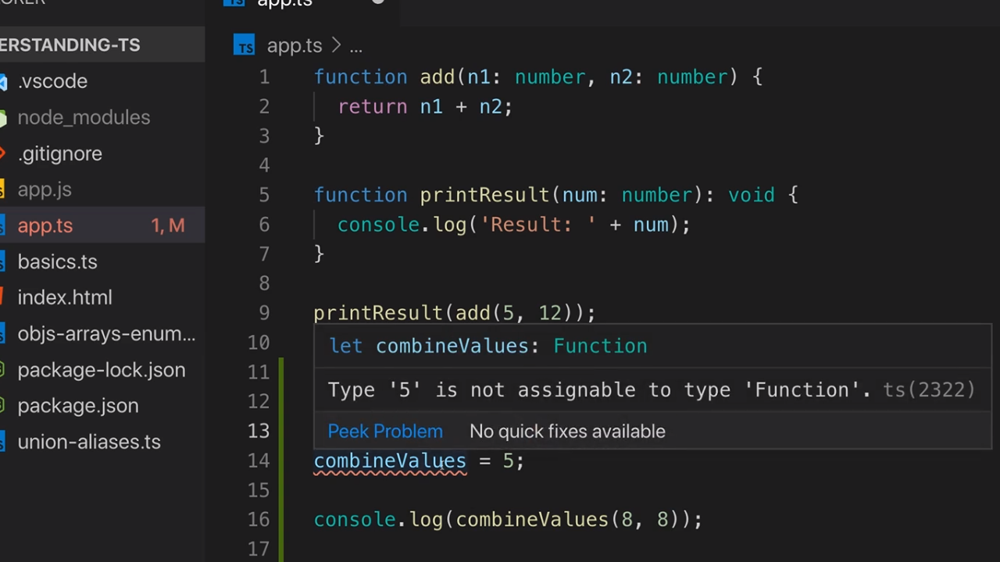
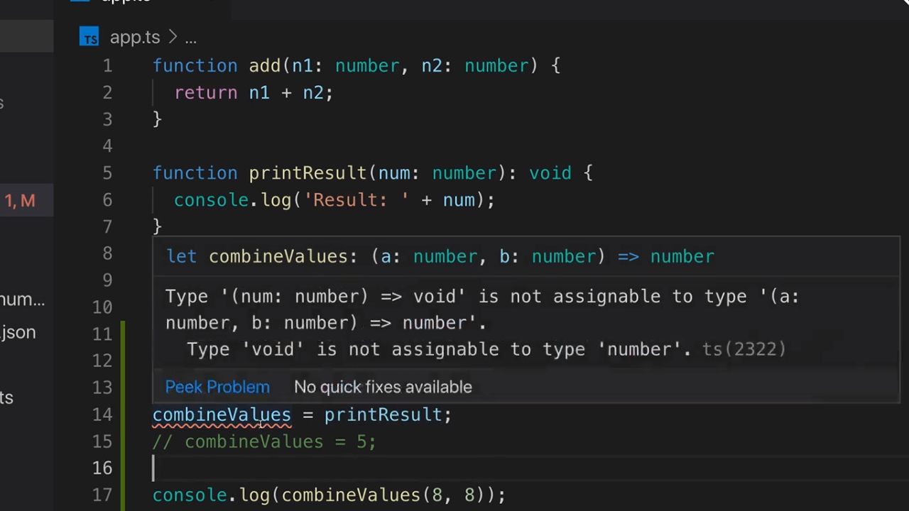

<p align="left">
 <a href="02_14.md">◀ Back: Function Return Types & void.</a>
</p>

---

# Functions as Types.

En TypeScript es posible utilizar funciones como el tipo de datos que está asociado a los parámetros de una función o como el valor que retorna una función. Pero antes de ver cómo utilizar esta capacidad del lenguaje en primer lugar tenemos que entender qué es lo que representa un **function type** por sí mismo.

Vamos a verlo con un ejemplo. Siguiendo con el ejemplo que hemos estado desarrollando en el [punto anterior](./02_14.md) supongamos que en definimos la variable `combineValue` de la siguiente manera:

```ts
function add(n1: number, n2: number) {
  return n1 + n2
}

function printResult(num: number) {
  console.log('Result: ' + num)
}

let combineValue
```

En TypeScript sabemos que por defecto (es decir, sin que nosotros le digamos lo contrario) un variable como la anterior tendrá asignado el tipo de datos `any`:

<div style='text-align: center'>
  
</div>
<br />

Ya hemos visto que por normal general el que una variable tenga asignado como tipo de datos `any` no suele ser muy relevante desde el punto de vista del uso de los tipos de datos.

Más adelante en nuestra aplicación de ejemplo nos podemos encontrar con el caso de que nuestra variable `combineValue` pase a estar asignada a la función `add` y simplemente invocar a dicha función a través de nuestra variable de la siguiente manera:

```ts
let combineValue
combineValue = add
console.log(combineValue(8, 8))
```

Si ahora guardamos nuestro trabajo, lo compilamos y ejecutamos nuestra aplicación desde la terminal del sistema lo que vamos a obtener es algo como lo siguiente:

```bash
$ tsc app.ts
$ node app.js
  16
```

Es decir que nuestro código está funcionando como lo haría JavaScript donde podemos definir una variable que apunte a una función y posteriormente invocar a dicha función a través del nombre de la nueva variable.

El problema que tenemos con esta aproximación desde el punto de vista de TypeScript es que el tipo de datos que está asociado a la variable `combineValues` tal y como hemos visto anteriormente es `any`. Esto quiere decir, que podemos cambiar la asignación de la variable antes de que se invoque a la función y TypeScript no se dará cuenta de ello lo que acabará provocando un error en tiempo de ejecución. En otras palabras, el siguiente código será válido desde la perspectiva del compilador de TypeScript:

```ts
let combineValue
combineValue = add
combineValue = 5
console.log(combineValue(8, 8))
```

Esto lo podemos ver si ahora ejecutamos nuestro código desde la consola del sistema:

```bash
$ tsc app.ts
$ node app.js
  /home/courses/typescript/api-extractor/app.js:7
  console.log(combineValue(8, 8));
              ^

  TypeError: combineValue is not a function
      at Object.<anonymous> (/home/courses/typescript/api-extractor/app.js:7:13)
      at Module._compile (internal/modules/cjs/loader.js:777:30)
      at Object.Module._extensions..js (internal/modules/cjs/loader.js:788:10)
      at Module.load (internal/modules/cjs/loader.js:643:32)
      at Function.Module._load (internal/modules/cjs/loader.js:556:12)
      at Function.Module.runMain (internal/modules/cjs/loader.js:840:10)
      at internal/main/run_main_module.js:17:11
```

Es decir que el error se produce en tiempo de ejecución ya que estamos intentando invocar una función cuando el tipo de datos que tiene asociado la variable `combineValue` es realmente un number. La forma de solucionarlo es poder especificar de alguna manera que el tipo de datos que tiene que tener asignado la variable `combineValue` es realmente una función y no `any`.

Para lograrlo lo primero que se nos puede ocurrir pensar es que como en JavaScript tenemos el objeto `Function` que sirve para representar a todas las funciones que posee el lenguaje y como sabemos que todos los objetos del lenguaje tienen su equivalente en tipo de datos, podríamos establecer que el tipo de datos uqe tiene que tener la variable `combineValue` es realmente `Function`. Por lo tanto escribiremos:

```ts
let combineValue: Function
combineValue = add
combineValue = 5
console.log(combineValue(8, 8))
```

Y como ahora le estamos especificando que cualquier cosa que vayamos a guardar en la variable `combineValue` ha de ser una función cuando le estamos asignando un number el compilador de TypeScript se percará de ello y nos avisará del error:

<div style='text-align: center'>
  
</div>
<br />

Si ahora eliminamos al instrucción que nos da el error:

```ts
let combineValue: Function
combineValue = add
console.log(combineValue(8, 8))
```

Guardamos nuestros trabajo, compilamos y volvemos a ejecutar el código veremos que el código se ejecuta sin lanzar ningún tipo de error escribiendo la salida que esperábamos:

```bash
$ tsc app.tsc
$ node app.js
  16
```

Pero aunque esta primera aproximación a la solución que estamos buscando es válida al hacer que el tipo de datos de la variable `combineValue` sea `Function` estaremos diciendo que le podemos asignar cualquiera de las funciones que estén disponibles dentro de nuestra aplicación. Entonces un código como el siguiente será válido desde el punto de vista del compilador de TypeScript:

```ts
let combineValue: Function
combineValue = add
combineValue = printResult
console.log(combineValue(8, 8))
```

TypeScript no nos va a mostrar ningún tipo de error porque `printResult` es una función pero el problema está en que no se trata de una función que pueda recibir dos parámetros. De hecho si ahora guardamos nuestro trabajo, lo compilamos y lo ejecutamos el resultado que obtenemos por la consola es el siguiente:

```bash
$ tsc app.ts
$ node app.js
  Result: 8
  undefined
```

---
**Nota:** no vamos detenernos en explicar porque aparecen dos líneas en la salida por la consola ya que es un tema propio de JavaScript y queda fuera del ámbito de este manual.

---

Lo realmente interesante aquí es conoce que TypeScript nos ofrece una forma de ser mucho más precisos a la hora de definir qué aspecto ha de tener la función que se le asignará como tipo de datos una de nuestras variables para que pueda hacer referencia a una función. Este tipo de datos es lo que se conoce como **function types**.

## Function Types.

Lo primero que tenemos que entender es que los functions types son un tipo de dato de TypeScript que sirven para describir funciones apoyándose para ello en especificar qué parámetros ha de recibir la función y qué valor retornará. Para definirlos se sigue la notición de las **arrow functions** de JavaScript:

```ts
let combineValues: () => ...
```

La primera diferencia entre las arrow function y los function types es que en estos últimos no estamos creando una función de JavaScript por lo que no es necesario que tras la flecha tengamos que escribir las llaves de apertura y cierre como sí sucede en muchas de las arrow functions de JavaScript. Entonces ¿qué se especifica en la parte de la derecha de la flecha? La respuesta es el tipo de datos que ha de retornar la función que representará nuestro function type. 

Así, como en nuestro en nuestro ejemplo esperamos que la función que asignemos a la variable `combineValue` ha de retorna un número definiríamos algo como lo siguiente:

```ts
let combineValues: () => number
```

Con esta declaración del tipe function para la variable lo que estamos diciendo es que la variable `combineValue` va a aceptar ser asignada a cualquier función que no recibe ningún parámetro (los paréntesis de apertura y cierre a la izquierda de la flecha están vacíos) y que se ejecutará retornando un number. 

Esto no es suficiente para nuestro ejemplo porque nosotros estamos esperando que la función que asignemos ha de poder recibir dos parámetros siendo cada uno de ellos un number por lo que en la parte de la izquierda de la flecha (es decir, entre los paréntesis) lo que tenemos que hacer es definir los tipos de datos que están asociados a cada uno de los parámetros (junto con un nombre para los mismos) y en el orden en que el que aparecen.

> No hace falta que el nombre de los parámetros en el tipo de datos sean los mismos que el nombre de esos mismos parámetros en la función que queremos asignar al tipo. Únicamente se tiene que cumplir que los tipos de datos de los parámetros han de ser los mismos.

Aplicando esta idea a nuestro ejemplo, como queremos que la función que podamos asignar a `combineValues` acepte dos paraḿetro de tipo number lo podemos declarar de la siguiente manera:

```ts
let combineValues: (a: number, b: number) => number
```

Tras esta definición del tipo de datos para `combineValues` en el caso de que queramos asignarle una función que no cumpla con la declaración que acabamos de hacer el compilador de TypeScript se percará de ello y nos informará del error que se ha cometido:

<div style='text-align: center'>
  
</div>
<br />

Como se puede ver en la imagen anterior TypeScript nos está diciendo que el tipo de datos de la función que queremos asignar (en este caso la función `printResult`) es una función que espera recibir un valor number y se ejecutará sin retornar nada (`void`) y que este tipo de datos no es compatible con el que está declarado para ser recogido en la variable `combineValues` ya que espera recibir una función con dos parámetros (siendo cada uno de ellos un number y retornando un number).

|elemento|tipo de datos|
|---|---|
|printResult|(num: number) => void|
|combineValues|(a: numnber, b: number) => number|

Si ahora eleminamos el error dejando el código tal y como se muestra a continuación:

```ts
let combineValues: (a: number, b: number) => number
combineValue = add
console.log(combineValue(8, 8))
```

Guardamos nuestro trabajo, compilamos y volvemos a ejecutarlo veremos que el programa se ejecutará sin ningún tipo de error tal y como esperamos:

```bash
$ tsc app.ts
$ node app.js
  16
```

Por lo tanto los function types sirve para ayudarnos a especificar qué tipos de funciones queremos utilizar en determinadas parte de nuestra aplicación verificando que se recibe el número de parámetros correcto, que los tipos de datos asociados a esos parámetros también son correctos y, por último, que el tipo de datos que retornará también será el esperado.

---

<p align="right">
 <a href="02_16.md">Next: Function Types and Callbacks ▶</a>
</p>
