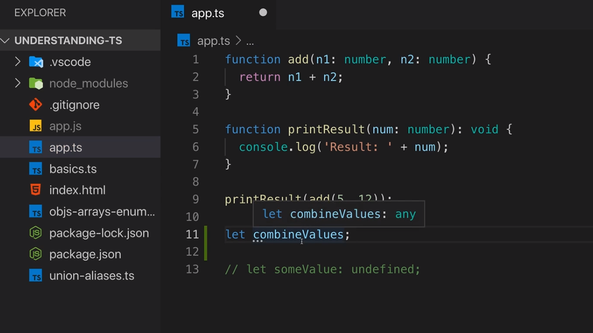

<p align="left">
 <a href="02_14.md">◀ Back: Function Return Types & void.</a>
</p>

---

# Functions as Types.

En TypeScript es posible utilizar funciones como el tipo de datos que está asociado a los parámetros de una función o como el valor que retorna una función. Pero antes de ver cómo utilizar esta capacidad del lenguaje en primer lugar tenemos que entender qué es lo que representa un **function type** por sí mismo.

Vamos a verlo con un ejemplo. Siguiendo con el ejemplo que hemos estado desarrollando en el [punto anterior](./02_14.md) supongamos que en definimos la variable `combineValue` de la siguiente manera:

```ts
function add(n1: number, n2: number) {
  return n1 + n2
}

function printResult(num: number) {
  console.log('Result: ' + number)
}

printResult(add(5, 12))

let combineValue
```

En TypeScript sabemos que por defecto (es decir, sin que nosotros le digamos lo contrario) un variable como la anterior tendrá asignado el tipo de datos `any`:

<div style='text-align: center'>
  
</div>
<br />

Ya hemos visto que por normal general el que una variable tenga asignado como tipo de datos `any` no suele ser muy relevante desde el punto de vista del uso de los tipos de datos.

Más adelante en nuestra aplicación de ejemplo nos podemos encontrar con el caso de que nuestra variable `combineValue` pase a estar asignada a la función `add` mediante una instrucción como la siguiente:

```ts
let combineValue
combineValue = add
```


---

<p align="right">
 <a href="02_16.md">Next: Function Types and Callbacks ▶</a>
</p>
