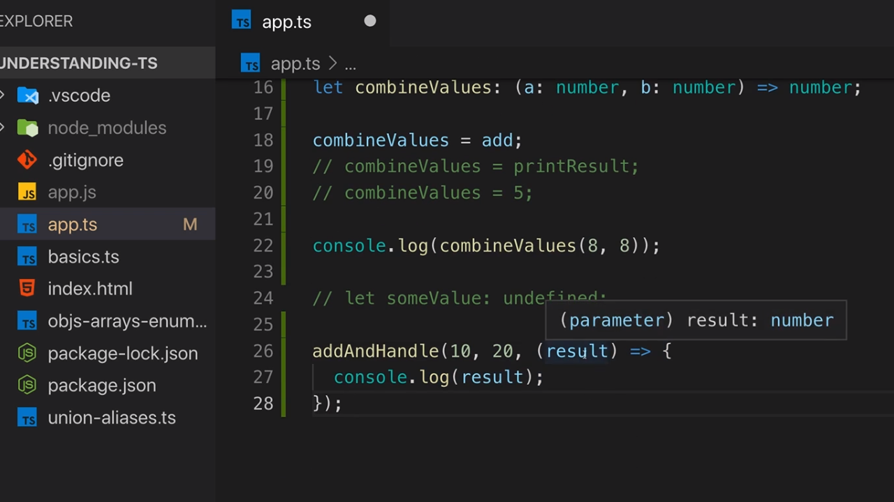
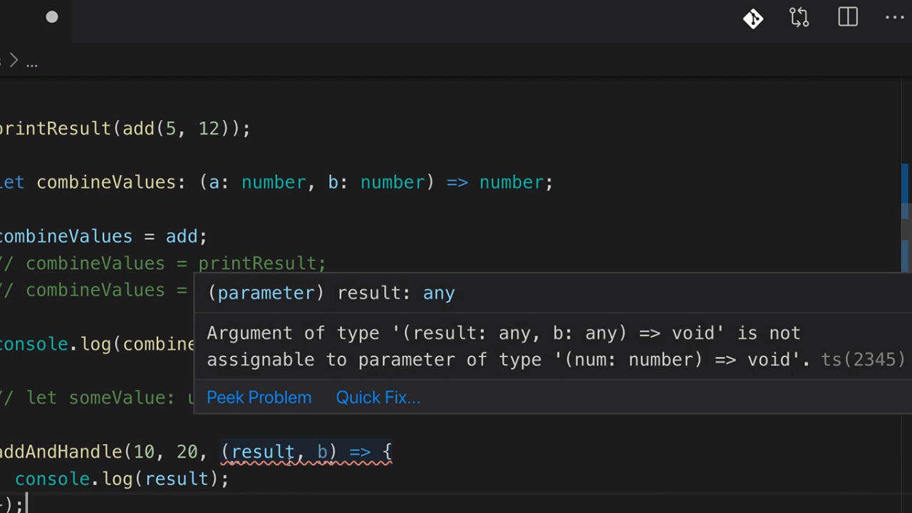

<p align="left">
 <a href="02_15.md">◀ Back: Functions as Types.</a>
</p>

---

# Function Types and Callbacks.

Las funciones denominadas [callbacks en JavaScript](https://developer.mozilla.org/en-US/docs/Glossary/Callback_function) desde el punto de vista de la declaración del tipo de datos que la representan tenemos que pensar que estaremos ante una situación similar a cómo se hace para declarar los functión types que hemos visto en el [punto anterior](./02_15.md).

Para entenderlo mejor vamos a suponer que definimos una función que sirve para sumar dos números (los dos primeros parámetros que vaya a recibir) pero que además recibe un tercer parámetro el cuál será una función que ha de ser invocada en algún momento durante la ejecución de esta nueva función (lo que nos hace considerarla una callback function). Así comenzamos definiendo esta nueva función de la siguiente manera:

```ts
function addAndHandle(n1: number, n2: number, cb) {
  const result = n1 + n2
  cb(result)
}
```

La cuestión aquí es ¿cómo definimos el tipo de datos que está asociado a la callback function? Pues mediante un function type. Para ello vamos a suponer que la esta función va recibir como parámetro un number (ya que el resultado de la suma de los dos primeros parámetros es lo que vamos a pasar como parámetro a la callback function) y esperamos que no retorne nada por lo que la describiríamos de la siguiente manera:

```ts
function addAndHandle(
  n1: number,
  n2: number,
  cb: (num: number) => void
) {
  const result = n1 + n2
  cb(result)
}
```

Con esta declaración ya vamos a poder hacer uso de la función `addAndHandle` dentro del código de nuestra aplicación como por ejemplo de la siguiente manera:

```ts
addAndHandle(10, 20, result => {
  console.log(result)
})
```

Si guardamos nuestro trabajo, lo compilamos y lo ejecutamos en la consola del sistema veremos algo como lo siguiente:

```bash
$ tsc app.ts
$ node app.js
  30
```

La ventaja de haber definido el function type que tendrá asociado la función callback dentro de la definición de los parámetros de la aplicación es que TypeScript va a poder inferir los tipos de datos que van a tener cada uno elementos que componen la definición de dicho callback. Esto que suene un poco misterioso lo podemos enteder mejor si entendemos que en nuestro ejemplo TypeScript es capaz de determinar que el atributo `result` que hemos establecido en el callback va a ser de tipo number porque así lo hemos defino en la function type:

<div style='text-align: center'>
  
</div>
<br />

lo que nos lleva a que no será necesario establecer el tipo de datos del que se trata a la hora de declarar el callbak, es decir, que no se hace necesario definir algo como lo siguiente donde estaremos indicando que el parámetro `result` ha de ser del tipo number.

```ts
addAndHandle(10, 20, (result: number) => {
  console.log(result)
})
```

Y no solamente esto sino que si nuestra callback utiliza más o menos argumentos de los que hemos declarado en el tipo de datos el compilador de TypeScript nos informará de una error:

<div style='text-align: center'>
  
</div>
<br />

Lo que TypeScript no puede verificar si la callback function va a retornar o no un valor. En nuestro caso el tipo de datos que está asociado a la callback function indica que no espera que dicha función no retorne nada con la utilización de `void` pero ante un código como el siguiente:

```ts
function addAndHandle(
  n1: number,
  n2: number,
  cb: (num: number) => void
) {
  const result = n1 + n2
  cb(result)
}

addAndHandle(10, 20, result => {
  console.log(result)
  return result
})
```

no provocará ningún error de compilación. La pregunta es ¿pero esto no es realmente un error de compilación? Vamos a pensarlo unos instantes. Cuando estamos indicando para el tipo de datos que define a una callback que esperamos que retorne `void` lo que en cierta medida estamos diciendo es que podemos ignorar el valor que la implementación de ese callback va a realizar ya que simplemente no se va a hacer nada con el mismo. En nuestro caso, al establecer que la callback function retornará un tipo de datos void lo que estamos diciendo es que dentro de la función `addAndHandle` no vamos a hacer nada con el tipo de datos que pueda retornar la callback. Así pues, que retorne un valor no va a ser un problema.

> TypeScript siempre nos va a forzar a que se cumpla con el número y el tipo de los datos que forman los parámetros de una callback function pero sin embargo no exige la misma restricción en lo que respecta al valor de retorno (return type) de dicha callback function.

---

<p align="right">
 <a href="02_17.md">Next: The unknown Type ▶</a>
</p>
