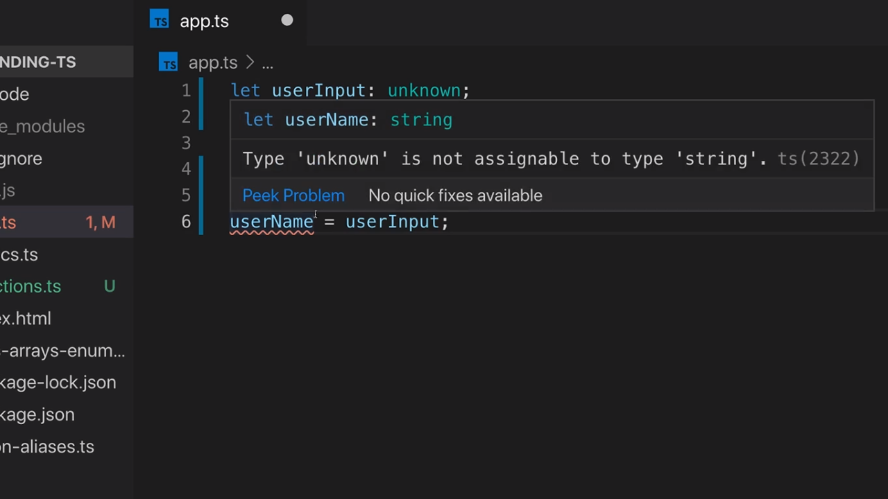
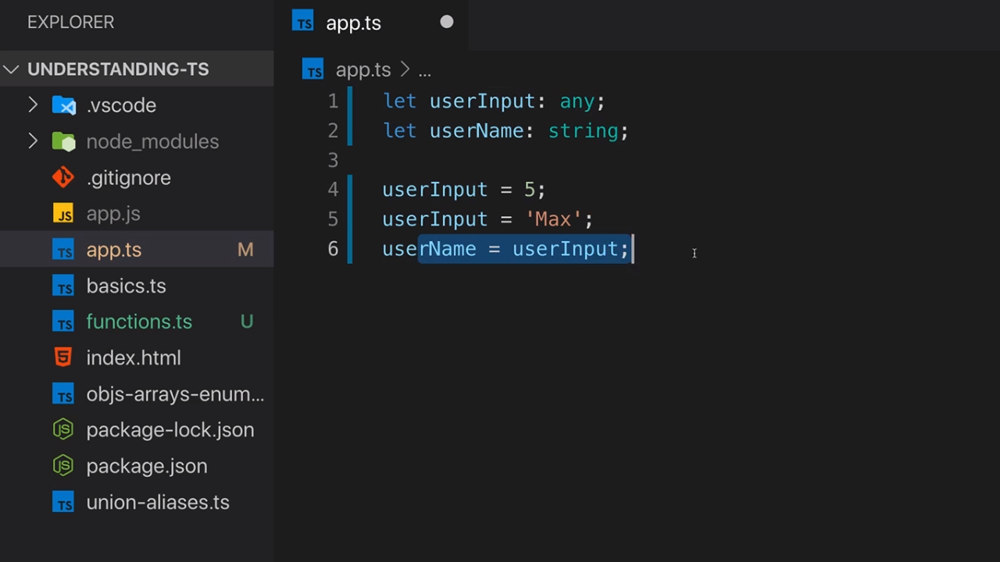
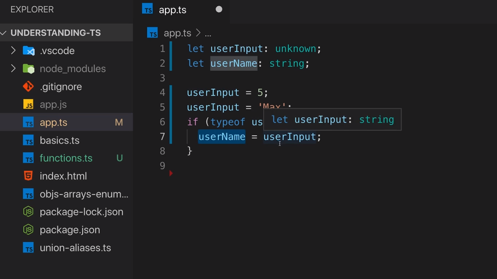

<p align="left">
 <a href="02_16.md">◀ Back: Function Types and Callbacks.</a>
</p>

---

# The unknown Type.

Todavía nos quedan dos tipos de datos más antes de dar por concluido el estudio de los tipos de datos básicos que nos ofrece TypeScript y en este punto vamos a estudiar el primero de ellos, el tipo de datos **unknown**. Para enteder cómo funciona vamos a ver un ejemplo:

```ts
let userInput: unknown
```

Lo primero que tenemos que entender es que unknown no es lo mismo que el tipo de datos any (que recordemos que recoge cualquier tipo de datos) en el sentido de que unknown lo podemos utilizar para recoger cualquier tipo de datos pero con la salvedad de que cuando lo establecemos lo que queremos decir es que en ese preciso instance (en el momento en el que se declara la variable `userInput`) no sabemos cuál será el tipo de datos que puede recoger (puede ser un string, un number, etc.).

Cuando establecemos el tipo de datos unknown tenemos que saber que a la variable en cuestion le vamos a poder asignar cualquier valor de forma similar a como se hace con el tipo de datos any. Por lo tanto, las siguientes asignaciones serán todas ellas correctas:

```ts
let userInput: unknown

userInput = 5
userInput = 'Max'
```

Y el código anterior, desde el punto de vista de asignación de tipos de datos, sería exactamente igual que si hubiésemos establecido que el tipo de datos para la variable `userInput` va a ser any:

```ts
let userInput: any

userInput = 5
userInput = 'Max'
```

Entonces ¿qué es lo que hace necesario al tipo de datos unknown? Para poderlo entender vamos a seguir desarrollando nuestro ejemplo. Supongamos ahora que definimos una segunda variable en nuestro código de ejemplo y que para dicha variable le establecemos que su tipo de datos va a ser string. ¿Qué es lo que sucede si seguimos desarrollando nuestro ejemplo?

```ts
let userInput: unknown
let userName: string

userInput = 5
userInput = 'Max'
userName = userInput
```

Si escribimos este código en VSCode podemos ver como el compilador de TypeScript nos reportará que hay un error dentro del mismo y si situamos el cursor sobre la variable se nos abre un tool-tip en el que podemos obtener más información al respecto:

<div style='text-align: center'>
  
</div>
<br />

Es decir, que TypeScript nos informa de que el tipo unknown no puede ser asignado a un tipo string y esto tiene sentido porque pese a que el tipo de datos unknown permite que a la variable `userInput` se le asigne un string en la instrucción en la que se produce el error, desde el punto de vista del tipado de datos, TypeScript no tiene la certeza de que la variable vaya a ser un string.

---
**Nota:** en la línea anterior cuando se está asignando un string a la variable `userInput` puede parecer que con ello se cambia el tipo de datos de la variable para determinar que es un sting y no es así, siendo este un error común en los desarrolladores que llegan nuevos a TypeScript. El compilador lo que hace es comparar los tipos de datos de las variables sin importar el valor que tienen asignado en cada momento (de hecho el valor asignado es algo que sucede en tiempo de ejecución) por lo que el tipo de datos de `userInput` seguirá siendo unknown y este es un valor que no puede ser asignado a string porque puede contener valores que no son compatibles con este tipo de datos.

---

¿Ocurrirá lo mismo en el caso de que declaremos `userInput` como any? La respuesta es que no como se puede ver en la siguiente imagen:

<div style='text-align: center'>
  
</div>
<br />

y esto es así porque tenemos que recordar que any es el tipo de datos más general que existe en TypeScript y básicamente viene a decir que lo que queremos hacer el deshabilitar la comprobación de los tipos de datos al menos para la variable a la que se le asigna ese valor y por lo tanto podremos hacer lo que queramos con ella.

¿Pero entonces el tipo de datos unknown impedirá que se realice una asignación como la anterior? La respuesta es que no siempre y cuando anteriormente forcemos a que se compruebe el tipo ya que de esta manera TypeScript podrá detectar que se ha realizado el chequeo y por lo tanto dejar que se realice la asignación.

```ts
let userInput: unknown
let userName: string

userInput = 5
userInput = 'Max'
if (typeof userInput === 'string) {
  userName = userInput
}
```

De hecho dentro del bloque `if` que acabamos de definir vamos a tener la garantía de que el valor que tiene asignado la variable `userInput` va a ser de tipo string y por lo tanto vamos a poder realizar la asignación sin problemas de tipado. Es más, en VSCode si situamos el cursor sobre la variable `userInput` dentro del bloque `if` podemos ver como el editor ya nos indica que en ese punto del programa podemos estar seguros de que el tipo de datos que va a tener asignado será un string.

<div style='text-align: center'>
  
</div>
<br />

Es necesario realizar un chequeo de tipos de datos adicional siempre que queremos asignar una variable que tiene asignado el tipo de datos unknown a una variable que tenga asignado otro tipo de datos.

> unknown es siempre una elección mejor que any cuando no sabemos el tipo de datos que va a tener asignado una variable dentro de nuestra aplicación siempre y cuando no podamos utilizar otro tipo de datos (como puede ser por ejemplo uno formado por un union de varios de ellos).

---

<p align="right">
 <a href="02_18.md">Next: The never Type ▶</a>
</p>
