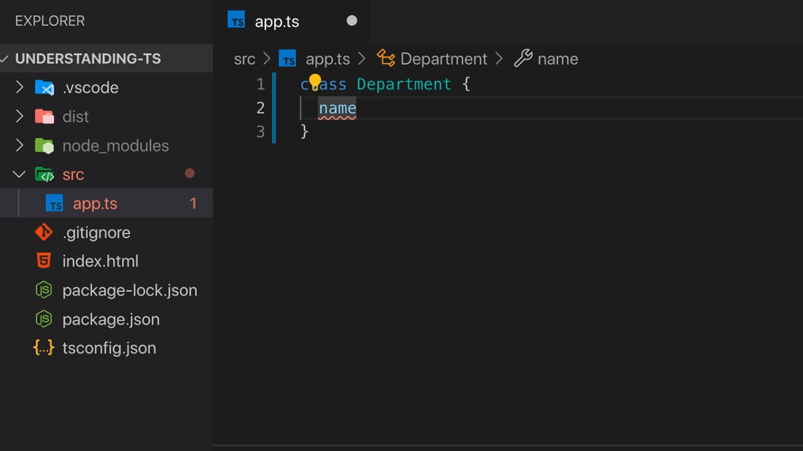
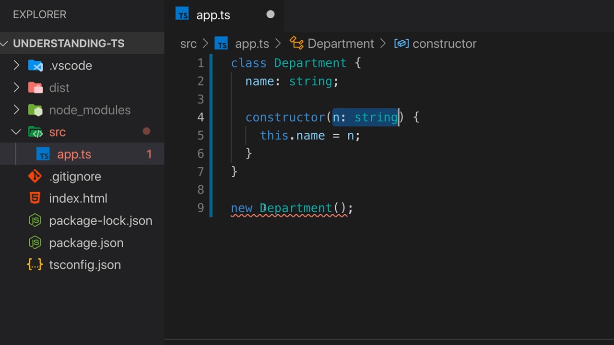
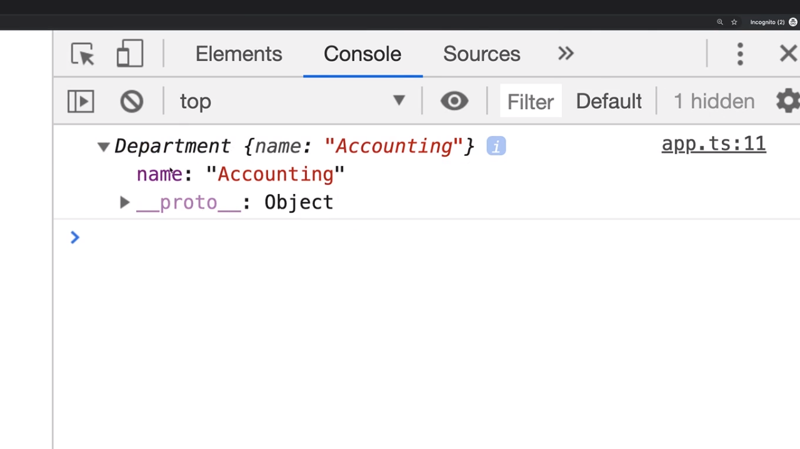

<p align="left">
 <a href="05_02.md">◀ Back: What Are Classes?</a>
</p>

---

# Creating a First Class.

En TypeScript para definir una clase lo que hacemos es utilizar la palabra reservada `class` (palabra reservada que también está recogida en JavaScript ya que en las últimas versiones del lenguaje la forma en la que se declara una clase es similar a lo que vamos a contar en este punto) seguida del nombre que le queramos dar a la clase siguiendo las reglas de creación de un identificador en JavaScript con la particularidad que, por covenio, se suele aplicar que la primera letra que forma el nombre de la clase ha de estar en mayúsculas.

Por ejemplo, vamos a suponer que estamos desarrollando una aplicación que va a servir para gestionar los diferentes departamentos que forman parte de una organización por lo que parece interesante tener una clase que se encargue de definir todos aquellos atributos y métodos que son comunes a todos ellos. Así pues comenzamos creando nuestra clase de la siguiente manera:

```ts
class Department {}
```

donde entre las llaves `{}` que recogen el cuerpo de nuestra clase lo que recogeremos posteriormente será el conjunto de atributos y métodos que definirán nuestra clase entendiendo como tal que ha de ser todas las capacidades que tendrán todas las instancias (objetos) que se crean a partir de ella.

---
**Nota:** para todos aquellos lectores que tengan experiencia en el desarrollo de aplicaicones con JavaScript es posible que hayan trabajado con las [constructor functions](https://www.w3schools.com/js/js_object_constructors.asp) para crear los objetos. Lo que tenemos que entender es que el uso de una clase en JavaScript no es más que un sintatic sugar que el lenguaje pone a nuestra disposición para simplicar el uso de estas constructor functions.

---

¿Qué tenemos que hacer para definir un atributo dentro de nuestra clase? Pues simplemente escribir el nombre que le queremos dar dentro del cuerpo de la misma como si se tratase de una variable salvo con la particularidad de que no vamos a tener que utilizar `let` o `const` para ello porque el compilador va a entender que se trata de un atributo que pertenece a la clase. Así, si cada uno de los departamentos que forman parte de nuestra organización va a tener un nombre este lo podemos recoger en el atributo `name` de la siguiente manera:

```ts
class Deparment {
  name
}
```

Ahora bien, como estamos trabajando con TypeScript, VSCode nos va a informar que no puede determinar el tipo de datos que tendrá asignado este atributo como se puede ver en la siguiente imagen:

<div style='text-align: center'>
  
</div>
<br />

Por lo que nuestro siguiente paso consistirá en establecer cuál es el tipo de datos que va a tener nuestro atributo siguiendo la notación habitual para definir un tipo de datos en TypScript, es decir, que tras la declaración del atributo escribiremos los dos puntos `:` seguidos del tipo de datos. Si en nuestro caso el atributo `name` va a tener un tipo de datos string lo que haremos será escribir:

```ts
class Deparment {
  name: string
}
```

Como se puede ver la definición de una clase es muy parecida a la forma en la que declaramos un objeto en JavaScript en el sentido de que cuando estamos declarando un objeto lo hacemos recogiendo pares clave-valor que lo conforman mientas que cuando estamos definiendo una clase lo que estamos haciendo es definir las propiedades de la clase mediante pares clave-tipo de datos.

Cuando estamos definiendo un atributo de una clase (también conocido como un campo o **field**) podemos asignarle un valor por defecto si así lo consideramos necesario sin más que, tras declarar su tipo de datos, utilizar el signo `=` seguido del valor que queremos asignarle. En nuestro ejemplo podríamos definir algo como lo siguiente:

```ts
class Deparment {
  name: string = 'DEFAULT'
}
```

Sin embargo algo como lo anterior no es lo habitual sino que junto con la clase se define una función especial (en el caso de estar hablando de clases las funciones que están contenidas dentro de la misma reciben el nombre de **method**) que nos va a servir para crear las instancias (objetos) a partir del molde que define la clase. Esta función recibe el nombre de **constructor**. Para establecerla dentro de una clase tenemos que declararla como cualquier otro función que forme parte de la misma (es decir, dentro de las llaves de apertura y cierre que engloban el código de la clase) pero utilizando la palabra reservada `constructor`. En nuestro ejemplo:

```ts
class Deparment {
  name: string

  constructor() {}
}
```

Por lo tanto, en el constructor de nuestras clases lo que tenemos que hacer es todas aquellas tareas de inicialización que estén asociadas a la creación de un nuevo objeto cuando este es creado. Es más, como sucede con cualquier otra función en TypeScript (y por lo tanto con cualquier método) el constructor de la clase va a poder aceptar los parámetro que precise para su correcta ejecución por lo que podemos escribir algo como lo siguiente:

```ts
class Deparment {
  name: string

  constructor(n: string) {}
}
```

Ahora bien, ¿cómo podemos hacer para que el valor que se ha recibido como parámetro sea asignado al atributo que hemos definido en la clase? En otras palabras, ¿cómo podemos hacer que el contenido del parámetro `n` sea asignado al atributo `name` de la clase? Aquí es donde entra en juego la palabra reserva `this` la cual nos servirá para hacer referencia al propia objeto de la clase, es decir, a la propia instancia y por lo tanto, gracias al operador punto `.` vamos a poder acceder a los atributos y métodos de la misma. En nuestro ejemplo esto se traduce en que para realizar la asignanción que queremos lograr tendremos que escribir algo como lo siguiente:

```ts
class Deparment {
  name: string

  constructor(n: string) {
    this.name = n
  }
}
```

Una vez que tenemos definida nuestra clase `Deparment` ¿cómo tenemos que hacer para crear las instancias de la misma (¿cómo tenemos que hacer para crear los objetos de la clase?) Pues simplemente fuera de la declaración de la clase tenemos que utilizar la palabra reservada `new` seguida del nombre de la clase y luego el paréntesis de apertura y cierre. En otras palabras:

```ts
new Department()
```

Sin embargo el código anterior dará un error de compilación y la razón no es otra que al utilizar la nomenclatura anterior lo que se está invocando es a la función `constructor` que está recogida dentro de la definición de la clase y en este caso hemos establecido que dicho constructor debe tener un parámetro y no solamente eso sino que además el valor del mismo ha de ser un string

<div style='text-align: center'>
  
</div>
<br />

Así, si no queremos que el código anterior produzca un error de compilación, lo que tenemos que hacer es crear la nueva instancia pasándo un string al constructor de la clase. Por lo tanto podemos escribir algo como lo siguiente:

```ts
new Department('Accounting')
```

Con la instrucción anterior lo que conseguimos es que se cree un nueva instancia (objeto) de la clase `Department` y como tal ese objeto va a tener todos los atributos y método que hayamos definido dentro de la clase. Esto lo podemos ver de forma sencilla si escribimos lo siguiente:

```ts
const accounting = new Department('Accounting')
console.log(accounting)
```

Si ahora guardamos nuestro trabajo, lo compilamos y lo ejecutamos en un navegador la salida que veremos por la consola de JavaScript será algo similar a lo que se recoge en la siguiente imagen:

<div style='text-align: center'>
  
</div>
<br />

Lo que aquí podemos ver es que estamos ante un objeto normal de JavaScript cambiando que en vez de preceder a la lista de propiedades que lo conforman con la palabra *Object* como sucede con un literal objeto de JavaScript lo que hace es escribir *Deparment* lo que nos viene a indicar que el objeto en cuestión para el que se están mostrando las propiedades pertenece a una determina clase en concreto y que esta clase es `Department`. 

Además podemos ver como el objeto que se ha creado tiene el atributo `name` y no solamente eso sino que el valor que está asignado al mismo es precisamente el valor que le hemos pasado cuando hemos creado la nueva instancia de la clase gracias al operador `new` (razón por la que tiene asignado el texto `Accounting`).

> Los campos (fields) que definimos en las clases son traducidos en las propiedades que posteriormente tendrán los objetos dentro de nuestra aplicación.

---

<p align="right">
 <a href="05_04.md">Next: Compiling to JavaScript ▶</a>
</p>
