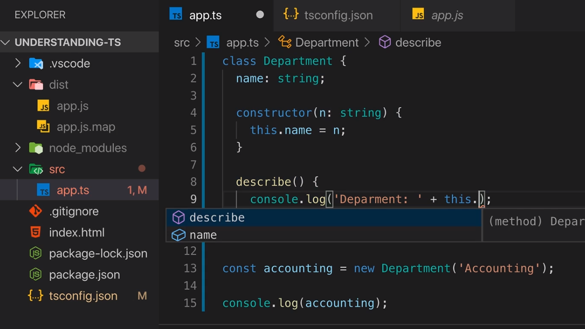
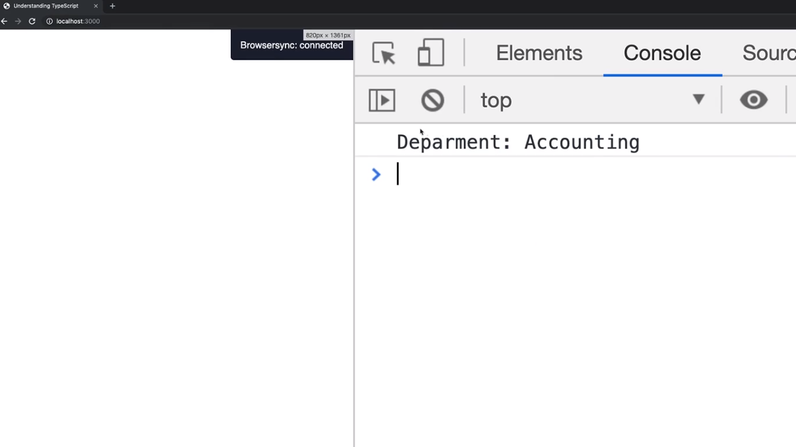
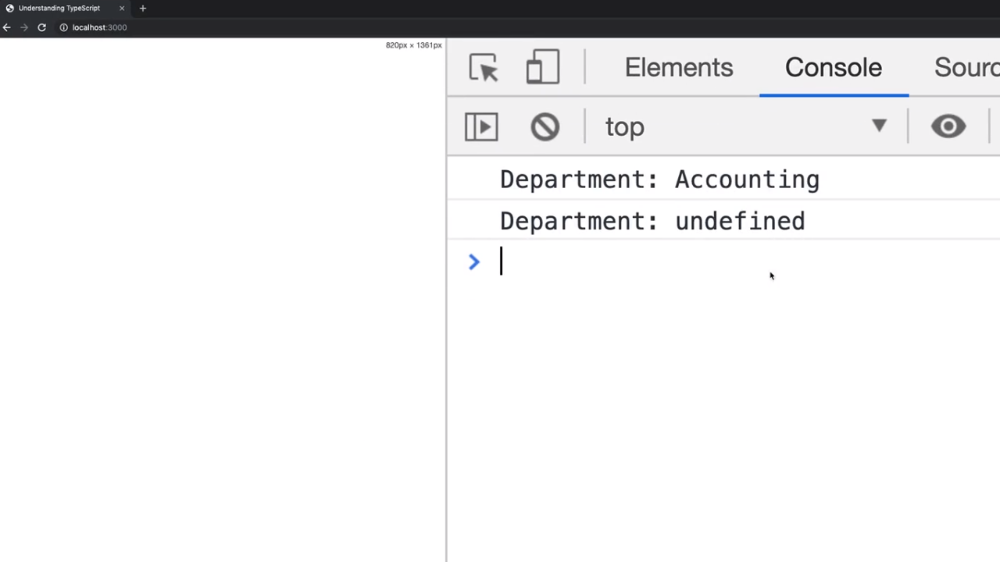
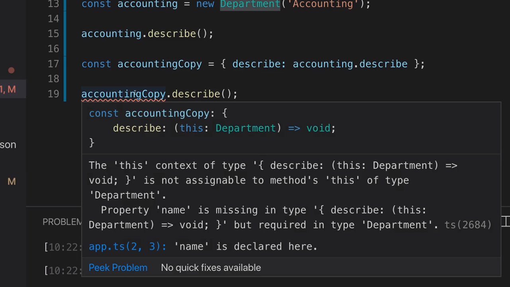
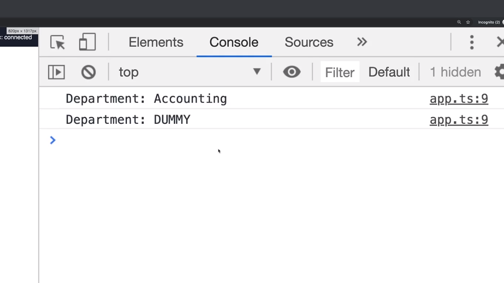

<p align="left">
 <a href="05_04.md">◀ Back: Compiling to JavaScript</a>
</p>

---

# Contructor Functions & The this Keyword.

Al igual que hemos definido el método `constructor` en nuestra clase podemos definir todos los métodos que precisemos para funcionar con los objetos de nuestra clase de forma similar a como estamos añadiendo atributos. Así, siguiendo con el ejemplo con el que estamos trabajando podemos añadir el método `describe` de la siguiente manera:

```ts
class Department {
  name: string

  constructor(n: string) {
    this.name = n
  }

  describe() {}
}
```

¿Qué patrón se sigue a la hora de definir un método dentro de una clase? Pues simplemente se escribe el nombre del mismo (en este caso `describe`) siguiendo los mismos criterios de nomenclatura que tenemso para nombrar las funciones en JavaScript seguido de los parétesis de apertura y cierre `()` (donde recogemos los parámetros con los que se llamará al método si es que son necesarios). Luego, entre llaves `{}` lo que vamos a recoger es el conjunto de las instrucciones que se ejecutarán cuando dicho método es invocado.

En nuestro caso vamos a suponer que el método `describe` lo que va a hacer es mostrar el nombre del departamento por ejemplo por la consola. Esto podríamos hacerlo de la siguiente manera:

```ts
class Department {
  name: string

  constructor(n: string) {
    this.name = n
  }

  describe() {
    console.log('Department: ' + name)
  }
}
```

Sin embargo el código anterior no va a funcionar ¿pero por qué? Pues porque tal y como está escrito lo que JavaScript va a hacer es buscar un variable denominada `name` la cual ha de estar definida dentro del método (en otras palabras, dentro de las llaves de apertura y cierre que engloban al código de dicho método) o bien que se trate de una variable que se esté recogida fuera de clase pero declarada como una variable global. ¿Qué podemos hacer para referenciar al atributo de la clase o a otro método de la misma? Pues algo como lo que hemos hecho en el constructor de la clase y utilizar la palabra reservada `this`.

Cuando estamos utilizando `this` lo que le estamos diciendo a JavaScript es que queremos que haga referencia a la instancia concreta de la clase sobre la que se está invocando el método (es decir, el objeto sobre el que se invoca), si lo escribimos en una herramienta como VSCode (seguido de un punto `.`) nos va a mostrar un menú desplegable en el que podemos elegir entre los atributos y métodos que vamos a tener disponibles como se puede ver en la siguiente imagen:

<div style='text-align: center'>
  
</div>
<br />

Como en nuestro caso lo que queremos hacer es acceder al valor que tiene el atributo `name` del objeto sobre el que se está invocando al método `describe` lo que escribiremos será algo como lo siguiente:

```ts
class Department {
  name: string

  constructor(n: string) {
    this.name = n
  }

  describe() {
    console.log('Department: ' + this.name)
  }
}
```

De esta manera si ahora en el código creamos una nueva instancia de la clase y posteriormente invocamos sobre ella al método `describe` como se puede ver a continuación:

```ts
const accounting = new Department('Accounting')
accouting.describe()
```

Si ahora guardamos nuestro trabajo, lo volvemos a compilar y lo ejecutamos en el navegador podemos ver que efectivamente en la consola de JavaScript se estará mostrando el valor del atributo `name` de la instancia concreta de la clase:

<div style='text-align: center'>
  
</div>
<br />

Para todos aquellos desarrolladores que estén familiarizados a trabajar con JavaScript ya conocen que el uso de la palabra reservada `this` muchas veces es complicado. Por ejemplo si en nuestro código ejemplo escribimos algo como lo siguiente:

```ts
const accounting = new Department('Accounting')
accouting.describe()
const accountingCopy = { describe: accounting.describe }
accountingCopy.describe()
```

donde lo que estamos defiendo es un object literal de JavaScript que posee el método `describe` y el código del mismo será el mismo método `describe` al que hace referencia la instancia a la que apunta la variable `accounting` y posteriormente invocarlo ¿qué piensa el lector que ocurrirá? La respuesta la tenemos en la siguiente imagen:

<div style='text-align: center'>
  
</div>
<br />

y la razón por la que se produce esto es porque la forma en la que se ha creado el objeto `accountingCopy` ha sido a través de un object literal de JavaScript lo cual supone que no ha sido creado utilizando para ello ninguna clase (se trata de un *dummy object* entendiendo por tal todos aquellos objetos que son creados directamente en el código con el uso de las llaves `{}`) donde el valor del método `describe` está apuntando al código del método `describe` que está recogido en la definición de la clase `Desparment` y dentro del mismo se hace referencia a `this` pero en este caso como no tiene el atributo `name` (el object literal no lo tiene definido) escribirá `undefined`.

> Una regla para poder determinar qué objeto es **this** en cualquier momento durante la ejecución del código es pensar en qué objeto tiene la responsabilidad de llamar al código se va a ejecutar.

Aplicando el párrafo anterior a nuestro ejemplo, podemos entender que en el código que se va a ejecutar quién es responsable de invocar al método `describe` es el objeto `accountingCopy` ya que de esta manera está especificado en el código ya que lo estamos invocando a través de dicha variable. Como ya hemos espeficado este objeto no tiene un atributo `name` y por lo tanto cuando dentro de la ejecución de `describe` se trata de acceder al atributo `name` al no tenerlo se escribre por la consola el valor `undefined`.

Podríamos pensar que una solución a este problema sería definir nuestro método al que le pasaríamos un parámetro al que podemos denominar `this`:

```ts
class Department {
  name: string

  constructor(n: string) {
    this.name = n
  }

  describe(this) {
    console.log('Department: ' + this.name)
  }
}
```

y aquí es donde tenemos que entender cómo funciona internamente JavaScript ya que `this` es una palabra reservada para el lenguaje y, lo importante, es que pese a que no se indique de forma explícita se trata de un parámetro que siempre es pasado como parte de la invocación del método lo pongamos nosotros o no (en otras palabra, siempre hay un `this` al que se puede hacer referencia dentro de la función). Con esto lo que queremos decir es que el hecho de nombrar de forma explícita el parámetro no cambiará nada.

Pero ahora tenemos que pensar que estamos trabajando con TypeScript y por lo tanto que podemos establecer cuál es el tipo de datos que va a poder tener este parámetro `this`. Para ello lo primero que hemos de saber es que el tipo de datos que está asociado a un objeto de una determinada clase es el nombre de la clase que lo define por lo que podemos hacer algo como lo siguiente:

```ts
class Department {
  name: string

  constructor(n: string) {
    this.name = n
  }

  describe(this: Department) {
    console.log('Department: ' + this.name)
  }
}
```

De esta manera el compilador de TypeScript va a ser capaz de detectar el problema de tipado que hay en el código cuando estamos tratando de invocar al método a través del object literal que hemos definido. En VSCode podemos obtener más información de este error:

<div style='text-align: center'>
  
</div>
<br />

Y la razón del error es que cuando estamos invocando al método `describe` a través de la instancia referida por la variable `accountingCopy` no es a través de una instancia de la clase `Department` y por lo tanto no se cumple el chequeo de tipos que hemos definido en el código de nuestro método.

> El tipo de datos que está asociado a un objeto de una determinada clase es la clase que lo define.

Sin embargo esto no es cierto del todo porque simplemente con el hecho de añadir el atributo `name` al literal object que está asociado a `accountingCopy` el error de tipado desaparece:

```ts
const accounting = new Department('Accounting')
accouting.describe()
const accountingCopy = { name: 'DUMMY', describe: accounting.describe }
accountingCopy.describe()
```

y la razón no es otra que el compilador de TypeScript ve que el objeto que tiene asignado tiene los mismos atributos y métodos (con sus corespondientes tipos de datos) que el clase que representa `Department` y para el desde el punto de tipado de datos, es una asignación correcta por lo que no dará ningún tipo de error.

De hecho si ahora guardamos nuestro trabajo, lo compilamos y lo volvemos a ejecutar en el navegador podemos comprobar como los valores que se muestran por la consola son los que realmente esperaríamos:

<div style='text-align: center'>
  
</div>
<br />

---

<p align="right">
 <a href="05_06.md">Next: private and public Access Modifiers ▶</a>
</p>
