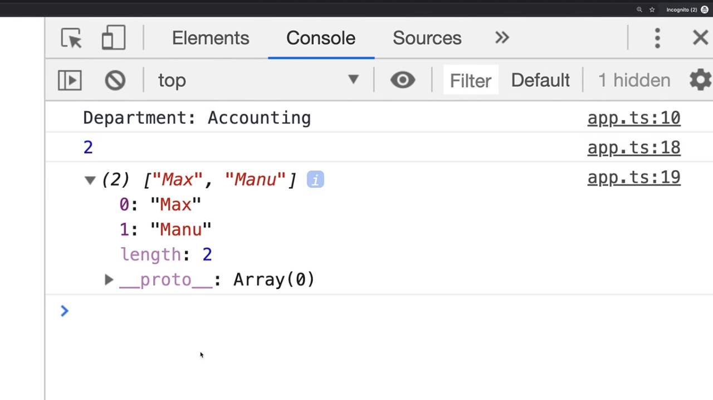
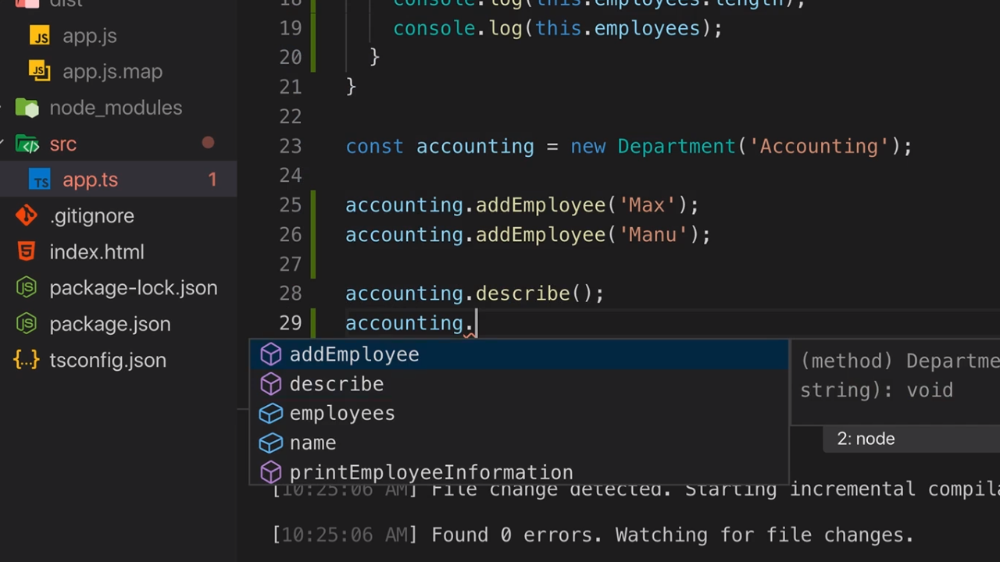
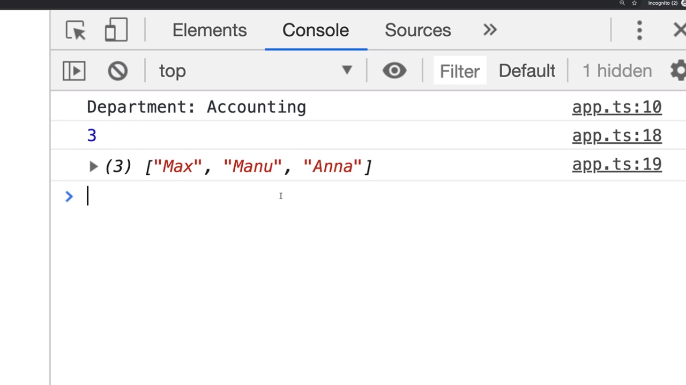
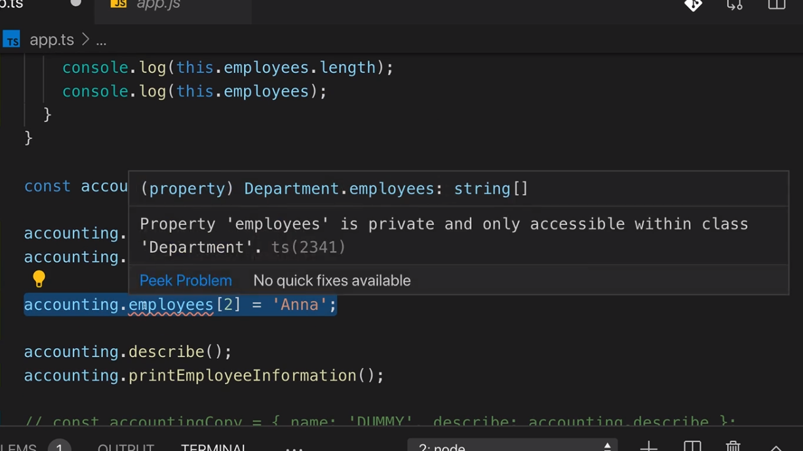

<p align="left">
 <a href="05_04.md">◀ Back: Contructor Functions & The this Keyword</a>
</p>

---

# private and public Access Modifiers.

Vamos a añadir más información en la forma de nuevos atributos a la clase con la que estamos trabajando. Por ejemplo, vamos a suponer que asociado a cada uno de los departamentos que podemos tener recogidos en la aplicación tendremos una serie de empleados que pertenecen al mismo y definimos que vamos a recoger esta información con un array de string en el que cada uno de los elementos que lo forman va a ser el nombre de un empleado. 

```ts
class Department {
  name: string,
  employees: string[] = []

  constructor(n: string) {
    this.name = n
  }

  describe(this: Department) {
    console.log('Department: ' + this.name)
  }
}
```

Con la declaración anterior lo hemos definido el atributo `employees` cuyo tipo de datos va a ser un array de string y además lo inicializamos a un array vacío. El siguiente paso que queremos dar va a consistir en añadir un nuevo método en la clase que permita añadir un nuevo empleado por lo que definimos algo como lo siguiente:

```ts
class Department {
  name: string,
  employees: string[] = []

  constructor(n: string) {
    this.name = n
  }

  describe(this: Department) {
    console.log('Department: ' + this.name)
  }

  addEmployee(employee: string) {
    this.employees.push(employee)
  }
}
```

El método `addEmployee` espera recibir como parámetro un string que representará el nombre del empleado que vamos a añadir y simplemente lo que hace es situarlo como el último elemento del array que recoge los nombres de todos los empleados del departamento, en otras palabras, como el último elemento del array al que hace referencia el atributo `employees`.

Ahora vamos a añadir un nuevo método a la clase que se encargará de mostrar la información de los empleados que forman parte de un departamente. Para ello creamos el método `printEmployeeInformation` tal y como sigue:

```ts
class Department {
  name: string,
  employees: string[] = []

  constructor(n: string) {
    this.name = n
  }

  describe(this: Department) {
    console.log('Department: ' + this.name)
  }

  addEmployee(employee: string) {
    this.employees.push(employee)
  }

  printEmployeeInformation() {
    console.log(this.employees.length)
    console.log(this.employees)
  }
}
```

Como se puede ver la funcionalidad que proporciona el método `printEmployeeInformation` es más bien sencilla ya que lo único que estamos haciendo es escribir el número total de empleados que tiene el departamento por la consola junto con el contenido del array que contiene sus nombres.

Vamos a continuar con el código que estamos desarrollando creando una nueva instancia de `Department` y añadiendo alguno empleados y posteriormente llamar a los métodos que nos mostrarán la información del departamento:

```ts
const accounting = new Department('Accounting')

accounting.addEmployee('Max')
accounting.addEmployee('Manu')

accounting.describe()
accounting.printInformation()
```

Si ahora guardamos nuestro trabajo, volemos a compilarlo y lo ejecutamos en un navegador en la consola de JavaScript vamos a ver algo como lo siguiente:

<div style='text-align: center'>
  
</div>
<br />

lo cual está acorde con lo que esperábamos ya que el nombre del departamento es `Accounting`, hemos añadido dos empleados y los nombres de estos empleados son `Max` y `Manu`.

El problema que tenemos aquí es que cuando estamos trabajando en el código podemos ver cómo es posible ver tanto los atributos como los métodos que forman parte del objeto que se ha instanciado:

<div style='text-align: center'>
  
</div>
<br />

Como podemos ver se puede cambiar el contenido del array `employees` desde el exterior de la clase lo que hace que perdamos el control sobre el mismo. Es por esto que podríamos hacer algo como lo siguiente en nuestro código:

```ts
const accounting = new Department('Accounting')

accounting.addEmployee('Max')
accounting.addEmployee('Manu')

accounting.employees[2] = 'Anna'

accounting.describe()
accounting.printInformation()
```

Es decir, que en la posición 2 del array que contiene la información de todos los empleados de nuestro departamento hemos situado a un nuevo empleado al que hemos llamado `Anna`. Si ahora guardamos la información, compilamos a lo volvemos a ejecutar en el navegador dentro de la consola de JavaScript podemos ver cómo efectivamente `Anna` aparece dentro del conjunto de empleados del deparmento:

<div style='text-align: center'>
  
</div>
<br />

---
**Nota:** aunque la explicación la estamos haciendo centrándonos en el atributo `employees` de nuestra clase de ejemplo lo mismo es aplicable al atributo `name` ya que tal y como lo tenemos definido en este momento es modificable desde el esterior de la clase sin hacer uso de ningún método.

---

El problema ante una situación como la que acabamos de describir es que normalmente cuando estamos desarrollando una aplicación más o menos grande no queremos que exista la posibilidad de modificar los atributos de una clase desde el exterior de una forma directa sino que únicamente exista una posibilidad para realizar estas modificaciones. En el caso de nuestro ejemplo, lo que queremos lograr es que exista una única posibilidad de añadir un empleado a un departamento y además que este se lleve a cabo a través del método `addEmployee` ya que en un aplicación real es posible que antes de añadirlo se tenga que realizar algún tipo de validación sobre el parámetro cosa que no se ejecutaría en el caso de que se pudiera añadir un empleado directamente:

```ts
class Employee {
  // ...
  addEmployee(employee: string) {
    // Some validation.
    this.employees.push(employee)
  }
}
```

En otras palabras lo que queremos lograr es que el campo `employees` no sea accesible desde el exterior de la clase. En TypeScript esto es posible gracias al uso del modificador de visibilidad **private**. Para utilizarlo simplemente lo que tenemos que hacer es escribir la palabra reservada `private` (palabra que está reservada en TypeScript pero no en JavaScript) delante de la declaración del atributo. Así en nuestro ejemplo escribiríamos:


```ts
class Department {
  name: string,
  private employees: string[] = []
  // ...
}
```

Al marcar el atributo como private lo que estamos diciendo a TypeScript es que ahora este atributo `employee` únicamente va a estar accesible desde dentro de la clase y por lo tanto únicamente lo van a poder ver todas las instancias de la clase. En otras palabras, cualquier método que recojamos dentro de la clase `Deparment` va a poder acceder al atributo `employees`:

```ts
class Employee {
  name: string,
  private employees: string[] = []

  // ...
  addEmployee(employee: string) {
    // Some validation.
    this.employees.push(employee)
  }

  printEmployeeInformation() {
    console.log(this.employees.length)
    console.log(this.employees)
  }
}
```

Pero ahora ya no va a ser posible acceder de forma directa a dicho atributo y así nos lo va a hacer notar TypeScript:

<div style='text-align: center'>
  
</div>
<br />

Así pues lo que estamos logrando es forzar a que cuando se quiera añadir un nuevo empleado a un departamento esto se tenga que hacer a través del método `addEmployee` de la clase y no de forma directa a través del atributo lo que nos permite tener un mayor control acerca de cómo se comportan nuestros objetos.

> Al igual que se puede marcar un atributo como **private** es posible marcar cualquier método de la clase con este modificador lo que hará que no sea visible (no pueda ser invocado) desde fuera de instancias de la propia clase.

La palabra reservada `private` que precede a la declaración de nuestro atributo (o método) de la clase se conoce como un modificador de visibilidad (**visibility modifier**). Además de este tenemos la palabra reservada `public` (palabra que no está reservada en JavaScript) y que es el modificador de visibilidad que se aplica por defecto si no indicamos lo contrario. Es decir, que la declaración de los atributos de nuestra clase de ejemplo es equivalente a la siguiente:

```ts
class Employee {
  public name: string,
  private employees: string[] = []
  // ...
}
```

---
**Nota:** normalmente la convención de desarrollo es no utilizar la palabra `public` para indicar que un atributo o método es accesible desde el exterior de la clase ya que es el modificador por defecto.

---

Como ya hemos dicho anteriormente cuando un atributo o método es `public` vamos a podelo modificar o invocar desde el exterior de la clase. Esto quiere decir que si dejamos las cosas como están hasta ahora en nuestro ejemplo, el siguiente código será correcto:

```ts
const accounting = new Department('Accounting')

accounting.addEmployee('Max')
accounting.addEmployee('Manu')

accounting.name = 'NEW NAME'

accounting.describe()
accounting.printInformation()
```

---
**Nota:** técnicamente JavaScript no tiene los conceptos de visibilidad pública o privada que hemos estado describiendo en este punto y únicamente en las versiones más actuales del lenguaje se han añadido. Nos tiene que quedar muy claro que por defecto en JavaScript todas los atributos y métodos de los objetos van a ser siempre públicos y por lo tanto accesibles desde el exterior de los mismos.

---
**Nota:** también hay que recordar que el hecho de declarar un atributo como privado en TypeScript no va a impedir que en el código JavaScript que se genere esté el acceso al mismo que no está permitido. Tenemos que recordar que el compilador de TypeScript siempre generará el código JavaScript equivalente pese a que haya errores de compilación por lo que una práctica que se debería siempre seguir es no pasar nunca a producción código TypeScript que tuviese errores de compilación.

---
**Nota:** si se quiere obtener más información acerca de cómo se declaran los campos privados en JavaScript en las versiones más modernas del lenguaje se recomienda leer la [documentación oficial](https://developer.mozilla.org/en-US/docs/Web/JavaScript/Reference/Classes/Private_class_fields) al respecto.

---

<p align="right">
 <a href="05_07.md">Next: Shorthand Initialization ▶</a>
</p>
