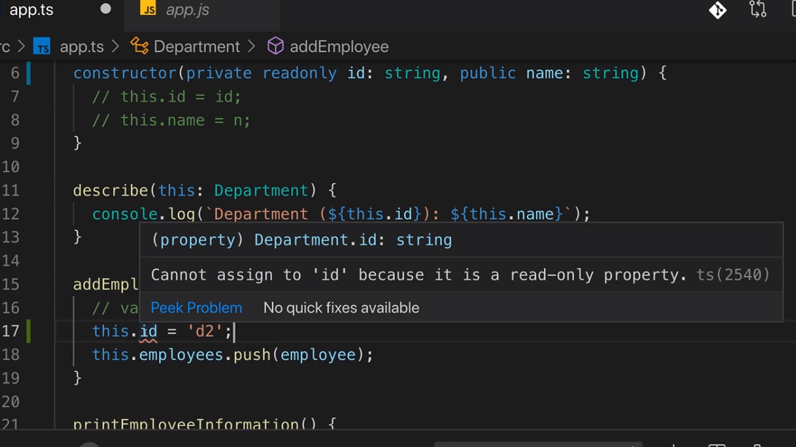

<p align="left">
 <a href="05_07.md">◀ Back: Shorthand Initialization</a>
</p>

---

# readonly Properties.

Además de los modificadores de visibilidad `private` y `public` en TypeScript tenemos un modificador más de visibilidad que se denomina **readonly** el cual representa a todos aquello atributos que pudiendo ser a su vez públicos o privados, no van a poder cambiar una vez son inicializados. 

En nuestro ejemplo que estamos desarrollando uno de los atributos candidatos a tener este modificar es `id` que recordemos que es el lugar en el que queremos guardar el identificador del departamento que estamos creando. Así pues nuestro lo declararíamos de la siguiente manera:

```ts
class Department {
  private employee: string[] = []

  constructor(private readonly id: string, private name: string) { }

  // ...
}
```

Es decir que la forma de establecer que el atributo `id` es **readonly** es escribiendo tras su modificador de visibilidad la palabra reservada `readonly` de TypeScript (JavaScript no posee esta palabra reservada).

---
**Nota:** esto mismo que hemos aplicado en el parámetro de la clase se aplica en el caso de estar definiendo un atributo de la misma ya que al escribirlo directamente podremos, tras el modificador de visibilidad, establecer si es readonly o no.

```ts
class Department {
  private readonly id
  // ...
}
```

---

¿Qué es lo que nos va a asegurar TypeScript cuando establecemos un atributo como readonly? Pues simplemente que si posteriormente a la asignación de su valor en el constructor de la clase tratamos de asignarle un nuevo valor se lanzará un error de compilación. En otras palabras, `readonly` es un valor que solamente se va a poder establecer durante la inicialización de la clase. Siguiendo con nuestro ejemplo esto lo podemos en el caso de que si en cualquiera de los métodos de la clase tratamos de cambiar el valor del atributo readonly TypeScript nos reportará un valor y, en caso de estar utilizando VSCode en el tool-tip que nos muestra obtendremos más información acerca del problema que está pasando:

<div style='text-align: center'>
  
</div>
<br />

> Gracias a `readonly` vamos a poder expresar de una forma muy clara que un atributo no va a poder cambiar una vez ha sido inicializado lo que hace que las intenciones que tratamos de comunicar con nuestro código queden todavía mucho más claras.

Un detalle más a tener en cuenta es que cuando nos vamos al archivo JavaScript que contiene nuestro código traducido veremos que no hay ninguna referencia a los modificadores de visibilidad ni reestricción de inicialización que hemos estado aplicando ya que no forman parte de la especificación de JavaScript para la que estamos generando nuestro código (que en nuestro ejemplo es ES5).

```js
'use strict'
var Deparment = (function() {
  function Deparment(id, name) {
    this.id = id
    this.name = name
    this.employees = []
  }
  Department.prototype.describe = function () {
    console.log('Department (' + this.id + '): ' + this.name)
  }
  // ...
})
```

---
**Nota:** en el código de JavaScript de la versión ES5 que ha sido traducido podemos ver como los métodos que están recogidos en la definición de nuestra clase al final son añadidos como funciones que están asociados al objeto prototype de la función que representa al constructor de las instancias de la clase.

En este manual no vamos a estudiar qué son los prototypes de JavaScript ya que cuando estemos trabajando con TypeScript casi siempre estaremos haciendo uso de clases por lo que dejamos al lector que pueda estar interesado en ello que lea la [documentación recogida en MDN](https://developer.mozilla.org/en-US/docs/Web/JavaScript/Reference/Global_Objects/Object) al respecto.

---

<p align="right">
 <a href="05_09.md">Next: Inheritance ▶</a>
</p>
