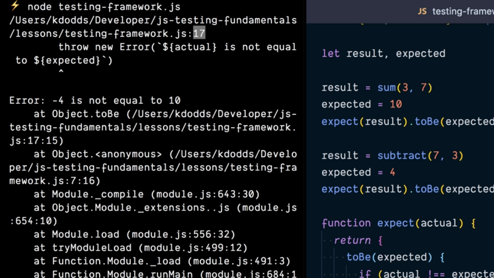
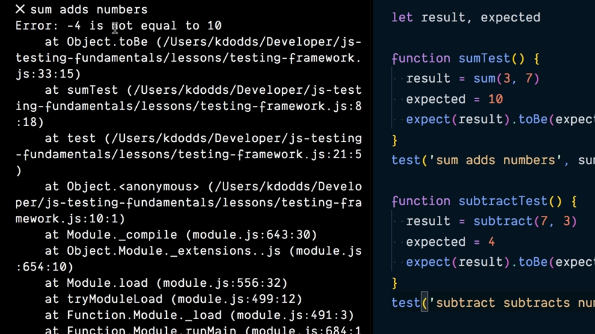

# Built a JavaScript Testing Framework.

La implementación que hemos realizado en el capítulo anterior para la ejecución de los test se basa en que en el momento en el que falla alguno de ellos (es decir, en el momento en el que se lanza un Error) la ejecución del resto de los test no continúa y por lo tanto no sabremos el resultado de la ejecución de los test que puedan estar escritos tras el que ha fallado lo cual, al menos en un principio, no parece algo demasiado bueno para nuestros propósitos de testing.

```js
const { sum, subtract } = require('../math')

let result, expected

result = sum(3, 7)
expected = 10
expect(result).toBe(expected)

result = subtract(7, 3)
expected = 4
expect(result).toBe(expected)

function expect(actual) {
  return {
    toBe(expected) {
      if (action !== expected) {
        throw new Error(`${ actual } is not equal to ${ expected }.`)
      }
    }
  }
}
```

Si ahora guardamos el contenido del código anterior dentro del fichero `testing-framework.js` y lo ejecutamos veremos que como parte del stack trace asociado al mensaje de error se nos está indicando que el error se lanza en la línea que está contenida dentro del código de la asserción `toBe` pero sin indicarnos mucho más, por lo que no sabremos si es como consecuencia de la invocación del primero de los test o del segundo.

<div style='text-align: center'>
  
</div>
<br />

Esto al final se traduce en que para poder detectar en qué lugar del código se ha producido el error y así poder determinar qué test ha fallado, tengamos que profundizar mucho más en la stack trace.

Otra manera de entender lo que acabamos de decir y focalizándolo en nuestro ejemplo es que para el caso del mensaje de error:

```console
[...]
Error: -4 is not equal to 10
```

nosotros como desarrolladores no tenemos una forma sencilla de poder determinar dónde se ha producido el error y por lo tanto tratar de solventarlo lo antes posible. Es para cubrir esta necesidad por lo que surgen lo que se conoce como **Testing Frameworks** que, entre otras cosas, van a darnos unos mensajes que error que nos ayudarán muchísimo para poder trazar el punto del programa en el que se ha producido.

Vamos a crear la función `test` para que simule nuestro Testing Framework. Dicha función recibe dos parámetro siendo el primero de ellos un string que recogerá una descripción del test que se está llevando a cabo (`title`) y el segundo la función que se ha de ejecutar para probar si se produce un error o no (`callback`).

```js
function test(title, callback) {
}
```

En la implementación deberemos tener en cuenta que como consecuencia de la ejecución del `callback` se puede producir un error hecho que detendría la ejecución de todos los test que quedasen pendientes y lo que pretendemos es que siempre que se ejecuten lo hagan todos independientemente de que lancen un error o no. Así, el bloque de código que está contenido dentro de esta esta función lo recubriremos de una instrucción `try/catch`:

```js
function test(title, callback) {
  try {
    callback()
    console.log(`✔️ ${ title }`)
  } catch (error) {
    console.error(`❌ ${ title }`)
    console.error(error)
  }
}
```

El siguiente paso que tendremos que dar ha de ser una función que nos permita ejecutar el código del test asociado a la ejecución de la función `sum` para la suma de los dos números:

```js
function sumTest() {
  result = sum(3, 7)
  expected = 10
  expect(result).toBe(expected)
}
```

Siendo el siguiente paso invocar a la función `test` que hemos definido pasándole un título que describa el test que vamos a llevar a cabo y el camo callback la función que acabamos de definir:

```js
test('sum adds numbers', sumTest)
```

Repitiendo estos mismos pasos pero para el caso del test que tiene que ver con la ejecución de la función `subtract` nos encontraremos con el siguiente código:

```js
function subtractTest() {
  result = subtract(7, 3)
  expected = 4
  expect(result).toBe(expected)
}

test('subtract subtracts numbers', subtractTest)
``` 

Así el código completo de nuestro fichero `testing-framerwork.js` será el que se puede mostrar a continuación:

```js
const { sum, subtract } = require('../math')

let result, expected

function sumTest() {
  result = sum(3, 7)
  expected = 10
  expect(result).toBe(expected)
}

test('sum adds numbers', sumTest)

function subtractTest() {
  result = subtract(7, 3)
  expected = 4
  expect(result).toBe(expected)
}

test('subtract subtracts numbers', subtractTest)

function expect(actual) {
  return {
    toBe(expected) {
      if (action !== expected) {
        throw new Error(`${ actual } is not equal to ${ expected }.`)
      }
    }
  }
}

function test(title, callback) {
  try {
    callback()
    console.log(`✔️ ${ title }`)
  } catch (error) {
    console.error(`❌ ${ title }`)
    console.error(error)
  }
}
```

Si ahora desde NodeJS volvemos a ejecutar los test veremos que que por una parte se nos está mostrando que uno delos dos test que hemos realizado falla (el que tiene que ver con la suma de los números) gracias al mensaje de error que hemos definido junto con la stack trace que se tiene en el momento en el que se ha producido el error, mientras que el test que se encarga de probar la resta de los números ha finalizado correctamente.

<div style='text-align: center'>
  
</div>
<br />

Como desarrolladores esta información nos va a ayudar enormemente porque ahora sabemos que el error no está en la función `subtract` (funciona correctamente si atendemos a los test que hemos definido) si no que está en la función `sum`.

Todavía podemos hacer algún tipo de refactorización adicional para que el código esté mucho mejor estructurado y límpio. Lo primero es hacer que las variables `result` y `expected` dejen de ser globales y pasen a formar parte de las funciones callback que se pasan como parámetro a la función `test`:

```js
function sumTest() {
  const result = sum(3, 7)
  const expected = 10
  expect(result).toBe(expected)
}

// ...

function subtractTest() {
  const result = subtract(7, 3)
  const expected = 4
  expect(result).toBe(expected)
}
```

Y no solamente esto sino que además podemos definir estas funciones callback como **arrow functions** de ES6 y además pasarlas directamente como el segundo parámetro en la invocación de `test`:

```js
test('sum adds numbers', () => {
  const result = sum(3, 7)
  const expected = 10
  expect(result).toBe(expected)
})

test('subtract subtracts numbers', () => {
  const result = subtract(7, 3)
  const expected = 4
  expect(result).toBe(expected)
})
```

<br />

----
<div>
  <div style="float: left">
    <a href="">
      < Built a JavaScript Assertion Library
    </a>
  </div>
  <div style="float: right">
    <a href="">
      Support Async Tests with JavaScript Promises >
    </a>
  </div>
</div>
