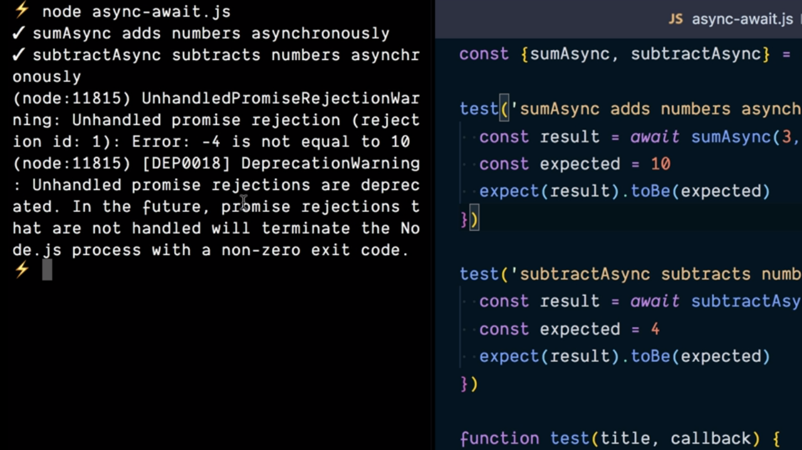
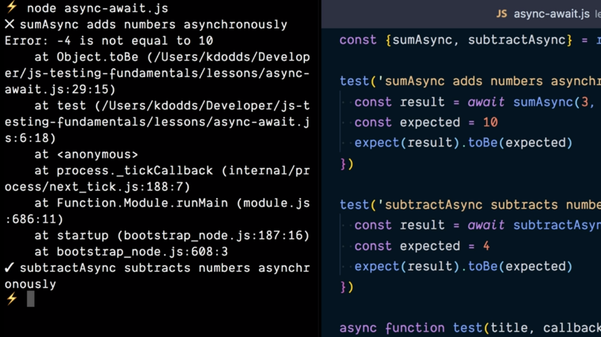

# Support Async Tests with JavaScript Promises.

En los puntos anteriores hemos visto que de una forma más o menos sencilla hemos podido crear un Testing Framework que opere con código síncrono pero, como desarrolladores de JavaScript, sabemos que no siempre vamos a tener código de este tipo sino que en muchas ocasiones nos vamos a tener que enfrentar a código asíncrono.

Supongamos que creamos un nuevo archivo dentro de la aplicación que estamos trabajando el cual servirá para probar las versiones asíncronas de las las funciones que realizan la suma y la resta de los dos parámetros que reciben:

```js
const { sumAsync, subtractAsync } = require('../math')

test('sumAsync adds numbers asynchronously', async () => {
  const result = sumAsync(3, 7)
  const expected = 10
  expect(result).toBe(expected)
})

test('subtractAsync subtracts numbers asynchronously', async () => {
  const result = subtractAsync(7, 3)
  const expected = 4
  expect(result).toBe(expected)
})

function expect(actual) {
  return {
    toBe(expected) {
      if (action !== expected) {
        throw new Error(`${ actual } is not equal to ${ expected }.`)
      }
    }
  }
}

function test(title, callback) {
  try {
    callback()
    console.log(`✔️ ${ title }`)
  } catch (error) {
    console.error(`❌ ${ title }`)
    console.error(error)
  }
}
```

Como se puede ver el código para probar este tipo de funciones asíncronas que están basadas en las Promises de JavaScript es muy sencillo ya que lo único que tenemos que hacer es que la función callback que se le pasa como parámetro a la función `test` se establezca como asíncrona gracias al uso de la palabra reservada `async` y dentro del código de la misma cuando tengamos que esperar por el resultado asociado a que una Promise es resuelta simplemente haremos uso de la palabra reservada `await`. El resto del código de la función callback quedará igual que en la versión síncrona de los test.

Sin embargo si ahora mismo ejecutamos los test de nuestra aplicación se nos informará de que ambos test finalizarán de forma correcta pese que la implementación de la función `sumAsync` tampoco realiza bien su labor. En la siguiente imagen podemos ver el resultado por la consola de la ejecución:

<div style='text-align: center'>
  
</div>
<br />

Vemos que NodeJS nos informa de que el resultado de la ejecución de ambos test ha sido correcto en las dos primeras líneas, seguido de un mensaje de warning en el que se nos indica que no se está capturando el caso en el que alguna derivado de que una de que la Promise asociada a la función `sumAsync` no realiza bien su trabajo (de hecho podemos ver el error que se ha producido y que provoca que la Promise no se resuelve, como parte del mensaje que se muestra por la consola):

```console
[...]
ion id:1) Error: -4 is not equal to 10
[...]
```

¿Cómo podemos resolver este tipo de casuísticas en nuestro Test Framework? El primer paso pasa por hacer que la función `test` que se invoca para ejecutar los test que escribimos ha de ser declarada como asíncrona gracias al uso de la palabra reservada `async` y como la función callback que se recibe como parámetro puede o no retornar un Promise lo que vamos a hacer es modificar su invocación precediéndola de la palabra reservada `await` garantizado que la función no continuará su ejecución hasta que no finalice.

```js
async function test(title, callback) {
  try {
    await callback()
    console.log(`✔️ ${ title }`)
  } catch (error) {
    console.error(`❌ ${ title }`)
    console.error(error)
  }
}
```

Con esto lo que logramos es que en el caso de que la Promise que está asociada a la función retorne con un error (sea rechazada) lo que sucederá es que se mostrará el mensaje de error que está contenido en el bloque `catch` y si la Promise se resuelve entonces la ejecución continuará mostrando el éxito en la realización del test.

Y no solamente esto, en el caso de que la función callback sea síncrona el efecto de las palabras `async` y `await` no tiene sentido pero no provoca ningún tipo de error durante la ejecución.

Tras este cambio si ahora volvemos a ejecutar los test de nuestro aplicación la información que obtenemos por la consola es la que estábamos esperando: un mensaje indicando que el test sobre la función `sumAsync` ha fallado mientras que el test sobre la función `subtractAsync` funcionará correctamente.

<div style='text-align: center'>
  
</div>
<br />

<br />

----
<div>
  <div style="float: left">
    <a href="">
      < Built a JavaScript Testing Framework
    </a>
  </div>
  <div style="float: right">
    <a href="">
      Provide Helper Functions as Globals >
    </a>
  </div>
</div>
