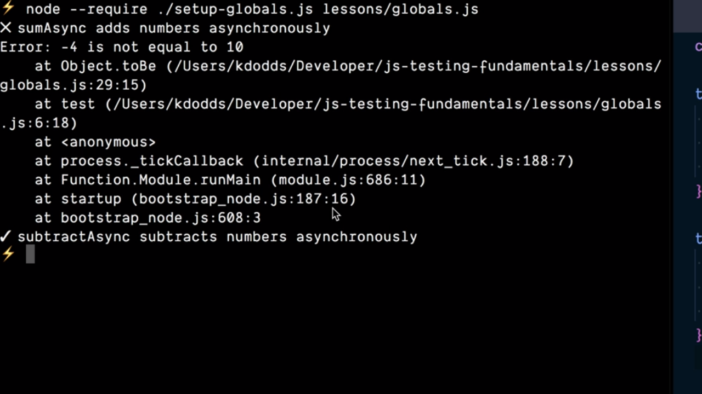

# Provide Helper Functions as Globals.

En los puntos anteriores hemos visto la implementación de las funciones `test` y `expect` para ejecutar y realizar aserciones relacionadas con los test de nuestras aplicaciones. Parece lógico pensar que es conveniente proporcionar estas dos funciones de forma global para que puedan ser utilizadas en aquellos lugares (ficheros) de la aplicación donde las vayamos a necesitar.

Para lograrlo lo primero que vamos a hacer es crear el fichero `globals.js` dentro de nuestro proyecto y dentro del mismo simplemente copiamos el contenido con la implementación de todos los test que hemos ido definiendo hasta ahora:

```js
const { sumAsync, subtractAsync } = require('../math')

test('sumAsync adds numbers asynchronously', async () => {
  const result = sumAsync(3, 7)
  const expected = 10
  expect(result).toBe(expected)
})

test('subtractAsync subtracts numbers asynchronously', async () => {
  const result = subtractAsync(7, 3)
  const expected = 4
  expect(result).toBe(expected)
})

async function test(title, callback) {
  try {
    await callback()
    console.log(`✔️ ${ title }`)
  } catch (error) {
    console.error(`❌ ${ title }`)
    console.error(error)
  }
}

function expect(actual) {
  return {
    toBe(expected) {
      if (action !== expected) {
        throw new Error(`${ actual } is not equal to ${ expected }.`)
      }
    }
  }
}
```

Una primera aproximación para poder proporcionar estas funciones de forma global puede ser incluirlas en un único módulo de JavaScript dentro de nuestro proyecto gracias al uso de `exports` y en aquellas partes del mismo donde las vayamos a necesitar lo que podemos hacer será importarlas mediante el uso de la función `require` de NodeJS. 

Pero existe una aproximación todavía mejor para lograr el objetivo que estamos persiguiendo y es lograr de alguna manera que estas funciones estén disponibles para todos aquellos ficheros que sean declarados como contenedores de test sin que sea necesario realizar ninguna importación de las mismas. 

Si optamos por esta segunda posibilidad lo primero que vamos a hacer es crear un nuevo fichero en el proyecto al que llamaremos `setup-globals.js` y dentro del mismo simplemente copiamos la implementación de las funciones `test` y `expect` que tenemos dentro del fichero `globals.js` (además de borrarlas de este último ya que queremos estén disponibles de forma global):

```js
async function test(title, callback) {
  try {
    await callback()
    console.log(`✔️ ${ title }`)
  } catch (error) {
    console.error(`❌ ${ title }`)
    console.error(error)
  }
}

function expect(actual) {
  return {
    toBe(expected) {
      if (action !== expected) {
        throw new Error(`${ actual } is not equal to ${ expected }.`)
      }
    }
  }
}
```

Lo siguiente que vamos a hacer es crear dos nuevos atributos dentro del objeto `global` que nos proporciona NodeJS dentro de este fichero con el mismo nombre que las funciones `test` y `expect`. Con esto lo que estamos haciendo es que el objeto `global` tenga los métodos `test` y `expect` y que la implementación de los mismos sea la de las dos funciones con las que hemos estado trabajando:

```js
async function test(title, callback) {
  try {
    await callback()
    console.log(`✔️ ${ title }`)
  } catch (error) {
    console.error(`❌ ${ title }`)
    console.error(error)
  }
}

function expect(actual) {
  return {
    toBe(expected) {
      if (action !== expected) {
        throw new Error(`${ actual } is not equal to ${ expected }.`)
      }
    }
  }
}

global.test = test
global.expect = expect
```

¿Qué deberemos hacer ahora para que NodeJS ejecute previamente este archivo antes de pasar a ejecutar el código con los test? Pues tendremos que hacer uso del flag `--require` el cual espera recibir como parámetro el nombre del archivo que queremos que se ejecute antes de nuestros test seguido del nombre del fichero que contiene los test que vamos a ejecutar:

```console
$ node --require ./setup-globals.js lessons/globals.js
[...]
```

Con lo que se ejecutarán todos los test que están contenidos en el fichero `globals.js` obteniendo el mismo resultado que en el caso de no tener las funciones definidas de forma global:

<div style='text-align: center'>
  
</div>
<br />

<br />

----
<div>
  <div style="float: left">
    <a href="https://github.com/DevJoseManuel/js-tutorials/blob/master/testing/ch01/01_05.md">
      < Support Async Tests with JavaScript Promises
    </a>
  </div>
  <div style="float: right">
    <a href="https://github.com/DevJoseManuel/js-tutorials/blob/master/testing/ch01/01_07.md">
      Custon JavaScript Tests with Jest >
    </a>
  </div>
</div>

