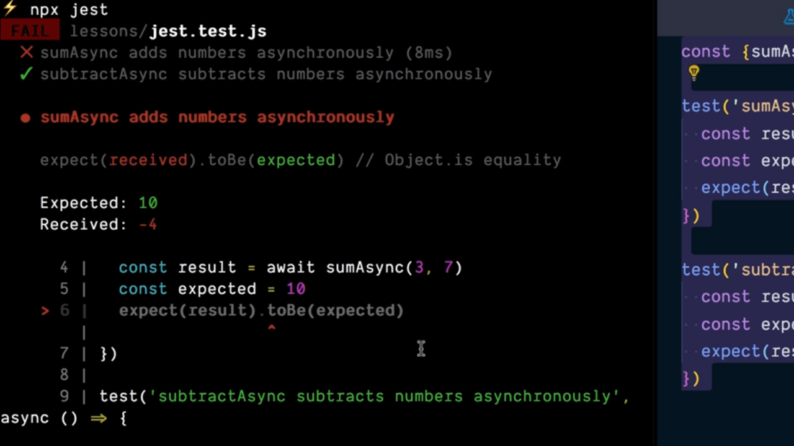

# Custon JavaScript Tests with Jest.

A lo largo de todo este manual el framework que vamos a utilizar para realizar nuestros test es [Jest](https://jestjs.io/) el cual, entre otras cosas, se encargará de definir de forma global todas las funciones que vamos a utilizar de forma global para la realización de nuestros test.

Así, una vez la tengamos instalada dentro de nuestro proyecto desde la terminal del sistema simplemente la invocaremos y ella se encargará de buscar todos aquellos ficheros que contienen los test que hayamos definido y ejecutarlos mostrándonos un informe final con el resultado de dicha ejecución.

  

 

Como se puede apreciar Jest nos informará no solamente de todos los test que se han llevado a cabo y del resultado de su ejecución sino que en el caso de que alguno de ellos falle nos indicará exactamente el punto en el que se ha producido el error lo que va agilizar enormemente nuestro proceso de desarrollo.

----

  

    <a href="./01_06.md">
      < Provide Helper Functions as Globals
    </a>
  

  

    <a href="./02_00.md">
      Chapter 2 >
    </a>
  

