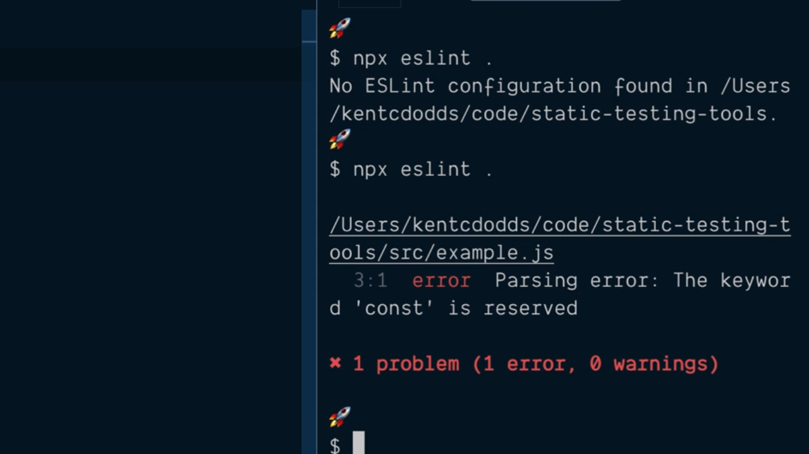
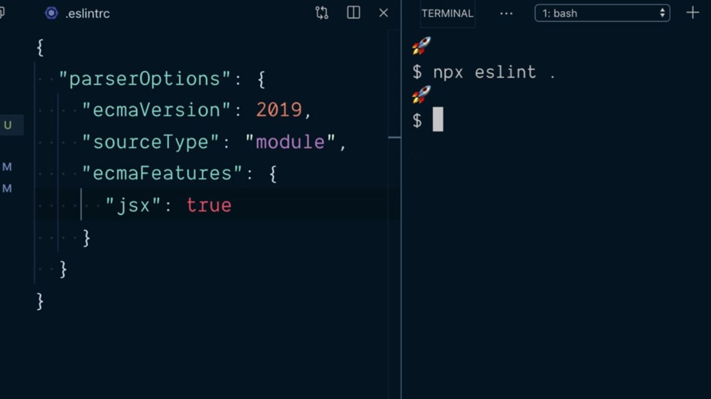
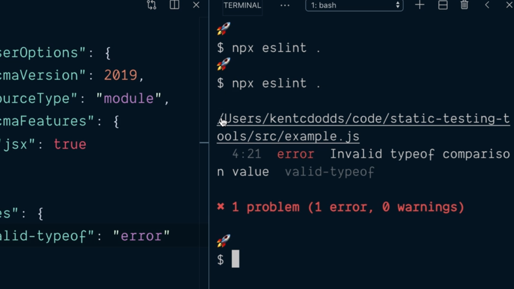
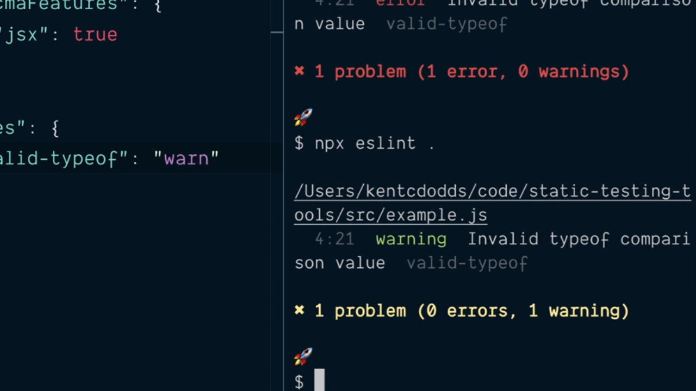
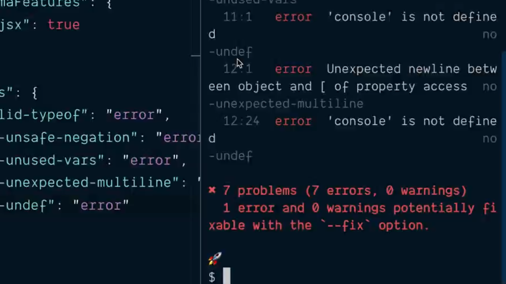
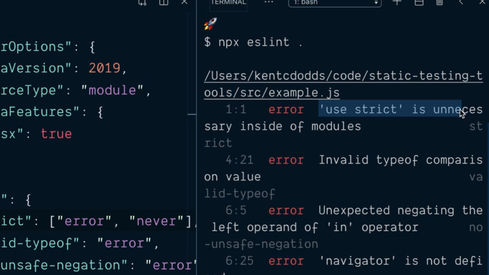
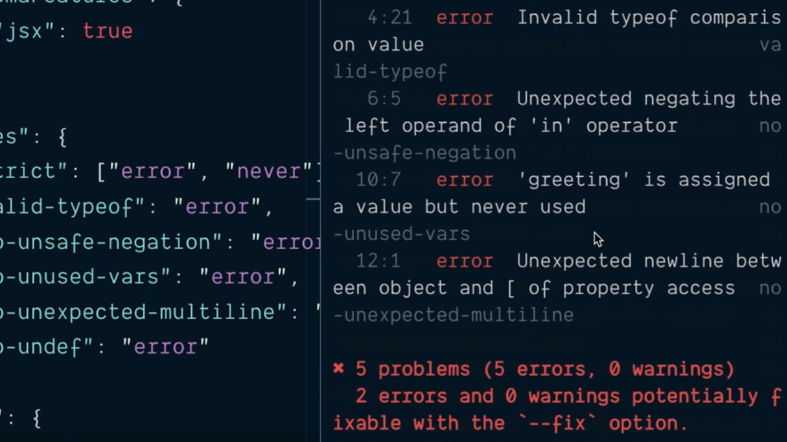

# Lint JavaScript by Configuring and Running eslint.

En este punto vamos a comenzar a estudiar las herramienta de análsis de código estático denominada [eslint](https://eslint.org/). Como sucede con otras herramientas del ecosistema JavaScript lo primero que haremos será instalar dentro de nuestro proyecto como una dependencia de desarrollo:

```console
$ npm install --save-dev eslint
  + eslint@6.1.0
  [...]
```

Si todo el proceso de instalación finaliza correctamente podemos abrir el fichero `package.json` y ver que se ha añadido una dependendencia de desarrollo con la versión de la herramienta:

```json
"devDependencies": {
  "@babel/cli": "^7.5.5",
  "@babel/core": "^7.5.5",
  "@babel/preset-env": "^7.5.5",
  "eslint": "^6.1.0"
}
```

Y no solamente esto sino que si nos vamos al directorio `.bin` dentro del directorio `node_modules` de nuestro proyecto vamos a poder encontrar un fichero denominado `eslint` que viene a indicarnos que el CLI (Command Line Client) de la herramienta está disponible para ser utilizada dentro de nuesto proyecto sin más que ejecutar `npx` y el nombre de la herramienta.

Así si lo que queremos es realizar el análisis de todo el código estático que está recogido en el proyecto la invocaremos indicando un punto `.` como el nombre del fichero que queremos analizar:

```console
$ npx eslint .
  No ESLint configuration found in /Users/kentcdodss/code/static-testing-tools
```

eslint nos informa que no puede realizar el análisis del código estático del proyecto porque no tiene un fichero con las opciones de configuración que ha de aplicar por lo que nuestro siguiente paso será crearlo. El nombre de este fichero se ha de denominar `.eslintrc`, tenemos que situarlo en la raíz de nuestro proyecto y dentro del mismo configuramos la herramienta a través de un objeto JSON. Así, si simplemente lo creamos estableciendo un objeto vacío:

```json
{}
```

Si ahora volvemos a ejecutar la eslint veremos que ya es capaz de llevar a cabo el análisis del código estático aplicando las opciones de configuración por defecto.

<div style='text-align: center'>
  
</div>
<br />

Lo primero que tenemos que entender es que la versión por defecto para la cual realiza el análisis del código es la herramienta es ES5 por lo que cualquier incorporación en el mismo de características más modernas del lenguaje va a determinar que se producta un error en el análisis del código estático. Así si estamos utilizando una versión superior tendremos que indicarle a eslint que lo tenga en cuenta.

¿Cómo podemos hacer esto? Pues simplemente estableciéndolo como parte de una de las opciones de configuración dentro del objeto JSON recogido en el fichero `.eslintrc`. En concreto en el atributo `parserOptions`, el cual espera tener asignado como valor un objeto en el que en su atributo `ecmaVersion` se puede establecer la versión de JavaScript con la que vamos a trabajar. Así, si vamos a trabajar con las versión 2019 escribiríamos:

```json
{
  "parseOptions": {
    "ecmaVersion": 2019
  }
}
```

Otro de los atributos que podemos establecer dentro de este objeto de configuración es el formato de los ficheros que con los que vamos a trabajar ya que, normalmente, estaremos trabajando con módulos que serán importados y exportados en diferentes partes de la aplicación y, por defecto esto no lo entenderá eslint. Por lo tanto en el atributo `sourceType` especificaremos que el formato será `module`:

```json
{
  "parseOptions": {
    "ecmaVersion": 2019,
    "sourceType": "module"
  }
}
```

Otro de los aspectos que queremos configurar es qué características de la versión del lenguaje con la que estamos trabajando vamos a querer aplicar en el proyecto. En nuestro caso como vamos a trabajar con aplicaciones que estarán construidas apoyándose en React queremos que eslint entienda el código JSX que está contenido en nuestros componentes por lo que así se lo tenemos que hacer entneder. Como JSX es una característica que está incluida en la versión de JavaScript con la que estamos trabajando simplemente establecemos esta opción de configuración entro del atributo `ecmaFeatures`:

```json
{
  "parseOptions": {
    "ecmaVersion": 2019,
    "sourceType": "module",
    "ecmaFeatures": {
      "jsx": true
    }
  }
}
```

Como podemo ver `ecmaFeatures` espera tener asignado un objeto como valor y es en el atributo `jsx` del mismo donde podemos indicar si queremos que esté disponible o no JSX en el código del proyecto.

Con estas opciones de configuración si ahora volvemos a ejecutar eslint veremos como termina de realizar el análisis estático de nuestra aplicación sin que nos informe de ningún error:

<div style='text-align: center'>
  
</div>
<br />

Ahora bien, el anális del código estático que se ha realizado no ha sido capaz de detectar algunos d elos errores de hemos cometido de forma intencionada en el fichero `example.js`:

```js
'use strict'

const username = 'freddy'
typeof username === 'strng'

if (!'serviceWorker' in navigator) ~
  // You have an old browser :-(
}

const greeting = 'hello'
console.log('${ greeting } world!')
[1, 2, 3].forEach(x => console.log(x))
```

Y la razón por la que eslint no es capaz de detectarlo no es otra que porque no ha sido configurado de forma adecuada para que pueda hacerlo. Vamos pues a detenernos en aprender a configurarlo adecudamente para que el proceso de análisis de código estático sea mucho más potente.

Ya hemos visto que todas las opciones de configuración se recogen en el objeto JSON que tenemo el archivo `.eslintrc` por lo que ahora vamos a definir un nuevo atributo dentro del mismo denominado `rules` el cual va a tener asociado un objeto donde cada uno de los atributos es el nombre de una regla que queremos que aplique en el análisis de código estático. Por ejemplo, una de estas reglas se denomina `valid-typeof` y si establecemos el valor de la misma a `error`:

```json
{
  "parseOptions": {
    "ecmaVersion": 2019,
    "sourceType": "module",
    "ecmaFeatures": {
      "jsx": true
    }
  },
  "rules": {
    "valid-typeof": "error"
  }
}
```

lo que le estamos indicando a eslint es que cada vez que se encuentra en nuestro código una parte que viola dicha regla que nos informe de ello mostrándonos en mensaje de error. Esto lo podemos ver si volvemos a ejecutar eslint:

<div style='text-align: center'>
  
</div>
<br />

El mensaje de error que nos arroja eslint nos informará del fichero en el que se produce el error, de la línea y columna dentro del mismo donde se lo está encontrando y la regla de análisis de código estático que ha sido violada que en nuestro caso viene derivado de que hemos tecleado mál el nombre del tipo de datos contra el que se está realizando la comprobación en le sentencia `typeof` ya que `strng` no es un valor válido:

```js
'use strict'

const username = 'freddy'
typeof username === 'strng'
// ... Rest of the code ...
```

---
**Nota:** una de las características más importantes de la forma en la que se trabaja con eslint es que en última instancia se trata de una herramienta que se ejecuta desde la línea de comandos por lo que la podemos incluir en nuestros procesos de integración contínua de tal manera que si se produce un error no se llegue a construir el entregable y por lo tanto evitando errores.

---

Pero ¿qué sucedería en el caso de uso en el que estemos realizando la migración de un proyecto que previamente no estaba utilizando eslint y ahora lo pase a utilizar? ¿qué sucede en el caso de que dejemos el nivel de aviso a `error`? Pues que no podríamos generarlo si estamos dentro del proceso de integración contínua. Es por este tipo de escenarios por los que eslint nos proporciona el nivel de severidad `warning` en el que simplemente nos informará de la existencia del error pero no impide la construcción del entregable.

Así, en nuestro ejemplo, si ahora cambiamos el nivel de serveridad a `warning` de la siguiente manera:

```json
{
  "parseOptions": {
    "ecmaVersion": 2019,
    "sourceType": "module",
    "ecmaFeatures": {
      "jsx": true
    }
  },
  "rules": {
    "valid-typeof": "warning"
  }
}
```

Y volvemos a ejecutar eslint desde la terminal podemos ver cómo eslint nos sigue informando del fichero y la localización dentro del mismo en el que se produce la violación de la regla pero el mensaje queda catalogado como un warning:

<div style='text-align: center'>
  
</div>
<br />

Vamos a volver a dejar el nivel de seviridad asociado a regla `valid-typeof` como `error` y en el fichero de configuración de eslint añadiremos alguna regla más que queremos que sea verificada:

```json
{
  "parseOptions": {
    "ecmaVersion": 2019,
    "sourceType": "module",
    "ecmaFeatures": {
      "jsx": true
    }
  },
  "rules": {
    "valid-typeof": "error",
    "no-unsafe-negation": "error",
    "no-unused-vars": "error",
    "no-unexpected-multiline": "error",
    "no-undef": "error"
  }
}
```

Si guardamos esta configuración y volvemos a ejecutar eslint podemos ver como en la salida del sistema se nos estará informando de que son varios los problemas que tenemos en nuestro código:

<div style='text-align: center'>
  
</div>
<br />

---
**Nota:** en este punto no tenemos por qué preocuparnos en entender qué partes del código se encarga de verificar cada una de las reglas que nos proporciona eslint ya que son muchas y siempre las vamos a poder consultar en la [documentación oficial](https://eslint.org/docs/rules/) de la librería.

---

Antes de dar por

Pero antes de dar por finalizado este punto vamos a deternernos en una regla concreto `strict` la cual es totalmente configurable, lo que se traduce en que no le vamos a asignar un string de forma directa indicando el nivel de serveridad que queremos aplicarle sino que se le asignará un array en el que el primer elemento será el nivel de severidad que queremos que se cumpla a la hora de verificar la regla (siendo este `error`, `warning` u `off`, este último indicando que la regla no se aplicará) y el segundo un string en el que indicaremos las opciones de configuración de la misma. Así podemos escribir lo siguiente:

```json
{
  "parseOptions": {
    "ecmaVersion": 2019,
    "sourceType": "module",
    "ecmaFeatures": {
      "jsx": true
    }
  },
  "rules": {
    "strict": ["error", "never"],
    "valid-typeof": "error",
    "no-unsafe-negation": "error",
    "no-unused-vars": "error",
    "no-unexpected-multiline": "error",
    "no-undef": "error"
  }
}
```

Con la configuración anterior lo que estamos indicándole a eslint es que no queremos que el uso del denominado `strict mode` de JavaScript esté disponible en ninguno de los archvos de nuestro proyecto de tal manera que se si encuentra con una instrucción como la siguiente:

```js
'use strict`
```

queremos que eslint nos informe de ello indicándonoslo con un mensaje de error:

<div style='text-align: center'>
  
</div>
<br />

Si nos seguimos fijando en los mensajes de error que nos está mostrando eslint uno de ellos en particular nos puede resultar bastante curioso:

```console
11:1  error   'console' is not defined          no-undef
```

Lo importante aquí es que el mensaje de error está relacionado con que se ha roto la regla `no-undef` ya que no sabe qué objeto es `console` ya que eslint no sabe en qué entorno de ejecución de JavaScript correrá nuestro código y por lo tanto no puede determinar cuál será este objeto. Es por ello dentro de las opciones de configuración que estamos estableciendo para eslint le tengamos que indicar el entorno de ejecución y así pueda determinar qué objeto será `console`.

¿Cómo se pude hacer lo anterior? Pues nuevamente con un atributo dentro del objeto JSON que estamos utilizando para configurar eslint. El atributo en cuestión es `env` y como valor le tendremos que indicar un objeto en el que su atributo `browser` va a ser asignado al valor `true`:

```json
{
  "parseOptions": {
    "ecmaVersion": 2019,
    "sourceType": "module",
    "ecmaFeatures": {
      "jsx": true
    }
  },
  "rules": {
    "strict": ["error", "never"],
    "valid-typeof": "error",
    "no-unsafe-negation": "error",
    "no-unused-vars": "error",
    "no-unexpected-multiline": "error",
    "no-undef": "error"
  },
  "env": {
    "browser": true
  }
}
```

Con esta opción de configuración si ahora volemos a ejecutar eslint veremos que el mensaje de error no aparecerá porque ahora ya está disponible el objeto `console` además de otros objetos que son propios del entorno de ejecución de JavaScript en el navegador como puede ser el objeto `navigator`:

<div style='text-align: center'>
  
</div>
<br />

<br />

----
<div>
  <div style="float: left">
    <a href="https://github.com/DevJoseManuel/js-tutorials/blob/master/testing/ch02/02_01.md">
      < Intro to Static Analysis Testing
    </a>
  </div>
  <div style="float: right">
    <a href="https://github.com/DevJoseManuel/js-tutorials/blob/master/testing/ch02/02_03.md">
      Use the eslint Extension for VSCode >
    </a>
  </div>
</div>
